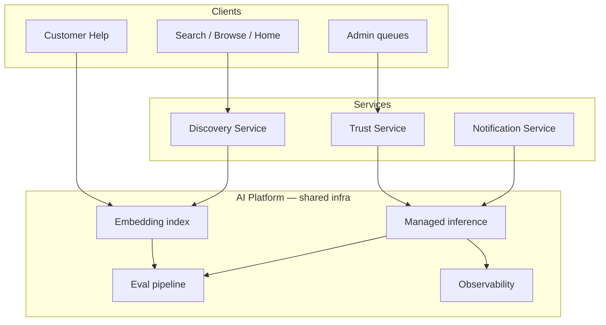

# AI Platform

> Marketplate AI systems documentation — Phase 3. Governing principle: **[AI recommends, humans approve](../company/constitution.md#ai-philosophy).**

**Status:** Active  
**Version:** 1.0  
**Last updated:** 2026-07-03  
**Owner:** AI Platform

Every system follows the [AI doc template](../templates/ai-doc-template.md) and documents purpose, inputs, outputs, prompt strategy, evaluation, confidence thresholds, fallbacks, security, human approval, monitoring, and continuous improvement.

---

## Platform Overview

Marketplate AI removes repetitive work for Trust & Safety, support ops, and discovery — without replacing human accountability on verification, moderation, enforcement, or customer-facing policy answers.

| Principle | Implementation |
|-----------|----------------|
| **Humans approve high-stakes actions** | No auto-approve verification; no auto-suspend; no autonomous customer replies |
| **Documentation before deploy** | Spec in `ai/`; full prompts in [`prompts/`](../prompts/) |
| **Trust over engagement** | Discovery ranking excludes engagement bait; trust gates are hard filters |
| **Explainability** | Ranking factors and moderation categories cite evidence; versioned models |
| **Fallback always** | Every pipeline degrades to manual/keyword/rule paths — never block core flows |



---

## Systems

| System | Description | Primary surface |
|--------|-------------|-----------------|
| [Verification Assist](verification-assist.md) | Document extraction, quality scoring, fraud/mismatch flags for identity, kitchen, and compliance review | [Verification Queue](../pages/admin/verification-queue.md) |
| [Moderation Assist](moderation-assist.md) | Policy violation scores, severity, and category suggestions for listings, reviews, and messages | [Moderation Queue](../pages/admin/moderation-queue.md) |
| [Support Assist](support-assist.md) | Semantic FAQ search, ticket classification, macro suggestions | [Help](../pages/customer/help.md) + internal ops |
| [Discovery Ranking](discovery-ranking.md) | Trust-weighted, explainable ranking for search, browse, and home | Customer discovery surfaces |

### Workflow integration

- **Verification:** Creator submit → [Trust Service](../engineering/services/trust-service.md) ingest → Verification Assist async → [Verification Queue](../pages/admin/verification-queue.md) → human approve/reject — [Trust Verification Flow](../pages/flows/trust-verification-flow.md)
- **Moderation:** Content/report ingest → Moderation Assist → [Moderation Queue](../pages/admin/moderation-queue.md) → human enforcement decision
- **Support:** Help search (retrieval) + ticket POST → Support Assist classification → ops queue with macro suggestions
- **Discovery:** Trust gates → weighted scoring → [Discovery Service](../engineering/services/discovery-service.md) — weights in [Platform Settings](../pages/admin/platform-settings.md)

---

## Shared Infrastructure

### Inference layer

| Component | Role |
|-----------|------|
| **Managed inference cluster** | Primary region; vision + text models for Trust and Support |
| **On-premise image analysis** | Fraud/tamper heuristics; sensitive moderation tiers |
| **Embedding service** | FAQ retrieval, semantic search, macro similarity |
| **Rules engine** | Deterministic trust gates, urgency keywords, compliance expiry |

- **Blue/green deploys** with `model_version` on every output
- **No cross-tenant batching** of PII documents
- **Provider zero-retention** agreements — inference only

### Model hosting approach

| Workload | Hosting | Rationale |
|----------|---------|-----------|
| Document OCR / extraction | Managed API (ephemeral URLs) | Quality; no document persistence at provider |
| Moderation classifiers | Shared cluster + versioned weights | Latency; control |
| FAQ / search embeddings | Co-located vector index | Cost; freshness |
| Discovery scoring | In Discovery Service (no LLM hot path v1) | Auditable linear model |
| Fraud heuristics | Trust Service enclave | PII isolation |

Models are **not** fine-tuned on production customer data without explicit consent and legal review. Prompt and classifier updates ship through the eval pipeline below.

### Evaluation pipeline

```
Label maintenance (Trust QA / Support ops)
    → Offline benchmark suites (per system doc)
    → Regression gate (blocking metrics)
    → Shadow traffic comparison (48h minimum for trust systems)
    → Human sign-off (Trust & Safety / Product)
    → Promote model_version + document version bump
    → Online monitoring + weekly sample audit
```

| System | Blocking metrics (examples) |
|--------|----------------------------|
| Verification Assist | Field extraction F1; fraud flag recall |
| Moderation Assist | Harassment recall; false positive rate |
| Support Assist | Urgent priority recall; FAQ MRR@5 |
| Discovery Ranking | Trust gate violation rate = 0 |

Eval artifacts stored in isolated storage; PII-sanitized gold sets only.

### PII handling

| Rule | Detail |
|------|--------|
| **Isolation** | Verification docs in Trust enclave; support tickets scoped; no unified "AI lake" of PII |
| **Minimization** | Models receive minimum context; truncate message threads |
| **Encryption** | Extracted fields and embeddings at rest encrypted |
| **Retention** | AI run metadata 30–90 days; raw inference logs redacted; case-linked outputs follow case retention |
| **No training** | Customer documents, tickets, and messages not used for training without consent |
| **Operator access** | Document viewer watermarked; moderation content view audited |

Cross-reference: [Trust Verification Flow — Security](../pages/flows/trust-verification-flow.md#security--access)

### Observability

Shared dashboards track **latency**, **error rate**, **fallback rate**, **cost per request**, and **quality drift** per system. Trust-specific counters include trust gate violations (Discovery) and `ai_flags_dismissed` (Verification).

Alerts route to AI Platform on-call and Trust Ops for fallback spikes affecting queue SLAs.

---

## Configuration

Trust-critical thresholds and discovery weights are tunable without code deploy:

| Setting area | Location |
|--------------|----------|
| Verification AI confidence thresholds | [Platform Settings](../pages/admin/platform-settings.md) → Trust & Verification |
| Moderation severity thresholds | Platform Settings → Moderation |
| Discovery weight profiles | Platform Settings → Discovery |
| SLA targets (queues) | Platform Settings → Trust & SLAs |

Default: **no auto-approve verification**; **no auto-suspend** on any threshold.

---

## Prompts

High-level prompt strategy is documented per system. Full system prompts, few-shot libraries, and schema definitions live in [`prompts/`](../prompts/) — not duplicated here.

---

## Related Documents

### Governance

- [Founding Constitution — AI Philosophy](../company/constitution.md#ai-philosophy)
- [Values — Humans Decide; AI Assists](../company/values.md#7-humans-decide-ai-assists)
- [Marketplace Mechanics](../product/marketplace-mechanics.md)

### Engineering

- [Engineering README](../engineering/README.md)
- [Trust Service](../engineering/services/trust-service.md)
- [Discovery Service](../engineering/services/discovery-service.md)
- [Service Catalog](../engineering/service-catalog.md)

### Admin & flows

- [Trust Verification Flow](../pages/flows/trust-verification-flow.md)
- [Verification Queue](../pages/admin/verification-queue.md)
- [Moderation Queue](../pages/admin/moderation-queue.md)
- [Platform Settings](../pages/admin/platform-settings.md)

### Customer

- [Help](../pages/customer/help.md)

### Templates

- [AI doc template](../templates/ai-doc-template.md)
