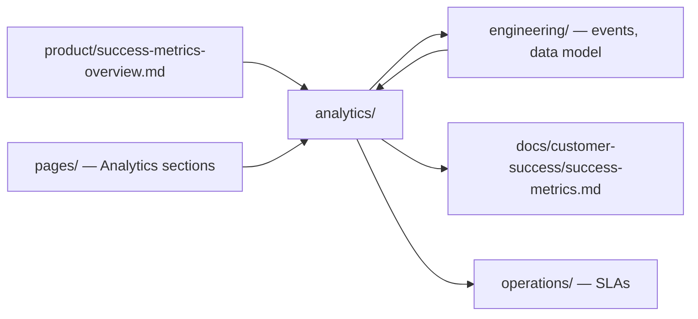

# Analytics & Data

> Measurement layer for Marketplate — canonical metrics, event taxonomy, dashboards, and data governance.

**Status:** Active  
**Version:** 1.0  
**Last updated:** 2026-07-03  
**Owner:** Analytics · Product  
**Phase:** 5 — Launch

---

## Purpose

This folder is the **implementation companion** to [Success Metrics Overview](../product/success-metrics-overview.md). Product defines *what* to measure and *why*; analytics defines *how* to instrument, aggregate, report, and govern that measurement.

Every feature spec in [`pages/`](../pages/) includes an Analytics section listing page-level events. This folder consolidates those events into a single taxonomy, maps them to canonical metrics, and specifies the dashboards that consume them.

**Trust metrics are first-class.** Analytics infrastructure treats Verified GMV and trust incident rate with equal reporting priority — growth without integrity is a crisis, not success. See [Founding Constitution](../company/constitution.md).

---

## Documents

| Document | Audience | Description |
|----------|----------|-------------|
| [Metrics Definitions](metrics-definitions.md) | Product, Analytics, Leadership | Canonical formulas for Verified GMV, trust guardrails, and funnel metrics |
| [Event Taxonomy](event-taxonomy.md) | Engineering, Product, Analytics | Event naming, properties, surface catalogs, implementation guide |
| [Dashboards](dashboards.md) | Leadership, Ops, CS, Product, Engineering | Dashboard specs by audience — widgets, cadence, data sources |
| [Data Governance](data-governance.md) | Analytics, Engineering, Legal, Security | Ownership, PII policy, retention, access, quality standards |

---

## How This Connects

| Layer | Document | Role |
|-------|----------|------|
| **Strategy** | [Success Metrics Overview](../product/success-metrics-overview.md) | North star, metric hierarchy, anti-metrics |
| **CS operations** | [Customer Success Metrics](../docs/customer-success/success-metrics.md) | CS targets, health scores, metric → action map |
| **Instrumentation** | [Event Taxonomy](event-taxonomy.md) | What to emit; links to page specs |
| **Aggregation** | [Metrics Definitions](metrics-definitions.md) | How events and DB records become KPIs |
| **Presentation** | [Dashboards](dashboards.md) | Who sees what, when |
| **Policy** | [Data Governance](data-governance.md) | PII, retention, access control |
| **Architecture** | [Architecture Overview](../engineering/architecture-overview.md) | Analytics module, event bus, observability split |
| **Domain events** | [Integration Patterns](../engineering/integration-patterns.md#event-catalog-launch) | Server-side lifecycle events |

---

## Measurement Principles

Inherited from product — applied consistently across all analytics work:

| Principle | Analytics application |
|-----------|----------------------|
| **Trust metrics are first-class** | Trust widgets on every executive and ops dashboard |
| **Quality over vanity** | No dashboards for raw page views without conversion context |
| **Segment by persona** | All creator metrics cuttable by [persona](../product/personas.md) |
| **Cohort-based** | Weekly/monthly cohorts for activation and retention |
| **Auditable definitions** | One canonical definition per metric in [metrics-definitions.md](metrics-definitions.md) |
| **Leading + lagging** | Funnel events (leading) + Verified GMV (lagging) on same review cadence |

---

## Reporting Cadence Summary

| Audience | Primary dashboard | Cadence |
|----------|-------------------|---------|
| Executive | [Executive Overview](dashboards.md#executive-dashboard) | Weekly |
| Trust & Safety | [Trust & Safety Ops](dashboards.md#trust--safety-dashboard) | Daily |
| Creator Success | [Creator Success](dashboards.md#creator-success-dashboard) | Weekly |
| Product | [Product & Funnels](dashboards.md#product-dashboard) | Weekly |
| Engineering / Ops | [Platform Operations](dashboards.md#platform-operations-dashboard) | Real-time + weekly |
| Creators (in-app) | [Creator Analytics page](../pages/creator/analytics.md) | Self-serve |

Full dashboard specs: [Dashboards](dashboards.md).

---

## Implementation Status

| Component | Launch scope | Notes |
|-----------|--------------|-------|
| Client event SDK | Phase 1 launch | Surface-aware wrapper; see [Event Taxonomy — Implementation](event-taxonomy.md#implementation-guide) |
| Domain event → analytics pipeline | Phase 1 launch | Consume bus events from [Integration Patterns](../engineering/integration-patterns.md) |
| Warehouse / BI tool | `TODO(decision):` | Options: BigQuery, Snowflake, Postgres read replica + Metabase |
| Product analytics vendor | `TODO(decision):` | Options: PostHog (self-host), Amplitude, Mixpanel |
| Creator-facing analytics API | Phase 2 | Spec in [Creator Analytics page](../pages/creator/analytics.md) |
| Admin dashboards | Phase 1 launch | Spec in [Admin Dashboard](../pages/admin/admin-dashboard.md) |

Architecture places Analytics as a **future module** in the modular monolith — see [Architecture Overview](../engineering/architecture-overview.md#services). At launch, analytics ingestion runs as a worker consuming the event bus; extraction to a dedicated service when volume or compliance isolation requires it.

---

## Adding New Metrics or Events

1. **Product change** — Update [Success Metrics Overview](../product/success-metrics-overview.md) if the metric is strategic
2. **Page spec** — Add events to the relevant page spec in [`pages/`](../pages/) Analytics section
3. **Taxonomy** — Register event in [Event Taxonomy](event-taxonomy.md) with properties and linked metrics
4. **Definition** — Add or update formula in [Metrics Definitions](metrics-definitions.md)
5. **Dashboard** — Add widget spec in [Dashboards](dashboards.md)
6. **Governance** — Review PII and retention impact in [Data Governance](data-governance.md)

Use [Feature Doc Template](../templates/feature-doc-template.md) Analytics section for new features.

---

## Anti-Metrics (Do Not Build Dashboards For)

Aligned with [Product Anti-Metrics](../product/success-metrics-overview.md#anti-metrics-do-not-optimize):

| Anti-metric | Why excluded |
|-------------|--------------|
| Total unverified signups | Incentivizes gray-market supply |
| Raw page views without conversion | Vanity |
| Review volume without integrity checks | Invites fraud |
| GMV including unverified creators | Contradicts trust thesis |
| Short-term take rate maximization | Drives creator churn |

---

## Open Decisions

| Decision | Impact |
|----------|--------|
| `TODO(decision):` Analytics warehouse / BI tool | Dashboard implementation, cost model |
| `TODO(decision):` Product analytics vendor | Client SDK, session replay policy |
| `TODO(decision):` Geographic launch market | Segmentation baselines, liquidity dashboards |
| `TODO(decision):` Commission structure | Take rate and unit economics widgets |

Track resolution in [`decisions/`](../decisions/) as ADRs.

---

## Related Documents

- [Success Metrics Overview](../product/success-metrics-overview.md)
- [Customer Success Metrics](../docs/customer-success/success-metrics.md)
- [Architecture Overview](../engineering/architecture-overview.md)
- [Integration Patterns](../engineering/integration-patterns.md)
- [Infrastructure Overview — Observability](../engineering/infrastructure-overview.md#observability-stack)
- [Core Entities](../engineering/data/core-entities.md)
- [Information Architecture](../pages/information-architecture.md)
- [Phased Rollout — Phase 5](../roadmap/phased-rollout.md)
- [Operations](../operations/)
