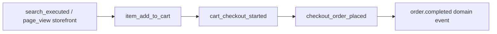
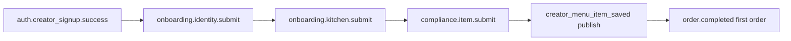
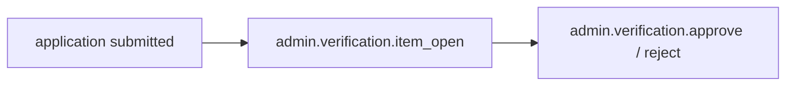

# Event Taxonomy

> Canonical event naming, properties, and implementation guide for product analytics instrumentation.

**Status:** Active  
**Version:** 1.0  
**Last updated:** 2026-07-03  
**Owner:** Analytics · Engineering

---

## Purpose

This document consolidates analytics events from all [page specifications](../pages/) into a single register. Engineers implement against this taxonomy; Product validates that new features register events here before launch.

**Two event layers:**

| Layer | Naming | Transport | Examples |
|-------|--------|-----------|----------|
| **Client product events** | Surface-specific (see [Naming](#naming-conventions)) | Client SDK → ingestion API | `checkout_order_placed`, `admin.dashboard.view` |
| **Server domain events** | `{domain}.{entity}.{action}` | Event bus → analytics worker | `order.completed`, `trust.identity.approved` |

Domain event schema: [Integration Patterns — Event envelope](../engineering/integration-patterns.md#event-envelope-schema).

---

## Naming Conventions

### Client product events

Three conventions exist across page specs — **standardize on these rules for new events:**

| Surface | Pattern | Example | Notes |
|---------|---------|---------|-------|
| **Customer** | `{noun}_{verb}` snake_case | `cart_checkout_started` | Shared `page_view` with `page` property |
| **Creator** | `creator_{noun}_{verb}` snake_case | `creator_dashboard_viewed` | Prefix avoids collision with customer events |
| **Admin** | `admin.{noun}.{verb}` dot notation | `admin.dispute.resolve` | Matches audit log action style |
| **Auth / onboarding** | `{area}.{noun}.{verb}` dot notation | `auth.login.success`, `onboarding.identity.submit` | Cross-surface auth flows |

**Legacy inconsistency:** Early customer page specs use unprefixed snake_case (`checkout_order_placed`). Do not rename at launch — map both to canonical names in the analytics pipeline. New customer events should use descriptive snake_case without `customer_` prefix unless collision risk exists.

### Server domain events

Per [Integration Patterns](../engineering/integration-patterns.md#event-naming-convention):

```
{domain}.{entity}.{action}
```

- Lowercase, dot-separated
- Past tense for completed actions
- Examples: `order.confirmed`, `payment.captured`, `catalog.item.published`

### Prohibited in event names

- PII (email, name, address, phone)
- Free-text user input (search queries logged as hashed or length-only where noted)
- Payment card data
- Government ID numbers

---

## Global Properties

Every client event MUST include these properties. The SDK injects them automatically.

| Property | Type | Required | Description |
|----------|------|----------|-------------|
| `event` | string | ✓ | Event name |
| `timestamp` | ISO 8601 UTC | ✓ | Client event time |
| `event_id` | UUID | ✓ | Client-generated dedupe ID |
| `session_id` | UUID | ✓ | Browser/app session |
| `surface` | enum | ✓ | `customer`, `creator`, `admin` |
| `user_id` | UUID | ○ | Authenticated user; omit for guests |
| `anonymous_id` | UUID | ✓ | Persistent device ID (cookie/localStorage) |
| `app_version` | string | ✓ | Web build hash or semver |
| `platform` | enum | ✓ | `web`, `ios`, `android` |
| `locale` | string | ✓ | BCP 47 locale |
| `market_id` | string | ○ | Geographic market when known |
| `referrer` | string | ○ | Previous page or external referrer |
| `utm_source` | string | ○ | Campaign attribution |
| `utm_medium` | string | ○ | Campaign attribution |
| `utm_campaign` | string | ○ | Campaign attribution |
| `trace_id` | string | ○ | Correlation with backend logs |

**Server-enriched on ingestion:**

| Property | Source |
|----------|--------|
| `received_at` | Ingestion timestamp |
| `ip_geo` | Coarse geo from IP (city-level max) |
| `user_role` | Identity service |
| `creator_id` | If user is creator owner/staff |

### Entity reference properties

Use consistent IDs across events:

| Property | Entity | Reference |
|----------|--------|-----------|
| `creator_id` | Creator | [Core Entities — Creator](../engineering/data/core-entities.md) |
| `customer_id` | Customer user | Same as `user_id` on customer surface |
| `order_id` | Order | |
| `item_id` | Menu item | |
| `cart_id` | Cart session | |
| `dispute_id` | Dispute case | |
| `case_id` | Verification case | |

---

## Customer Marketplace Events

Surface: `customer`  
Page specs: [`pages/customer/`](../pages/customer/), [`pages/auth/`](../pages/auth/)

### Shared

| Event | Properties | Page spec | Metrics |
|-------|------------|-----------|---------|
| `page_view` | `page`, context props | All customer pages | Traffic context only — not a success metric |

**`page` values:** `home`, `search`, `browse`, `browse_collection`, `storefront`, `item_detail`, `cart`, `checkout`, `order_confirmation`, `order_detail`, `order_history`, `account_settings`, `help`

### Discovery & browse

| Event | Properties | Page spec |
|-------|------------|-----------|
| `home_search_initiated` | `source: hero \| nav` | [Home](../pages/customer/home.md) |
| `home_search_submitted` | `query`, `suggestion_used` | [Home](../pages/customer/home.md) |
| `home_creator_card_clicked` | `creator_id`, `section`, `position` | [Home](../pages/customer/home.md) |
| `home_collection_clicked` | `collection_slug`, `section` | [Home](../pages/customer/home.md) |
| `home_trust_explainer_opened` | — | [Home](../pages/customer/home.md) |
| `search_executed` | `q`, `filters[]`, `result_count`, `latency_ms` | [Search](../pages/customer/search.md) |
| `search_filter_applied` | `filter_type`, `filter_value` | [Search](../pages/customer/search.md) |
| `search_result_clicked` | `result_type`, `position`, `creator_id`, `item_id` | [Search](../pages/customer/search.md) |
| `search_zero_results` | `q`, `filters[]` | [Search](../pages/customer/search.md) |
| `browse_collection_opened` | `slug`, `source` | [Browse](../pages/customer/browse.md) |
| `browse_creator_clicked` | `collection_slug`, `creator_id`, `position` | [Browse](../pages/customer/browse.md) |

→ Metrics: [Search success rate](metrics-definitions.md#discovery--conversion), [Zero-result search rate](metrics-definitions.md#discovery--conversion)

### Storefront & item

| Event | Properties | Page spec |
|-------|------------|-----------|
| `storefront_menu_item_clicked` | `creator_id`, `item_id`, `section` | [Creator Storefront](../pages/customer/creator-storefront.md) |
| `storefront_quick_add` | `creator_id`, `item_id`, `quantity` | [Creator Storefront](../pages/customer/creator-storefront.md) |
| `storefront_verification_badge_clicked` | `creator_id`, `badge_type` | [Creator Storefront](../pages/customer/creator-storefront.md) |
| `storefront_share` | `creator_id`, `method` | [Creator Storefront](../pages/customer/creator-storefront.md) |
| `item_add_to_cart` | `creator_id`, `item_id`, `quantity`, `variant_ids`, `addon_ids`, `price` | [Menu Item Detail](../pages/customer/menu-item-detail.md) |
| `item_add_failed` | `item_id`, `error_code` | [Menu Item Detail](../pages/customer/menu-item-detail.md) |
| `item_allergen_tooltip_opened` | `allergen` | [Menu Item Detail](../pages/customer/menu-item-detail.md) |

→ Metrics: [Profile → cart rate](metrics-definitions.md#customer-purchase-funnel)

### Cart & checkout

| Event | Properties | Page spec |
|-------|------------|-----------|
| `cart_checkout_started` | `creator_id`, `item_count`, `subtotal`, `validation_passed` | [Cart](../pages/customer/cart.md) |
| `cart_checkout_blocked` | `reason: minimum \| availability \| creator_closed` | [Cart](../pages/customer/cart.md) |
| `checkout_step_completed` | `step`, `fulfillment_type`, `duration_ms` | [Checkout](../pages/customer/checkout.md) |
| `checkout_fulfillment_selected` | `type`, `window_id` | [Checkout](../pages/customer/checkout.md) |
| `checkout_policy_acknowledged` | `policy_type` | [Checkout](../pages/customer/checkout.md) |
| `checkout_allergen_acknowledged` | `allergen_count` | [Checkout](../pages/customer/checkout.md) |
| `checkout_place_order_clicked` | `cart_value`, `item_count` | [Checkout](../pages/customer/checkout.md) |
| `checkout_order_placed` | `order_id`, `total`, `fulfillment_type` | [Checkout](../pages/customer/checkout.md) |
| `checkout_failed` | `step`, `error_code` | [Checkout](../pages/customer/checkout.md) |
| `checkout_abandoned` | `last_step`, `duration_ms` | [Checkout](../pages/customer/checkout.md) |

→ Metrics: [Cart → checkout](metrics-definitions.md#customer-purchase-funnel), [Checkout → order](metrics-definitions.md#customer-purchase-funnel), [Pre-checkout policy ack rate](metrics-definitions.md#transparency-compliance)

### Post-purchase

| Event | Properties | Page spec |
|-------|------------|-----------|
| `confirmation_view_order_clicked` | `order_id` | [Order Confirmation](../pages/customer/order-confirmation.md) |
| `order_detail_review_submitted` | `order_id`, `rating` | [Order Detail](../pages/customer/order-detail.md) |
| `order_detail_cancel_completed` | `order_id`, `reason` | [Order Detail](../pages/customer/order-detail.md) |
| `order_history_reorder_completed` | `order_id`, `items_added`, `items_unavailable` | [Order History](../pages/customer/order-history.md) |

→ Metrics: [Review submission rate](metrics-definitions.md#review-integrity), [Repeat purchase rate](metrics-definitions.md#repeat-purchase-rate-30-day)

### Help & support

| Event | Properties | Page spec |
|-------|------------|-----------|
| `help_faq_expanded` | `faq_id`, `category` | [Help](../pages/customer/help.md) |
| `help_contact_submitted` | `category`, `order_attached` | [Help](../pages/customer/help.md) |
| `help_deflection` | `faq_id` | [Help](../pages/customer/help.md) |

→ Metrics: [Support contact rate](metrics-definitions.md#satisfaction)

---

## Auth Events

Cross-surface authentication and registration.

| Event | Properties | Page spec |
|-------|------------|-----------|
| `auth.login.success` | `user_type`, `method` | [Login](../pages/auth/login.md) |
| `auth.login.failure` | `error_code` | [Login](../pages/auth/login.md) |
| `auth.signup.success` | `verification_required` | [Signup](../pages/auth/signup.md) |
| `auth.creator_signup.success` | `business_type` | [Creator Signup](../pages/auth/creator-signup.md) |
| `auth.password_reset.request_success` | — (no email logged) | [Password Reset](../pages/auth/password-reset.md) |

**PII rule:** Never log email, password, or reset tokens in event properties.

---

## Creator OS Events

Surface: `creator`  
Prefix: `creator_`  
Page specs: [`pages/creator/`](../pages/creator/), [`pages/auth/`](../pages/auth/) (onboarding)

### Dashboard & navigation

| Event | Properties | Page spec |
|-------|------------|-----------|
| `creator_dashboard_viewed` | `verification_status`, `pending_orders_count` | [Dashboard](../pages/creator/dashboard.md) |
| `creator_dashboard_primary_action_clicked` | `action_type` | [Dashboard](../pages/creator/dashboard.md) |
| `creator_analytics_viewed` | `range`, `order_count_in_range` | [Analytics](../pages/creator/analytics.md) |
| `creator_analytics_exported` | `range`, `format` | [Analytics](../pages/creator/analytics.md) |

### Onboarding & compliance

| Event | Properties | Page spec |
|-------|------------|-----------|
| `onboarding.identity.submit` | `entity_type` | [Identity Verification](../pages/auth/identity-verification.md) |
| `onboarding.identity.approved` | `time_to_approval_hours` | [Identity Verification](../pages/auth/identity-verification.md) |
| `onboarding.identity.rejected` | `reason_category` | [Identity Verification](../pages/auth/identity-verification.md) |
| `onboarding.kitchen.submit` | `kitchen_type`, `jurisdiction` | [Kitchen Verification](../pages/auth/kitchen-verification.md) |
| `compliance.item.submit` | `requirement_type` | [Compliance Center](../pages/auth/compliance-center.md) |
| `creator_compliance_layer_completed` | `layer: identity \| kitchen \| compliance` | [Compliance](../pages/creator/compliance.md) |

→ Metrics: [Verification funnel](metrics-definitions.md#creator-activation-funnel), [Time to verified](metrics-definitions.md#acquisition--onboarding)

### Catalog & storefront

| Event | Properties | Page spec |
|-------|------------|-----------|
| `creator_menu_item_saved` | `item_id`, `save_type: draft \| publish`, `duration_seconds` | [Menu Item Editor](../pages/creator/menu-item-editor.md) |
| `creator_menu_item_publish_blocked` | `reason` | [Menu Item Editor](../pages/creator/menu-item-editor.md) |
| `creator_catalog_viewed` | `active_count`, `draft_count`, `blocked_count` | [Catalog](../pages/creator/catalog.md) |
| `creator_storefront_link_copied` | — | [Storefront Settings](../pages/creator/storefront-settings.md) |
| `creator_storefront_settings_saved` | `fields_changed[]` | [Storefront Settings](../pages/creator/storefront-settings.md) |
| `creator_availability_saved` | `days_open`, `window_count`, `daily_capacity` | [Availability](../pages/creator/availability.md) |

→ Metrics: [First listing published rate](metrics-definitions.md#activation), [Listing completeness rate](metrics-definitions.md#transparency-compliance)

### Orders & fulfillment

| Event | Properties | Page spec |
|-------|------------|-----------|
| `creator_orders_viewed` | `tab`, `filter_status`, `order_count` | [Orders](../pages/creator/orders.md) |
| `creator_order_status_changed` | `order_id`, `from`, `to`, `time_in_previous_state_seconds` | [Order Detail](../pages/creator/order-detail.md) |
| `creator_order_cancel_confirmed` | `order_id` | [Order Detail](../pages/creator/order-detail.md) |
| `creator_messages_response_time` | `minutes_to_first_reply` | [Messages](../pages/creator/messages.md) |

→ Metrics: [Order completion rate](metrics-definitions.md#order-completion-rate), [On-time ready rate](metrics-definitions.md#creator-quality)

### Reviews & payouts

| Event | Properties | Page spec |
|-------|------------|-----------|
| `creator_reviews_response_posted` | `review_id`, `rating`, `response_time_hours` | [Reviews](../pages/creator/reviews.md) |
| `creator_payouts_setup_completed` | — | [Payouts](../pages/creator/payouts.md) |

---

## Admin Events

Surface: `admin`  
Pattern: `admin.{domain}.{action}`  
Page specs: [`pages/admin/`](../pages/admin/)

| Event | Properties | Page spec |
|-------|------------|-----------|
| `admin.dashboard.view` | `role` | [Admin Dashboard](../pages/admin/admin-dashboard.md) |
| `admin.dashboard.queue_click` | `queue_type` | [Admin Dashboard](../pages/admin/admin-dashboard.md) |
| `admin.verification.approve` | `type`, `time_in_queue_hours`, `ai_flags_dismissed` | [Verification Queue](../pages/admin/verification-queue.md) |
| `admin.verification.reject` | `type`, `reason_category` | [Verification Queue](../pages/admin/verification-queue.md) |
| `admin.moderation.decision` | `action`, `type`, `time_to_resolve_hours` | [Moderation Queue](../pages/admin/moderation-queue.md) |
| `admin.dispute.resolve` | `outcome`, `amount`, `time_to_resolve_hours` | [Dispute Detail](../pages/admin/dispute-detail.md) |
| `admin.creator.action` | `action_type` | [Creator Admin Detail](../pages/admin/creator-admin-detail.md) |
| `admin.settings.save` | `category`, `fields_changed[]` | [Platform Settings](../pages/admin/platform-settings.md) |

**Audit separation:** Admin events are duplicated to the immutable audit log per [Integration Patterns — Audit log](../engineering/integration-patterns.md#audit-log-pattern). Product analytics reads from analytics pipeline; compliance reads from audit store.

→ Metrics: [Verification SLA](metrics-definitions.md#trust-verification-funnel-ops), [Dispute resolution SLA](metrics-definitions.md#safety--incidents)

---

## Server Domain Events (Analytics Consumers)

These events originate from backend modules and are consumed by the analytics worker. Full catalog: [Integration Patterns — Event catalog](../engineering/integration-patterns.md#event-catalog-launch).

| Event | Producer | Key payload fields | Metrics fed |
|-------|----------|-------------------|-------------|
| `order.confirmed` | Order | `order_id`, `creator_id`, `customer_id`, `subtotal`, `creator_verification_status` | Funnel, liquidity |
| `order.completed` | Order | `order_id`, `creator_id`, `subtotal`, `fees`, `completed_at`, `creator_verification_status` | **Verified GMV** |
| `order.cancelled` | Order | `order_id`, `cancelled_by`, `reason` | Completion rate, cancellation rate |
| `payment.captured` | Payment | `order_id`, `amount`, `success` | Payment success rate |
| `payment.refunded` | Payment | `order_id`, `amount`, `reason` | Refund rate |
| `payout.completed` | Payment | `creator_id`, `amount`, `latency_hours` | Payout latency |
| `trust.identity.approved` | Trust | `creator_id`, `time_in_queue_hours` | Time to verified |
| `trust.compliance.expired` | Trust | `creator_id`, `document_type` | Compliance currency rate |
| `catalog.item.published` | Catalog | `creator_id`, `item_id`, `completeness_score` | First listing rate, listing completeness |

**Analytics worker responsibilities:**

1. Subscribe to event bus (at-least-once delivery)
2. Dedupe on `event_id`
3. Write to warehouse fact tables
4. Emit derived metrics to dashboard cache
5. Never block domain producers

---

## Funnel Event Sequences

Pre-defined sequences for funnel analysis. Analytics pipeline materializes these as session-scoped or cohort-scoped conversions.

### Customer purchase



→ [Customer Purchase Flow](../pages/flows/customer-purchase-flow.md)

### Creator activation



→ [Creator Onboarding Flow](../pages/flows/creator-onboarding-flow.md)

### Trust verification (ops)



→ [Trust Verification Flow](../pages/flows/trust-verification-flow.md)

---

## Implementation Guide

### Client SDK

Wrap all client tracking in a surface-aware SDK. Single entry point:

```typescript
// Pseudocode — adapt to chosen analytics vendor
analytics.track('checkout_order_placed', {
  order_id: order.id,
  total: order.total_cents,
  fulfillment_type: order.fulfillment_type,
  // global properties injected by SDK
});
```

**Requirements:**

| Requirement | Implementation |
|-------------|----------------|
| Surface detection | Route prefix: `/` = customer, `/creator` = creator, `/admin` = admin |
| Guest support | Generate and persist `anonymous_id`; merge on login |
| Login merge | On `auth.login.success`, alias `anonymous_id` → `user_id` |
| PII scrubbing | SDK blocklist for property keys matching `/email\|phone\|password\|ssn/i` |
| Offline queue | Queue events locally; flush on reconnect (mobile future) |
| Consent | Respect marketing consent flag for non-essential tracking |
| Debug mode | `?mp_analytics_debug=1` logs to console in dev/staging only |

### Server-side ingestion

```
Client SDK ──POST──▶ Ingestion API ──▶ Raw events table
                                              │
Event bus ──worker──▶ Analytics worker ───────┼──▶ Warehouse facts
                                              │
Audit log ──(admin only)──▶ Compliance store  └──▶ Dashboard cache
```

| Endpoint | Method | Purpose |
|----------|--------|---------|
| `POST /api/v1/analytics/events` | POST | Batch client events (max 20 per request) |
| `POST /api/v1/analytics/events` | Auth | Optional for guests; required for creator/admin |

**Validation rules:**

- Reject events with unknown `event` names in production (warn in staging)
- Schema validation per event via JSON Schema registry
- Rate limit: 100 events/minute per session
- Max payload size: 32 KB per event

### Engineering checklist (per page)

When implementing a page spec Analytics section:

- [ ] Register event names in this document
- [ ] Define JSON Schema for properties
- [ ] Add SDK calls at interaction points specified in page spec
- [ ] Link events to metric IDs in [Metrics Definitions](metrics-definitions.md)
- [ ] Verify no PII in properties — [Data Governance](data-governance.md)
- [ ] Add integration test asserting event fired on critical path
- [ ] Update [Dashboards](dashboards.md) if new metric exposed

### Testing

| Test type | Scope |
|-----------|-------|
| Unit | SDK property injection, PII blocklist |
| Integration | Critical funnels emit expected events (checkout, onboarding) |
| Staging validation | Event schema registry matches production |
| Dashboard QA | Metric matches manual SQL spot-check weekly during launch |

### Module ownership

Per [Architecture Overview](../engineering/architecture-overview.md):

| Module | Events emitted |
|--------|----------------|
| Identity | Auth events, session context |
| Order | Cart, checkout (client); order lifecycle (domain) |
| Trust | Verification (client + domain) |
| Catalog | Item, catalog (client + domain) |
| Payment | Payout (client + domain) |
| Admin | All `admin.*` events |
| Analytics *(future)* | Ingestion, aggregation, export |

---

## Page Spec Index

Quick reference to Analytics sections in page specs:

| Surface | Pages with events |
|---------|-------------------|
| Customer | [home](../pages/customer/home.md), [search](../pages/customer/search.md), [browse](../pages/customer/browse.md), [storefront](../pages/customer/creator-storefront.md), [item](../pages/customer/menu-item-detail.md), [cart](../pages/customer/cart.md), [checkout](../pages/customer/checkout.md), [confirmation](../pages/customer/order-confirmation.md), [order detail](../pages/customer/order-detail.md), [order history](../pages/customer/order-history.md), [account](../pages/customer/account-settings.md), [help](../pages/customer/help.md) |
| Creator | [dashboard](../pages/creator/dashboard.md), [orders](../pages/creator/orders.md), [order detail](../pages/creator/order-detail.md), [catalog](../pages/creator/catalog.md), [menu editor](../pages/creator/menu-item-editor.md), [compliance](../pages/creator/compliance.md), [availability](../pages/creator/availability.md), [storefront settings](../pages/creator/storefront-settings.md), [analytics](../pages/creator/analytics.md), [reviews](../pages/creator/reviews.md), [messages](../pages/creator/messages.md), [payouts](../pages/creator/payouts.md) |
| Admin | [dashboard](../pages/admin/admin-dashboard.md), [verification](../pages/admin/verification-queue.md), [moderation](../pages/admin/moderation-queue.md), [dispute](../pages/admin/dispute-detail.md), [creator detail](../pages/admin/creator-admin-detail.md), [settings](../pages/admin/platform-settings.md) |
| Auth | [login](../pages/auth/login.md), [signup](../pages/auth/signup.md), [creator signup](../pages/auth/creator-signup.md), [identity](../pages/auth/identity-verification.md), [kitchen](../pages/auth/kitchen-verification.md), [compliance](../pages/auth/compliance-center.md) |

---

## Related Documents

- [Metrics Definitions](metrics-definitions.md)
- [Dashboards](dashboards.md)
- [Data Governance](data-governance.md)
- [Integration Patterns](../engineering/integration-patterns.md)
- [Architecture Overview](../engineering/architecture-overview.md)
- [Success Metrics Overview](../product/success-metrics-overview.md)
