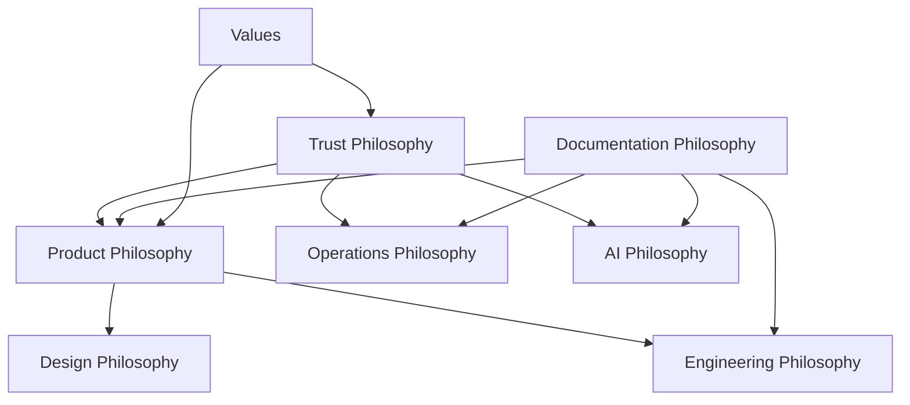

# Company Philosophy

> Decision frameworks and rationale for how Marketplate builds product, documentation, engineering, design, operations, trust, and AI systems.

**Status:** Active  
**Version:** 1.0  
**Last updated:** 2026-07-03

This document elaborates the core philosophies defined in the [Founding Constitution](constitution.md). It explains **why** each philosophy exists and **how to apply it** when making decisions. For behavioral norms, see [Values](values.md). For terminology, see [Glossary](glossary.md).

---

## How to Use This Document

When facing a design, engineering, or operational decision:

1. Identify which philosophy applies
2. Apply the decision framework for that domain
3. If philosophies conflict, **trust philosophy wins** — then clarity, then long-term scalability
4. Document significant tradeoffs in an [ADR](../decisions/) and link back here

---

## Product Philosophy

### Principle

Every product decision optimizes for: **Trust · Quality · Clarity · Long-term scalability · Beautiful design · Operational excellence · AI-first workflows · Documentation-first development · Maintainability · Human-centered experiences.**

Build fewer things. Build them exceptionally well. If Apple, Airbnb, Stripe, and Etsy collaborated on a food marketplace, the result should feel like Marketplate.

### Rationale

Independent food creators are underserved by tools built for restaurants or generic e-commerce. They need vertical depth (compliance, verification, perishable fulfillment) without enterprise complexity. A bloated product erodes the clarity that trust requires — customers and creators both need to understand what they are buying and selling.

### Decision Framework

| Question | Pass | Fail |
|----------|------|------|
| Does this increase verifiable trust? | Ship or prioritize | Deprioritize unless trust-neutral and high creator value |
| Does this serve independent food creators specifically? | Continue | Reconsider — may belong in a different product |
| Can a cottage food operator use this without support? | Continue | Simplify or add guided flows |
| Does this add complexity disproportionate to value? | Cut scope | — |
| Is this documented before implementation begins? | Proceed to build | Write spec first |

### Anti-patterns

- Feature parity chasing with delivery aggregators
- Configuration-heavy designs that avoid product judgment
- Shipping trust-impacting features behind feature flags without verification workflow review
- "Launch now, document later"

→ Product strategy: [Product Overview](../product/overview.md) · [Marketplace Mechanics](../product/marketplace-mechanics.md)

---

## Documentation Philosophy

### Principle

**Documentation is production code.** Incomplete documentation means the feature is incomplete.

| Principle | Meaning |
|-----------|---------|
| Documentation precedes implementation | Spec before code |
| Traceability | Every engineering decision links back to documentation |
| Dual audience | Understandable by humans and AI agents |
| Link, don't duplicate | Prefer cross-references over repeated content |
| Evergreen | Written for years of consumption |
| Related systems | Every page references connected systems |

### Rationale

Marketplate's repository is institutional memory — the operating system of the company. Engineers, designers, operators, executives, investors, and AI agents consume these documents for years. Undocumented systems become single points of failure in people, not code.

### Decision Framework

Before marking any feature complete:

- [ ] Feature doc exists using [feature template](../templates/feature-doc-template.md)
- [ ] Page specs updated for affected screens
- [ ] API documented before implementation (Phase 3+)
- [ ] Related Documents section links to connected systems
- [ ] Significant decisions recorded in [decisions/](../decisions/)
- [ ] Glossary updated if new terms introduced

### Anti-patterns

- Copy-pasting content across docs instead of linking
- Docs that describe intent but not behavior (edge cases, failure modes, permissions)
- Stale docs without version dates or status
- Vague TODOs without `TODO(decision):` prefix when blocked on founder input

→ Templates: [`templates/`](../templates/) · Rollout: [Phased Rollout](../roadmap/phased-rollout.md)

---

## Engineering Philosophy

### Principle

Optimize for **readability, maintainability, and modularity**. Prefer boring technology over clever technology.

- Every service owns one responsibility
- Every API documented before implementation
- Every module independently testable
- Every feature observable — logged, measurable, versioned, documented

### Rationale

Marketplate must scale internationally across diverse creator types and regulatory environments. Clever architectures become bottlenecks when the original author leaves. Boring, well-documented services survive team growth, agent-assisted development, and decade-long maintenance.

### Decision Framework

| Decision | Prefer | Avoid |
|----------|--------|-------|
| Technology choice | Proven, well-documented, team-readable | Bleeding-edge without operational maturity |
| Service boundaries | Single responsibility, clear ownership | God services that do everything |
| Data model | Normalized where integrity matters; denormalized with documented reason | Implicit schema changes without migration docs |
| Failure handling | Explicit failure modes documented; graceful degradation | Silent failures on trust-critical paths |
| Observability | Structured logging, metrics, tracing on every feature | "We can add monitoring later" |

Significant architecture decisions require an [ADR](../decisions/) with alternatives, tradeoffs, and impact analysis.

### Anti-patterns

- Undocumented APIs shipped to unblock frontend
- Shared mutable state without audit trails on financial or verification data
- Test coverage as a vanity metric without testing trust-critical paths
- Internationalization as a retrofit

→ Engineering docs: [`engineering/`](../engineering/) (Phase 3)

---

## Design Philosophy

### Principle

Interfaces should feel **calm**. Whitespace is a feature. Motion communicates state. Consistency builds trust.

- One primary action per screen
- Premium feel: large photography, minimal interface
- Accessibility first
- Responsive across desktop, tablet, and mobile — never design for one breakpoint

### Rationale

Food is emotional. Creators invest passion in their product; customers make trust decisions with their eyes and gut before they read compliance details. Calm, premium interfaces signal that Marketplate takes creators and food safety seriously. Cluttered interfaces signal a cluttered operation.

### Decision Framework

| Question | Guidance |
|----------|----------|
| What is the one primary action? | If unclear, the screen tries to do too much — split or simplify |
| Are trust signals visible? | Verification, allergens, pickup/delivery details above the fold where applicable |
| Does this work on mobile, tablet, and desktop? | Design all three; mobile is not an afterthought for creators managing orders on the go |
| Does motion communicate state? | Animations indicate loading, success, error — never decorate |
| Is it accessible? | WCAG AA minimum; test with keyboard, screen reader, and reduced motion |

Visual identity, color, typography, and components live in [`design-system/`](../design-system/) — this philosophy governs intent; the design system governs execution.

### Anti-patterns

- Dense admin-style interfaces on customer-facing surfaces
- Trust badges as decorative icons without meaningful status
- Designing desktop-first for workflows creators perform on phones
- Custom one-off components when design system components exist

→ Design system: [Design Principles](../design-system/principles.md) · [Accessibility](../design-system/accessibility-standards.md)

---

## Operations Philosophy

### Principle

Every customer interaction should **reduce uncertainty**. Every incident becomes documentation. Every SOP should eventually become partially automated.

- AI assists; humans remain accountable
- Measurable SLAs on every workflow
- Complete audit trails

### Rationale

Creators bet their livelihood on Marketplate. A delayed verification, missing payout, or silent outage is not an inconvenience — it is a business emergency. Operational excellence is respect. Documented, measured workflows scale; tribal knowledge does not.

### Decision Framework

Every operational workflow must define:

| Element | Required |
|---------|----------|
| Owner | Named role or team |
| Trigger | What starts the workflow |
| SLA | Measurable time-to-resolution target |
| AI responsibilities | What AI may recommend or automate |
| Human responsibilities | What requires human judgment and approval |
| Escalation rules | When and how to escalate |
| Audit logging | What is recorded and retained |
| Post-mortem | Required for trust-impacting incidents |

Use [SOP template](../templates/sop-template.md) for all operational procedures.

### Anti-patterns

- "Someone will handle it" without an owner
- Manual workarounds that become permanent infrastructure
- Incidents closed without documentation or root cause
- AI auto-resolving trust-critical tickets without human review path

→ Operations docs: [`operations/`](../operations/) (Phase 4)

---

## Trust Philosophy

### Principle

**Trust is the product.** Never sacrifice trust for growth.

| Pillar | Requirement |
|--------|-------------|
| Food safety | Non-negotiable compliance and verification |
| Identity verification | Creators are real, verified people |
| Kitchen verification | Production environments are verified |
| Transparency | Customers see what they need to trust |
| Reviews & community | Social proof and accountability |

### Rationale

Generic marketplaces race to maximize listings. Marketplate races to maximize **verified, trustworthy supply**. One food safety incident damages not just one creator but the platform's core thesis. Trust is slower to build and faster to destroy than any feature is to ship.

### Decision Framework

```
Trust Decision Tree
───────────────────
1. Does this weaken food safety compliance?
   YES → Stop. Do not ship.
   NO  → Continue

2. Does this allow unverified creators to transact?
   YES → Stop unless explicit, time-bounded exception approved via ADR.
   NO  → Continue

3. Does this reduce transparency to customers?
   YES → Redesign for transparency or do not ship.
   NO  → Continue

4. Does this weaken review integrity or community accountability?
   YES → Redesign.
   NO  → Proceed with standard review
```

Trust-impacting changes require review from Trust & Safety (Phase 4) and documentation in [Marketplace Mechanics](../product/marketplace-mechanics.md).

### Anti-patterns

- Growth hacks that bypass verification
- Hiding negative review or compliance information from customers
- Deferring kitchen re-verification when creator changes production environment
- Treating trust workflows as "ops overhead" instead of core product

---

## AI Philosophy

### Principle

AI should **not replace people**. AI removes repetitive work, improves consistency, proactively detects problems, and assists internal teams.

**AI recommends. Humans approve.**

Every AI system must document: Purpose · Inputs · Outputs · Prompt Strategy · Evaluation · Fallbacks · Confidence Thresholds · Security · Human Review · Continuous Improvement

### Rationale

AI scales operational capacity — menu description suggestions, document classification, anomaly detection, support triage — but trust-critical decisions require human judgment. A false-positive kitchen approval is a food safety risk. A false-negative creator rejection damages a livelihood. AI must be bounded, evaluated, and auditable.

### Decision Framework

| Trust Impact | AI Role | Human Role |
|--------------|---------|------------|
| **High** (verification, moderation, compliance) | Recommend with confidence score | Approve or reject every decision |
| **Medium** (support triage, content suggestions) | Draft or classify; auto-act above confidence threshold with audit | Review samples; handle exceptions |
| **Low** (internal search, doc generation, analytics) | Auto-act with logging | Periodic evaluation and prompt refinement |

Every AI system requires documentation using [AI doc template](../templates/ai-doc-template.md).

### Anti-patterns

- Auto-approving creators or trust-impacting content without human review
- Undocumented prompts in production code
- No fallback when model confidence is below threshold
- Using AI to avoid building clear, deterministic rules where rules suffice

→ AI docs: [`ai/`](../ai/) (Phase 3–4)

---

## Philosophy Integration

These philosophies are not independent — they reinforce each other:



When building any feature, the minimum philosophical coverage is:

1. **Trust** — Does this meet trust pillars?
2. **Product** — Does this serve creators with quality and clarity?
3. **Documentation** — Is the spec complete and linked?
4. **Design** — Is the experience calm, accessible, and responsive?
5. **Engineering** — Is it maintainable, observable, and testable?
6. **Operations** — Is there an owner, SLA, and audit trail?
7. **AI** — If AI is involved, is human approval documented?

---

## Related Documents

- [Founding Constitution](constitution.md) — Authoritative source for all philosophies
- [Mission](mission.md) — Why these philosophies exist
- [Vision](vision.md) — Long-term direction they serve
- [Values](values.md) — Behavioral expression of philosophy
- [Market Context](market-context.md) — Category context for product philosophy
- [Glossary](glossary.md) — Canonical terminology
- [Design Principles](../design-system/principles.md) — Design system execution
- [Product Overview](../product/overview.md) — Product strategy
- [Marketplace Mechanics](../product/marketplace-mechanics.md) — Trust model details
- [Phased Rollout](../roadmap/phased-rollout.md) — When domain docs are built
- [Templates](../templates/) — Document templates for each domain
