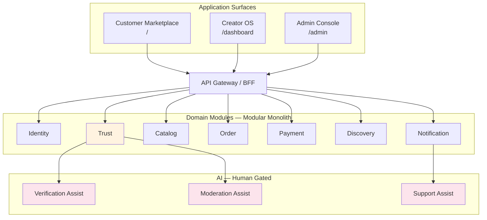

# Application Surfaces

> Three surfaces, one platform — see [Architecture Overview](../engineering/architecture-overview.md#three-application-surfaces).

## Access matrix

| Surface | Auth required | MFA | Primary modules |
|---------|---------------|-----|-----------------|
| Customer | Optional browse; required checkout | No | Discovery, Catalog, Order, Payment |
| Creator | Yes | Recommended | Catalog, Order, Trust, Payment |
| Admin | Yes | **Required** | Trust, Order, Payment, Admin config |

→ [Information Architecture — Access Matrix](../pages/information-architecture.md#authentication--access-matrix)
