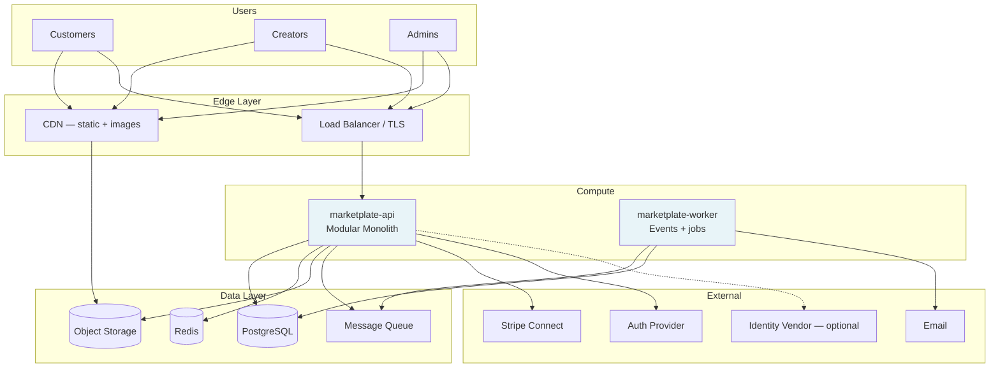

# System Topology

> Launch infrastructure — see [Infrastructure Overview](../engineering/infrastructure-overview.md) for full detail.

## Environments

| Env | Purpose | Stripe | Auth |
|-----|---------|--------|------|
| **local** | Docker Compose | Test CLI | Stub |
| **dev** | Integration | Test | Dev tenant |
| **staging** | Pre-prod QA | Test | Staging |
| **prod** | Live marketplace | Live | Production |

→ [Infrastructure Overview — Environments](../engineering/infrastructure-overview.md)
