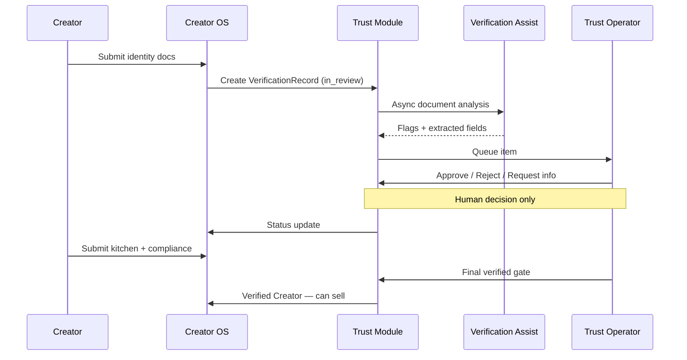
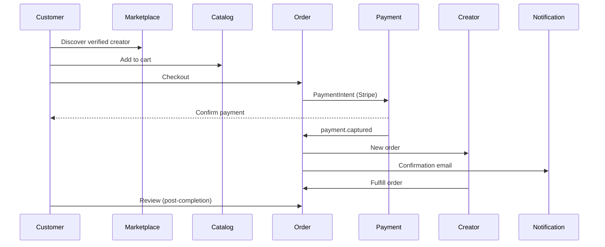
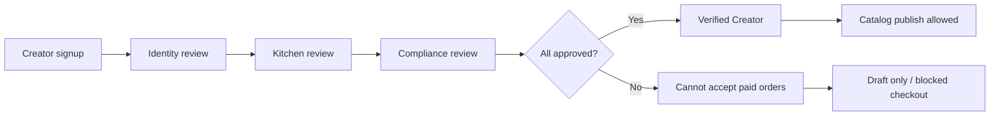

# Trust & Commerce Flows

> High-level sequences — full specs in [Trust Verification Flow](../pages/flows/trust-verification-flow.md) and [Customer Purchase Flow](../pages/flows/customer-purchase-flow.md).

## Creator verification (trust path)

*Human approval required at every verification decision.*

→ SOP: [Verification Review](../operations/verification-review-sop.md)

---

## Customer purchase (commerce path)

→ Flow: [Order Fulfillment](../pages/flows/order-fulfillment-flow.md) · Mechanics: [Marketplace Mechanics](../product/marketplace-mechanics.md)

---

## Verified-to-sell gate

Hard invariant: unverified creators **never** appear in customer discovery or accept payment.

→ [Marketplace Mechanics — Verified to sell](../product/marketplace-mechanics.md#marketplace-model-overview)
