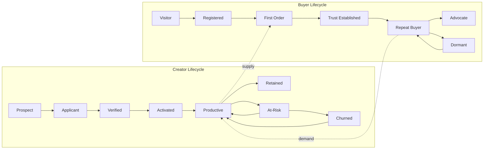

# Customer Lifecycle

> Lifecycle stages, gates, and CS responsibilities for creators (supply) and buyers (demand).

**Status:** Active  
**Version:** 1.0  
**Last updated:** 2026-07-03  
**Owner:** Customer Success

---

## Purpose

Marketplate serves two customer types with distinct lifecycles that must stay synchronized: **creators** who supply verified food and **buyers** who purchase with confidence. This document defines lifecycle stages, exit criteria, CS touchpoints, and handoffs so teams intervene at the right moment — not after churn.

For funnel mechanics, see [Creator Onboarding Flow](../../pages/flows/creator-onboarding-flow.md) and [Customer Purchase Flow](../../pages/flows/customer-purchase-flow.md). For persona context, see [Personas](../../product/personas.md).

---

## Lifecycle Overview

Creator and buyer lifecycles are interdependent: productive creators without repeat buyers stall; repeat buyers without reliable supply churn. CS monitors both sides of the marketplace.

---

## Creator Lifecycle

### Stage definitions

| Stage | Definition | Primary CS goal |
|-------|------------|-----------------|
| **Prospect** | Identified lead; has not started application | Convert to applicant with trust-first messaging |
| **Applicant** | Account created; verification in progress | Reduce drop-off; clear timeline communication |
| **Verified** | Identity + kitchen + compliance approved; may lack listings | Drive first listing and storefront completeness |
| **Activated** | ≥1 live listing + storefront shared; may lack orders | Accelerate first order; operational readiness |
| **Productive** | ≥1 completed order/month; completion rate ≥ platform target | Deepen OS adoption; improve GMV per creator |
| **Retained** | Active order volume month-over-month | Expansion, persona-specific optimization |
| **At-Risk** | Meets at-risk criteria — see [Retention & Expansion](retention-and-expansion.md#health-scoring) | Targeted intervention within SLA |
| **Churned** | Previously active; zero orders for 60+ days | Win-back campaign; diagnose root cause |
| **Reactivated** | Churned creator returns to ≥1 completed order | Re-onboard to current product; prevent re-churn |

### Creator stage gates

| Transition | Exit criteria | CS action if stalled |
|------------|---------------|------------------------|
| Prospect → Applicant | Application started | Nurture email; address verification concerns upfront |
| Applicant → Verified | Full verification approved | See verification sub-stages below |
| Verified → Activated | ≥1 published listing + profile completeness ≥ threshold | Activation outreach at day 7 and day 14 |
| Activated → Productive | First completed order within 30 days of first listing | First-order coaching; share-link guidance |
| Productive → Retained | Order in consecutive active months | Quarterly business review (high-GMV creators) |
| Any → At-Risk | Health score drops below threshold | Tiered intervention — see [Retention & Expansion](retention-and-expansion.md#intervention-strategy) |
| At-Risk → Churned | No order activity 60 days post-intervention | Win-back sequence; internal post-mortem tag |

**Activation benchmark (from product metrics):** A verified creator without a live listing at **day 14** is at-risk — trigger creator success outreach. See [Creator Metrics](../../product/success-metrics-overview.md#activation).

### Verification sub-stages (Applicant)

The applicant stage maps directly to [Creator Onboarding Flow](../../pages/flows/creator-onboarding-flow.md) phases:

| Sub-stage | Blocker | CS / Ops responsibility |
|-----------|---------|---------------------------|
| Identity not started | No ID submitted | Education: why verification matters for conversion |
| Identity in review | Awaiting human approval | SLA communication; no premature promises |
| Identity action required | Deficiency flagged | Specific resubmission guidance — not generic "try again" |
| Kitchen not started | Identity not approved | N/A — product gate |
| Kitchen in review | Awaiting approval | Persona-specific doc checklist (commissary, cottage food, etc.) |
| Compliance pending | Docs missing or expired | Proactive expiration reminders; jurisdiction guidance |
| Compliance complete | — | Transition to Verified; handoff to activation CS |

→ Internal review path: [Trust Verification Flow](../../pages/flows/trust-verification-flow.md)  
→ Persona variations: [Creator Onboarding — Persona-Specific Variations](../../pages/flows/creator-onboarding-flow.md#persona-specific-variations)

### Persona-specific lifecycle notes

| Persona | Lifecycle emphasis | CS focus area |
|---------|-------------------|---------------|
| [Independent Chef](../../product/personas.md#independent-chef) | Trust story + first orders from network | Profile quality, share-link activation |
| [Meal Prep Business](../../product/personas.md#meal-prep-business) | Batch capacity + weekly rhythm | Cut-off times, recurring order patterns |
| [Baker](../../product/personas.md#baker) | Lead times, custom orders, seasonal spikes | Deposit policies, capacity calendar |
| [Caterer](../../product/personas.md#caterer) | Quote-to-book, high AOV | Inquiry response time, deposit collection |
| [Food Truck Operator](../../product/personas.md#food-truck-operator) | Location schedule + pre-orders | Real-time availability, sell-out accuracy |
| [Cottage Food Operator](../../product/personas.md#cottage-food-operator) | Compliance confidence | Category restrictions, sales cap tracking |
| [Pop-Up Kitchen](../../product/personas.md#pop-up-kitchen) | Event sell-through | Pre-pay capacity, waitlist management |
| [Commercial Kitchen Operator](../../product/personas.md#commercial-kitchen-operator) | Tenant enablement | Kitchen-level verification, tenant attach rate |

---

## Buyer Lifecycle

### Stage definitions

| Stage | Definition | Primary CS goal |
|-------|------------|-----------------|
| **Visitor** | Browses without account | Trust education; reduce anonymous-seller anxiety |
| **Registered** | Account created; no completed order | Convert to first order with verified-creator confidence |
| **First Order** | One completed purchase | Flawless fulfillment experience; establish trust |
| **Trust Established** | First order completed without dispute/refund | Prompt review; introduce favorites/reorder |
| **Repeat Buyer** | ≥2 orders within 90 days | Increase frequency; cross-creator discovery |
| **Advocate** | NPS promoter; refers others or reviews consistently | Referral programs; creator-attributed acquisition |
| **Dormant** | No order in 90 days after prior activity | Re-engagement with creator updates, not discount spam |

### Buyer stage gates

| Transition | Exit criteria | CS action if stalled |
|------------|---------------|------------------------|
| Visitor → Registered | Account created | Welcome sequence emphasizing verification |
| Registered → First Order | One completed order | Abandoned cart/checkout recovery (product-triggered) |
| First Order → Trust Established | Order completed; CSAT ≥ 4; no open dispute | Post-order satisfaction check |
| Trust Established → Repeat Buyer | Second order within 90 days | Reorder prompts; favorite creator nudges |
| Repeat Buyer → Advocate | NPS ≥ 9 or referral action | Thank-you touch; case study invitation (opt-in) |
| Any → Dormant | No order in 90 days | Win-back with creator-specific updates |

**Primary persona:** [End Customer (Trust-Seeking Buyer)](../../product/personas.md#end-customer-trust-seeking-buyer)

Buyers optimize for **confidence** — who made it, where, allergen clarity, reliable timing. CS messaging must lead with trust, not promotions. See [Customer Value Propositions — Trust](../../product/value-props.md#trust-1).

---

## Lifecycle × Value Dimension

Use [Value Propositions](../../product/value-props.md) to select outreach framing per stage:

| Stage | Creator — lead with | Buyer — lead with |
|-------|---------------------|-------------------|
| Early (Prospect / Visitor) | Trust — verification credibility | Trust — verified creators only |
| Activation (Verified / First Order) | Software — OS replaces patchwork tools | Software — calm checkout, clear tracking |
| Growth (Productive / Repeat) | Community — reviews compound | Community — connection to local makers |
| Expansion (Retained / Advocate) | Economics — GMV growth, fair fees | Economics — fair value for quality |

---

## CS Touchpoint Calendar

### Creator touchpoints by stage

| Stage | Day | Channel | Owner |
|-------|-----|---------|-------|
| Applicant | 0 | Email | Automated + CS monitor |
| Applicant (stalled 3+ days) | 3 | Email | CS |
| Verified, no listing | 7 | Email + in-app | CS |
| Verified, no listing | 14 | Email + optional call | CS (at-risk) |
| First listing, no order | 3 | Email | CS |
| First order received | 0 | In-app tooltip + email | Automated |
| First order fulfilled | 1 | Email — success guide link | CS |
| Productive (monthly) | — | In-app tips | Automated |
| Productive (high GMV) | Quarterly | Call / video | CSM |

→ Email copy and sequences: [Education Playbooks](education-playbooks.md)  
→ External creator guides: [onboarding/](../onboarding/)

### Buyer touchpoints by stage

| Stage | Trigger | Channel | Owner |
|-------|---------|---------|-------|
| Registered, no order | 24h | Email | Automated |
| First order placed | Immediate | Email + push | Automated |
| Order in progress | Status changes | Push + email | Automated |
| Order completed | +2h | Review prompt | Automated |
| Order completed | +24h | CSAT survey | Automated |
| Repeat buyer (30-day) | Milestone | Email — discovery | Automated |
| Dormant (90-day) | Inactivity | Email — creator updates | CS |

---

## Internal Handoffs

| Event | From | To | Required context |
|-------|------|----|------------------|
| Verification rejected | Trust & Safety | CS | Rejection reason, appeal eligibility, persona |
| Creator at-risk flagged | CS system | CSM | Health score breakdown, intervention history |
| Buyer dispute opened | Support | CS (if repeat buyer) | Order ID, creator relationship, prior tickets |
| Trust incident | Trust & Safety | CS + Comms | Incident severity, affected creators/buyers |
| Creator suspended | Trust & Safety | CS | Suspension reason, reinstatement path |
| High-GMV creator churn risk | CS | Product | Feature gaps, persona-specific feedback |

→ Playbooks: [Creator Suspension & Offboarding](../playbooks/creator-suspension-offboarding.md) · [Trust & Safety Escalation](../playbooks/trust-safety-escalation.md)

---

## Lifecycle Metrics by Stage

| Stage | Key metrics | Target direction |
|-------|-------------|------------------|
| Applicant | Verification completion rate, time to verified, drop-off by step | ↑ completion, ↓ time, ↓ drop-off |
| Verified → Activated | First listing published rate (14-day), profile completeness | ↑ |
| Activated → Productive | First order received rate (30-day), time to first order | ↑, ↓ |
| Productive | GMV per active creator, order completion rate, creator retention | ↑ |
| Buyer First Order | Checkout → order rate, fulfillment step abandonment | ↑, ↓ |
| Repeat Buyer | Repeat purchase rate (30/90-day), purchase frequency | ↑ |

Full definitions: [Success Metrics](success-metrics.md) · [Product Success Metrics Overview](../../product/success-metrics-overview.md)

---

## Related Documents

- [Customer Success README](README.md)
- [Retention & Expansion](retention-and-expansion.md)
- [Education Playbooks](education-playbooks.md)
- [Success Metrics](success-metrics.md)
- [Creator Onboarding Flow](../../pages/flows/creator-onboarding-flow.md)
- [Customer Purchase Flow](../../pages/flows/customer-purchase-flow.md)
- [Personas](../../product/personas.md)
- [Value Propositions](../../product/value-props.md)
