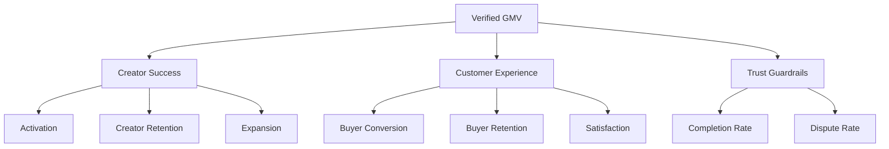

# Success Metrics

> Customer Success KPIs, operational metrics, and reporting — aligned with product measurement.

**Status:** Active  
**Version:** 1.0  
**Last updated:** 2026-07-03  
**Owner:** Customer Success · Analytics

---

## Purpose

This document defines **CS-owned and CS-influenced metrics** with targets, data sources, and reporting cadence. Canonical metric definitions live in [Success Metrics Overview](../../product/success-metrics-overview.md) — this document adds CS operational context, health score inputs, and team accountability without redefining formulas.

**North star:** [Verified GMV](../../product/success-metrics-overview.md#north-star-metric) — CS influences supply activation, creator retention, and buyer repeat rate.

---

## Measurement Principles (CS Application)

| Principle | CS application |
|-----------|----------------|
| **Trust metrics are first-class** | CS dashboards include completion rate and dispute rate alongside activation |
| **Quality over vanity** | Report verified → first listing, not raw signups |
| **Segment by persona** | Activation and churn cut by [persona](../../product/personas.md) |
| **Leading + lagging** | Health score (leading) + GMV per creator (lagging) |
| **Cohort-based** | Weekly creator cohorts from verification date |

→ Full principles: [Success Metrics Overview — Measurement Principles](../../product/success-metrics-overview.md#measurement-principles)

---

## CS Metric Hierarchy

If Verified GMV grows while **Trust Guardrails** degrade, CS pauses expansion motions and escalates — see [Retention & Expansion](retention-and-expansion.md).

---

## Creator Success Metrics

### Activation (CS primary ownership)

| Metric | Definition | CS target (internal) | Source | Cadence |
|--------|------------|---------------------|--------|---------|
| **Verification completion rate** | Verified / submitted applications within 30 days | ≥70% (adjust by market maturity) | Trust + product analytics | Weekly |
| **Time to verified** | Median hours: submit → verified | ↓ week-over-week | Trust queue | Weekly |
| **Verification drop-off by step** | % abandoning at identity, kitchen, compliance, catalog | ↓ per step | Funnel events | Weekly |
| **First listing published rate** | Creators with ≥1 live listing / verified within 14 days | ≥80% | Product analytics | Weekly |
| **Time to first listing** | Median days: verified → first publish | ≤7 days | Product analytics | Weekly |
| **First order received rate** | Creators with ≥1 order / verified within 30 days | ≥50% | Order data | Weekly |
| **Time to first order** | Median days: verified → first completed order | ≤21 days | Order data | Weekly |
| **Profile completeness score** | Weighted: photo, story, catalog depth, fulfillment | ≥80% at activation | Product analytics | Weekly |

**At-risk benchmark:** Verified creator without live listing at day 14 → outreach triggered. See [Customer Lifecycle](customer-lifecycle.md#creator-stage-gates).

→ Canonical definitions: [Creator Metrics — Activation](../../product/success-metrics-overview.md#activation)

### Creator retention (CS shared ownership with Product)

| Metric | Definition | CS target (internal) | Source | Cadence |
|--------|------------|---------------------|--------|---------|
| **Creator retention (monthly)** | Order in M and M+1 / order in M | ↑ month-over-month | Order cohorts | Monthly |
| **Creator churn rate** | Complement of retention | ↓ | Order cohorts | Monthly |
| **Creator reactivation rate** | Churned returning to ≥1 order | ≥15% of churned cohort | Order data | Monthly |
| **Weekly active creators (WAC)** | ≥1 login or order action in 7 days | ↑ | Product analytics | Weekly |
| **At-risk creator count** | Health score <60 | ↓ | Health score model | Weekly |
| **Intervention resolution rate** | At-risk creators returning to healthy within 30 days | ≥40% | CS CRM | Weekly |

→ Health scoring: [Retention & Expansion — Health Scoring](retention-and-expansion.md#health-scoring)

### Creator quality (CS monitoring + coaching)

| Metric | Definition | CS target | Source | Cadence |
|--------|------------|-----------|--------|---------|
| **Order completion rate** | Completed / confirmed orders | ≥98% platform target | Order data | Weekly |
| **On-time ready rate** | Ready by promised time / orders with promise | ≥95% | Fulfillment events | Weekly |
| **Creator-initiated cancellation rate** | Creator cancellations / confirmed | ↓ | Order data | Weekly |
| **Creator average review score** | Mean rating | ≥4.5 | Reviews | Monthly |
| **Dispute rate (creator-attributed)** | Disputes lost/mediated against creator / orders | ↓ | Trust | Monthly |

Quality drops trigger intervention before churn — see [Intervention Strategy](retention-and-expansion.md#intervention-strategy).

### Creator expansion (CS influenced)

| Metric | Definition | CS target | Source | Cadence |
|--------|------------|-----------|--------|---------|
| **GMV per active creator** | Verified GMV / creators with ≥1 order | ↑ | Finance + orders | Monthly |
| **Catalog breadth** | Median active SKUs per active creator | Monitor by persona | Product analytics | Monthly |
| **Capacity utilization** | Orders / capacity available | Optimize — not max blindly | Fulfillment config | Monthly |
| **Expansion motion conversion** | Creators completing CS-recommended action / outreach | Track by motion | CS CRM | Monthly |

---

## Customer Experience Metrics

### Buyer conversion (CS influenced via education)

| Metric | Definition | CS target | Source | Cadence |
|--------|------------|-----------|--------|---------|
| **Registered → first order rate** | First completed order / registrations (30-day cohort) | ↑ | Funnel | Weekly |
| **Cart → checkout rate** | Checkouts / carts | ↑ | Funnel | Weekly |
| **Checkout → order rate** | Orders / checkouts started | ↑ | Funnel | Weekly |
| **Fulfillment step abandonment** | Drop at scheduling/pickup | ↓ | Funnel | Weekly |
| **Creator-attributed acquisition** | First touch via creator share link | ↑ organic share | Attribution | Monthly |

→ Canonical definitions: [Customer Metrics — Discovery & conversion](../../product/success-metrics-overview.md#discovery--conversion)

### Buyer retention (CS primary ownership)

| Metric | Definition | CS target | Source | Cadence |
|--------|------------|-----------|--------|---------|
| **Repeat purchase rate (30-day)** | ≥2 orders in 30 days / first-time customers | ↑ | Order cohorts | Monthly |
| **Repeat purchase rate (90-day)** | Same at 90 days | ↑ | Order cohorts | Monthly |
| **Purchase frequency** | Orders / active customer / month | ↑ | Order data | Monthly |
| **Customer retention (monthly)** | Order in M and M+1 / order in M | ↑ | Order cohorts | Monthly |
| **Dormant buyer rate** | No order 90+ days after prior activity | ↓ | Cohort | Monthly |
| **Buyer win-back rate** | Dormant returning within 30 days of campaign | Track | CS campaigns | Monthly |

### Buyer satisfaction (CS primary ownership)

| Metric | Definition | CS target | Source | Cadence |
|--------|------------|-----------|--------|---------|
| **CSAT** | Post-order "How satisfied?" (1–5) | ≥4.2 avg | Survey | Weekly |
| **NPS** | Standard NPS cadence | ↑ quarter-over-quarter | Survey | Quarterly |
| **Support contact rate** | Tickets / completed orders | ↓ | Support | Weekly |
| **Refund request rate** | Customer refunds / completed orders | ↓ | Orders | Weekly |
| **Review submission rate** | Reviews / review prompts sent | ↑ | Reviews | Monthly |

→ Canonical definitions: [Customer Metrics — Satisfaction](../../product/success-metrics-overview.md#satisfaction)

---

## CS Operational Metrics

Metrics measuring CS team effectiveness — not duplicated in product overview.

| Metric | Definition | Target | Cadence |
|--------|------------|--------|---------|
| **Activation outreach SLA adherence** | Day-14 at-risk contacts within 1 business day / eligible | ≥95% | Weekly |
| **Intervention response time** | Hours from at-risk flag → first CSM contact | Per tier SLA | Weekly |
| **Email sequence completion rate** | Users receiving full sequence / enrolled | Monitor drop-off | Weekly |
| **Education content engagement** | Clicks on help links from lifecycle emails | ↑ | Monthly |
| **CS-attributed reactivation** | Churned creators/buyers returning after CS touch | Track | Monthly |
| **Support → CS handoff SLA** | At-risk tags within 24h / eligible tickets | ≥90% | Weekly |
| **Creator NPS (CS survey)** | Optional quarterly creator satisfaction | ↑ | Quarterly |

---

## Trust Guardrails (CS accountability)

CS must monitor these even though Trust & Safety owns resolution:

| Metric | Definition | CS action threshold | Cadence |
|--------|------------|---------------------|---------|
| **Trust incident rate** | Confirmed incidents / 1,000 orders | Any spike → pause expansion | Daily review |
| **Dispute rate** | Disputes / completed orders | ↑ 20% WoW → creator coaching push | Weekly |
| **Listing completeness rate** | Listings meeting allergen/ingredient standards | <95% → education campaign | Weekly |
| **Compliance doc currency rate** | Valid docs / verified creators | <98% → compliance email surge | Weekly |
| **Verified creator ratio** | Fully verified / attempting to sell | ↓ → activation funnel review | Weekly |

→ Full definitions: [Trust Metrics](../../product/success-metrics-overview.md#trust-metrics)

**Crisis rule:** Verified GMV growth + trust metric degradation = executive escalation, not CS celebration.

---

## Health Score Metrics

Health scores aggregate inputs defined in [Retention & Expansion](retention-and-expansion.md#health-scoring). Track distribution, not just averages:

| Metric | Definition | Cadence |
|--------|------------|---------|
| **Creator health distribution** | % green (80+) / yellow (60–79) / red (<60) | Weekly |
| **Health score trend** | WoW change in median creator health | Weekly |
| **False positive rate** | Healthy score but churned within 30 days | Monthly |
| **False negative rate** | At-risk score but self-recovered without intervention | Monthly |
| **Override trigger count** | Hard overrides firing regardless of score | Weekly |

Review false positive/negative rates quarterly with Analytics to tune weights.

---

## Persona Segmentation

After sufficient volume, all CS metrics must be reportable by creator persona:

| Persona | Priority metrics |
|---------|-------------------|
| Independent Chef | Time to first order, repeat customer rate |
| Meal Prep Business | Weekly active order rate, batch utilization |
| Baker | On-time ready rate, cancellation rate |
| Caterer | Quote-to-book (future), AOV |
| Food Truck | Pre-order rate, location schedule adherence |
| Cottage Food | Compliance completion, catalog restriction adherence |
| Pop-Up Kitchen | Sell-through rate, repeat attendance |
| Commercial Kitchen | Tenant verification attach rate |

→ Persona definitions: [Personas](../../product/personas.md)

---

## Reporting Cadence

| Report | Audience | Cadence | Core metrics |
|--------|----------|---------|--------------|
| **CS Weekly Dashboard** | CS team | Weekly | Activation funnel, at-risk count, intervention outcomes, CSAT |
| **Creator Success Review** | CS + Product + Trust | Weekly | Verification drop-off, first listing rate, completion rate, health distribution |
| **Customer Experience Review** | CS + Product | Weekly | Repeat rate, dormant buyers, support contact rate, NPS trend |
| **Executive CS Summary** | Leadership | Monthly | Verified GMV inputs, creator retention, repeat customer rate, trust guardrails |
| **Quarterly Persona Review** | CS + Product + Analytics | Quarterly | All metrics re-cut by persona and geography |

Aligns with product reporting: [Success Metrics Overview — Reporting Cadence](../../product/success-metrics-overview.md#reporting-cadence)

### Weekly CS dashboard template

| Section | Metrics |
|---------|---------|
| **North star inputs** | Verified GMV, active verified creators with orders, repeat customer rate |
| **Activation** | Verification completion, first listing rate (14-day), first order rate (30-day) |
| **At-risk** | Count by tier, persona breakdown, aging |
| **Interventions** | Outreach completed, resolution rate, reactivation |
| **Quality** | Completion rate, on-time ready, dispute rate |
| **Buyer** | CSAT, repeat rate (30-day), dormant count |
| **Trust guardrails** | Trust incident rate, compliance currency |

---

## Anti-Metrics for CS

Do not optimize these — aligned with [Product Anti-Metrics](../../product/success-metrics-overview.md#anti-metrics-do-not-optimize):

| Anti-metric | Why CS must avoid |
|-------------|-------------------|
| Total unverified signups | Pressure to skip verification coaching |
| Outreach volume without resolution | Activity metric, not outcome |
| Email open rate alone | Vanity without conversion to listing/order |
| Creators retained with <90% completion | Retention without quality |
| Buyer reactivation via deep discounts | Wrong buyer segment |

---

## Metric → Action Map

Quick reference for weekly reviews:

| Metric moves ↓ | Likely cause | CS action |
|----------------|--------------|-----------|
| First listing rate | Verification confusion, catalog friction | C2 sequence; listing workshop |
| First order rate | No share strategy, empty discovery | C3 sequence; share coaching |
| Completion rate | Capacity overcommit, ops overwhelm | Fulfillment coaching; capacity review |
| Repeat purchase rate | First order failure, discovery gap | B2 sequence; cross-creator education |
| CSAT | Fulfillment timing, communication gaps | Creator coaching; support audit |
| Compliance currency | Doc expiration awareness | C5 sequence escalation |
| At-risk count ↑ | Seasonal, product change, market liquidity | Persona-specific intervention blitz |

---

## Open Decisions

CS metric baselines depend on product decisions not yet finalized:

| Decision | Metric impact |
|----------|---------------|
| `TODO(decision):` Geographic launch market | Liquidity targets, cohort sizes |
| `TODO(decision):` Commission structure | Creator economics coaching, expansion framing |
| `TODO(decision):` Pricing model | Subscription vs. transaction CS motions |

→ Track in [Value Propositions — Open Decisions](../../product/value-props.md#open-decisions)

---

## Related Documents

- [Customer Success README](README.md)
- [Customer Lifecycle](customer-lifecycle.md)
- [Retention & Expansion](retention-and-expansion.md)
- [Education Playbooks](education-playbooks.md)
- [Success Metrics Overview](../../product/success-metrics-overview.md)
- [Personas](../../product/personas.md)
- [Value Propositions](../../product/value-props.md)
- [Creator Onboarding Flow](../../pages/flows/creator-onboarding-flow.md)
- [Customer Purchase Flow](../../pages/flows/customer-purchase-flow.md)
