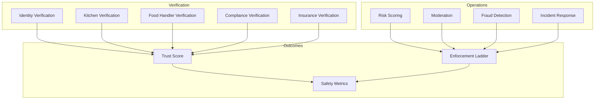

# Trust & Safety Standards

> The complete trust framework for Marketplate — verification, risk scoring, moderation, fraud detection, incident response, and platform integrity. **Trust is our product. Software enables trust.**

**Status:** Active  
**Version:** 1.0  
**Last updated:** 2026-07-03  
**Owner:** Trust & Safety  
**Governing authority:** [Marketplate Standards](marketplate-standards.md) · [Founding Constitution](../../company/constitution.md)

---

## Purpose

This document defines how Marketplate **builds, measures, and enforces trust** across the platform. It is the operational and policy companion to the strategic [Trust Model](../../product/marketplace-mechanics.md#trust-model).

Engineering implements these standards via the [Trust Service](../../engineering/services/trust-service.md). AI systems assist but never decide — [Verification Assist](../../ai/verification-assist.md) · [Moderation Assist](../../ai/moderation-assist.md).

**Audience:** Trust & Safety operators, Engineering, Legal, Support, Product, Executive leadership.

---

## Trust Framework Overview

Trust is a **coherent system** where each layer reinforces the others. Removing one layer weakens the entire model.



### Trust layers

| Layer | Purpose | Customer-visible outcome |
|-------|---------|------------------------|
| **Identity verification** | Confirm creator is real and accountable | Verified Identity badge |
| **Kitchen verification** | Confirm approved production environment | Verified Kitchen badge; location transparency |
| **Compliance verification** | Licenses, permits, food safety docs | Compliance status; category eligibility |
| **Listing transparency** | Ingredients, allergens, fulfillment, policies | Informed purchase decision |
| **Reviews & community** | Post-transaction accountability | Authentic reputation signals |
| **Platform integrity** | Moderation, disputes, enforcement | Bad actors removed; disputes handled |

Strategic requirements: [Marketplace Mechanics — Trust Model](../../product/marketplace-mechanics.md#trust-model).

### Platform invariants

| Invariant | Rule |
|-----------|------|
| **Verified to sell** | Unverified creators cannot accept paid orders |
| **Transparent to buy** | Trust information visible before payment |
| **Audit everything** | Immutable audit trails on trust actions |
| **Human approval on high stakes** | AI recommends; humans approve |
| **Fail closed** | Unknown verification state → deny transaction |

Architecture enforcement: [Architecture Overview — Trust layer](../../engineering/architecture-overview.md#trust-layer-as-cross-cutting-concern).

---

## Identity Verification

**Goal:** Customers know they are buying from a real, accountable operator — not an anonymous account.

### Requirements

| Element | Standard |
|---------|----------|
| **Entity types** | Individual sole proprietors, LLCs, partnerships — entity type captured |
| **Minimum signals** | Government ID, business registration where applicable, tax identity, contact verification |
| **Ongoing checks** | Re-verification on material identity change; fraud signal triggers |
| **Failure mode** | Cannot publish paid listings; draft mode only |
| **Customer display** | Creator name, verification status, story on storefront |

Identity establishes **accountability** — it does not alone prove food safety. Kitchen and compliance layers required.

### Verification workflow

```
Creator submits → Document ingest → Verification Assist (async)
    → Verification Queue → Human operator review → Approve / Reject / Request info
```

Flow detail: [Trust Verification Flow](../../pages/flows/trust-verification-flow.md) · Queue: [Verification Queue](../../pages/admin/verification-queue.md).

### AI assist role

[Verification Assist](../../ai/verification-assist.md) extracts fields, scores quality, flags mismatches and fraud. **Never approves or rejects.** Operators complete checklist and decide.

| AI output | Operator action |
|-----------|-----------------|
| Extracted fields | Confirm or correct |
| Mismatch flags | Investigate; dismiss with audit note if false |
| Fraud flags (high severity) | Senior reviewer required to approve |

### Re-verification triggers

| Trigger | Action |
|---------|--------|
| Legal name or entity change | Identity re-verification required |
| Fraud signal (duplicate ID, tampered doc) | Immediate hold; investigation |
| Customer or authority report | Case review; possible re-verification |
| Periodic refresh | `TODO(decision):` Define refresh cadence for mature accounts |

---

## Kitchen Verification

**Goal:** Customers understand **where food is produced** and that the environment meets platform standards.

### Kitchen types

| Type | Verification focus |
|------|-------------------|
| **Home (cottage)** | Address confirmation, jurisdiction eligibility, facility photos |
| **Commercial shared kitchen** | Facility registration, inspection records where available, tenant bay linkage |
| **Dedicated facility** | Business address, inspection records, facility photos |
| **Commissary** | Commissary registration; linked mobile units |
| **Mobile (food truck)** | Unit identification + commissary linkage |

### Required artifacts

| Artifact | Purpose |
|----------|---------|
| **Address confirmation** | Match production location to declared address |
| **Facility photos** | Prep areas, storage, hand-washing — current and accurate |
| **Inspection records** | Where available from local authority |
| **Facility registration** | Commercial kitchen or commissary documentation |
| **Multi-tenant linkage** | Tenant schedule/bay assignment in shared kitchens |

### Product linkage

Every SKU must associate with a **verified production location**. Listings blocked or suspended until kitchen verified — [Marketplace Mechanics](../../product/marketplace-mechanics.md#kitchen-verification).

### Important limitation

Kitchen verification is **not** a health inspection substitute. Marketplate verifies documentation and consistency; government authorities retain regulatory authority. Legal framing: [`legal/`](../../legal/).

### Multi-tenant kitchens

Commercial kitchen verified once; tenants linked to permitted bays/schedules. Changes in tenancy require updated linkage before sale from new bay.

---

## Food Handler Verification

Food handler certification confirms the creator (or designated staff) has completed jurisdiction-required food safety training.

### Requirements

| Element | Standard |
|---------|----------|
| **Document type** | Valid food handler certificate, manager certification, or equivalent per jurisdiction |
| **Named individual** | Certificate must match verified identity or registered staff member |
| **Expiration tracking** | Proactive reminders; grace period before suspension |
| **Renewal** | Updated certificate uploaded before expiry |
| **Failure mode** | Expired cert → listing suspension after grace — not silent continuation |

Compliance engine: [Trust Service — Compliance expiry](../../engineering/services/trust-service.md#compliance-expiry).

### Staff coverage

Creators with employees must ensure at least one certified food handler supervises production. `TODO(decision):` Staff roster verification requirement for creators above headcount threshold.

---

## Insurance Verification

Liability insurance reduces customer and platform risk for food businesses.

### Requirements

| Element | Standard |
|---------|----------|
| **Coverage type** | General liability; product liability where available |
| **Minimum coverage** | `TODO(decision):` Define minimum coverage amount per launch market |
| **Named insured** | Must match verified business entity |
| **Expiration tracking** | Same grace/reminder pattern as compliance docs |
| **Jurisdiction** | Required where platform policy or local law mandates |

Insurance verification may be phased by creator persona and jurisdiction. Until required, status shown as "Not on file" — not as verified.

---

## Compliance Verification

**Goal:** Creators operate within jurisdiction rules; customers see only eligible products.

### Document types

| Document | Applicability |
|----------|---------------|
| Business license | Most commercial operators |
| Cottage food registration | Home-based cottage operators |
| Food handler certificate | See Food Handler Verification |
| Specialty permits | Catering, alcohol (if ever supported), mobile vending |
| Sales tax registration | Where applicable |

### Category restrictions

Platform enforces **prohibited items** per jurisdiction — e.g., certain refrigerated items under cottage food rules. Compliance engine blocks ineligible categories at listing time.

### Jurisdiction awareness

Rules vary by state/locality. Template library per launch market — [Platform Settings](../../pages/admin/platform-settings.md).

`TODO(decision):` Geographic launch market determines initial jurisdiction rule set.

### Renewal and grace

| Phase | Behavior |
|-------|----------|
| **60 days before expiry** | Creator notification |
| **30 days before expiry** | Dashboard warning; email reminder |
| **Expiry date** | Grace period begins (default: 14 days) |
| **Post-grace** | Listings suspended; `compliance.expired` event emitted |

Creator surface: [Creator Compliance](../../pages/creator/compliance.md).

---

## Risk Scoring

Risk scoring prioritizes human review and identifies accounts requiring elevated scrutiny.

### Risk signal categories

| Category | Signals |
|----------|---------|
| **Identity risk** | Document tampering flags, duplicate hashes across accounts, name/address mismatches |
| **Behavioral risk** | Velocity of submissions, repeated rejections, appeal patterns |
| **Transaction risk** | Chargeback rate, dispute rate, refund anomalies |
| **Content risk** | Moderation flags, prohibited item attempts |
| **Network risk** | Shared device, payment instrument, or address with suspended accounts |

### Risk score usage

| Score tier | Effect |
|------------|--------|
| **Low** | Standard queue priority |
| **Medium** | Enhanced checklist on verification |
| **High** | Senior reviewer required; payout hold possible |
| **Critical** | Auto-escalation; block pending investigation |

Risk scoring **does not auto-suspend**. It routes cases and informs operators — aligned with [Verification Assist confidence thresholds](../../ai/verification-assist.md#confidence-thresholds).

### Fraud detection integration

See [Fraud Detection](#fraud-detection) below. Risk score incorporates fraud classifier outputs as weighted signals.

---

## Trust Score

Trust Score is the platform's composite creator reliability signal — distinct from per-case risk score but related.

### Definition

From [Glossary](../../company/glossary.md#trust-score):

> A composite signal reflecting a creator's verification status, compliance history, review quality, fulfillment reliability, and incident record.

### Components

| Component | Type | Impact |
|-----------|------|--------|
| Verification status | Hard gate | Unverified = ineligible |
| Compliance currency | Binary + decay | Expired = ineligible |
| Average review rating | Continuous | Discovery ranking input |
| Review volume & recency | Continuous | Confidence weight |
| Order completion rate | Continuous | Reliability signal |
| On-time fulfillment rate | Continuous | Reliability signal |
| Cancellation rate (creator-initiated) | Continuous (inverse) | Reliability signal |
| Dispute rate | Continuous (inverse) | Integrity signal |
| Moderation history | Discrete penalties | Warnings/suspensions reduce score |
| Incident record | Discrete penalties | Food safety incidents heavily penalized |
| Listing completeness | Continuous | Transparency signal |
| Photography quality | Continuous | Merchandising eligibility |

`TODO(decision):` Define exact weights and public vs. internal visibility.

### Usage

| Consumer | Application |
|----------|-------------|
| **Discovery ranking** | Trust Score influences rank after hard gates — [Discovery Ranking](../../ai/discovery-ranking.md) |
| **Featured collections** | Minimum Trust Score threshold |
| **Creator dashboard** | Internal component breakdown for improvement |
| **Customer UI** | Badges and reviews visible; numeric score internal at v1 |

Creator-facing quality implications: [Chef Quality Standards — Trust Score](chef-quality-standards.md#trust-score).

---

## Review Integrity

Reviews provide authentic post-transaction accountability.

### Rules

| Rule | Rationale |
|------|-----------|
| **Verified purchase only** | Prevents review bombing and fake social proof |
| **Post-completion window** | Reviews prompt after order fulfilled/completed |
| **Moderation** | Fraud, harassment, policy violations removed |
| **Creator response** | Creators may respond publicly |
| **No pay-to-remove** | Reviews never suppressed for payment |
| **Aggregate display** | Rating distribution visible; recent reviews weighted |

Strategic model: [Marketplace Mechanics — Reviews & community](../../product/marketplace-mechanics.md#reviews--community).

### Review fraud detection

| Pattern | Detection approach |
|---------|---------------------|
| **Review bombing** | Velocity + IP/device clustering — [Moderation Assist](../../ai/moderation-assist.md) |
| **Competitor attack** | Reporter/creator relationship analysis |
| **Off-platform solicitation** | Text classification in reviews |
| **Incentivized reviews** | Policy prohibition; moderation + creator enforcement |
| **Retaliatory reviews** | Creator reporting customer pattern; cross-order analysis |

### Review moderation workflow

```
Review submitted → Moderation Assist (async) → Moderation Queue (if flagged)
    → Human moderator → Dismiss / Remove / Warn / Escalate
```

Verified-purchase flag included in all review moderation context — AI does not judge food quality, only policy violations.

### Metrics

| Metric | Target direction |
|--------|------------------|
| Verified-purchase review ratio | ~100% |
| Review fraud detection rate | Monitor; minimize false removals |
| Appeal overturn rate (review moderation) | Monitor process quality |

→ [Success Metrics — Review integrity](../../product/success-metrics-overview.md#review-integrity)

---

## AI Moderation

AI accelerates moderation triage; **humans decide all enforcement.**

### Systems

| System | Scope | Document |
|--------|-------|----------|
| **Moderation Assist** | Listings, reviews, storefront, messages | [Moderation Assist](../../ai/moderation-assist.md) |
| **Verification Assist** | Verification documents (not UGC moderation) | [Verification Assist](../../ai/verification-assist.md) |

### Moderation Assist outputs

| Output | Use |
|--------|-----|
| Policy violation score | Queue priority |
| Suggested categories | Pre-select policy reference |
| Severity recommendation | SLA tier assignment |
| Content summary | Moderator context card |
| Confidence | Low confidence → full manual review banner |

### Confidence thresholds (v1 defaults)

| Signal | Behavior |
|--------|----------|
| Violation score ≥ 0.90 + high-severity policy | HIGH severity; 4h SLA |
| Violation score 0.70–0.89 | MEDIUM severity |
| Violation score 0.40–0.69 | LOW severity |
| Violation score < 0.40 | Low priority; may batch |
| Classifier confidence < 0.55 | "AI uncertain — full manual review" |
| Publish-time listing ≥ 0.85 prohibited item | Hold for review — **not auto-reject** |

**Explicit prohibition:** No threshold enables autonomous suspension, removal, or account action.

### Publish-time listing scan

Synchronous scan target < 2s. Prohibited food imagery or category violations hold listing for moderator review; creator sees "pending review" — [Moderation Assist — Fallback](../../ai/moderation-assist.md#fallback-behaviour).

---

## Manual Moderation

Human moderators are the **sole enforcement authority.**

### Moderation queue

All flagged content and user reports flow to [Moderation Queue](../../pages/admin/moderation-queue.md).

| Content type | Trigger |
|--------------|---------|
| Listing / menu item | Publish, edit to flagged fields, user report |
| Review | Post-submit, fraud flag, user report |
| Storefront | Photo/story flag, automated scan |
| Message | Toxicity flag, user report |
| Community report | In-product report flow |

### Enforcement actions (human-only)

| Action | Requirements |
|--------|--------------|
| **Dismiss** | Moderator confirms false positive; rationale logged |
| **Warn creator** | Policy category selected; template editable |
| **Remove content** | Rationale required; creator notified |
| **Restrict listings** | Temporary; remediation steps specified |
| **Suspend account** | Senior role + confirmation modal — never automatic |
| **Permanent removal** | Senior + dual approval |
| **Escalate to legal** | Moderator action; AI summary only |

UI contract: AI score shown as "policy match" — enforcement radio not pre-selected from AI — [Moderation Assist — Human Approval](../../ai/moderation-assist.md#human-approval).

### Moderator SLAs

| Severity | First action SLA |
|----------|------------------|
| HIGH | 4 hours |
| MEDIUM | 24 hours |
| LOW | 72 hours (batch allowed) |

Configurable: [Platform Settings](../../pages/admin/platform-settings.md) → Trust & SLAs.

---

## Fraud Detection

Fraud detection protects customers, creators, and platform integrity.

### Fraud categories

| Category | Examples |
|----------|----------|
| **Identity fraud** | Synthetic IDs, stolen identity, duplicate accounts |
| **Document fraud** | Tampered certificates, reused kitchen photos across accounts |
| **Payment fraud** | Stolen cards, chargeback abuse |
| **Review fraud** | Fake reviews, review bombing, pay-for-reviews |
| **Listing fraud** | Stolen photography, misrepresented products |
| **Off-platform fraud** | Payment solicitation to bypass platform protections |

### Detection methods

| Method | System |
|--------|--------|
| Document tamper analysis | [Verification Assist — Fraud flags](../../ai/verification-assist.md#outputs) |
| Duplicate document hash | Trust Service ingest |
| Embedding similarity (review spam) | [Moderation Assist — Spam clusters](../../ai/moderation-assist.md#models) |
| Transaction anomaly rules | Payment Service + Trust Service |
| Network graph analysis | Shared identifiers across accounts |
| Manual reports | User report flow → Moderation Queue |

### Fraud response

| Severity | Response |
|----------|----------|
| **Confirmed identity fraud** | Permanent removal; law enforcement referral if warranted |
| **Suspected fraud** | Account hold; senior review; payout freeze |
| **Document reuse** | Both accounts investigated; weaker evidence account suspended |
| **Chargeback pattern** | Creator or customer account review per evidence |

Fraud-suspect verification cases require senior reviewer — [Verification Assist — Confidence thresholds](../../ai/verification-assist.md#confidence-thresholds).

---

## Incident Response

Trust incidents require rapid, documented response — especially food safety events.

### Incident classification

| Class | Examples | Response tier |
|-------|----------|---------------|
| **P0 — Critical safety** | Allergic reaction, foodborne illness report, tampering | Immediate |
| **P1 — High integrity** | Confirmed allergen mislabeling, unlicensed operation discovered | Same day |
| **P2 — Moderate** | Repeated quality complaints, harassment escalation | 24 hours |
| **P3 — Low** | Policy education needed, minor listing inaccuracy | 72 hours |

### P0 response protocol

| Step | Action | Owner | Timeline |
|------|--------|-------|----------|
| 1 | Acknowledge report | Support / Trust | 1 hour |
| 2 | Suspend affected listings/orders if ongoing risk | Trust | Immediate |
| 3 | Preserve evidence (order, listing snapshot, messages) | Trust + Engineering | Immediate |
| 4 | Contact creator for statement | Trust | Same day |
| 5 | Notify leadership | Trust lead | Same day |
| 6 | Determine refund/credit for affected customers | Trust + Payment | 24 hours |
| 7 | Investigation conclusion | Trust | 3 business days |
| 8 | Post-mortem | Trust + relevant teams | 5 business days |

### Evidence preservation

| Artifact | Retention |
|----------|-----------|
| Order snapshot | Life of dispute + 7 years |
| Listing at time of order | Immutable archive |
| Messages | Case-linked retention |
| Verification documents | Case-linked retention |
| Audit log entries | Immutable per [Integration Patterns](../../engineering/integration-patterns.md) |

### Regulatory notification

`TODO(decision):` Define when and how to notify health authorities per launch market legal counsel guidance.

### Post-mortem requirements

Every P0/P1 incident produces a post-mortem documenting: timeline, root cause, customer impact, remediation, and documentation/ product changes required.

---

## Dispute Resolution

Disputes mediate conflicts between creators and customers when direct resolution fails.

### Dispute stages

| Stage | Owner |
|-------|-------|
| **Creator ↔ Customer direct** | Encouraged first via messaging |
| **Platform mediation** | Trust & Safety when unresolved |
| **Resolution outcomes** | Refund, partial refund, credit, no action — logged |
| **SLA** | 3 business days from escalation |

Tooling: [Dispute Detail](../../pages/admin/dispute-detail.md).

### Mediation standards

| Principle | Application |
|-----------|-------------|
| **Evidence-based** | Order record, messages, photos, policies at time of order |
| **Policy version lock** | Refund decision uses policy version acknowledged at checkout |
| **Neutral tone** | No platform favoritism toward take rate |
| **Documented rationale** | Every outcome logged with reason code |
| **Appeal path** | Either party may appeal within 7 days |

Refund standards: [Marketplate Standards — Refunds](marketplate-standards.md#refunds-and-disputes-standards).

---

## Enforcement Ladder

Progressive enforcement protects marketplace integrity while allowing education for first-time issues.

```
Education → Warning → Listing restriction → Order suspension → Account suspension → Permanent removal
```

### Trigger matrix

| Trigger | Typical response |
|---------|------------------|
| Incomplete verification | Cannot go live |
| Expired compliance doc | Auto-suspend listings after grace |
| Allergen mislabeling confirmed | Immediate suspension pending investigation |
| Pattern of unresolved disputes | Account review |
| Fraudulent identity | Permanent removal |
| Harassment (first offense) | Warning → content removal |
| Harassment (repeat) | Suspension |
| Chronic late fulfillment | Warning → order suspension |
| Off-platform payment solicitation | Warning → suspension |

Strategic model: [Marketplace Mechanics — Trust enforcement ladder](../../product/marketplace-mechanics.md#trust-enforcement-ladder). Creator quality detail: [Chef Quality Standards — Violations](chef-quality-standards.md#violations-and-enforcement).

### Enforcement documentation

Every enforcement action records:

- Operator ID
- Timestamp
- Reason code (from taxonomy)
- Evidence links
- Creator notification sent
- Appeal eligibility and deadline

Audit: [Trust Service — Audit Writer](../../engineering/services/trust-service.md).

### Payout holds during enforcement

Orders under investigation may trigger payout holds — released or forfeited per outcome. Payment Service coordination required.

---

## Appeals

Fair appeals process maintains trust in enforcement.

### Appeal types

| Type | Window | Reviewer |
|------|--------|----------|
| Verification rejection | 14 days | Independent verifier |
| Enforcement action | 14 days | Independent moderator |
| Dispute outcome | 7 days | Senior Trust reviewer |
| Permanent removal | 14 days | Trust lead + executive |

### Appeal principles

| Principle | Standard |
|-----------|----------|
| **Independent review** | Reviewer not involved in original decision when possible |
| **New evidence considered** | Appeals must include substantive new information or documented error |
| **Timely decision** | 5 business days standard |
| **Documented outcome** | Uphold, modify, or reverse with rationale |
| **No retaliation** | Appeal activity never increases penalties |

### Metrics

| Metric | Interpretation |
|--------|----------------|
| Appeal overturn rate | High rate signals process calibration needed |
| Appeal volume | Monitor for policy clarity gaps |
| Time to appeal decision | Operational efficiency |

→ [Success Metrics — Verification appeal overturn rate](../../product/success-metrics-overview.md#verification-integrity)

---

## Safety Metrics

Trust metrics are **first-class** — reported alongside GMV, not as a subset of growth.

### Primary safety metrics

| Metric | Definition | Target |
|--------|------------|--------|
| **Trust incident rate** | Confirmed incidents / 1,000 orders | ↓ |
| **Time to trust incident resolution** | Median hours report → resolution | ↓ |
| **Verified creator ratio** | Fully verified / attempting to sell | ↑ |
| **Compliance doc currency rate** | Valid docs / verified creators | ~100% |
| **Dispute rate** | Disputes / completed orders | ↓ |
| **Dispute resolution SLA** | Resolved within SLA / total | ↑ |
| **Review fraud rate** | Flagged or removed / total reviews | ↓ |
| **Account suspension rate** | Suspended / active verified | Monitor |
| **Verification SLA adherence** | Reviewed within SLA / total | ↑ |
| **Moderation queue depth** | Pending items | ↓ |

Full definitions: [Success Metrics — Trust](../../product/success-metrics-overview.md#trust-metrics).

### North star guardrail

**If Verified GMV grows while trust metrics degrade, treat as a crisis** — not success — [Success Metrics Overview](../../product/success-metrics-overview.md#north-star-metric).

### Reporting cadence

| Audience | Cadence | Focus |
|----------|---------|-------|
| Trust & Safety | Daily | Queue depth, incidents, dispute SLA |
| Executive | Weekly | Trust incident rate, suspension rate, appeal overturn |
| Product | Monthly | Trust Score distribution, funnel impact |
| Board | Quarterly | Trend review, jurisdiction expansion readiness |

### Anti-metrics (do not optimize)

| Anti-metric | Why harmful |
|-------------|-------------|
| Total unverified signups | Incentivizes low-quality supply |
| GMV including unverified creators | Contradicts trust thesis |
| Review volume without integrity | Invites fraud |
| Auto-moderation throughput | Incentivizes false positives |

→ [Success Metrics — Anti-Metrics](../../product/success-metrics-overview.md#anti-metrics-do-not-optimize)

---

## Transparency Requirements

Customers must see what they need to trust **before payment.**

| Disclosure area | Required visibility |
|-----------------|---------------------|
| Creator identity | Name, verification status, story |
| Production location | Appropriate level per policy |
| Ingredients & allergens | Mandatory fields; checkout acknowledgment |
| Fulfillment method | Pickup, delivery, catering, event details |
| Pricing | Item, fees, tax estimate, total |
| Policies | Cancellation, refund, lead time, deposits |

Transparency applies uniformly — not optional on discount or promoted listings — [Marketplace Mechanics — Transparency](../../product/marketplace-mechanics.md#transparency).

Customer education: [Help — Verification](../../pages/customer/help.md) · [Help — Allergens](../../pages/customer/help.md).

---

## Admin Surfaces and Access Control

Trust operations execute through Admin Console surfaces.

| Surface | Function |
|---------|----------|
| [Verification Queue](../../pages/admin/verification-queue.md) | Identity, kitchen, compliance review |
| [Moderation Queue](../../pages/admin/moderation-queue.md) | Content and report review |
| [Dispute Detail](../../pages/admin/dispute-detail.md) | Dispute mediation |
| [Creator Admin Detail](../../pages/admin/creator-admin-detail.md) | Account-level trust history |
| [Platform Settings](../../pages/admin/platform-settings.md) | Thresholds, SLAs, jurisdiction templates |
| [Admin Dashboard](../../pages/admin/admin-dashboard.md) | Queue depth, incident overview |

### Access standards

| Rule | Standard |
|------|----------|
| **MFA required** | All admin accounts |
| **Role separation** | Junior operators cannot approve fraud-suspect cases |
| **Audit logging** | All admin actions immutable |
| **Document watermarking** | Operator ID on verification document viewer |
| **Dual approval** | Permanent removal requires two senior approvers |

Security: [Architecture Overview — Security](../../engineering/architecture-overview.md#security) · [Trust Verification Flow — Security](../../pages/flows/trust-verification-flow.md).

---

## AI Governance Summary

All AI systems follow [AI Philosophy](../../company/constitution.md#ai-philosophy):

| Rule | Verification Assist | Moderation Assist |
|------|---------------------|-------------------|
| Auto-approve/reject | Never | Never |
| Auto-suspend/remove | Never | Never |
| Human checklist required | Yes | Yes |
| Fallback on failure | Queue without AI | Queue without AI |
| Version tracking | `model_version` on output | `model_version` on output |
| Eval gate before deploy | Yes | Yes |

Platform overview: [AI Platform README](../../ai/README.md).

---

## Open Decisions

| Decision | Impact |
|----------|--------|
| `TODO(decision):` Geographic launch market | Jurisdiction templates, insurance requirements, authority notification |
| `TODO(decision):` Trust Score weights and public visibility | Discovery model, creator dashboard |
| `TODO(decision):` Insurance minimum coverage | Compliance verification requirements |
| `TODO(decision):` Listing publish vs. hold when moderation AI unavailable | Creator UX during outages |

---

## Related Documents

### Standards suite

- [Marketplate Standards](marketplate-standards.md)
- [Chef Quality Standards](chef-quality-standards.md)
- [Standards README](README.md)

### Product and strategy

- [Marketplace Mechanics](../../product/marketplace-mechanics.md)
- [Success Metrics Overview](../../product/success-metrics-overview.md)
- [Glossary](../../company/glossary.md)

### AI and engineering

- [Verification Assist](../../ai/verification-assist.md)
- [Moderation Assist](../../ai/moderation-assist.md)
- [Trust Service](../../engineering/services/trust-service.md)
- [Architecture Overview](../../engineering/architecture-overview.md)

### Flows and admin pages

- [Trust Verification Flow](../../pages/flows/trust-verification-flow.md)
- [Verification Queue](../../pages/admin/verification-queue.md)
- [Moderation Queue](../../pages/admin/moderation-queue.md)
- [Creator Compliance](../../pages/creator/compliance.md)
- [Help — Trust explainer](../../pages/customer/help.md)

### Governance

- [Founding Constitution](../../company/constitution.md)
- [Values — Humans Decide; AI Assists](../../company/values.md#7-humans-decide-ai-assists)
