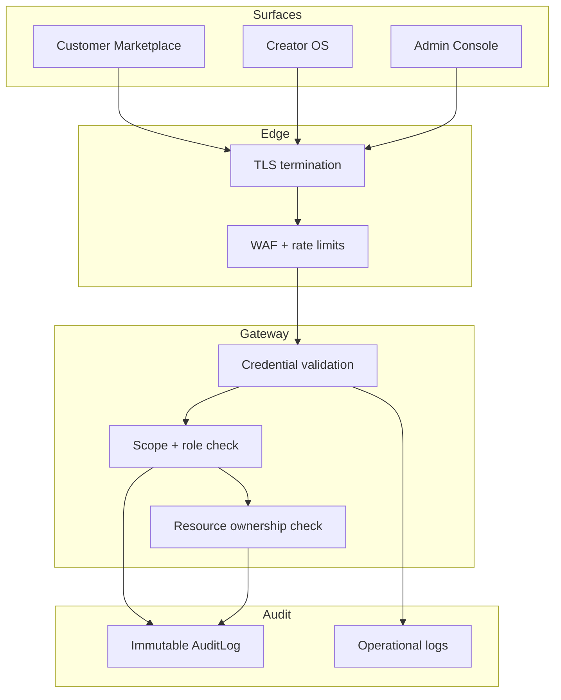
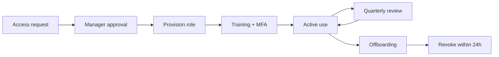

# Access Control

> Role-based access control, MFA, admin access, least privilege, and audit requirements for Marketplate.

**Status:** Active  
**Version:** 1.0  
**Last updated:** 2026-07-03  
**Owner:** Engineering — Identity & Security

---

## Purpose

This document defines how Marketplate **controls who can access what** across customer, creator, and admin surfaces — and how access decisions are enforced, monitored, and audited.

It implements the [Security Policy — Least privilege](security-policy.md#security-principles) principle and the trust thesis requirement that high-stakes actions remain human-accountable with complete audit trails.

Implementation details for auth endpoints and permission scopes: [Authentication & Authorization](api/authentication.md). Service-level enforcement: [Identity Service](services/identity-service.md).

---

## Architecture

### Access control layers

Every authenticated request passes through:

1. **Credential validation** — session cookie or JWT verified by [Identity Service](services/identity-service.md)
2. **Scope check** — RBAC permission `{resource}:{action}` evaluated against user roles
3. **Ownership check** — resource-level authorization (customer owns order, creator owns catalog)
4. **Audit emission** — mutating admin, trust, and payment actions write to [AuditLog](data/core-entities.md#auditlog)

Surface isolation per [Information Architecture — Surface isolation](../pages/information-architecture.md#three-primary-surfaces): admin routes are not reachable from customer or creator UI contexts.

---

## Role-Based Access Control (RBAC)

### Account model

Marketplate uses a **single User record** with one or more **roles**. A person may hold customer and creator roles simultaneously. Admin roles are separate and never combined with creator commerce actions on the same session for verification review (separation of duties).

Full role definitions: [Authentication — Account Types & Roles](api/authentication.md#account-types--roles).

### Role summary

| Role | Surface | Access level |
|------|---------|--------------|
| **Customer** | Customer Marketplace | Own profile, cart, orders, support tickets |
| **Creator — Owner** | Creator OS | Full creator account — catalog, orders, compliance, payouts |
| **Creator — Staff (orders)** | Creator OS | Order fulfillment; no catalog or payout mutations |
| **Creator — Staff (read-only)** | Creator OS | View-only |
| **Admin — Trust & Safety** | Admin | Verification, moderation, disputes |
| **Admin — Senior reviewer** | Admin | Overrides, suspend/reinstate, fraud-flag approvals |
| **Admin — Creator Success** | Admin | View queue, internal notes — limited write |
| **Admin — Read-only** | Admin | View without mutating actions |
| **Admin — Platform config** | Admin | Platform settings — thresholds, SLAs, discovery weights |

### Permission scopes

Permissions are `{resource}:{action}` scopes checked by middleware before handler execution. Full matrix: [Authentication — RBAC Permission Matrix](api/authentication.md#rbac-permission-matrix).

#### High-sensitivity scopes

These scopes require additional controls beyond standard RBAC:

| Scope | Additional requirement |
|-------|------------------------|
| `admin.verification:write` | Cannot review own test accounts; fraud-flag cases require senior role |
| `admin.creators:write` | Rationale required; logged to audit |
| `admin.settings:write` | Platform config changes audited with before/after state |
| `admin.audit:read` | Read-only; export requires Security approval |
| Document bulk export | Elevated permission — not default for any admin role |
| Break-glass production DB | Security Engineering approval + incident ticket |

### Creator verification states vs roles

Auth roles govern **API access**. Verification states govern **commerce capability** — orthogonal but combined at checkout:

| State | Creator OS access | Paid checkout for creator's items |
|-------|:-----------------:|:---------------------------------:|
| Onboarding | ✓ | ✗ |
| Identity approved, kitchen pending | ✓ | ✗ |
| Fully verified | ✓ | ✓ |
| Suspended | ✓ (read-only banner) | ✗ |
| Removed | ✗ | ✗ |

Trust gates are enforced synchronously — [Trust Service](services/trust-service.md). No long-lived cache on verification status without TTL ≤ 60s and event invalidation.

---

## Multi-Factor Authentication (MFA)

### Requirements

| Account type | MFA requirement | Method |
|--------------|-----------------|--------|
| **Admin — all roles** | **Required** before admin console access | TOTP (authenticator app) or WebAuthn passkey |
| **Engineering — production access** | **Required** for cloud console, secrets manager, database | Same as admin |
| **Creator — Owner** | Recommended at launch; required before first payout | TOTP or SMS fallback |
| **Customer** | Optional; encouraged for accounts with saved payment methods | TOTP, SMS, or passkey |
| **Service accounts** | Certificate or short-lived token — no password auth | IAM / workload identity |

`TODO(decision):` Auth provider selection (Clerk, Auth0, Cognito) determines available MFA methods — ADR required before launch.

### MFA enforcement

| Control | Implementation |
|---------|----------------|
| **Step-up auth** | Sensitive admin actions (suspend creator, change platform settings) require fresh MFA within 15 minutes |
| **Session binding** | Admin sessions bound to MFA-verified session flag |
| **Recovery codes** | One-time backup codes issued at MFA enrollment; stored hashed |
| **Lockout** | 5 failed MFA attempts → 30-minute lockout + alert to Security |
| **Offboarding** | MFA devices revoked within 24 hours of access termination |

### MFA exceptions

Temporary MFA bypass requires:

1. Active SEV-0/1 incident with documented justification
2. Security Engineering Lead approval
3. Time-limited break-glass session (max 4 hours)
4. Full audit of all actions during bypass window

---

## Admin Access

### Admin console access model

The Admin / Trust & Safety surface (`/admin`) is the highest-privilege application context. Access is **provisioned, not self-service**.

| Requirement | Detail |
|-------------|--------|
| **Provisioning** | Security Engineering or Trust Lead creates admin role assignment |
| **Background check** | `TODO(decision):` Required for Trust operators handling verification documents |
| **Training** | Verification Review SOP, PII handling, MFA enrollment before first login |
| **Session timeout** | 30 minutes idle; 8 hours absolute — shorter than customer/creator |
| **IP restrictions** | `TODO(decision):` VPN or IP allowlist for admin in v1 — recommended |
| **Concurrent sessions** | Max 2 active admin sessions per user |

### Separation of duties

| Rule | Rationale |
|------|-----------|
| Operators cannot review verification for their own test accounts | Prevent self-approval |
| Junior operators cannot approve fraud-flagged cases | [Trust Verification Flow — Security](../pages/flows/trust-verification-flow.md#security--access) |
| Creator Success cannot approve/reject verification | View and notes only |
| Platform config changes require different role than verification review | Reduce single-person blast radius |
| Destructive actions require rationale in API request body | Audit completeness |

Operational workflow: [Verification Review SOP](../operations/verification-review-sop.md), [Moderation SOP](../operations/moderation-sop.md).

### Admin document access

Verification documents are the highest-sensitivity data in the admin console:

| Control | Implementation |
|---------|----------------|
| **Viewer only** | No download by default; preview via signed URL |
| **Watermark** | Document viewer displays `operator_id` and timestamp |
| **Access logging** | Every preview logged: `{ operator_id, document_id, action, timestamp }` |
| **Bulk export** | Elevated permission; requires Trust Lead approval + audit entry |
| **Screenshot policy** | Prohibited by acceptable use — training enforced |

Details: [Data Protection — Verification documents](data-protection.md#verification-document-handling), [Trust Service — Security](services/trust-service.md#security).

---

## Least Privilege

### Principles

| Principle | Application |
|-----------|-------------|
| **Default deny** | No permission unless explicitly granted by role |
| **Minimal production access** | Engineers use staging for development; production DB access is break-glass only |
| **Time-limited elevation** | Temporary admin or production access expires automatically |
| **Service account isolation** | Each deployment unit has its own IAM identity — api, worker, migrate |
| **Secrets scoping** | Service accounts read only secrets required for their function |

### Service account permissions

| Service account | PostgreSQL | Redis | Object storage | External APIs |
|-----------------|:----------:|:-----:|:--------------:|:-------------:|
| **api** | Read/write app schemas | Read/write | Read/write media buckets | Stripe, auth, email |
| **worker** | Read/write app schemas | Read/write | Read compliance bucket | Email only |
| **migrate** | DDL on deploy only | None | None | None |
| **CI** | None (test DB only) | None | None | None |

Infrastructure IAM: [Infrastructure Overview — Security](infrastructure-overview.md#security).

### Environment isolation

| Rule | Detail |
|------|--------|
| Production credentials never in dev/staging | Separate secrets namespaces |
| No cross-environment network access | Separate VPCs or equivalent |
| Anonymized data in staging | No production PII in non-prod |
| Admin roles in production only | Staging admin uses test accounts |

### Access lifecycle

| Event | Action | Timeline |
|-------|--------|----------|
| New hire | Provision minimum role; MFA before prod access | Day 1 |
| Role change | Adjust scopes; remove stale permissions | Same day |
| Transfer | Review and right-size access | Within 48 hours |
| Termination | Revoke all access | Within 24 hours |
| Quarterly review | Security validates all admin and break-glass accounts | Every 90 days |

---

## Audit

### What gets audited

Immutable append-only [AuditLog](data/core-entities.md#auditlog) — separate from operational logs. Pattern: [Integration Patterns — Audit log](integration-patterns.md#audit-log-pattern).

| Category | Events |
|----------|--------|
| **Authentication** | Login, logout, failed login, password reset, MFA enrollment, role change |
| **Verification** | Approve, reject, request-info; AI flag dismissals with operator note |
| **Moderation** | Content actions, enforcement decisions |
| **Disputes** | Open, resolve, refund triggers |
| **Creator admin** | Suspend, reinstate, payout holds |
| **Platform config** | Settings changes with before/after JSON |
| **Document access** | Preview, export (if permitted) |
| **Payment admin** | Refunds, dispute overrides |
| **Security** | Break-glass access, MFA bypass, permission elevation |

### Audit record requirements

Every audit entry includes:

| Field | Description |
|-------|-------------|
| `timestamp` | ISO 8601 UTC |
| `actor_id` | User or service account performing action |
| `actor_type` | user, service, system |
| `action` | Semantic action (e.g., `verification.approved`) |
| `resource_type` | Entity type |
| `resource_id` | Entity identifier |
| `before_state` | JSON snapshot (mutations) |
| `after_state` | JSON snapshot (mutations) |
| `rationale` | Required for reject, suspend, moderation |
| `request_id` | Correlation to operational logs |
| `surface` | admin, creator, customer, internal |

### Audit integrity

| Control | Implementation |
|---------|----------------|
| **Append-only** | No UPDATE or DELETE on audit tables |
| **Transactional** | Mutating action rolls back if audit write fails — [Trust Service](services/trust-service.md#failure-modes) |
| **Retention** | 7 years minimum — [Data Protection — Retention](data-protection.md#retention-schedule) |
| **Replication** | Audit logs replicated to separate storage with WORM policy |
| **Access** | `admin.audit:read` scope; export requires Security approval |

Audit write failure is **SEV-0** — block the mutating action and page on-call. See [Incident Response](incident-response.md#trust-critical-escalations).

### Operational vs audit logs

| Log type | Purpose | Retention | Mutability |
|----------|---------|-----------|------------|
| **Operational logs** | Debugging, metrics, traces | 30 days hot, 1 year archive | Standard |
| **Audit logs** | Compliance, trust enforcement, security investigations | 7 years | Immutable |
| **Security events** | Auth anomalies forwarded to SIEM | 1 year | Immutable |

Operational logs never contain: full payment card data, government ID numbers, raw document content — [Architecture Overview — Logging](architecture-overview.md#logging).

---

## Failure Modes

| Failure | Impact | Mitigation |
|---------|--------|------------|
| **Auth provider outage** | No new logins; existing sessions may work | Cached session validation; status page; provider SLA |
| **RBAC misconfiguration** | Over-permission or denied access | CI contract tests on permission matrix; staging validation |
| **Session store (Redis) down** | Auth sessions lost | DB fallback for authenticated users; force re-login |
| **Audit write failure** | Mutating action blocked | Transaction rollback; SEV-0 alert |
| **MFA provider outage** | Admin lockout | Break-glass procedure with Security approval |
| **Stale permission cache** | Revoked access still works | Short TTL (≤ 60s); invalidate on role change event |

---

## Testing

| Layer | Coverage |
|-------|----------|
| **Unit** | Scope evaluation, ownership checks, role combinations |
| **Integration** | Middleware rejects unauthorized requests; audit writes on mutations |
| **E2E** | Admin cannot access without MFA; creator cannot access admin routes |
| **Security** | Horizontal privilege escalation tests; IDOR on orders and documents |
| **Regression** | Permission matrix changes require test updates in CI |

Trust-critical tests: junior operator blocked on fraud-flag approval; audit log completeness on verification approve/reject.

---

## Related Documents

### Security suite

- [Security Policy](security-policy.md)
- [Data Protection](data-protection.md)
- [Incident Response](incident-response.md)

### Engineering

- [Authentication & Authorization](api/authentication.md)
- [Identity Service](services/identity-service.md)
- [Trust Service — Security](services/trust-service.md#security)
- [Integration Patterns — Audit log](integration-patterns.md#audit-log-pattern)
- [Infrastructure Overview — Secrets](infrastructure-overview.md#secrets-management)

### Operations

- [Verification Review SOP](../operations/verification-review-sop.md)
- [Platform Admin SOP](../operations/platform-admin-sop.md)
- [Trust Verification Flow — Security](../pages/flows/trust-verification-flow.md#security--access)

### Governance

- [Founding Constitution — Trust Philosophy](../company/constitution.md#trust-philosophy)
- [Information Architecture — Auth matrix](../pages/information-architecture.md#authentication--access-matrix)
