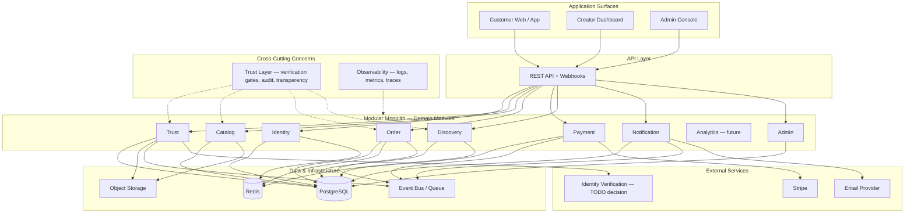
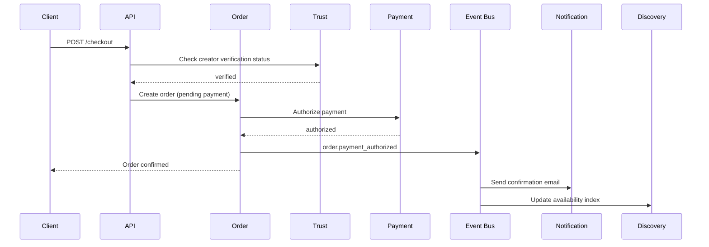

# Architecture Overview

> System architecture for Marketplate — trusted marketplace and creator operating system.

**Status:** Active  
**Version:** 1.0  
**Last updated:** 2026-07-03  
**Owner:** Engineering Architecture

---

## Purpose

This document defines Marketplate's **system architecture**: how application surfaces, domain services, data stores, and external integrations compose into a platform that enforces the trust thesis — **Trust is our product. Software enables trust.**

It is the canonical reference for engineering decisions, service boundaries, and evolution from launch to scale. Every service spec, API doc, and infrastructure change must trace back here and to the [Founding Constitution](../company/constitution.md) and [Engineering Philosophy](../company/company-philosophy.md#engineering-philosophy).

For service-level detail, see [Service Catalog](service-catalog.md). For integration mechanics, see [Integration Patterns](integration-patterns.md). For deployment and environments, see [Infrastructure Overview](infrastructure-overview.md). For end-to-end flows, see [Data Flow](data-flow.md).

---

## Architecture

### Strategic approach: modular monolith first

Marketplate launches as a **modular monolith** — a single deployable application with **strict internal module boundaries** that map 1:1 to domain services. Each module owns its schema, API surface, and events. This optimizes for:

- **Team velocity** at early scale — one deployment pipeline, shared transaction boundaries where needed
- **Operational simplicity** — fewer moving parts while product-market fit is validated
- **Clear extraction path** — modules become independently deployable services when load, team size, or failure isolation demands it

Extraction triggers (document in ADRs when met):

| Trigger | Candidate service |
|---------|-------------------|
| Independent scaling requirement | Discovery (search index), Notification |
| Different SLO or blast radius | Payment, Trust |
| Dedicated team ownership | Order + Payment split |
| Regulatory isolation | Payment (PCI scope reduction) |

We do **not** start with microservices. We start with **boring, readable modules** that behave like services.

### Three application surfaces

Marketplate is one platform with three distinct application contexts, aligned with [Information Architecture](../pages/information-architecture.md#three-primary-surfaces):

| Surface | Audience | Entry | Primary backend modules |
|---------|----------|-------|-------------------------|
| **Customer Marketplace** | End customers | `/` | Discovery, Catalog, Order, Payment, Trust (read), Notification |
| **Creator OS** | Verified and onboarding creators | `/dashboard` | Catalog, Order, Payment, Trust, Notification |
| **Admin / Trust & Safety** | Platform operators | `/admin` | Trust, Order, Payment, Admin |

Each surface shares a **unified API gateway** (BFF pattern optional per surface later) and **Identity** for authentication and authorization. Surface-specific routing and permission middleware enforce the [Authentication & Access Matrix](../pages/information-architecture.md#authentication--access-matrix).

### Trust layer as cross-cutting concern

Trust is not a single module — it is a **platform invariant** enforced across modules:

| Concern | Enforcement point | Reference |
|---------|-------------------|-----------|
| Verified to sell | Catalog + Order gate paid checkout | [Marketplace Mechanics — Verified to sell](../product/marketplace-mechanics.md#marketplace-model-overview) |
| Transparent to buy | Catalog + Order expose trust fields pre-payment | [Transparency](../product/marketplace-mechanics.md#transparency) |
| Audit everything | Trust + Payment + Admin immutable audit log | [Integration Patterns — Audit log](integration-patterns.md#audit-log-pattern) |
| Human approval on high stakes | Trust workflow + Admin queues | [Trust Verification Flow](../pages/flows/trust-verification-flow.md) |

The **Trust module** owns verification state, compliance documents, and moderation. Other modules **consult Trust** via synchronous API checks and subscribe to trust state change events — they never cache verification status without TTL and invalidation.

### Technology stack (boring by design)

Per [Engineering Philosophy](../company/company-philosophy.md#engineering-philosophy), prefer proven, operable technology:

| Layer | Choice | Rationale |
|-------|--------|-----------|
| **Primary database** | PostgreSQL | ACID transactions, JSONB for flexible metadata, mature tooling |
| **Cache / sessions** | Redis | Cart sessions, rate limits, idempotency keys, job locks |
| **Object storage** | S3-compatible (e.g., AWS S3, GCS, Cloudflare R2) | Creator photos, compliance documents, CDN origin |
| **Payments** | Stripe + Stripe Connect | Marketplace payouts, PCI scope reduction |
| **Email** | Transactional email provider (SendGrid, Postmark, SES) | Order confirmations, verification updates |
| **Search** | PostgreSQL full-text initially → OpenSearch/Elasticsearch at scale | Discovery module extraction candidate |
| **Runtime** | Containerized services (see [Infrastructure Overview](infrastructure-overview.md)) | Portable, reproducible deployments |
| **Auth** | `TODO(decision):` Auth provider (Clerk, Auth0, Cognito, or self-hosted) | SSO, MFA, session management |

### Architectural principles

| Principle | Implementation |
|-----------|----------------|
| **One service, one responsibility** | Each module owns one domain; no god modules |
| **Documented APIs before implementation** | OpenAPI specs in `engineering/api/` precede code |
| **Independently testable modules** | Module tests run in isolation with contract tests at boundaries |
| **Observable by default** | Structured logs, metrics, traces on every user-facing path |
| **Fail closed on trust** | Unknown verification state → deny paid transaction |
| **Idempotent side effects** | Payment, notification, webhook handlers use idempotency keys |
| **Events for side effects** | Order confirmed → async notification, analytics, discovery index update |

### Module interaction pattern

---

## Dependencies

### Upstream (consumers of this architecture)

| Consumer | Usage |
|----------|-------|
| [Page specifications](../pages/) | API requirements per screen |
| [AI systems](../ai/) | Integration points for verification assist, moderation, ranking |
| [Operations](../operations/) *(Phase 4)* | SOPs map to service workflows |
| [Analytics](../analytics/) *(Phase 5)* | Event taxonomy from module boundaries |

### Downstream (systems this architecture depends on)

| System | Role |
|--------|------|
| [Product Overview](../product/overview.md) | Product pillars define module scope |
| [Marketplace Mechanics](../product/marketplace-mechanics.md) | Business invariants drive gates and state machines |
| [Information Architecture](../pages/information-architecture.md) | Surface and routing model |
| [Integration Patterns](integration-patterns.md) | Async, webhooks, sagas |
| [Infrastructure Overview](infrastructure-overview.md) | Runtime, environments, observability |

### External dependencies

| Provider | Module | Purpose |
|----------|--------|---------|
| Stripe | Payment | Customer charges, Connect payouts, webhooks |
| Email provider | Notification | Transactional email |
| `TODO(decision):` Identity verification vendor | Trust | Government ID, business entity verification |
| `TODO(decision):` Cloud provider and primary region | Infrastructure | Compute, storage, networking |
| `TODO(decision):` Auth provider | Identity | Authentication, MFA, session tokens |

---

## Services

Domain modules and their responsibilities — full catalog in [Service Catalog](service-catalog.md):

| Module | Responsibility | Surface exposure |
|--------|----------------|------------------|
| **Identity** | Users, sessions, roles, permissions | All surfaces |
| **Trust** | Identity/kitchen/compliance verification, moderation, audit | Creator, Admin; read on Customer |
| **Catalog** | Menu items, storefronts, availability, capacity | Customer, Creator |
| **Order** | Cart, checkout, order lifecycle, fulfillment state | Customer, Creator |
| **Payment** | Charges, refunds, Connect accounts, payouts | Customer, Creator, Admin |
| **Discovery** | Search, browse, ranking, collections | Customer |
| **Notification** | Email, push (future), in-app (future) | All surfaces |
| **Analytics** *(future)* | Event pipeline, dashboards, exports | Creator, Admin |
| **Admin** | Platform config, operator actions, dispute tooling | Admin |

Per-service specs: [`engineering/services/`](services/) *(Phase 3 — in progress)*.

---

## Data Flow

High-level data movement — detailed sequence diagrams in [Data Flow](data-flow.md):

| Flow | Modules touched | Storage |
|------|-----------------|---------|
| Customer purchase | Discovery → Catalog → Order → Payment → Notification | PostgreSQL, Redis (cart), Stripe |
| Creator onboarding | Identity → Trust → Catalog | PostgreSQL, object storage |
| Order fulfillment | Order ↔ Notification | PostgreSQL, event bus |
| Payout | Payment → Stripe Connect | PostgreSQL, Stripe |

---

## Failure Modes

| Failure | Impact | Mitigation |
|---------|--------|------------|
| **Trust module unavailable** | Checkout blocked for all creators | Fail closed; serve read-only discovery with stale index; alert P1 |
| **Payment module unavailable** | No new orders | Graceful error at checkout; retry with idempotency; no duplicate charges |
| **PostgreSQL primary down** | Platform unavailable | Failover to replica; RPO per [Infrastructure Overview](infrastructure-overview.md) |
| **Redis unavailable** | Cart sessions lost; rate limits degraded | Fall back to DB-backed cart for authenticated users; degrade gracefully |
| **Event bus backlog** | Delayed emails, index updates | Monitor queue depth; scale workers; critical path stays synchronous where required |
| **Stripe webhook delay** | Order/payment state drift | Reconciliation job; idempotent webhook processing |
| **Stale verification cache** | Unverified creator accepts order | No long-lived cache on trust gates; TTL ≤ 60s with event invalidation |

Trust-impacting failures require incident documentation per [Operations Philosophy](../company/company-philosophy.md#operations-philosophy).

---

## Monitoring

| Layer | What to monitor |
|-------|-----------------|
| **Golden signals** | Latency, traffic, errors, saturation per module and surface |
| **Business metrics** | Checkout success rate, verification queue depth, payout failures |
| **Trust metrics** | Failed verification gates, audit log write failures, moderation SLA |
| **Infrastructure** | DB connections, Redis memory, queue depth, container health |

Dashboards organized by surface (`customer`, `creator`, `admin`) and by module. Alert routing: P1 for payment/trust/checkout outages; P2 for discovery degradation; P3 for non-critical notification delays.

Details: [Infrastructure Overview — Observability](infrastructure-overview.md#observability-stack).

---

## Logging

All modules emit **structured JSON logs** with consistent fields:

| Field | Description |
|-------|-------------|
| `timestamp` | ISO 8601 UTC |
| `level` | debug, info, warn, error |
| `service` | Module name (identity, trust, order, …) |
| `trace_id` | Distributed trace correlation |
| `request_id` | Per-request identifier |
| `user_id` | Authenticated user (when present) |
| `surface` | customer, creator, admin |
| `action` | Semantic action (e.g., `checkout.initiated`) |

**Never log:** full payment card data, government ID numbers, raw compliance document content.

Retention: 30 days hot search; 1 year cold archive for audit-adjacent logs. Trust and payment audit events have separate immutable retention — see [Integration Patterns](integration-patterns.md#audit-log-pattern).

---

## Security

| Area | Approach |
|------|----------|
| **Authentication** | `TODO(decision):` Auth provider; session/JWT validated at API gateway |
| **Authorization** | Role-based (customer, creator, admin) + resource ownership checks |
| **Data in transit** | TLS 1.2+ everywhere |
| **Data at rest** | Encrypted PostgreSQL, encrypted object storage |
| **Secrets** | Managed secrets store — never in code or images |
| **PCI** | Card data never touches Marketplate servers — Stripe Elements / Checkout |
| **Trust documents** | Object storage with signed URLs; access logged |
| **Admin access** | Separate permission tier; MFA required; all actions audited |

Surface isolation per [Information Architecture — Surface isolation rules](../pages/information-architecture.md#three-primary-surfaces).

Security program: [Security Policy](security-policy.md), [Access Control](access-control.md), [Data Protection](data-protection.md), [Incident Response](incident-response.md).

---

## Testing

| Layer | Scope |
|-------|-------|
| **Unit** | Module business logic, state machines, policy gates |
| **Integration** | Module boundaries with test PostgreSQL/Redis; Stripe test mode |
| **Contract** | OpenAPI specs validated in CI; consumer-driven for extracted services |
| **E2E** | Critical paths: purchase, onboarding, fulfillment, payout (staging) |
| **Trust-critical** | Verification gate tests, fail-closed scenarios, audit log completeness |

Test pyramid: heavy unit + integration; targeted E2E on trust and payment paths. AI-assisted features tested with golden datasets — see [AI Platform](../ai/).

---

## Scaling Strategy

### Phase 1 — Launch (modular monolith)

- Single deployment, horizontal pod replication behind load balancer
- PostgreSQL primary + read replica for discovery reads
- Redis for session, cart, cache
- CDN for static assets and creator photography

### Phase 2 — Growth

- Extract Discovery search index to dedicated engine
- Async workers scaled independently for Notification and index updates
- Read replicas for reporting and analytics queries

### Phase 3 — Scale

- Extract Payment and Trust to isolated services (PCI, compliance blast radius)
- Event bus to managed message service (SQS, Pub/Sub, or NATS)
- Geographic read replicas if multi-region launch

Capacity enforcement at checkout (Catalog module) prevents overselling — scale Order/Catalog before Discovery.

---

## Disaster Recovery

| Target | Value | Notes |
|--------|-------|-------|
| **RTO** | 4 hours | Full platform recovery from regional failure |
| **RPO** | 1 hour | PostgreSQL point-in-time recovery |
| **Payment reconciliation** | 24 hours | Stripe as source of truth for financial state |

PostgreSQL: automated backups, PITR, tested restore quarterly. Object storage: versioning enabled for compliance documents. Runbooks in `operations/` *(Phase 4)*.

Full detail: [Infrastructure Overview — Disaster Recovery](infrastructure-overview.md#disaster-recovery).

---

## Future Improvements

| Improvement | Trigger |
|-------------|---------|
| Extract Discovery to standalone search service | Search latency SLO breach or index size |
| Real-time order updates (WebSocket/SSE) | Creator dashboard refresh pain |
| Delivery partner integrations | Fulfillment model expansion |
| Multi-region active-active | International launch post first market |
| GraphQL or gRPC internal APIs | Mobile app performance needs |
| Feature flags service | Gradual rollout infrastructure |

Resolved architecture decisions recorded in [`decisions/`](../decisions/) as ADRs.

---

## Related Documents

- [Founding Constitution](../company/constitution.md)
- [Company Philosophy — Engineering](../company/company-philosophy.md#engineering-philosophy)
- [Product Overview](../product/overview.md)
- [Marketplace Mechanics](../product/marketplace-mechanics.md)
- [Information Architecture](../pages/information-architecture.md)
- [Service Catalog](service-catalog.md)
- [Integration Patterns](integration-patterns.md)
- [Infrastructure Overview](infrastructure-overview.md)
- [Data Flow](data-flow.md)
- [AI Platform](../ai/)
- [Customer Purchase Flow](../pages/flows/customer-purchase-flow.md)
- [Creator Onboarding Flow](../pages/flows/creator-onboarding-flow.md)
- [Order Fulfillment Flow](../pages/flows/order-fulfillment-flow.md)
- [Trust Verification Flow](../pages/flows/trust-verification-flow.md)
