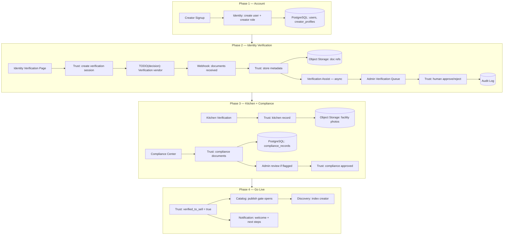
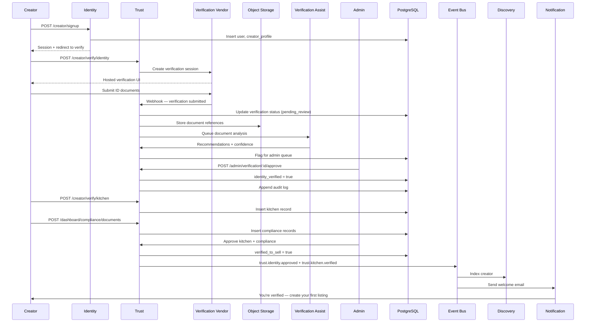
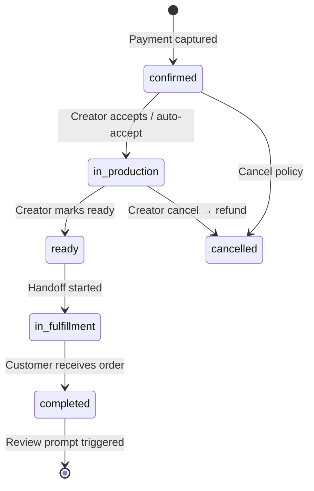
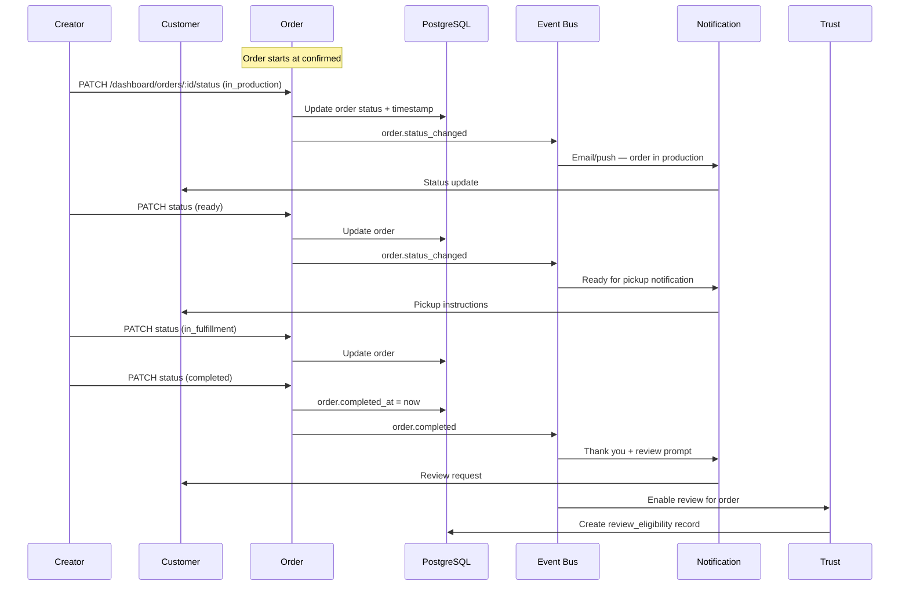
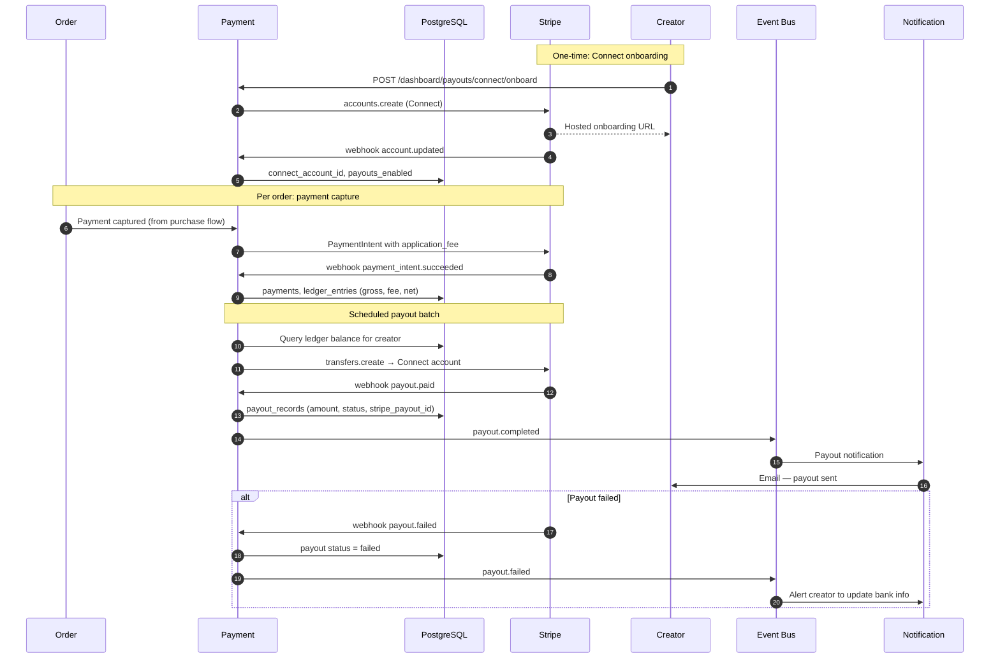
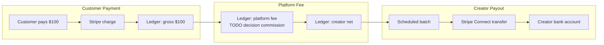

# Data Flow

> End-to-end data flows across Marketplate services — customer purchase, creator onboarding, fulfillment, and payouts.

**Status:** Active  
**Version:** 1.0  
**Last updated:** 2026-07-03  
**Owner:** Engineering Architecture

---

## Purpose

This document traces **how data moves** through Marketplate for the four critical platform flows. Each diagram shows which [services](service-catalog.md) participate, which data stores are touched, and where synchronous vs asynchronous integration applies.

For integration mechanics (events, sagas, webhooks), see [Integration Patterns](integration-patterns.md). For system context, see [Architecture Overview](architecture-overview.md).

Product flow definitions: [pages/flows/](../pages/flows/). Business rules: [Marketplace Mechanics](../product/marketplace-mechanics.md).

---

## Architecture

### Data store roles

| Store | Role in flows |
|-------|---------------|
| **PostgreSQL** | System of record — users, orders, catalog, trust, payments |
| **Redis** | Cart sessions, idempotency keys, short-lived locks |
| **Object storage** | Creator photos, verification documents |
| **Stripe** | Payment intents, charges, Connect accounts, payouts |
| **Event bus** | Async side effects — notifications, index updates |
| **Discovery index** | Denormalized search copy *(PostgreSQL or search engine)* |

### Service legend

| Abbrev | Service |
|--------|---------|
| ID | Identity |
| TR | Trust |
| CA | Catalog |
| OR | Order |
| PA | Payment |
| DI | Discovery |
| NO | Notification |
| AM | Admin |

---

## Dependencies

| Flow document | Product context |
|---------------|-----------------|
| [Customer Purchase Flow](../pages/flows/customer-purchase-flow.md) | [Checkout](../pages/customer/checkout.md), [Cart](../pages/customer/cart.md) |
| [Creator Onboarding Flow](../pages/flows/creator-onboarding-flow.md) | [Identity Verification](../pages/auth/identity-verification.md), [Kitchen Verification](../pages/auth/kitchen-verification.md) |
| [Order Fulfillment Flow](../pages/flows/order-fulfillment-flow.md) | [Creator Orders](../pages/creator/orders.md), [Order Detail](../pages/customer/order-detail.md) |
| Payout | [Creator Payouts](../pages/creator/payouts.md) |

AI touchpoints: [Verification Assist](../ai/verification-assist.md), [Discovery Ranking](../ai/discovery-ranking.md).

---

## Services

Services participating in each flow:

| Flow | Services (in order of involvement) |
|------|--------------------------------------|
| Customer purchase | DI → CA → TR → OR → PA → NO |
| Creator onboarding | ID → TR → CA → DI |
| Order fulfillment | OR → NO → TR |
| Payout | OR → PA → NO |

Admin (AM) participates in verification approval during onboarding and dispute resolution during fulfillment — see [Trust Verification Flow](../pages/flows/trust-verification-flow.md).

---

## Data Flow

### 1. Customer purchase

Customer discovers a verified creator, adds items to cart, completes checkout, and receives order confirmation.

**Surfaces:** Customer Marketplace — [Information Architecture](../pages/information-architecture.md#customer-marketplace)

**Invariants:** Verified to sell · Transparent to buy · No overselling capacity

```mermaid
sequenceDiagram
    autonumber
    participant C as Customer
    participant DI as Discovery
    participant CA as Catalog
    participant TR as Trust
    participant OR as Order
    participant RD as Redis
    participant PG as PostgreSQL
    participant PA as Payment
    participant ST as Stripe
    participant BUS as Event Bus
    participant NO as Notification

    C->>DI: GET /search or /creators/:slug
    DI->>PG: Query discovery index
    Note over DI,PG: Index excludes unverified creators
    DI-->>C: Creator + items

    C->>CA: GET /creators/:slug/items/:itemId
    CA->>PG: Read item, allergens, availability
    CA->>TR: Verify creator can sell (sync)
    TR-->>CA: verified_to_sell
    CA-->>C: Item detail + trust disclosures

    C->>OR: POST /cart/items
    OR->>RD: Update cart session
    OR-->>C: Cart updated

    C->>OR: POST /checkout
    OR->>CA: Validate availability + reserve capacity (soft hold)
    CA->>PG: Check capacity counters
    OR->>TR: Trust gate — creator verified, compliance current
    TR->>PG: Read verification state
    TR-->>OR: pass

    OR->>PG: Create order (pending_payment)
    OR->>PA: Create PaymentIntent
    PA->>ST: paymentIntents.create
    ST-->>PA: client_secret
    PA-->>OR: payment intent id
    OR-->>C: Client secret + order id

    C->>ST: Confirm payment (Stripe.js)
    ST->>PA: webhook payment_intent.succeeded
    PA->>PG: Record payment (idempotent)
    PA->>OR: Mark payment authorized
    OR->>PG: Order → confirmed; commit capacity
    OR->>BUS: order.confirmed

    BUS->>NO: Send confirmation email
    NO->>C: Order confirmation

    BUS->>DI: Update availability index
    BUS->>CA: Confirm capacity decrement
```

**Data touched:**

| Step | Service | Data written | Data read |
|------|---------|--------------|-----------|
| Discovery | DI | — | `discovery_index`, `creators`, `catalog_items` |
| Item detail | CA, TR | — | `catalog_items`, `storefronts`, `trust_verifications` |
| Cart | OR | Redis cart | `catalog_items` (price snapshot) |
| Checkout | OR, CA, TR | `orders`, `order_line_items`, capacity hold | `trust_state`, `availability` |
| Payment | PA, OR | `payments`, order status | Stripe API |
| Post-confirm | NO, DI | `notification_deliveries` | `orders`, `users` |

Saga detail: [Integration Patterns — Order + payment saga](integration-patterns.md#saga-pattern-order--payment).

---

### 2. Creator onboarding and verification

Creator signs up, completes identity and kitchen verification, uploads compliance documents, and becomes eligible to sell.

**Surfaces:** Auth → Creator OS — [Creator Onboarding Flow](../pages/flows/creator-onboarding-flow.md)

**Invariants:** Unverified creators cannot accept paid orders · Human approval on verification





**Data touched:**

| Entity | Owner | Key fields |
|--------|-------|------------|
| `users` | Identity | email, roles |
| `creator_profiles` | Identity + Trust | slug, business name |
| `trust_verifications` | Trust | identity_status, kitchen_status, compliance_status |
| `kitchens` | Trust | address, type, linked SKUs |
| `compliance_records` | Trust | doc_type, expiry, jurisdiction |
| `trust_audit_log` | Trust | append-only actions |
| Verification vendor refs | Trust | external_session_id |

Failure mode: rejection returns creator to draft mode — no Discovery indexing.

---

### 3. Order fulfillment

Creator progresses order through production and fulfillment; customer receives status updates.

**Surfaces:** Creator OS ↔ Customer Marketplace — [Order Fulfillment Flow](../pages/flows/order-fulfillment-flow.md)





**Data touched:**

| State transition | Written | Read |
|------------------|---------|------|
| → in_production | `orders.status`, `orders.status_history[]` | `orders`, creator settings |
| → ready | Same + `orders.ready_at` | Customer contact |
| → completed | `orders.completed_at` | `orders`, `payments` |
| Review prompt | `review_eligibility` | `orders`, `trust_reviews` |

Both surfaces read the same `orders` row — asymmetric actions enforced by API authorization ([Order Detail creator](../pages/creator/order-detail.md) vs [customer](../pages/customer/order-detail.md)).

---

### 4. Creator payout

Platform collects customer payment, deducts platform fee, and transfers creator earnings via Stripe Connect on a defined schedule.

**Invariants:** Creator is merchant of record · Payout schedule visible in dashboard





**Data touched:**

| Entity | Owner | Contents |
|--------|-------|----------|
| `payments` | Payment | stripe_payment_intent_id, amount, status |
| `ledger_entries` | Payment | gross, platform_fee, creator_net, order_id |
| `connect_accounts` | Payment | stripe_account_id, onboarding_status |
| `payout_records` | Payment | amount, period, stripe_payout_id, status |

Platform fee calculation depends on `TODO(decision):` commission structure — [Product Overview](../product/overview.md#open-decisions).

Refund flow reverses ledger entries — see [Integration Patterns](integration-patterns.md#saga-pattern-order--payment).

---

## Failure Modes

| Flow | Failure point | Data consistency | User impact |
|------|---------------|------------------|-------------|
| Purchase | Payment succeeds, order not confirmed | Reconciliation job matches Stripe ↔ orders | Customer sees retry or support contact |
| Purchase | Capacity oversold | Prevented by checkout lock — if occurs, cancel + refund | Apology + refund |
| Onboarding | Vendor webhook lost | Polling job checks vendor API | Creator sees "processing" state |
| Onboarding | Admin approval delayed | State stays pending | Creator in draft mode — SLA in ops |
| Fulfillment | Notification not sent | Order state still correct in DB | Customer refreshes order page |
| Payout | Connect account incomplete | Ledger accrues; payout blocked | Dashboard shows "complete setup" |

All flows: idempotency on payment and webhook paths — [Integration Patterns](integration-patterns.md#idempotency).

---

## Monitoring

| Flow | Key metrics |
|------|-------------|
| Purchase | Checkout funnel conversion; payment failure rate; saga stuck count |
| Onboarding | Time to verified_to_sell; verification queue age |
| Fulfillment | Avg time confirmed → completed; status update latency |
| Payout | Payout success rate; Connect onboarding completion; ledger reconciliation drift |

Trace each flow with shared `correlation_id` from first customer request through async events.

---

## Logging

Semantic log actions per flow:

| Flow | Example `action` values |
|------|-------------------------|
| Purchase | `checkout.initiated`, `checkout.payment_confirmed`, `order.confirmed` |
| Onboarding | `verification.submitted`, `verification.approved`, `creator.verified_to_sell` |
| Fulfillment | `order.status_changed` |
| Payout | `payout.initiated`, `payout.completed`, `payout.failed` |

Include `order_id`, `creator_id`, `customer_id` where applicable — never log full payment details.

---

## Security

| Flow | Controls |
|------|----------|
| Purchase | Trust gate sync; PCI via Stripe.js; cart ownership validation |
| Onboarding | Verification docs via signed URLs; admin approval audited |
| Fulfillment | Creator can only update own orders; customer read-only |
| Payout | Connect account ownership verified; payout amounts from ledger not client input |

---

## Testing

| Flow | E2E scenario (staging) |
|------|------------------------|
| Purchase | Search → add to cart → checkout → Stripe test card → confirmation email |
| Onboarding | Signup → mock vendor webhook → admin approve → publish listing |
| Fulfillment | Advance order through all states → review eligibility created |
| Payout | Connect test account → complete order → trigger payout batch → verify ledger |

Contract tests at each service boundary with fixture data matching production schema.

---

## Scaling Strategy

| Flow | Bottleneck | Mitigation |
|------|------------|------------|
| Purchase | Checkout + payment sync path | Horizontal API scale; Stripe handles payment scale |
| Onboarding | Admin review queue | AI assist + ops scaling; async document processing |
| Fulfillment | Status update writes | Standard DB scale; future WebSocket for live updates |
| Payout | Batch job duration | Partition batches by creator; parallel Stripe API calls within rate limits |

Discovery index update on purchase is async — does not block checkout.

---

## Disaster Recovery

| Flow | Recovery notes |
|------|----------------|
| Purchase | Reconcile Stripe payments against orders post-restore |
| Onboarding | Verification vendor is external source for doc status — re-sync |
| Fulfillment | Order state in PostgreSQL — authoritative |
| Payout | Ledger + Stripe reconciliation; never double-payout (idempotent transfer keys) |

RTO/RPO: [Infrastructure Overview](infrastructure-overview.md#disaster-recovery).

---

## Future Improvements

| Flow | Enhancement |
|------|-------------|
| Purchase | Real-time inventory via WebSocket |
| Onboarding | Progressive verification — identity before kitchen |
| Fulfillment | Delivery partner tracking integration |
| Payout | Instant payout option; multi-currency |

---

## Related Documents

- [Architecture Overview](architecture-overview.md)
- [Service Catalog](service-catalog.md)
- [Integration Patterns](integration-patterns.md)
- [Infrastructure Overview](infrastructure-overview.md)
- [Product Overview](../product/overview.md)
- [Marketplace Mechanics](../product/marketplace-mechanics.md)
- [Information Architecture](../pages/information-architecture.md)
- [Customer Purchase Flow](../pages/flows/customer-purchase-flow.md)
- [Creator Onboarding Flow](../pages/flows/creator-onboarding-flow.md)
- [Order Fulfillment Flow](../pages/flows/order-fulfillment-flow.md)
- [Trust Verification Flow](../pages/flows/trust-verification-flow.md)
- [AI Platform](../ai/)
