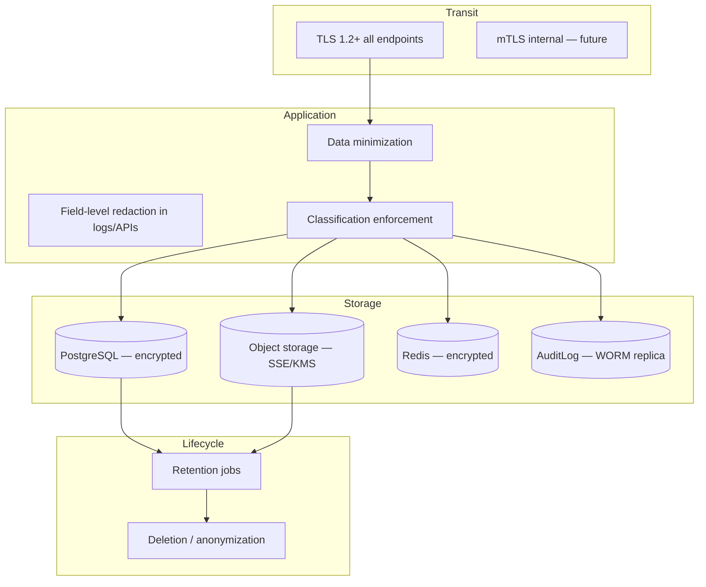
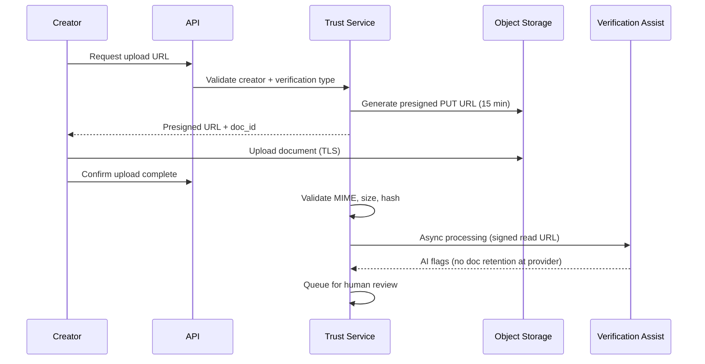

# Data Protection

> Encryption, PII classification, retention, and verification document handling for Marketplate.

**Status:** Active  
**Version:** 1.0  
**Last updated:** 2026-07-03  
**Owner:** Engineering + Trust & Safety

---

## Purpose

This document defines how Marketplate **protects data throughout its lifecycle** — from collection through storage, processing, retention, and deletion. It covers encryption requirements, PII classification, retention schedules, and the specialized handling of creator verification documents.

It implements [Security Policy — Minimize data collection](security-policy.md#security-principles) and supports the trust thesis by ensuring verification evidence and customer data remain confidential and integrity-protected.

Cross-references: [Architecture Overview — Security](architecture-overview.md#security), [Infrastructure Overview — Security](infrastructure-overview.md#security), [AI Platform — PII handling](../ai/README.md#pii-handling).

---

## Architecture

### Data protection layers



---

## Encryption

### Encryption in transit

| Path | Requirement | Implementation |
|------|-------------|----------------|
| **Client → CDN / LB** | TLS 1.2+ only; TLS 1.0/1.1 disabled | CDN and load balancer configuration |
| **Client → API** | TLS 1.2+; HSTS enabled | Load balancer termination |
| **API → PostgreSQL** | TLS required | Managed database enforced SSL |
| **API → Redis** | TLS in transit | Managed Redis TLS |
| **API → object storage** | HTTPS | Provider SDK defaults |
| **API → Stripe** | TLS | Stripe SDK |
| **API → email provider** | TLS | Provider API |
| **API → auth provider** | TLS | Provider SDK |
| **API → AI inference** | TLS; ephemeral signed URLs for documents | No persistent document at provider |

Internal service-to-service traffic within the VPC uses provider-managed encryption. Mutual TLS (mTLS) between extracted services is a Phase 3 scaling improvement.

Details: [Infrastructure Overview — Security](infrastructure-overview.md#security).

### Encryption at rest

| Store | Encryption | Key management |
|-------|------------|----------------|
| **PostgreSQL** | AES-256 at rest | Cloud provider managed keys; CMK option for compliance tier |
| **PostgreSQL backups** | Encrypted | Same key hierarchy as primary |
| **Object storage** | SSE-S3 or SSE-KMS | Per-bucket keys; compliance bucket uses dedicated KMS key |
| **Redis** | At-rest encryption | Provider managed |
| **Audit log replica** | Encrypted + WORM | Separate storage account; dedicated key |
| **Secrets manager** | Encrypted | Automatic rotation per [Infrastructure Overview](infrastructure-overview.md#secrets-management) |
| **Log archive** | Encrypted cold storage | Provider managed |

### Application-level encryption

| Data | Approach | Notes |
|------|----------|-------|
| **Passwords** | bcrypt (cost ≥ 12) or delegated to auth provider | Never stored plaintext |
| **Refresh tokens** | Hashed at rest | [Identity Service](services/identity-service.md) |
| **PII fields (optional)** | Column-level encryption for addresses | `TODO(decision):` Launch market privacy requirements |
| **AI extracted fields** | Encrypted at rest in trust schema | [Verification Assist](../ai/verification-assist.md#security) |
| **Payment card data** | **Not stored** — Stripe tokenization only | PCI scope reduction |

### Key management

| Rule | Detail |
|------|--------|
| **No keys in code or images** | Secrets manager only |
| **Key rotation** | Database credentials 90 days; JWT signing 180 days |
| **Separation** | Compliance document bucket uses key distinct from public media |
| **Access** | Key usage logged; break-glass for key operations requires Security approval |

---

## Data Classification

All Marketplate data is classified at creation. Classification determines access controls, retention, encryption tier, and logging rules.

### Classification tiers

| Tier | Label | Description | Examples |
|------|-------|-------------|----------|
| **T1** | Public | Intended for public display | Creator storefront name, menu items, public reviews, discovery index fields |
| **T2** | Internal | Business operations; not customer-facing | Aggregated metrics, platform settings, anonymized analytics |
| **T3** | Confidential | PII and commerce data | Customer name, email, phone, delivery address, order history, support tickets |
| **T4** | Restricted | Highest sensitivity | Government IDs, verification documents, compliance certificates, payment dispute evidence, audit logs with before/after state |
| **T5** | Regulated | Subject to specific regulatory retention | Order/payment records (tax), food safety incident records |

### Handling requirements by tier

| Tier | Access | Encryption | Logging | Retention |
|------|--------|------------|---------|-----------|
| **T1 Public** | Unauthenticated read OK | Transit only | Standard | Until creator removes |
| **T2 Internal** | Employee role required | At rest + transit | Standard; no PII | Per data type schedule |
| **T3 Confidential** | Owner + authorized admin | At rest + transit | Redacted in operational logs | Per schedule; deletion on request |
| **T4 Restricted** | Least-privilege admin; access logged | At rest + transit + signed URLs | Never in operational logs | Active + 3 years post-offboarding |
| **T5 Regulated** | Legal + Finance + authorized admin | At rest + transit | Audit only | 7 years minimum |

### PII inventory

| PII element | Tier | Stored in | Who can access |
|-------------|------|-----------|----------------|
| Customer email, name, phone | T3 | Identity schema | Customer; support (scoped); admin (dispute context) |
| Delivery address | T3 | Order schema | Customer; creator (fulfillment order only) |
| Creator legal name, business entity | T3–T4 | Trust schema | Creator; Trust operators |
| Government ID images | T4 | Object storage (trust bucket) | Trust operators via watermarked viewer |
| Kitchen photos | T4 | Object storage | Trust operators; AI pipeline (ephemeral) |
| Compliance certificates | T4 | Object storage | Trust operators; creator (own docs) |
| Payment method | T3 (token only) | Stripe (not Marketplate) | Customer via Stripe |
| Support message content | T3 | Support schema | Support ops; may contain order PII |
| Search queries | T3 (scrubbed) | Discovery logs | 30-day retention; PII scrubbed |

Discovery index contains **no PII beyond public storefront fields** — [Discovery Service](services/discovery-service.md#logging).

### Data minimization rules

| Rule | Implementation |
|------|----------------|
| Collect minimum for commerce | Signup collects email + password; address at checkout only |
| No unified PII warehouse | Verification docs isolated in Trust enclave; no analytics lake of PII |
| API responses scoped | Admin APIs return fields required for task — no bulk PII export by default |
| AI context minimized | Models receive minimum context; truncate threads — [AI Platform](../ai/README.md#pii-handling) |
| Log redaction | Pipeline scrubs accidental PII — [Infrastructure Overview — Logging](infrastructure-overview.md#logging) |

---

## Retention Schedule

Default retention periods. Legal may extend for active litigation or regulatory hold.

| Data class | Tier | Retention | After retention |
|------------|------|-----------|-----------------|
| **Order records** | T5 | 7 years | Archive then delete |
| **Payment records** | T5 | 7 years | Stripe is financial source of truth |
| **Verification documents** | T4 | Active creator + 3 years post-offboarding | Secure deletion from object storage |
| **AI assist outputs** | T4 | With verification case | Deleted with case |
| **AI inference logs** | T2 | 30 days | Redacted then deleted |
| **Audit logs** | T4 | 7 years minimum | WORM archive |
| **Support tickets** | T3 | 3 years | Anonymize then delete |
| **Session tokens** | T3 | 30 days sliding | Redis TTL expiry |
| **Guest carts** | T3 | 7 days | Automatic purge |
| **Checkout drafts** | T3 | 72 hours | Automatic purge |
| **Operational logs** | T2 | 30 days hot, 1 year archive | Automatic rotation |
| **Search query logs** | T3 | 30 days (PII scrubbed) | Automatic purge |
| **Creator media (menu photos)** | T1 | Until creator deletes | CDN cache invalidation |
| **Account profile (deleted user)** | T3 | Anonymize on deletion request | Retain pseudonymized order reference |

Source: [Data Model Overview — Retention](data/data-model-overview.md#data-retention--privacy).

### Account deletion

On user deletion request (`user.deletion_requested` event):

1. **Anonymize** PII in Identity schema — email replaced with pseudonym
2. **Retain** order and payment records with pseudonymized customer reference (T5 requirement)
3. **Delete** active sessions and refresh tokens
4. **Revoke** creator verification documents after offboarding retention period
5. **Remove** from marketing and notification lists
6. **Audit** deletion completion

Identity Service publishes scrub schedule to all services — [Identity Service — Events](services/identity-service.md).

### Regulatory hold

Legal may impose a hold suspending deletion for specific accounts or data classes. Held data is flagged in database; retention jobs skip held records. Hold release requires Legal written approval.

---

## Verification Document Handling

Verification documents (government IDs, kitchen photos, compliance certificates) are **T4 Restricted** — the highest-volume sensitive data Marketplate processes.

### Storage architecture

| Component | Detail |
|-----------|--------|
| **Bucket** | Dedicated private bucket — separate from public creator media |
| **Encryption** | SSE-KMS with compliance-dedicated key |
| **Versioning** | Enabled — accidental overwrite recoverable |
| **Public access** | Blocked at bucket policy level |
| **CDN** | Never CDN cached — signed URLs only |
| **Path structure** | `{creator_id}/{verification_type}/{doc_id}/{filename}` |

Implementation: [Trust Service — Security](services/trust-service.md#security), [Infrastructure Overview — CDN](infrastructure-overview.md#cdn-for-assets).

### Upload flow



| Upload control | Detail |
|----------------|--------|
| **Presigned URLs** | 15-minute expiry; single-use where provider supports |
| **MIME validation** | PDF, JPEG, PNG only; reject executables |
| **Size limit** | Enforced at API and storage policy |
| **Malware scan** | `TODO(decision):` ClamAV or cloud scanner at ingest |
| **PDF sanitization** | Strip JavaScript and embedded objects at ingest |
| **Hash deduplication** | SHA-256 stored; cross-account duplicate detection uses hash only |

### Access flow

| Actor | Access method | Controls |
|-------|---------------|----------|
| **Creator** | Own documents via Creator OS | Own `creator_id` only; preview via signed URL |
| **Trust operator** | Admin verification queue | RBAC scope; watermarked viewer; access logged |
| **AI pipeline** | Ephemeral signed read URL | 15-min expiry; no provider retention; Trust enclave only |
| **Engineering** | No routine access | Break-glass only with Security approval + incident ticket |

Access logging format:

```
service=trust action=document.access actor_id= operator_id= document_id= verification_type= timestamp=
```

Every access event is auditable. Bulk export requires elevated permission — [Access Control — Admin document access](access-control.md#admin-document-access).

### AI processing constraints

Verification documents processed by [Verification Assist](../ai/verification-assist.md) under strict isolation:

| Rule | Detail |
|------|--------|
| **No cross-tenant batching** | One creator's documents per inference request |
| **Provider zero-retention** | Contractual; inference-only API |
| **No training** | Production documents not used for model training without consent |
| **Extracted fields encrypted** | Stored in trust schema; scoped to verification roles |
| **Raw docs not in AI logs** | Log `{ case_id, model_version, document_hashes }` only |

Full PII policy: [AI Platform — PII handling](../ai/README.md#pii-handling).

### Document lifecycle

| Stage | Action |
|-------|--------|
| **Submitted** | Stored in private bucket; metadata in PostgreSQL |
| **In review** | Accessible to assigned operators; AI flags attached |
| **Approved / rejected** | Document retained for compliance period |
| **Resubmission** | New document version; prior version retained in version history |
| **Creator offboarding** | Retain 3 years post-offboarding, then secure delete |
| **Legal hold** | Deletion suspended until hold released |

Secure deletion: cryptographic erase via storage provider delete + version purge; deletion logged in audit.

---

## PCI & Payment Data

Marketplate minimizes PCI scope:

| Rule | Implementation |
|------|----------------|
| **No card data on Marketplate servers** | Stripe Elements / Checkout |
| **No card numbers in logs** | [Payment Service — Logging](services/payment-service.md#logging) |
| **Stripe as PCI compliant processor** | SAQ A or A-EP scope — Legal confirms |
| **Webhook verification** | Signature validation on all Stripe webhooks |
| **Connect accounts** | Creator payout data in Stripe Connect, not local PAN storage |

---

## Data Subject Rights

`TODO(decision):` Geographic launch market determines applicable rights (GDPR access/erasure/portability, CCPA know/delete, etc.). Controls below are designed to satisfy common requirements pending legal review.

| Right | Process |
|-------|---------|
| **Access** | Customer self-service export from account settings; manual request via support |
| **Correction** | Profile edit in app; verification docs require resubmission |
| **Deletion** | Account deletion flow → anonymization per schedule above |
| **Portability** | JSON export of order history and profile |
| **Restriction** | Legal hold or account suspension flags |

Privacy notices and terms: [`legal/`](../legal/) *(Phase 5)*.

---

## Failure Modes

| Failure | Impact | Mitigation |
|---------|--------|------------|
| **Encryption key unavailable** | Cannot decrypt data; new writes may fail | Key redundancy; provider SLA; break-glass key recovery |
| **Signed URL leak** | Time-limited exposure window | Short expiry (15 min); revoke on incident; access logged |
| **Retention job failure** | Data kept past schedule | Alert on job failure; manual run; compliance review |
| **Incomplete deletion** | PII remains after deletion request | Deletion verification job; audit confirmation event |
| **Cross-bucket misconfiguration** | Public exposure of compliance docs | Bucket policy tests in CI; separate IAM roles per bucket |
| **AI provider retention** | Document persisted at vendor | Zero-retention contract; ephemeral URLs only; vendor audit |

Document exposure is **SEV-0** — [Incident Response](incident-response.md#pii-or-verification-document-exposure).

---

## Monitoring

| Metric | Alert |
|--------|-------|
| Object storage public access policy change | Immediate |
| Unusual document access volume per operator | Anomaly detection |
| Retention job failures | P2 |
| Deletion request backlog | > 72 hours unprocessed |
| KMS key usage anomalies | Security review |

Trust Ops dashboard includes document access audit samples — monthly review by Trust Lead.

---

## Testing

| Test | Purpose |
|------|---------|
| Bucket policy CI check | Compliance bucket not public |
| Signed URL expiry | URLs invalid after TTL |
| Deletion flow E2E | Account deletion anonymizes PII; orders retained pseudonymized |
| Log redaction | Operational logs contain no T4 fields |
| AI pipeline isolation | No document content in inference telemetry |

---

## Related Documents

### Security suite

- [Security Policy](security-policy.md)
- [Access Control](access-control.md)
- [Incident Response](incident-response.md)

### Engineering

- [Architecture Overview — Security](architecture-overview.md#security)
- [Infrastructure Overview — Secrets & CDN](infrastructure-overview.md)
- [Trust Service](services/trust-service.md)
- [Identity Service](services/identity-service.md)
- [Payment Service](services/payment-service.md)
- [Data Model Overview — Retention](data/data-model-overview.md#data-retention--privacy)

### AI

- [AI Platform — PII handling](../ai/README.md#pii-handling)
- [Verification Assist — Security](../ai/verification-assist.md#security)

### Operations

- [Verification Review SOP](../operations/verification-review-sop.md)
- [Creator Onboarding Ops SOP](../operations/creator-onboarding-ops-sop.md)
- [Trust Verification Flow](../pages/flows/trust-verification-flow.md)

### Governance

- [Founding Constitution — Trust Philosophy](../company/constitution.md#trust-philosophy)
- [Marketplace Mechanics — Trust Model](../product/marketplace-mechanics.md#trust-model)
