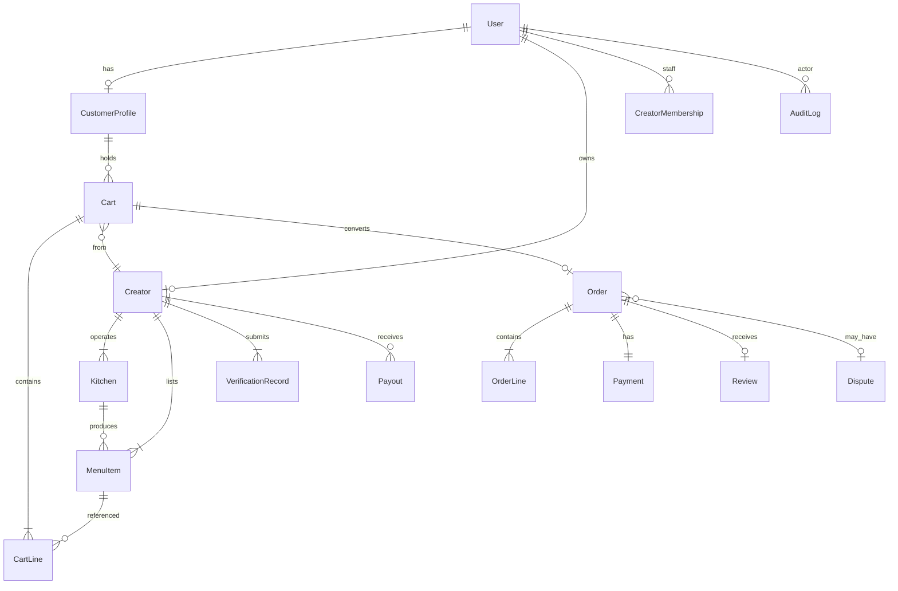

# Core Entities

> Detailed entity specifications for Marketplate PostgreSQL schema — see [Data Model Overview](data-model-overview.md)

**Status:** Active  
**Version:** 1.0  
**Last updated:** 2026-07-03  
**Owner:** Engineering

---

## Purpose

Define fields, relationships, constraints, and indexes for core domain entities. Implements [Marketplace Mechanics](../../product/marketplace-mechanics.md) invariants at the data layer.

---

## Entity Relationship Overview

---

## User

Platform identity for all account types.

| Column | Type | Constraints | Description |
|--------|------|-------------|-------------|
| `id` | UUID | PK | Internal ID |
| `email` | VARCHAR(255) | UNIQUE, NOT NULL | Login email |
| `email_verified_at` | TIMESTAMPTZ | NULL | Email confirmation timestamp |
| `password_hash` | VARCHAR(255) | NULL | bcrypt hash; NULL if auth provider |
| `first_name` | VARCHAR(100) | NOT NULL | |
| `last_name` | VARCHAR(100) | NOT NULL | |
| `phone` | VARCHAR(20) | NULL | E.164 format |
| `phone_verified_at` | TIMESTAMPTZ | NULL | |
| `account_status` | ENUM | NOT NULL | `active`, `suspended`, `pending_deletion`, `deleted` |
| `auth_provider` | VARCHAR(50) | NULL | `native`, `auth0`, etc. — `TODO(decision):` |
| `auth_provider_id` | VARCHAR(255) | NULL | External subject ID |
| `last_login_at` | TIMESTAMPTZ | NULL | |
| `created_at` | TIMESTAMPTZ | NOT NULL | |
| `updated_at` | TIMESTAMPTZ | NOT NULL | |
| `deleted_at` | TIMESTAMPTZ | NULL | Soft delete |

**Relationships:**
- 1:1 `CustomerProfile` (optional — customer role)
- 1:1 `Creator` (optional — creator owner)
- 1:N `CreatorMembership` (staff on other creators)
- 1:N `AuditLog` (as actor)

**Indexes:**
- `uq_users_email` UNIQUE on `email` WHERE `deleted_at IS NULL`
- `idx_users_auth_provider` on `(auth_provider, auth_provider_id)`

---

## CustomerProfile

Customer-specific preferences and defaults.

| Column | Type | Constraints | Description |
|--------|------|-------------|-------------|
| `id` | UUID | PK | |
| `user_id` | UUID | FK → users, UNIQUE | |
| `display_name` | VARCHAR(100) | NULL | Optional public display |
| `default_address_id` | UUID | FK → customer_addresses, NULL | |
| `dietary_preferences` | TEXT[] | DEFAULT '{}' | e.g., `vegan`, `gluten_free` |
| `allergen_alerts` | TEXT[] | DEFAULT '{}' | Severe allergens to flag |
| `notification_preferences_json` | JSONB | NOT NULL | Channel toggles by category |
| `location_lat` | DECIMAL(10,7) | NULL | Saved location for discovery |
| `location_lng` | DECIMAL(10,7) | NULL | |
| `created_at` | TIMESTAMPTZ | NOT NULL | |
| `updated_at` | TIMESTAMPTZ | NOT NULL | |

**Related table: `customer_addresses`**

| Column | Type | Description |
|--------|------|-------------|
| `id` | UUID | PK |
| `customer_profile_id` | UUID | FK |
| `label` | VARCHAR(50) | "Home", "Work" |
| `line1`, `line2` | VARCHAR | Street address |
| `city`, `state`, `postal_code` | VARCHAR | |
| `country_code` | CHAR(2) | ISO 3166-1 |
| `lat`, `lng` | DECIMAL | Geocoded coordinates |
| `is_default` | BOOLEAN | |
| `delivery_notes` | TEXT | NULL |

**Indexes:**
- `idx_customer_addresses_profile_id` on `customer_profile_id`

---

## Creator

Merchant-of-record entity — [Creator-owned relationship](../../product/marketplace-mechanics.md#marketplace-model-overview).

| Column | Type | Constraints | Description |
|--------|------|-------------|-------------|
| `id` | UUID | PK | |
| `owner_user_id` | UUID | FK → users, UNIQUE | Account owner |
| `slug` | VARCHAR(63) | UNIQUE, NOT NULL | Public storefront URL |
| `business_name` | VARCHAR(200) | NOT NULL | Display name |
| `legal_name` | VARCHAR(200) | NOT NULL | Entity legal name |
| `business_type` | ENUM | NOT NULL | `sole_proprietor`, `llc`, `partnership` |
| `story` | TEXT | NULL | Creator bio |
| `avatar_url` | VARCHAR(500) | NULL | |
| `cover_url` | VARCHAR(500) | NULL | |
| `verification_status` | ENUM | NOT NULL | `onboarding`, `partial`, `verified`, `suspended`, `removed` |
| `identity_verified_at` | TIMESTAMPTZ | NULL | |
| `kitchen_verified_at` | TIMESTAMPTZ | NULL | |
| `compliance_verified_at` | TIMESTAMPTZ | NULL | |
| `accepting_orders` | BOOLEAN | NOT NULL DEFAULT false | Computed + cached |
| `minimum_order_cents` | INTEGER | DEFAULT 0 | |
| `currency_code` | CHAR(3) | DEFAULT 'USD' | |
| `jurisdiction_id` | UUID | FK | Primary operating jurisdiction — `TODO(decision):` |
| `stripe_connect_account_id` | VARCHAR(100) | NULL | `TODO(decision):` Connect model |
| `rating_average` | DECIMAL(3,2) | NULL | Denormalized |
| `rating_count` | INTEGER | DEFAULT 0 | Denormalized |
| `policies_json` | JSONB | NOT NULL | Cancellation, refund, lead time |
| `created_at` | TIMESTAMPTZ | NOT NULL | |
| `updated_at` | TIMESTAMPTZ | NOT NULL | |
| `deleted_at` | TIMESTAMPTZ | NULL | |

**Relationships:**
- 1:N `Kitchen`, `MenuItem`, `Order`, `VerificationRecord`, `Payout`
- 1:N `CreatorMembership` (staff)

**Indexes:**
- `uq_creators_slug` UNIQUE on `slug` WHERE `deleted_at IS NULL`
- `idx_creators_verification_status` on `verification_status`
- `idx_creators_owner_user_id` on `owner_user_id`

**Invariant:** `accepting_orders = true` only when fully verified and not suspended — [Verified to sell](../../product/marketplace-mechanics.md#marketplace-model-overview).

---

## Kitchen

Production location — [Kitchen verification](../../product/marketplace-mechanics.md#kitchen-verification).

| Column | Type | Constraints | Description |
|--------|------|-------------|-------------|
| `id` | UUID | PK | |
| `creator_id` | UUID | FK → creators | Owner creator |
| `kitchen_type` | ENUM | NOT NULL | `home_cottage`, `commercial_shared`, `dedicated`, `commissary`, `mobile_unit` |
| `name` | VARCHAR(200) | NOT NULL | |
| `address_line1` | VARCHAR | NOT NULL | |
| `address_line2` | VARCHAR | NULL | |
| `city`, `state`, `postal_code` | VARCHAR | NOT NULL | |
| `country_code` | CHAR(2) | NOT NULL | |
| `lat`, `lng` | DECIMAL | NOT NULL | PostGIS point |
| `verification_status` | ENUM | NOT NULL | Same enum as VerificationRecord |
| `verified_at` | TIMESTAMPTZ | NULL | |
| `shared_facility_id` | UUID | FK → kitchens, NULL | Link to parent commercial kitchen |
| `inspection_records_json` | JSONB | NULL | Document references |
| `photos_json` | JSONB | NULL | Facility photo URLs |
| `created_at` | TIMESTAMPTZ | NOT NULL | |
| `updated_at` | TIMESTAMPTZ | NOT NULL | |
| `deleted_at` | TIMESTAMPTZ | NULL | |

**Indexes:**
- `idx_kitchens_creator_id` on `creator_id`
- `idx_kitchens_location` GiST on `ST_MakePoint(lng, lat)` (PostGIS)
- `idx_kitchens_shared_facility_id` on `shared_facility_id`

**Invariant:** Every `MenuItem` must reference a verified `kitchen_id`.

---

## VerificationRecord

Human-reviewed verification submissions — identity, kitchen, compliance layers.

| Column | Type | Constraints | Description |
|--------|------|-------------|-------------|
| `id` | UUID | PK | |
| `creator_id` | UUID | FK → creators | |
| `verification_type` | ENUM | NOT NULL | `identity`, `kitchen`, `compliance` |
| `status` | ENUM | NOT NULL | `not_started`, `draft`, `in_review`, `needs_information`, `approved`, `rejected` |
| `submitted_at` | TIMESTAMPTZ | NULL | |
| `reviewed_at` | TIMESTAMPTZ | NULL | |
| `reviewer_id` | UUID | FK → users, NULL | Admin operator |
| `entity_type` | ENUM | NULL | `sole_proprietor`, `llc`, etc. (identity) |
| `kitchen_id` | UUID | FK → kitchens, NULL | Kitchen submissions |
| `jurisdiction_id` | UUID | NULL | Compliance submissions |
| `form_data_json` | JSONB | NOT NULL | Draft/submitted form fields |
| `ai_flags_json` | JSONB | NULL | ML extraction flags (read-only) |
| `checklist_json` | JSONB | NULL | Operator checklist on approval |
| `reviewer_notes_internal` | TEXT | NULL | |
| `reviewer_message_creator` | TEXT | NULL | Visible to creator on reject/request-info |
| `rejection_reason` | TEXT | NULL | |
| `sla_due_at` | TIMESTAMPTZ | NULL | Computed from platform settings |
| `locked_by` | UUID | FK → users, NULL | Concurrent review lock |
| `locked_at` | TIMESTAMPTZ | NULL | |
| `created_at` | TIMESTAMPTZ | NOT NULL | |
| `updated_at` | TIMESTAMPTZ | NOT NULL | |

**Related table: `verification_documents`**

| Column | Type | Description |
|--------|------|-------------|
| `id` | UUID | PK |
| `verification_record_id` | UUID | FK |
| `document_type` | VARCHAR | `government_id`, `business_license`, etc. |
| `storage_key` | VARCHAR | S3 object key |
| `mime_type` | VARCHAR | |
| `file_size_bytes` | INTEGER | |
| `uploaded_at` | TIMESTAMPTZ | |

**Indexes:**
- `idx_verification_records_creator_type` on `(creator_id, verification_type, status)`
- `idx_verification_records_queue` on `(status, sla_due_at)` WHERE `status IN ('in_review', 'needs_information')`
- `idx_verification_records_reviewer` on `reviewer_id`

**Invariant:** No auto-approval — status `approved` requires `reviewer_id` — [Human approval](../../product/marketplace-mechanics.md#marketplace-model-overview).

---

## MenuItem

Catalog SKU linked to verified kitchen — [Listing transparency](../../product/marketplace-mechanics.md#transparency).

| Column | Type | Constraints | Description |
|--------|------|-------------|-------------|
| `id` | UUID | PK | |
| `creator_id` | UUID | FK → creators | |
| `kitchen_id` | UUID | FK → kitchens | Production location |
| `section_id` | UUID | FK → menu_sections | |
| `slug` | VARCHAR(100) | NOT NULL | Unique per creator |
| `name` | VARCHAR(200) | NOT NULL | |
| `description` | TEXT | NULL | |
| `price_cents` | INTEGER | NOT NULL | |
| `currency_code` | CHAR(3) | NOT NULL | |
| `photos_json` | JSONB | NOT NULL | Ordered photo URLs |
| `ingredients` | TEXT[] | NOT NULL | Mandatory disclosure |
| `allergens` | TEXT[] | NOT NULL | Mandatory disclosure |
| `dietary_tags` | TEXT[] | DEFAULT '{}' | |
| `variants_json` | JSONB | NULL | Size/flavor options |
| `addons_json` | JSONB | NULL | Optional add-ons |
| `lead_time_hours` | INTEGER | NOT NULL DEFAULT 0 | |
| `max_quantity` | INTEGER | NULL | Per-order cap |
| `status` | ENUM | NOT NULL | `draft`, `published`, `sold_out`, `archived` |
| `compliance_status` | ENUM | NOT NULL | `eligible`, `restricted`, `blocked` |
| `sort_order` | INTEGER | NOT NULL DEFAULT 0 | |
| `created_at` | TIMESTAMPTZ | NOT NULL | |
| `updated_at` | TIMESTAMPTZ | NOT NULL | |
| `deleted_at` | TIMESTAMPTZ | NULL | |

**Indexes:**
- `uq_menu_items_creator_slug` UNIQUE on `(creator_id, slug)` WHERE `deleted_at IS NULL`
- `idx_menu_items_creator_status` on `(creator_id, status)`
- `idx_menu_items_kitchen_id` on `kitchen_id`
- `idx_menu_items_search` GIN on `to_tsvector('english', name || ' ' || coalesce(description, ''))`

---

## Cart

Session or customer-scoped pre-checkout container — [single-creator rule](../../product/marketplace-mechanics.md#transactions).

| Column | Type | Constraints | Description |
|--------|------|-------------|-------------|
| `id` | UUID | PK | |
| `customer_profile_id` | UUID | FK, NULL | NULL for guest session |
| `session_id` | VARCHAR(100) | NULL | Guest cookie reference |
| `creator_id` | UUID | FK → creators | Single creator enforced |
| `status` | ENUM | NOT NULL | `active`, `converted`, `abandoned`, `expired` |
| `expires_at` | TIMESTAMPTZ | NOT NULL | 7 days guest; longer for auth |
| `created_at` | TIMESTAMPTZ | NOT NULL | |
| `updated_at` | TIMESTAMPTZ | NOT NULL | |

**Related table: `cart_lines`**

| Column | Type | Description |
|--------|------|-------------|
| `id` | UUID | PK |
| `cart_id` | UUID | FK |
| `menu_item_id` | UUID | FK |
| `quantity` | INTEGER | NOT NULL, CHECK > 0 |
| `unit_price_cents` | INTEGER | Snapshot at add time |
| `variants_json` | JSONB | Selected variants |
| `addons_json` | JSONB | Selected add-ons |
| `special_instructions` | TEXT | NULL |
| `line_total_cents` | INTEGER | Computed |

**Indexes:**
- `idx_carts_customer_profile_id` on `customer_profile_id` WHERE `status = 'active'`
- `idx_carts_session_id` on `session_id` WHERE `status = 'active'`
- `idx_cart_lines_cart_id` on `cart_id`

---

## Order

Transaction record — [Order lifecycle](../../product/marketplace-mechanics.md#order-lifecycle).

| Column | Type | Constraints | Description |
|--------|------|-------------|-------------|
| `id` | UUID | PK | |
| `order_number` | VARCHAR(20) | UNIQUE | Human-readable #1042 |
| `creator_id` | UUID | FK → creators | |
| `customer_profile_id` | UUID | FK → customer_profiles | |
| `cart_id` | UUID | FK → carts, NULL | Source cart |
| `status` | ENUM | NOT NULL | See lifecycle below |
| `fulfillment_type` | ENUM | NOT NULL | `pickup`, `delivery`, `catering`, `shipping` |
| `fulfillment_window_start` | TIMESTAMPTZ | NULL | |
| `fulfillment_window_end` | TIMESTAMPTZ | NULL | |
| `fulfillment_location_json` | JSONB | NOT NULL | Address or pickup point |
| `fulfillment_instructions` | TEXT | NULL | |
| `contact_name` | VARCHAR | NOT NULL | Snapshot |
| `contact_phone` | VARCHAR | NOT NULL | |
| `contact_email` | VARCHAR | NOT NULL | |
| `order_notes` | TEXT | NULL | |
| `allergy_restatement` | TEXT | NULL | Customer-declared allergies |
| `allergen_ack_at` | TIMESTAMPTZ | NULL | Checkout acknowledgment |
| `cancellation_policy_ack_at` | TIMESTAMPTZ | NOT NULL | |
| `subtotal_cents` | INTEGER | NOT NULL | |
| `service_fee_cents` | INTEGER | NOT NULL | Platform fee |
| `tax_cents` | INTEGER | NOT NULL | |
| `total_cents` | INTEGER | NOT NULL | |
| `currency_code` | CHAR(3) | NOT NULL | |
| `idempotency_key` | VARCHAR(100) | UNIQUE | Checkout dedup |
| `cancelled_at` | TIMESTAMPTZ | NULL | |
| `cancelled_by` | ENUM | NULL | `customer`, `creator`, `platform` |
| `cancel_reason` | TEXT | NULL | |
| `completed_at` | TIMESTAMPTZ | NULL | |
| `created_at` | TIMESTAMPTZ | NOT NULL | |
| `updated_at` | TIMESTAMPTZ | NOT NULL | |

**Status enum:** `confirmed`, `in_production`, `ready`, `in_fulfillment`, `completed`, `cancelled`, `refunded`

**Related table: `order_events`** — append-only timeline

| Column | Type | Description |
|--------|------|-------------|
| `id` | UUID | PK |
| `order_id` | UUID | FK |
| `from_status` | ENUM | NULL |
| `to_status` | ENUM | NOT NULL |
| `note` | TEXT | NULL |
| `actor_id` | UUID | NULL |
| `actor_type` | ENUM | `customer`, `creator`, `system`, `admin` |
| `created_at` | TIMESTAMPTZ | |

**Indexes:**
- `idx_orders_creator_status` on `(creator_id, status)`
- `idx_orders_customer_profile_id` on `(customer_profile_id, created_at DESC)`
- `idx_orders_fulfillment_window` on `(creator_id, fulfillment_window_start)` WHERE `status NOT IN ('completed', 'cancelled', 'refunded')`
- `uq_orders_idempotency_key` UNIQUE on `idempotency_key`

---

## OrderLine

Immutable snapshot of ordered items.

| Column | Type | Constraints | Description |
|--------|------|-------------|-------------|
| `id` | UUID | PK | |
| `order_id` | UUID | FK → orders | |
| `menu_item_id` | UUID | FK → menu_items | Reference (may be archived) |
| `name` | VARCHAR(200) | NOT NULL | Snapshot |
| `quantity` | INTEGER | NOT NULL | |
| `unit_price_cents` | INTEGER | NOT NULL | Snapshot |
| `line_total_cents` | INTEGER | NOT NULL | |
| `variants_json` | JSONB | NULL | Snapshot |
| `addons_json` | JSONB | NULL | Snapshot |
| `ingredients` | TEXT[] | NOT NULL | Snapshot |
| `allergens` | TEXT[] | NOT NULL | Snapshot |
| `special_instructions` | TEXT | NULL | |
| `photo_url` | VARCHAR(500) | NULL | Snapshot |

**Indexes:**
- `idx_order_lines_order_id` on `order_id`

---

## Payment

Financial record — [Payment model](../../product/marketplace-mechanics.md#payment-model).

| Column | Type | Constraints | Description |
|--------|------|-------------|-------------|
| `id` | UUID | PK | |
| `order_id` | UUID | FK → orders, UNIQUE | |
| `creator_id` | UUID | FK → creators | |
| `customer_profile_id` | UUID | FK | |
| `stripe_payment_intent_id` | VARCHAR | UNIQUE | `TODO(decision):` |
| `status` | ENUM | NOT NULL | `pending`, `authorized`, `captured`, `failed`, `refunded`, `partially_refunded` |
| `amount_cents` | INTEGER | NOT NULL | Total charged |
| `platform_fee_cents` | INTEGER | NOT NULL | |
| `creator_net_cents` | INTEGER | NOT NULL | Amount to creator |
| `currency_code` | CHAR(3) | NOT NULL | |
| `payment_method_type` | VARCHAR | | `card`, etc. |
| `payment_method_last4` | CHAR(4) | NULL | Display only |
| `authorized_at` | TIMESTAMPTZ | NULL | |
| `captured_at` | TIMESTAMPTZ | NULL | |
| `refunded_cents` | INTEGER | DEFAULT 0 | |
| `failure_code` | VARCHAR | NULL | |
| `failure_message` | TEXT | NULL | |
| `created_at` | TIMESTAMPTZ | NOT NULL | |
| `updated_at` | TIMESTAMPTZ | NOT NULL | |

**Related table: `refunds`**

| Column | Type | Description |
|--------|------|-------------|
| `id` | UUID | PK |
| `payment_id` | UUID | FK |
| `dispute_id` | UUID | FK, NULL |
| `amount_cents` | INTEGER | |
| `reason` | TEXT | |
| `initiated_by` | UUID | Admin or system |
| `stripe_refund_id` | VARCHAR | |
| `idempotency_key` | VARCHAR | UNIQUE |
| `created_at` | TIMESTAMPTZ | |

**Indexes:**
- `idx_payments_creator_id` on `(creator_id, created_at DESC)`
- `idx_payments_status` on `status`

---

## Payout

Creator disbursement batch — `TODO(decision):` Stripe Connect payout schedule.

| Column | Type | Constraints | Description |
|--------|------|-------------|-------------|
| `id` | UUID | PK | |
| `creator_id` | UUID | FK → creators | |
| `period_start` | DATE | NOT NULL | |
| `period_end` | DATE | NOT NULL | |
| `gross_cents` | INTEGER | NOT NULL | |
| `platform_fee_cents` | INTEGER | NOT NULL | |
| `adjustments_cents` | INTEGER | DEFAULT 0 | Refunds, chargebacks |
| `net_cents` | INTEGER | NOT NULL | |
| `currency_code` | CHAR(3) | NOT NULL | |
| `status` | ENUM | NOT NULL | `pending`, `in_transit`, `paid`, `failed`, `held` |
| `hold_reason` | TEXT | NULL | Compliance or dispute hold |
| `stripe_payout_id` | VARCHAR | NULL | |
| `paid_at` | TIMESTAMPTZ | NULL | |
| `created_at` | TIMESTAMPTZ | NOT NULL | |
| `updated_at` | TIMESTAMPTZ | NOT NULL | |

**Related table: `payout_line_items`**

| Column | Type | Description |
|--------|------|-------------|
| `id` | UUID | PK |
| `payout_id` | UUID | FK |
| `order_id` | UUID | FK, NULL |
| `payment_id` | UUID | FK, NULL |
| `description` | VARCHAR | |
| `amount_cents` | INTEGER | Signed |
| `line_type` | ENUM | `order`, `fee`, `refund`, `adjustment` |

**Indexes:**
- `idx_payouts_creator_id` on `(creator_id, period_end DESC)`
- `idx_payouts_status` on `status`

---

## Review

Verified-purchase reputation — [Reviews & community](../../product/marketplace-mechanics.md#reviews--community).

| Column | Type | Constraints | Description |
|--------|------|-------------|-------------|
| `id` | UUID | PK | |
| `order_id` | UUID | FK → orders, UNIQUE | One review per order |
| `creator_id` | UUID | FK → creators | |
| `customer_profile_id` | UUID | FK | |
| `rating` | SMALLINT | CHECK 1-5 | |
| `body` | TEXT | NULL | |
| `creator_response` | TEXT | NULL | Public response |
| `creator_response_at` | TIMESTAMPTZ | NULL | |
| `status` | ENUM | NOT NULL | `published`, `flagged`, `removed`, `under_review` |
| `flagged_at` | TIMESTAMPTZ | NULL | |
| `flag_reason` | TEXT | NULL | |
| `moderation_decision_at` | TIMESTAMPTZ | NULL | |
| `created_at` | TIMESTAMPTZ | NOT NULL | |
| `updated_at` | TIMESTAMPTZ | NOT NULL | |
| `deleted_at` | TIMESTAMPTZ | NULL | Soft hide on moderation |

**Indexes:**
- `idx_reviews_creator_id` on `(creator_id, created_at DESC)` WHERE `status = 'published'`
- `idx_reviews_order_id` UNIQUE on `order_id`

**Invariant:** Review requires completed order — verified purchase only.

---

## Dispute

Platform-mediated resolution — [Disputes](../../product/marketplace-mechanics.md#disputes).

| Column | Type | Constraints | Description |
|--------|------|-------------|-------------|
| `id` | UUID | PK | |
| `order_id` | UUID | FK → orders | |
| `creator_id` | UUID | FK | |
| `customer_profile_id` | UUID | FK | |
| `status` | ENUM | NOT NULL | `open`, `awaiting_info`, `in_mediation`, `resolved`, `escalated`, `closed` |
| `initiated_by` | ENUM | NOT NULL | `customer`, `creator`, `platform` |
| `category` | VARCHAR | NOT NULL | Issue category |
| `description` | TEXT | NOT NULL | |
| `outcome` | ENUM | NULL | `full_refund`, `partial_refund`, `credit`, `no_action` |
| `refund_amount_cents` | INTEGER | NULL | |
| `resolution_rationale` | TEXT | NULL | |
| `assigned_to` | UUID | FK → users, NULL | Admin operator |
| `resolved_at` | TIMESTAMPTZ | NULL | |
| `resolved_by` | UUID | FK → users, NULL | |
| `sla_due_at` | TIMESTAMPTZ | NULL | |
| `created_at` | TIMESTAMPTZ | NOT NULL | |
| `updated_at` | TIMESTAMPTZ | NOT NULL | |

**Indexes:**
- `idx_disputes_status` on `(status, sla_due_at)`
- `idx_disputes_order_id` on `order_id`
- `idx_disputes_creator_id` on `creator_id`

---

## AuditLog

Append-only platform audit trail — [Audit everything](../../product/marketplace-mechanics.md#marketplace-model-overview).

| Column | Type | Constraints | Description |
|--------|------|-------------|-------------|
| `id` | UUID | PK | |
| `actor_id` | UUID | FK → users, NULL | NULL for system events |
| `actor_type` | ENUM | NOT NULL | `customer`, `creator`, `admin`, `system` |
| `action` | VARCHAR(100) | NOT NULL | e.g., `verification.approved`, `order.status_changed` |
| `entity_type` | VARCHAR(50) | NOT NULL | `order`, `creator`, `verification_record`, etc. |
| `entity_id` | UUID | NOT NULL | |
| `before_json` | JSONB | NULL | State before change |
| `after_json` | JSONB | NULL | State after change |
| `rationale` | TEXT | NULL | Required for destructive admin actions |
| `ip_hash` | VARCHAR(64) | NULL | Hashed client IP |
| `request_id` | VARCHAR(100) | NULL | Correlation ID |
| `metadata_json` | JSONB | NULL | Additional context |
| `created_at` | TIMESTAMPTZ | NOT NULL | Immutable |

**Indexes:**
- `idx_audit_logs_entity` on `(entity_type, entity_id, created_at DESC)`
- `idx_audit_logs_actor` on `(actor_id, created_at DESC)`
- `idx_audit_logs_action` on `(action, created_at DESC)`
- `idx_audit_logs_created_at` on `created_at DESC`

**Invariant:** No UPDATE or DELETE on audit_logs table — insert only.

---

## Related Documents

- [Data Model Overview](data-model-overview.md)
- [Order Service](../services/order-service.md)
- [Trust Service](../services/trust-service.md)
- [Payment Service](../services/payment-service.md)
- [Marketplace Mechanics](../../product/marketplace-mechanics.md)
