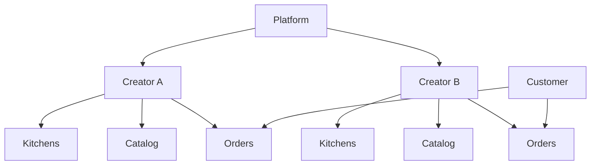

# Data Model Overview

> PostgreSQL schema conventions and multi-tenancy model for Marketplate — see [Founding Constitution](../../company/constitution.md)

**Status:** Active  
**Version:** 1.0  
**Last updated:** 2026-07-03  
**Owner:** Engineering

---

## Purpose

Define database platform choices, naming conventions, cross-cutting column patterns, and multi-tenancy boundaries for all Marketplate services. Entity-level detail lives in [Core Entities](core-entities.md).

Product context: [Marketplace Mechanics](../../product/marketplace-mechanics.md) — creator-owned relationship, audit everything, verified to sell.

---

## Database Platform

| Component | Choice | Rationale |
|-----------|--------|-----------|
| **Primary database** | PostgreSQL 16+ | ACID transactions, JSONB, full-text search, PostGIS for geo |
| **Connection pooling** | PgBouncer (transaction mode) | Scale API workers without exhausting connections |
| **Migrations** | Versioned SQL migrations (e.g., Flyway, golang-migrate) | Reproducible schema history |
| **Read replicas** | Async replicas for analytics/discovery | Offload heavy read queries |
| **Object storage** | S3-compatible (documents, photos) | Presigned upload flow per [API Overview](../api/api-overview.md) |

---

## Schema Organization

Logical schemas by service domain (may be single database with schema separation in v1):

| Schema | Owner service | Contents |
|--------|---------------|----------|
| `identity` | Identity Service | users, sessions, roles |
| `trust` | Trust Service | verification, compliance, reviews, disputes, audit |
| `catalog` | Catalog Service | menu items, storefronts, availability |
| `commerce` | Order Service | carts, orders, order lines |
| `payments` | Payment Service | payments, payouts, refunds |
| `discovery` | Discovery Service | search index metadata (may use Elasticsearch externally) |

Cross-schema foreign keys permitted where strong consistency required (e.g., `orders.creator_id → creators.id`).

---

## Naming Conventions

| Element | Convention | Example |
|---------|------------|---------|
| **Tables** | snake_case, plural nouns | `menu_items`, `order_lines` |
| **Columns** | snake_case | `created_at`, `creator_id` |
| **Primary keys** | `id` UUID v4 | `id UUID PRIMARY KEY DEFAULT gen_random_uuid()` |
| **Foreign keys** | `{referenced_table_singular}_id` | `creator_id`, `customer_id` |
| **Indexes** | `idx_{table}_{columns}` | `idx_orders_creator_id_status` |
| **Unique constraints** | `uq_{table}_{columns}` | `uq_creators_slug` |
| **Enums** | PostgreSQL ENUM or check constraints | `order_status` |
| **Boolean flags** | `is_` or `has_` prefix | `is_verified`, `has_allergen_ack` |
| **Money** | `_cents` suffix, integer | `total_cents`, `currency_code` |
| **JSON metadata** | `_json` or `_metadata` suffix | `fulfillment_metadata_json` |

Public-facing slugs stored separately from internal UUIDs — [Information Architecture — URL conventions](../../pages/information-architecture.md#url-structure-conventions).

---

## Standard Audit Columns

Every mutable business table includes:

| Column | Type | Description |
|--------|------|-------------|
| `created_at` | `TIMESTAMPTZ NOT NULL` | Row creation time (UTC) |
| `updated_at` | `TIMESTAMPTZ NOT NULL` | Last mutation time (auto-updated) |
| `created_by` | `UUID NULL` | User who created (NULL for system) |
| `updated_by` | `UUID NULL` | User who last updated |

Trust-sensitive tables additionally include:

| Column | Type | Description |
|--------|------|-------------|
| `version` | `INTEGER NOT NULL DEFAULT 1` | Optimistic locking |
| `deleted_at` | `TIMESTAMPTZ NULL` | Soft delete timestamp |
| `deleted_by` | `UUID NULL` | Who soft-deleted |

---

## Soft Deletes

Soft delete pattern used for entities requiring audit retention or recovery:

| Entity | Soft delete | Hard delete trigger |
|--------|:-------------:|---------------------|
| User | ✓ | Account deletion request + retention period |
| Creator | ✓ | Permanent removal after investigation |
| MenuItem | ✓ | Creator-initiated delete |
| Order | ✗ | Immutable — cancel/refund instead |
| Payment | ✗ | Immutable financial record |
| VerificationRecord | ✗ | Status transitions only |
| Review | ✓ | Moderation removal (content hidden, record retained) |

Queries default to `WHERE deleted_at IS NULL`. Admin audit views may include deleted records with scope check.

---

## Multi-Tenancy Model

Marketplate uses **creator-scoped multi-tenancy** — the creator is the primary tenant boundary for operational data.

### Tenancy rules

| Rule | Implementation |
|------|----------------|
| **Creator isolation** | All creator OS queries filter by `creator_id` from auth context |
| **Customer data** | Scoped to `customer_id` (user_id) — cross-creator order history permitted |
| **Admin access** | Cross-tenant with audit logging — no implicit creator filter |
| **Kitchen sharing** | Commercial kitchens verified once; `kitchen_tenants` links creators to bays |
| **Row-level security** | Optional PostgreSQL RLS as defense-in-depth — `creator_id = current_setting('app.creator_id')` |
| **Discovery index** | Denormalized public read model — no PII beyond storefront display fields |

### Shared vs isolated resources

| Resource | Scope |
|----------|-------|
| User, CustomerProfile | Platform-global |
| Creator, Kitchen, MenuItem, Availability | Creator-scoped |
| Cart | Session or customer-scoped; single creator per cart |
| Order, OrderLine, Payment | Creator + customer linked |
| VerificationRecord | Creator-scoped |
| Review | Creator-scoped; customer author |
| Dispute | Order-linked (creator + customer) |
| AuditLog | Platform-global with entity references |
| Platform settings | Platform-global |

---

## Immutable Audit Trail

High-stakes actions write to append-only `audit_logs` table — see [AuditLog](core-entities.md#auditlog).

Sources: verification decisions, payment events, moderation actions, order state transitions, admin settings changes.

Audit logs are **never updated or soft-deleted**. Retention: minimum 7 years for financial and trust records.

---

## Indexing Strategy

| Pattern | Index type | Use case |
|---------|------------|----------|
| Tenant filter + status | B-tree composite | `idx_orders_creator_id_status` |
| Time-range queries | B-tree on timestamp | Order queues by pickup window |
| Full-text search | GIN on tsvector | Menu item name/description (catalog) |
| Geo proximity | GiST (PostGIS) | Discovery nearby search |
| Slug lookup | Unique B-tree | Creator and item public URLs |
| Partial indexes | `WHERE deleted_at IS NULL` | Active records only |

---

## Data Retention & Privacy

| Data class | Retention | Notes |
|------------|-----------|-------|
| Order records | 7 years | Tax and dispute requirements |
| Verification documents | Active + 3 years post-offboarding | Encrypted at rest |
| Session tokens | 30 days sliding | Redis TTL |
| Guest carts | 7 days | Cookie-linked |
| Checkout drafts | 72 hours | Abandoned checkout recovery |
| Audit logs | 7 years minimum | Immutable |
| Support tickets | 3 years | PII minimization |

Account deletion: anonymize PII, retain order/payment records with pseudonymized customer reference.

---

## Open Decisions

| Decision | Data impact |
|----------|-------------|
| `TODO(decision):` Geographic launch market | Jurisdiction rule tables, compliance templates |
| `TODO(decision):` Auth provider | External identity linkage table vs native users |
| `TODO(decision):` Stripe Connect model | Connect account ID storage, payout ledger schema |

---

## Related Documents

- [Core Entities](core-entities.md)
- [Identity Service](../services/identity-service.md)
- [Trust Service](../services/trust-service.md)
- [Order Service](../services/order-service.md)
- [API Overview](../api/api-overview.md)
- [Marketplace Mechanics](../../product/marketplace-mechanics.md)
