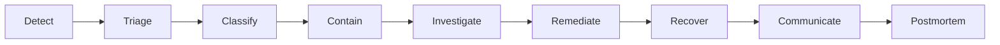

# Security Incident Response

> Classification, response procedures, notification requirements, and postmortem process for security incidents at Marketplate.

**Status:** Active  
**Version:** 1.0  
**Last updated:** 2026-07-03  
**Owner:** Security Engineering + Trust & Safety

---

## Purpose

This document defines how Marketplate **detects, classifies, contains, and resolves security incidents** — events that threaten confidentiality, integrity, or availability of platform systems and data, or that undermine the trust thesis.

It complements operational playbooks for trust-specific scenarios. Use this document for security and infrastructure incidents; cross-reference [Trust & Safety Escalation](../docs/playbooks/trust-safety-escalation.md) when incidents overlap (e.g., unauthorized verification document access, verification system integrity failure).

**Governing principle:** Every incident becomes documentation — [Operations Philosophy](../company/constitution.md#operations-philosophy).

---

## Scope

### Security incidents (this document)

| Category | Examples |
|----------|----------|
| **Confidentiality breach** | PII leak, unauthorized verification document access, exposed secrets |
| **Integrity compromise** | Audit log tampering, unauthorized admin action, verification auto-approve bug |
| **Availability attack** | DDoS, ransomware, destructive database action |
| **Authentication compromise** | Credential stuffing success, stolen admin session, MFA bypass |
| **Supply chain** | Compromised dependency, malicious container image |
| **Insider threat** | Policy violation with data exfiltration |

### Related but distinct

| Scenario | Primary reference |
|----------|-------------------|
| Food safety, illness, allergen exposure | [Food Safety Incident SOP](../operations/food-safety-incident-sop.md) |
| Creator fraud, false approval (operational) | [Verification Review SOP](../operations/verification-review-sop.md) + [T&S Escalation](../docs/playbooks/trust-safety-escalation.md) |
| Infrastructure outage (no security vector) | [Infrastructure Overview — Failure Modes](infrastructure-overview.md#failure-modes) |
| Payment reconciliation drift | [Payment Service](../engineering/services/payment-service.md) + on-call runbook |

When categories overlap, assign a **single Incident Commander** and invoke both playbooks.

---

## Severity Classification

Security incidents use **SEV** levels aligned with infrastructure alerting tiers and Trust & Safety **P** levels for cross-team coordination.

| SEV | Definition | P-level equivalent | Examples |
|-----|------------|-------------------|----------|
| **SEV-0** | Active exploitation; ongoing data exfiltration; legal/regulatory trigger; trust integrity breach | P0 | Live PII leak; production secrets in public repo; verification gate bypass allowing unverified checkout; audit write failure during active admin session |
| **SEV-1** | Confirmed breach contained; high-risk vulnerability actively exploited in staging; significant unauthorized access | P0–P1 | Single operator accessed documents outside queue scope; admin credential compromise (session revoked); Stripe webhook signature bypass attempt succeeded |
| **SEV-2** | Suspected breach; vulnerability with credible exploit path; degraded security control | P1–P2 | Anomalous admin API access pattern; WAF alert storm; failed penetration test finding in production |
| **SEV-3** | Minor security event; no evidence of exploitation | P3 | Single failed brute-force login spike; dependency CVE with no known exploit; policy violation without data access |
| **SEV-4** | Informational | — | Security scan finding in dev; phishing attempt reported, not clicked |

**Upgrade rule:** When in doubt, classify up. Downgrade only with Incident Commander approval and documented rationale.

### Trust-critical escalations

These events are **automatic SEV-0** regardless of initial assessment:

| Event | Why |
|-------|-----|
| Audit log write failure on mutating admin action | Integrity of trust enforcement — [Trust Service](../engineering/services/trust-service.md#failure-modes) |
| Unverified creator in paid checkout path | Trust gate violation — fail-closed invariant broken |
| Bulk verification document export without elevated permission | Confidentiality breach of highest-sensitivity data class |
| AI auto-approval of verification (any case) | Human approval invariant violated — [Verification Assist](../ai/verification-assist.md#human-approval) |

---

## Response Workflow

### Phase overview



### 1. Detect

| Source | Examples |
|--------|----------|
| **Automated alerts** | P1 pages — checkout broken, audit write failure; WAF blocks; anomaly detection |
| **Observability** | Error rate spikes on auth endpoints; unusual object storage access patterns |
| **Personnel reports** | Operator reports document viewer anomaly; engineer finds exposed secret |
| **External reports** | Researcher disclosure; customer report of account compromise |
| **Vendor notification** | Stripe, auth provider, cloud provider security advisory |

Detection runbooks live in [`operations/`](../operations/). Alert routing: [Infrastructure Overview — Alerting tiers](infrastructure-overview.md#alerting-tiers).

### 2. Triage (target: 15 minutes for SEV-0/1)

On-call engineer or Trust Supervisor performs initial assessment:

1. **Confirm or dismiss** — Is this a genuine security incident?
2. **Assign SEV level** — Use classification table above
3. **Assign Incident Commander (IC)** — See role table below
4. **Open incident channel** — `#incident-YYYYMMDD-shortname` in Slack
5. **Start incident timeline doc** — Timestamped log of actions and decisions

### 3. Contain (target: 30 minutes for SEV-0)

Containment actions depend on incident type. Execute the minimum necessary to stop ongoing harm:

| Incident type | Containment actions |
|---------------|---------------------|
| **Credential compromise** | Revoke sessions; force password reset; rotate affected secrets |
| **Admin account misuse** | Disable account; preserve audit logs; lock verification queue item if in progress |
| **Data exposure** | Revoke signed URLs; block public access; take affected endpoint offline if needed |
| **Verification integrity failure** | Block paid checkout platform-wide if gate bypass confirmed — fail closed |
| **Secrets exposure** | Rotate immediately; invalidate CI tokens; scan git history |
| **Active exploitation** | WAF block; IP denylist; scale down affected service if isolation required |

Document every containment action in the incident timeline. Prefer reversible containment when possible.

### 4. Investigate

| Activity | Detail |
|----------|--------|
| **Scope determination** | What data, accounts, time window affected? |
| **Root cause analysis** | How did the attacker or failure bypass controls? |
| **Evidence preservation** | Export relevant logs, audit records, and access logs before retention expiry |
| **Chain of custody** | Legal consulted for incidents that may involve law enforcement |

Investigation tools: centralized logs ([Architecture Overview — Logging](architecture-overview.md#logging)), [AuditLog](data/core-entities.md#auditlog), object storage access logs, auth provider audit trail.

**Never destroy evidence** during investigation unless required for ongoing containment — coordinate with Legal.

### 5. Remediate

| Activity | Owner |
|----------|-------|
| Patch vulnerability or fix bug | Engineering |
| Rotate compromised credentials | Engineering + Security |
| Revoke improper access grants | Security + Identity owner |
| Update WAF rules or rate limits | Engineering |
| Operator retraining (if human error) | Trust & Safety |

Remediation PRs for SEV-0/1 require Security Engineering review before deploy.

### 6. Recover

Return systems to normal operation with verification:

| Check | Before closing incident |
|-------|------------------------|
| Affected control restored and tested | ✓ |
| No ongoing unauthorized access | ✓ |
| Monitoring enhanced for recurrence | ✓ |
| Trust gates verified (if trust-impacting) | ✓ E2E checkout with verification check |
| Payment reconciliation current (if payment-impacting) | ✓ |

Disaster recovery targets apply for data loss scenarios: RTO 4 hours, RPO 1 hour — [Infrastructure Overview — Disaster Recovery](infrastructure-overview.md#disaster-recovery).

### 7. Communicate

See [Notification Requirements](#notification-requirements) below.

### 8. Postmortem

See [Postmortem Process](#postmortem-process) below.

---

## Roles During Incident

| Role | Responsibility | Typical assignee |
|------|----------------|------------------|
| **Incident Commander (IC)** | Owns timeline, decisions, severity, and close criteria | Security Eng Lead (SEV-0/1) or Eng On-Call (SEV-2) |
| **Technical Lead** | Investigation, containment execution, remediation | Engineering On-Call |
| **Trust Liaison** | Verification/document impact assessment; operator interviews | Trust & Safety Lead |
| **Legal Counsel** | Breach notification, regulatory, external comms approval | Legal |
| **Communications** | Customer/creator/status page messaging (Legal-approved) | `TODO(decision):` Comms owner |
| **Executive Sponsor** | SEV-0 decisions, policy exceptions | Founder / CEO |
| **Scribe** | Timeline documentation | Any available team member |

### War room

| SEV | War room |
|-----|----------|
| SEV-0 | Required — standing video bridge until contained |
| SEV-1 | Recommended |
| SEV-2 | Optional — async in incident channel |
| SEV-3/4 | Async only |

Cross-functional trust incidents use the war room model in [T&S Escalation — War room](../docs/playbooks/trust-safety-escalation.md).

---

## Notification Requirements

### Internal notification

| SEV | Notify | Timeline |
|-----|--------|----------|
| SEV-0 | IC, Eng On-Call, Security Lead, Trust Lead, Legal, Executive | Immediate (pager) |
| SEV-1 | IC, Eng On-Call, Security Lead, Trust Lead | Within 30 minutes |
| SEV-2 | Eng On-Call, Security Lead | Within 4 hours |
| SEV-3 | Security Lead (async) | Next business day |

### External notification

Legal Counsel determines external notification requirements based on jurisdiction, data classes affected, and contractual obligations. Engineering provides factual technical summary — **never** send external communications without Legal approval.

| Stakeholder | When to consider | Owner |
|-------------|------------------|-------|
| **Affected users** | Confirmed unauthorized access to their PII or account | Legal + Comms |
| **Affected creators** | Verification documents or payout data exposed | Legal + Comms |
| **Regulators** | Jurisdiction-specific breach notification thresholds met | Legal |
| **Law enforcement** | Criminal activity, subpoena, active fraud network | Legal |
| **Vendors** | Compromised integration credentials (Stripe, auth provider) | Engineering + Legal |
| **Status page** | Customer-facing availability or security impact | Comms |

### Notification content standards

External notifications include:

- What happened (factual, no speculation)
- What data was affected (by class — see [Data Protection](data-protection.md#data-classification))
- What Marketplate is doing
- What affected users should do (password reset, monitor accounts)
- Contact channel for questions

Do **not** include: internal root cause before postmortem, individual operator names, or unverified scope estimates.

---

## Postmortem Process

Every **SEV-0 and SEV-1** incident requires a written postmortem within **5 business days** of incident close. SEV-2 postmortems are recommended when systemic issues are identified.

### Postmortem principles

| Principle | Detail |
|-----------|--------|
| **Blameless** | Focus on systems and processes, not individuals |
| **Accurate** | Timeline with UTC timestamps; distinguish hypothesis from confirmed fact |
| **Actionable** | Every postmortem produces tracked remediation items |
| **Shared** | Published internally to engineering, trust, and leadership |

### Postmortem template

```markdown
# Postmortem: [Incident title]

**Date:** YYYY-MM-DD
**SEV:** SEV-X
**Duration:** [detect → close]
**Authors:** [names]
**Incident Commander:** [name]

## Summary
[2–3 sentences: what happened, impact, resolution]

## Impact
- Users affected: [count or "unknown"]
- Data classes exposed: [list]
- Duration of exposure: [time window]
- Trust/commerce impact: [checkout blocked, etc.]

## Timeline (UTC)
| Time | Event |
|------|-------|
| ... | ... |

## Root Cause
[Technical and/or process root cause]

## What Went Well
- ...

## What Went Poorly
- ...

## Action Items
| Item | Owner | Priority | Due |
|------|-------|----------|-----|
| ... | ... | P0/P1/P2 | YYYY-MM-DD |

## Lessons Learned
[Process or architecture improvements]
```

### Action item tracking

Postmortem action items enter the engineering backlog with **P0 priority for SEV-0** findings that could recur. Security Engineering reviews open incident action items monthly until closed.

Trust-impacting incidents also update relevant SOPs in [`operations/`](../operations/) — per [Operations Philosophy](../company/constitution.md#operations-philosophy).

---

## Incident-Specific Runbooks

### PII or verification document exposure

1. **Classify SEV-0** if bulk or unauthenticated access confirmed
2. **Revoke** all active signed URLs for affected documents — [Trust Service — Document access](services/trust-service.md#security)
3. **Identify** access log entries: `{ operator_id, document_id, timestamp, action }`
4. **Notify** Legal immediately
5. **Preserve** object storage access logs and audit records
6. **Interview** involved operators if internal access suspected
7. Postmortem must include access control review — [Access Control](access-control.md)

### Secrets exposure

1. **Rotate** affected secrets immediately — do not wait for full scope assessment
2. **Scan** git history and CI logs for exposure window
3. **Audit** API usage during exposure window for unauthorized calls
4. Follow [Infrastructure Overview — Secrets management](infrastructure-overview.md#secrets-management) rotation procedures

### Authentication compromise at scale

1. **Enable** enhanced rate limiting on auth endpoints
2. **Force** password reset for affected account cohort
3. **Revoke** all sessions for affected users
4. **Review** auth audit logs — [Identity Service — Audit](services/identity-service.md#security)
5. Consider temporary MFA enforcement for admin accounts

### Trust gate bypass

1. **SEV-0** — block paid checkout if bypass is active
2. **Identify** orders placed during bypass window
3. **Quarantine** affected creator listings via [Creator Suspension SOP](../operations/creator-suspension-sop.md) if unverified commerce occurred
4. **Fix** with fail-closed test cases before re-enabling checkout
5. Trust & Safety reviews affected orders manually

---

## Metrics & Continuous Improvement

| Metric | Target | Review |
|--------|--------|--------|
| Time to detect (SEV-0) | < 15 min | Per incident |
| Time to contain (SEV-0) | < 30 min | Per incident |
| Postmortem completion | 100% within 5 days for SEV-0/1 | Monthly |
| Open action items from incidents | Trending down | Monthly |
| Repeat incident class | 0 within 90 days | Quarterly |

Semi-annual **tabletop exercises** simulate SEV-0 scenarios (document leak, secrets exposure, trust gate failure) with Engineering, Trust & Safety, and Legal participants.

---

## Related Documents

### Security suite

- [Security Policy](security-policy.md)
- [Access Control](access-control.md)
- [Data Protection](data-protection.md)

### Operations & playbooks

- [Operations README](../operations/README.md)
- [Trust & Safety Escalation](../docs/playbooks/trust-safety-escalation.md)
- [Verification Review SOP](../operations/verification-review-sop.md)
- [Food Safety Incident SOP](../operations/food-safety-incident-sop.md)
- [Platform Admin SOP](../operations/platform-admin-sop.md)

### Engineering

- [Infrastructure Overview — Alerting](infrastructure-overview.md#alerting-tiers)
- [Architecture Overview — Failure Modes](architecture-overview.md#failure-modes)
- [Trust Service — Failure Modes](services/trust-service.md#failure-modes)
- [Integration Patterns — Audit log](integration-patterns.md#audit-log-pattern)

### Governance

- [Founding Constitution — Operations Philosophy](../company/constitution.md#operations-philosophy)
- [Support Escalation Guide](../support/escalation-guide.md)
