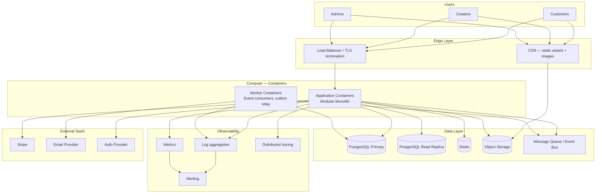
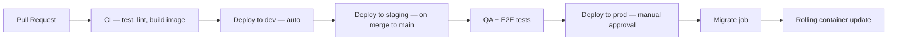

# Infrastructure Overview

> Environments, deployment, CDN, secrets, observability, scaling, and disaster recovery for Marketplate.

**Status:** Active  
**Version:** 1.0  
**Last updated:** 2026-07-03  
**Owner:** Engineering Architecture

---

## Purpose

This document defines Marketplate's **runtime infrastructure**: where the platform runs, how it is deployed across environments, how assets and secrets are managed, and how we observe, scale, and recover the system.

It implements the deployment and operational requirements implied by [Architecture Overview](architecture-overview.md) and [Engineering Philosophy](../company/company-philosophy.md#engineering-philosophy).

For integration and async patterns, see [Integration Patterns](integration-patterns.md). For module boundaries, see [Service Catalog](service-catalog.md).

---

## Architecture

### Infrastructure topology (launch)



### Cloud provider

`TODO(decision):` Cloud provider and primary region (AWS, GCP, or Azure) — determines managed service choices, compliance certifications, and latency to launch geography.

`TODO(decision):` Geographic launch market drives region selection and data residency requirements.

Until decided, this document uses **provider-neutral** terminology (managed PostgreSQL, object storage, container orchestration).

---

## Dependencies

| Dependency | Purpose |
|------------|---------|
| Container orchestration | Run application and worker containers |
| Managed PostgreSQL | Primary data store |
| Redis | Cache, sessions, idempotency, job locks |
| Object storage | Creator media, compliance documents |
| CDN | Global asset delivery |
| Secrets manager | API keys, DB credentials, webhook secrets |
| Stripe | Payments — external dependency |
| Email provider | Transactional email |
| `TODO(decision):` Auth provider | Authentication |

Application architecture: [Architecture Overview](architecture-overview.md).

---

## Services

### Deployment units (launch)

| Unit | Image | Replicas (prod) | Notes |
|------|-------|-----------------|-------|
| **api** | `marketplate-api` | 2+ (auto-scale) | Modular monolith — all domain modules |
| **worker** | `marketplate-worker` | 2+ | Event consumers, outbox relay, scheduled jobs |
| **migrate** | `marketplate-api` | Job (on deploy) | Database migrations — run before traffic shift |

Future extraction adds independent images per service — same container pattern.

### Environment-specific configuration

| Config | dev | staging | prod |
|--------|-----|---------|------|
| Stripe | Test mode | Test mode | Live mode |
| Email | Sink / sandbox | Provider sandbox | Production sending |
| Auth | Dev tenant | Staging tenant | Production tenant |
| Log level | debug | info | info |
| DB | Shared small instance | Prod-like sizing | HA cluster |

No production credentials in dev or staging images — injected at runtime from secrets manager.

---

## Data Flow

### Deployment pipeline



| Stage | Gate |
|-------|------|
| CI | Unit + integration tests pass; OpenAPI lint |
| Staging | E2E on trust and payment paths |
| Production | Manual approval; migration succeeds; health checks green |

### Asset delivery flow

1. Creator uploads photo → API → object storage (private bucket)
2. API returns CDN URL (signed or public per policy)
3. CDN caches at edge; cache invalidation on catalog update
4. Customer storefront loads images from CDN — not from API containers

Static frontend assets (JS, CSS) also served via CDN with content-hash filenames.

---

## Environments

### Environment definitions

| Environment | Purpose | URL pattern | Data |
|-------------|---------|-------------|------|
| **dev** | Engineer daily work; feature branches | `dev.marketplate.internal` | Synthetic; reset weekly |
| **staging** | Pre-production validation; demo | `staging.marketplate.com` | Anonymized prod-like or seeded |
| **prod** | Live marketplace | `marketplate.com` | Production data |

### Environment isolation

- Separate PostgreSQL instances (or clusters) per environment
- Separate Stripe accounts (test vs live)
- Separate object storage buckets
- Separate secrets namespaces
- No cross-environment network access

### Local development

Docker Compose stack: PostgreSQL, Redis, local object storage (MinIO), Stripe CLI for webhooks, mail sink (Mailpit).

Documented in `engineering/local-development.md` *(Phase 3 — in progress)*.

---

## Deployment

### Container strategy

| Principle | Implementation |
|-----------|----------------|
| **Immutable images** | Same image promoted dev → staging → prod |
| **12-factor config** | All config via environment variables / secrets |
| **Health checks** | `/health/live` and `/health/ready` endpoints |
| **Graceful shutdown** | Drain connections on SIGTERM (30s window) |
| **Non-root containers** | Run as unprivileged user |

### Orchestration options

| Phase | Platform |
|-------|----------|
| Launch | Managed container service (ECS, Cloud Run, or App Service) |
| Scale | Kubernetes (EKS, GKE, AKS) when multi-service extraction warrants |

Decision recorded in ADR when cloud provider is chosen.

### Database migrations

- Migrations run as **pre-deploy job** — not on container startup in prod
- Backward-compatible migrations required for zero-downtime rolling deploys
- Rollback plan documented per migration in PR

### CDN for assets

| Asset type | CDN behavior |
|------------|--------------|
| Creator photography | Cache 24h; invalidate on catalog update |
| Static app bundles | Cache 1 year (content-hash filenames) |
| API responses | Not CDN cached |
| Compliance documents | Never CDN cached — signed URLs only |

CDN provider typically co-located with object storage or Cloudflare in front.

---

## Secrets management

| Secret type | Storage | Rotation |
|-------------|---------|----------|
| Database credentials | Secrets manager | 90 days automated |
| Stripe API keys | Secrets manager | On compromise; API supports rolling |
| Webhook signing secrets | Secrets manager | Per Stripe dashboard rotation |
| Auth provider keys | Secrets manager | Per provider policy |
| JWT signing keys (if self-hosted) | Secrets manager | 180 days |
| Email provider API key | Secrets manager | 90 days |

**Rules:**

- Never commit secrets to git
- Never bake secrets into container images
- Application reads secrets at startup; supports rotation without rebuild
- CI uses short-lived credentials scoped to CI role

Access audited; production secrets require break-glass procedure documented in operations *(Phase 4)*.

---

## Observability stack

### Three pillars

| Pillar | Tool class | Purpose |
|--------|------------|---------|
| **Logs** | Centralized log aggregation (Datadog, CloudWatch, Grafana Loki) | Debugging, audit correlation |
| **Metrics** | Time-series metrics (Prometheus, CloudWatch, Datadog) | SLIs, SLOs, alerting |
| **Traces** | Distributed tracing (OpenTelemetry → Jaeger, Tempo, X-Ray) | Request flow across modules |

OpenTelemetry instrumentation in all application and worker containers. `trace_id` propagated to logs and events.

### Key dashboards

| Dashboard | Audience | Contents |
|-----------|----------|----------|
| Platform health | Engineering | Error rate, latency, saturation by module |
| Checkout funnel | Product + Engineering | Cart → payment → confirm conversion |
| Trust operations | Trust & Safety | Verification queue depth, SLA |
| Payment reconciliation | Finance + Engineering | Failed webhooks, payout errors |
| Infrastructure | Engineering | CPU, memory, DB connections, Redis, queue depth |

### Alerting tiers

| Tier | Response | Examples |
|------|----------|----------|
| **P1** | Page on-call immediately | Prod down, checkout broken, payment webhook failure storm |
| **P2** | Notify on-call; fix within 4h | Discovery degraded, notification backlog |
| **P3** | Next business day | Non-critical metric drift |

Alert definitions live in infrastructure-as-code alongside deployment configs.

### Health checks

```
GET /health/live   → 200 if process running
GET /health/ready  → 200 if DB + Redis reachable
```

Load balancer removes unhealthy instances from rotation.

Logging standards: [Architecture Overview — Logging](architecture-overview.md#logging).

---

## Failure Modes

| Failure | Impact | Response |
|---------|--------|----------|
| Single container crash | Minimal — LB routes to healthy replicas | Auto-restart |
| AZ failure | Reduced capacity | Multi-AZ deployment; auto-scale |
| DB primary failure | Write outage | Failover to standby; RPO ≤ 1h |
| Redis failure | Cart/session degradation | Failover or rebuild; DB fallback for auth sessions |
| CDN outage | Slow image loads | Origin fallback; monitor origin load |
| Secrets manager outage | New containers fail to start | Cached secrets in running containers; restore SM |
| Deployment bad migration | Deploy blocked | Migration job fails; rollback; no traffic shift |
| Stripe outage | No payments | Status page; queue checkout retries |

---

## Monitoring

SLO targets for production:

| SLI | SLO | Measurement window |
|-----|-----|-------------------|
| API availability | 99.9% | 30 days |
| Checkout success (excl. user error) | 99.5% | 7 days |
| Search p99 latency | < 300ms | 7 days |
| Webhook processing lag | < 60s p99 | 7 days |

Error budget policy: if availability SLO breached, freeze non-critical deploys until recovered.

Business metrics feed [`analytics/`](../analytics/) *(Phase 5)* — infrastructure metrics stay in observability stack.

---

## Logging

| Environment | Log level | Retention |
|-------------|-----------|-----------|
| dev | debug | 7 days |
| staging | info | 14 days |
| prod | info (warn for noisy paths) | 30 days hot, 1 year archive |

Log shipping: application → stdout (JSON) → log aggregator. No SSH-to-container log retrieval in prod.

PII scrubbing at log pipeline for accidental inclusion.

---

## Security

| Control | Implementation |
|---------|----------------|
| Network | Private subnets for DB, Redis, workers; public LB only |
| TLS | TLS 1.2+ on all public endpoints |
| WAF | Rate limiting and OWASP rules on public LB *(recommended at launch)* |
| IAM | Least privilege per service account |
| Container scanning | Image vulnerability scan in CI |
| DB encryption | At-rest encryption enabled |
| Backup encryption | Encrypted backups |
| Admin access | VPN or IP allowlist for admin tools *(optional)* |

Compliance framing: [`legal/`](../legal/) *(Phase 5)*. Security program: [Security Policy](security-policy.md), [Access Control](access-control.md), [Data Protection](data-protection.md), [Incident Response](incident-response.md).

---

## Testing

| Environment | Test type |
|-------------|-----------|
| CI | Unit, integration, contract tests |
| Staging | E2E purchase, onboarding, fulfillment, payout |
| Staging | Load test before major launches (checkout, search) |
| Prod | Synthetic monitoring (canary checkout every 5 min) |

Staging mirrors prod topology at smaller scale — not a single-container shortcut.

---

## Scaling Strategy

### Horizontal scaling (launch)

| Component | Trigger | Action |
|-----------|---------|--------|
| API containers | CPU > 70% or p99 latency | Add replicas (max 10 at launch) |
| Worker containers | Queue depth > 500 | Add worker replicas |
| PostgreSQL | Connection saturation | Connection pooling (PgBouncer); read replica |
| Redis | Memory > 80% | Scale instance; review TTLs |

### Vertical scaling thresholds

Upgrade DB instance tier before read replica sharding. Monitor slow query log.

### Caching layers

| Cache | TTL | Invalidation |
|-------|-----|--------------|
| Creator storefront (public) | 60s | Catalog event |
| Discovery search results | 30s | Trust/catalog events |
| Trust gate check | 60s max | Trust state change event |
| Session | Per auth provider | Logout / expiry |

### Future scaling

- Extract Discovery and Notification to scale independently
- PostgreSQL read replicas for analytics queries
- Multi-region when second geographic market launches

Module-specific scaling: [Service Catalog — Scaling Strategy](service-catalog.md#scaling-strategy).

---

## Disaster Recovery

### Targets

| Metric | Target | Definition |
|--------|--------|------------|
| **RTO** | 4 hours | Time to restore platform to functional state after regional disaster |
| **RPO** | 1 hour | Maximum acceptable data loss (PostgreSQL PITR granularity) |

Payment and financial state: Stripe is reconciliation source of truth — local DB restored then reconciled within 24 hours.

### Backup strategy

| Asset | Frequency | Retention | Test restore |
|-------|-----------|-----------|--------------|
| PostgreSQL | Continuous PITR + daily snapshot | 30 days snapshots; PITR 7 days | Quarterly |
| Object storage | Versioning enabled | Indefinite for compliance docs | Quarterly sample |
| Redis | Daily snapshot (non-critical) | 7 days | Optional |
| Infrastructure config | Git (IaC) | Full history | Every deploy |

### Failover procedure (summary)

1. Detect regional outage (synthetic monitors + provider status)
2. Declare incident; notify on-call and leadership
3. Promote read replica to primary *(or restore from snapshot in alternate AZ)*
4. Update DNS / load balancer to healthy region
5. Scale containers in recovery region
6. Run payment reconciliation job
7. Post-incident review → operations doc

Detailed runbooks: [`operations/`](../operations/) *(Phase 4)*.

### Business continuity

- Stripe and email provider are multi-region SaaS — dependency on their SLAs
- Status page communicates customer-facing outages
- Creator payout delays documented in incident comms template

---

## Future Improvements

| Improvement | Trigger |
|-------------|---------|
| Infrastructure as Code (Terraform/Pulumi) | Before second engineer on infra |
| Kubernetes migration | Service extraction or > 20 API replicas |
| Multi-region active-passive | Second geographic market launch |
| Secrets rotation automation | First security audit |
| Cost allocation tags | Finance reporting need |
| Private link to Stripe *(if offered)* | Network hardening |
| Database sharding | Single creator hot-spot at scale |

Cloud provider ADR required before implementing provider-specific services.

---

## Related Documents

- [Architecture Overview](architecture-overview.md)
- [Integration Patterns](integration-patterns.md)
- [Service Catalog](service-catalog.md)
- [Data Flow](data-flow.md)
- [Company Philosophy — Engineering](../company/company-philosophy.md#engineering-philosophy)
- [Marketplace Mechanics](../product/marketplace-mechanics.md)
- [Information Architecture](../pages/information-architecture.md)
- [Operations](../operations/) *(Phase 4)*
- [Security Policy](security-policy.md)
- [Data Protection](data-protection.md)
- [Incident Response](incident-response.md)
