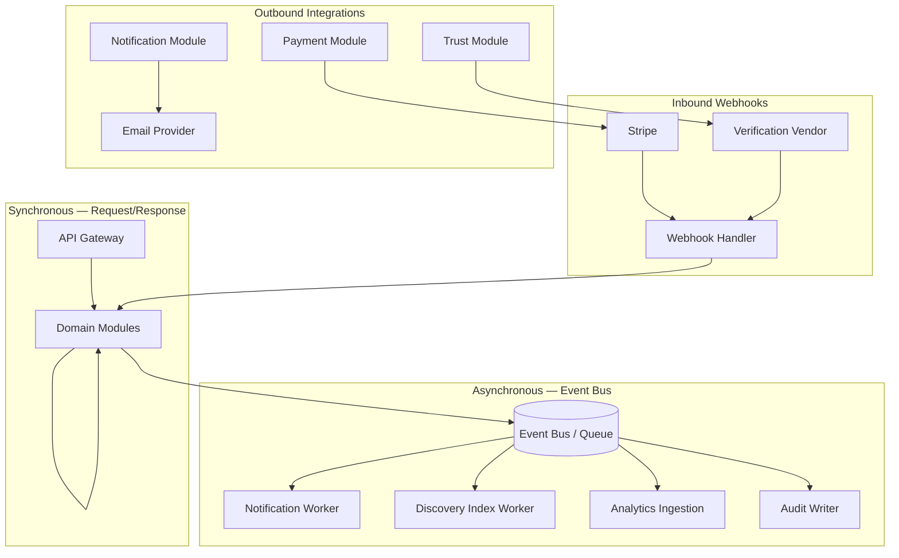
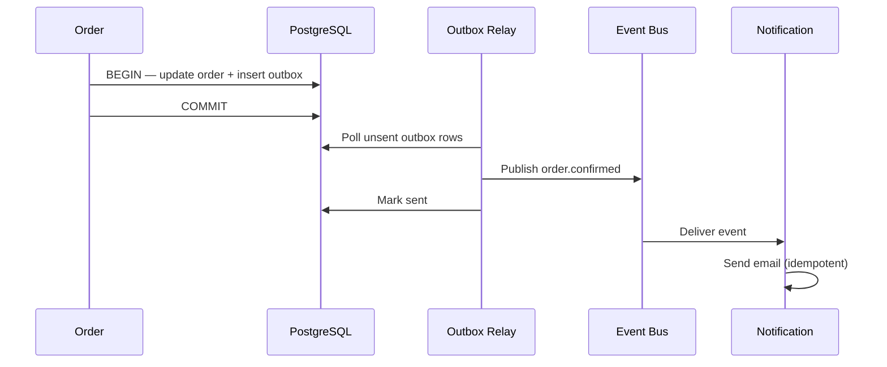
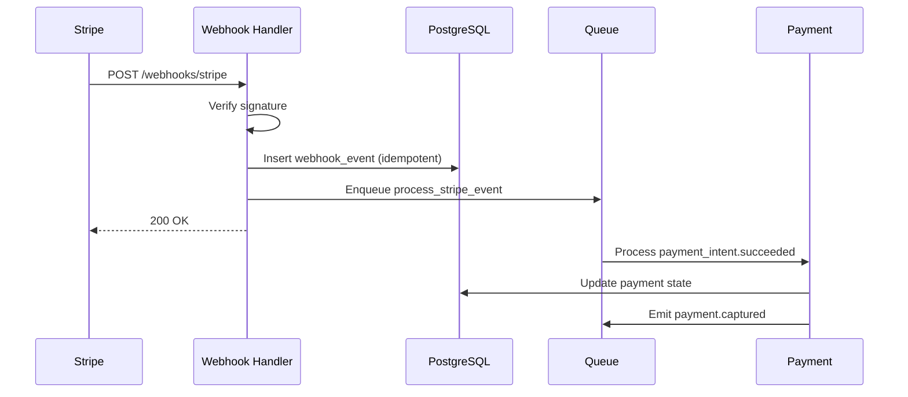
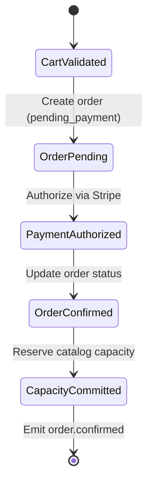
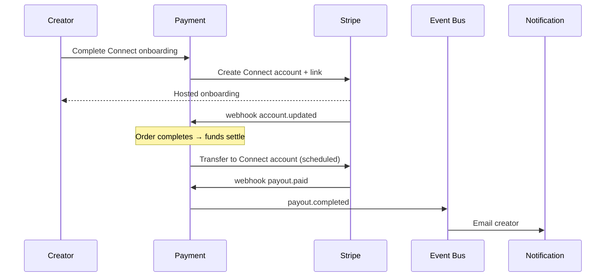

# Integration Patterns

> Event-driven integration, webhooks, idempotency, sagas, and external system patterns for Marketplate.

**Status:** Active  
**Version:** 1.0  
**Last updated:** 2026-07-03  
**Owner:** Engineering Architecture

---

## Purpose

This document defines **how Marketplate modules integrate** with each other and with external providers. It establishes patterns for async messaging, webhook handling, distributed transactions, audit logging, and third-party integrations so implementations remain consistent, observable, and safe — especially on trust and payment paths.

For module boundaries and API surfaces, see [Service Catalog](service-catalog.md). For system context, see [Architecture Overview](architecture-overview.md).

Business invariants driving these patterns: [Marketplace Mechanics](../product/marketplace-mechanics.md).

---

## Architecture

### Integration topology



### When to use which pattern

| Pattern | Use when | Example |
|---------|----------|---------|
| **Sync API call** | Immediate consistency required; user waiting | Trust gate at checkout |
| **Domain event (async)** | Side effects can be eventual; user not blocked | Send confirmation email |
| **Webhook (inbound)** | External system pushes state changes | Stripe `payment_intent.succeeded` |
| **Saga (orchestrated)** | Multi-step transaction across modules | Order + payment confirmation |
| **Audit log (append-only)** | Immutable record required | Admin approves verification |
| **Outbox pattern** | DB write + event must be atomic | Order confirmed → emit event |

---

## Dependencies

| System | Integration type |
|--------|------------------|
| PostgreSQL | Transactional outbox table per module |
| Redis | Idempotency key store, distributed locks |
| Event bus | Redis Streams, SQS, or equivalent at launch |
| Stripe | REST API + webhooks |
| Email provider | REST API |
| `TODO(decision):` Identity verification vendor | REST API + webhooks |
| [Verification Assist](../ai/verification-assist.md) | Internal async job queue |
| [Moderation Assist](../ai/moderation-assist.md) | Internal async classification |

---

## Services

Event producers and consumers by module — full catalog in [Service Catalog](service-catalog.md).

| Module | Produces | Consumes |
|--------|----------|----------|
| Identity | `user.*` | — |
| Trust | `trust.*`, `review.*` | Verification vendor webhooks, AI assist results |
| Catalog | `catalog.*` | `trust.creator.suspended` |
| Order | `order.*` | `payment.*` |
| Payment | `payment.*`, `payout.*` | Stripe webhooks |
| Discovery | — | `catalog.*`, `trust.*`, `order.completed` |
| Notification | — | `order.*`, `trust.*`, `payment.*` |
| Admin | `admin.*` | — *(orchestrates via sync APIs)* |

---

## Data Flow

### Event envelope schema

All domain events share a standard envelope:

```json
{
  "event_id": "uuid",
  "event_type": "order.confirmed",
  "event_version": "1",
  "occurred_at": "2026-07-03T12:00:00Z",
  "producer": "order",
  "correlation_id": "trace-or-request-id",
  "idempotency_key": "optional-for-command-events",
  "payload": { }
}
```

### Event naming convention

`{domain}.{entity}.{action}` — lowercase, past tense for completed actions.

Examples: `order.payment_authorized`, `trust.identity.approved`, `catalog.item.published`

### Outbox pattern

Modules write business state and outbox row in **one database transaction**. A relay process publishes outbox rows to the event bus and marks them sent.



---

## Event bus and async patterns

### Launch implementation

At modular monolith launch, the event bus is a **lightweight queue**:

- **Option A:** Redis Streams with consumer groups
- **Option B:** PostgreSQL-backed job queue (GoodJob, Solid Queue pattern)
- **Option C:** Managed queue (SQS) when extracted to multi-service

Choice documented in ADR when `TODO(decision):` cloud provider is resolved.

### Delivery guarantees

| Guarantee | Policy |
|-----------|--------|
| **At-least-once delivery** | Default — consumers must be idempotent |
| **Ordering** | Per-aggregate ordering (`order_id`, `creator_id`) via partition key |
| **Retry** | Exponential backoff; max 5 retries; then dead-letter queue |
| **DLQ handling** | Alert on DLQ depth; manual replay after fix |

### Consumer rules

1. **Idempotent handlers** — dedupe on `event_id`
2. **No circular sync calls** — if handler needs data, read from DB or cache
3. **Fail fast on schema mismatch** — `event_version` checked; incompatible → DLQ
4. **No trust decisions in async-only paths** — verification gates stay synchronous at checkout

### Event catalog (launch)

| Event | Producer | Consumers |
|-------|----------|-----------|
| `order.confirmed` | Order | Notification, Discovery, Analytics |
| `order.completed` | Order | Notification, Trust (review prompt), Discovery |
| `order.cancelled` | Order | Notification, Payment (refund trigger), Catalog (release capacity) |
| `trust.identity.approved` | Trust | Notification, Catalog (publish gate), Discovery |
| `trust.compliance.expired` | Trust | Catalog (suspend listings), Notification, Discovery |
| `catalog.item.published` | Catalog | Discovery (index) |
| `payment.captured` | Payment | Order, Analytics |
| `payment.refunded` | Payment | Order, Notification |
| `payout.completed` | Payment | Notification |

---

## Webhook patterns

### Inbound webhook handler

All inbound webhooks share a handler module with:

| Step | Action |
|------|--------|
| 1 | Verify signature (Stripe signing secret, vendor HMAC) |
| 2 | Parse payload; reject unknown API versions with logged warning |
| 3 | Dedupe on provider event ID — store in `webhook_events` table |
| 4 | Enqueue async processing (never block webhook response > 5s) |
| 5 | Return 200 immediately after persistence |



### Stripe webhooks (required events)

| Event | Action |
|-------|--------|
| `payment_intent.succeeded` | Mark payment captured; advance order |
| `payment_intent.payment_failed` | Mark order payment failed; release capacity |
| `charge.refunded` | Sync refund state |
| `account.updated` | Update Connect onboarding status |
| `payout.paid` / `payout.failed` | Update creator payout record |

Handler: `POST /webhooks/stripe` — see [Payment Service](services/payment-service.md).

### Verification vendor webhooks

`TODO(decision):` Identity verification vendor — expected events:

- Verification session completed
- Document upload processed
- Manual review required

Pattern identical to Stripe; map vendor statuses to Trust state machine.

---

## Idempotency

### Idempotency key usage

| Operation | Key source | Storage TTL |
|-----------|------------|-------------|
| Checkout / create payment | Client `Idempotency-Key` header | 24 hours |
| Stripe webhook processing | Stripe event ID | Permanent (dedupe table) |
| Event consumer | `event_id` | Permanent (processed_events table) |
| Notification send | `{event_id}:{template}:{recipient}` | 7 days |
| Trust admin action | `{admin_user_id}:{action}:{target_id}:{timestamp_bucket}` | 24 hours |

### API idempotency

```
POST /checkout
Idempotency-Key: 550e8400-e29b-41d4-a716-446655440000
```

Server behavior:

1. Key + endpoint + user → lookup in Redis
2. If exists → return cached response (same status code and body)
3. If not → process; store result; return response

### Database idempotency

Unique constraints as last line of defense:

- `payments.stripe_payment_intent_id` UNIQUE
- `webhook_events.provider_event_id` UNIQUE
- `processed_events.event_id` UNIQUE

---

## Saga pattern: order + payment

Checkout spans Order and Payment modules. Use an **orchestrated saga** with compensating actions — not a distributed 2PC.

### Happy path



### Saga steps

| Step | Module | Action | Failure compensation |
|------|--------|--------|---------------------|
| 1 | Order | Validate cart, trust gate, fulfillment | Return 400 — no side effects |
| 2 | Order | Create order `pending_payment` | — |
| 3 | Payment | Create PaymentIntent | Cancel order |
| 4 | Payment | Confirm authorization (sync or webhook) | Cancel order; release hold |
| 5 | Order | Transition to `confirmed` | Refund payment |
| 6 | Catalog | Commit capacity reservation | Cancel order; refund |
| 7 | Order | Emit `order.confirmed` | — |

### Timeout handling

| State | Timeout | Action |
|-------|---------|--------|
| `pending_payment` | 30 minutes | Auto-cancel order; release capacity |
| Payment authorized, order not confirmed | 5 minutes | Reconciliation job; alert if stuck |

Saga state stored in `orders.saga_state` JSONB for observability and recovery jobs.

Reference flow: [Customer Purchase Flow](../pages/flows/customer-purchase-flow.md).

---

## Audit log pattern

Trust, payment, and admin actions require an **immutable append-only audit log** separate from application logs.

### What gets audited

| Category | Examples |
|----------|----------|
| Trust | Verification approve/reject, compliance doc access, suspension |
| Payment | Refund initiated, payout override, fee adjustment |
| Admin | Dispute resolution, enforcement ladder actions |
| Moderation | Review removal, listing suspension |

Per [Marketplace Mechanics — Audit everything](../product/marketplace-mechanics.md#marketplace-model-overview).

### Audit record schema

```json
{
  "audit_id": "uuid",
  "occurred_at": "2026-07-03T12:00:00Z",
  "actor_type": "admin_user | system | creator | customer",
  "actor_id": "uuid",
  "action": "trust.verification.approved",
  "target_type": "creator",
  "target_id": "uuid",
  "before_state": { },
  "after_state": { },
  "reason": "human-readable justification",
  "correlation_id": "request-or-trace-id",
  "ip_address": "optional-for-human-actors"
}
```

### Implementation rules

| Rule | Detail |
|------|--------|
| **Append-only** | No UPDATE or DELETE on audit table |
| **Same transaction** | Audit write in same DB transaction as state change |
| **Separate table** | `trust_audit_log` — not mixed with `application_logs` |
| **Retention** | 7 years minimum for trust and payment audit |
| **Access** | Admin read-only; export for legal/compliance |

AI-assisted decisions log model version and confidence — [Verification Assist](../ai/verification-assist.md); human approver ID always recorded.

---

## External integrations

### Stripe (payments and payouts)

| Integration | Pattern |
|-------------|---------|
| Customer checkout | Stripe Payment Intents via Payment module |
| Creator payouts | Stripe Connect Express or Standard — `TODO(decision):` Connect account type |
| Platform fees | Application fee on PaymentIntent |
| Refunds | Stripe Refund API; webhook sync |

Creator is merchant of record — [Marketplace Mechanics — Payment model](../product/marketplace-mechanics.md#payment-model).

Onboarding flow: Creator dashboard → Payment module → Stripe Connect onboarding link → webhook updates account status.

### Stripe Connect payout flow



### Identity verification vendor

`TODO(decision):` Identity verification vendor (e.g., Persona, Stripe Identity, Veriff, Onfido)

| Concern | Pattern |
|---------|---------|
| Session creation | Trust module creates vendor session; returns client token to [Identity Verification page](../pages/auth/identity-verification.md) |
| Document storage | Vendor holds primary copy; Trust stores reference ID + extracted metadata |
| Webhook | Vendor → Trust state machine |
| AI assist | [Verification Assist](../ai/verification-assist.md) reads uploaded docs post-ingestion; human approves in [Admin Verification Queue](../pages/admin/verification-queue.md) |

### Email provider

Notification module sends via provider REST API. Templates versioned in code or CMS. Bounce/complaint webhooks update user deliverability flags.

---

## Failure Modes

| Failure | Symptom | Mitigation |
|---------|---------|------------|
| Duplicate webhook | Double payment state update | Idempotent webhook table |
| Lost event | Missing email, stale search index | Outbox relay + reconciliation jobs |
| Saga stuck | Order pending forever | Timeout job + alerting |
| DLQ backlog | Growing unprocessed events | Scale workers; fix consumer bug; replay |
| Audit write failure | State change without audit | Same-transaction requirement — rollback state change |
| Stripe API timeout | Checkout hangs | Retry with idempotency; user sees retry UX |
| Verification webhook out of order | Wrong trust state | State machine rejects invalid transitions |

---

## Monitoring

| Metric | Alert threshold |
|--------|-----------------|
| Event bus queue depth | > 1000 for 5 min |
| DLQ message count | > 0 |
| Webhook processing lag | > 60s p99 |
| Saga stuck orders | > 10 in `pending_payment` > 30 min |
| Idempotency collision rate | Spike detection (possible client bug) |
| Audit log write failures | Any — P1 |

---

## Logging

| Log type | Content | Retention |
|----------|---------|-----------|
| Application logs | Request flow, errors | 30 days hot |
| Event processing logs | `event_id`, handler, duration | 30 days |
| Webhook logs | Provider, event type, dedupe status | 90 days |
| Audit log | Immutable records | 7 years |

Never log webhook signing secrets or full Stripe card objects.

---

## Security

| Area | Control |
|------|---------|
| Webhook endpoints | Signature verification; IP allowlist if provider supports |
| Event bus | Internal network only; no public exposure |
| Idempotency keys | Scoped to authenticated user or session |
| Stripe | Restricted API keys; Connect platform settings |
| Verification vendor | API keys in secrets manager; webhook HMAC |
| Audit log | Tamper-evident; restricted write path |

---

## Testing

| Test type | Coverage |
|-----------|----------|
| Unit | State machines, idempotency logic, saga compensations |
| Integration | Outbox relay, webhook handler with Stripe fixtures |
| Contract | Webhook payload fixtures per Stripe API version |
| Chaos | Kill consumer mid-handler; verify no duplicate side effects |
| Audit | Every trust admin action produces audit row |

Stripe test mode for all payment integration tests. Webhook tests use Stripe CLI or recorded fixtures.

---

## Scaling Strategy

| Component | Scale approach |
|-----------|----------------|
| Webhook handler | Horizontal; stateless after enqueue |
| Event consumers | Consumer groups per event type |
| Outbox relay | Single leader or partitioned by module |
| Idempotency store | Redis cluster |
| Audit writes | PostgreSQL — partition by month at scale |

Extract event bus to managed service before consumer count exceeds monolith worker capacity.

---

## Disaster Recovery

| Asset | Recovery |
|-------|----------|
| Outbox unsent rows | Relay resumes on restart |
| DLQ | Replay after fix — idempotent consumers safe |
| Webhook events table | Reconcile against Stripe Dashboard export |
| Audit log | Restored from PostgreSQL backup — never truncated |

Payment reconciliation job runs post-recovery: compare Stripe charges to local payment records.

---

## Future Improvements

| Improvement | Benefit |
|-------------|---------|
| Change Data Capture (CDC) | Replace outbox with Debezium-style streaming |
| Event schema registry | Enforce payload contracts across versions |
| GraphQL subscriptions | Real-time order updates for creator dashboard |
| Webhook replay UI | Admin tool for failed vendor webhooks |
| Saga visualization | Ops dashboard for in-flight checkout sagas |

---

## Related Documents

- [Architecture Overview](architecture-overview.md)
- [Service Catalog](service-catalog.md)
- [Data Flow](data-flow.md)
- [Infrastructure Overview](infrastructure-overview.md)
- [Marketplace Mechanics](../product/marketplace-mechanics.md)
- [Customer Purchase Flow](../pages/flows/customer-purchase-flow.md)
- [Trust Verification Flow](../pages/flows/trust-verification-flow.md)
- [Verification Assist](../ai/verification-assist.md)
- [Payment Service](services/payment-service.md)
