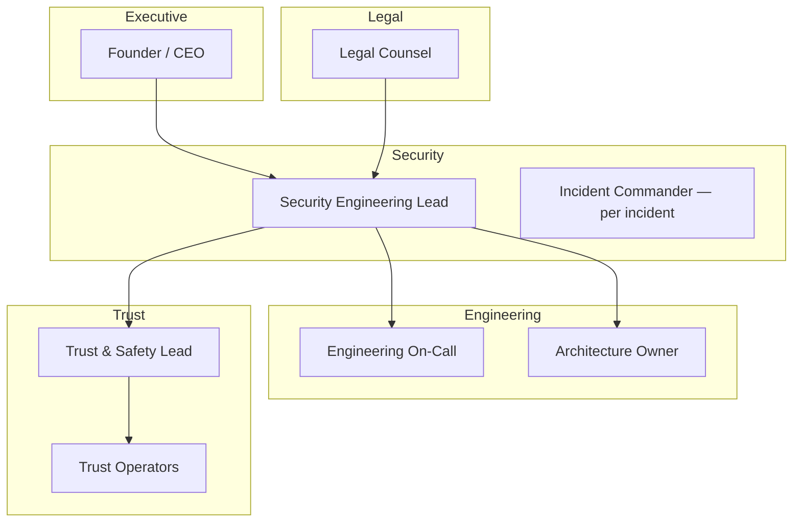

# Security Policy

> Information security principles, scope, roles, and acceptable use for Marketplate.

**Status:** Active  
**Version:** 1.0  
**Last updated:** 2026-07-03  
**Owner:** Engineering + Trust & Safety

---

## Purpose

This document defines Marketplate's **information security program**: the principles, scope, roles, and acceptable-use expectations that protect platform integrity, customer and creator data, and the trust thesis — **Trust is our product. Software enables trust.**

It is the governing reference for security decisions across engineering, operations, and Trust & Safety. Detailed controls are implemented in companion documents:

| Document | Focus |
|----------|-------|
| [Access Control](access-control.md) | RBAC, MFA, admin access, audit |
| [Data Protection](data-protection.md) | Encryption, PII classification, retention |
| [Incident Response](incident-response.md) | Classification, response, notification, postmortem |
| [Infrastructure Overview — Security](infrastructure-overview.md#security) | Network, TLS, WAF, container scanning |
| [Architecture Overview — Security](architecture-overview.md#security) | Platform-level security approach |

This policy traces to the [Founding Constitution](../company/constitution.md) and [Trust Philosophy](../company/constitution.md#trust-philosophy).

---

## Security Principles

Marketplate security decisions follow these principles, ordered by priority when they conflict:

| # | Principle | Meaning |
|---|-----------|---------|
| 1 | **Trust over convenience** | Fail closed on verification gates, auth failures, and ambiguous access. Never bypass controls for speed. |
| 2 | **Least privilege** | Every account, service account, and operator receives the minimum access required for their role — no more. |
| 3 | **Defense in depth** | Layer controls: network isolation, encryption, RBAC, audit, monitoring. No single control is sufficient. |
| 4 | **Human accountability on high stakes** | AI recommends; humans approve verification, enforcement, and security exceptions. See [AI Philosophy](../company/constitution.md#ai-philosophy). |
| 5 | **Audit everything that matters** | Trust, payment, admin, and security events produce immutable audit records — see [Integration Patterns — Audit log](integration-patterns.md#audit-log-pattern). |
| 6 | **Minimize data collection and retention** | Collect only what commerce and compliance require; delete or anonymize when retention expires. |
| 7 | **Secure by default** | New features ship with auth, logging, and encryption requirements met — not retrofitted. |
| 8 | **Transparency internally** | Incidents become documentation; postmortems are blameless and actionable. |

### Alignment with engineering philosophy

Per [Engineering Philosophy](../company/company-philosophy.md#engineering-philosophy), security controls prefer **boring, operable technology** over novel approaches. Proven patterns (TLS, RBAC, managed secrets, Stripe for PCI scope reduction) are preferred until a documented threat model justifies deviation — recorded as an ADR in [`decisions/`](../decisions/).

---

## Scope

### In scope

| Domain | Coverage |
|--------|----------|
| **Production systems** | API, workers, PostgreSQL, Redis, object storage, CDN, observability stack |
| **Non-production environments** | dev, staging — same policy with environment-appropriate controls |
| **Application surfaces** | Customer Marketplace, Creator OS, Admin / Trust & Safety |
| **Data** | All data classes defined in [Data Protection — Classification](data-protection.md#data-classification) |
| **People** | Employees, contractors, advisors with system access |
| **Third parties** | Stripe, email provider, auth provider, identity verification vendor, AI inference providers |
| **Endpoints** | Laptops and devices used to access production admin tools |

### Out of scope (handled elsewhere)

| Domain | Reference |
|--------|-----------|
| Physical office security | `TODO(decision):` HR / facilities policy |
| End-user device security | Customer and creator responsibility |
| Creator kitchen food safety | [Food Safety Incident SOP](../operations/food-safety-incident-sop.md) |
| Legal privacy notices and terms | [`legal/`](../legal/) *(Phase 5)* |

### Compliance framing

Marketplate handles payment data (via Stripe), identity documents, and food-business compliance records. PCI scope is minimized — card data never touches Marketplate servers. Geographic launch market determines applicable privacy regulations; controls in this policy are designed to satisfy GDPR/CCPA-class requirements pending legal review.

---

## Roles & Responsibilities

### Security ownership model

### Role definitions

| Role | Security responsibilities |
|------|---------------------------|
| **Founder / CEO** | Final authority on P0 incidents, regulatory notification, and policy exceptions |
| **Security Engineering Lead** | Owns this policy; access reviews; vulnerability management; security architecture review |
| **Engineering On-Call** | First responder for infrastructure and application security incidents; containment actions |
| **Architecture Owner** | Ensures new systems meet security requirements before production deploy |
| **Trust & Safety Lead** | Owns verification document access policy; operator security training; T&S incident escalation |
| **Trust Operators** | Follow least-privilege admin access; report suspected data exposure immediately |
| **Legal Counsel** | Breach notification requirements; regulatory correspondence; external comms approval |
| **All employees & contractors** | Acceptable use compliance; report security concerns; complete security onboarding |

### RACI for key security activities

| Activity | Security Eng | Engineering | Trust & Safety | Legal | Executive |
|----------|:------------:|:-----------:|:--------------:|:-----:|:---------:|
| Access provisioning / revocation | C | R | C | — | I |
| Quarterly access review | R | C | C | — | I |
| Vulnerability remediation | A | R | I | — | I |
| Security incident response | C | R | C | C | A |
| Breach notification decision | C | I | I | R | A |
| Verification document access audit | C | I | R | C | I |
| Third-party security review | R | C | I | C | I |

*R = Responsible, A = Accountable, C = Consulted, I = Informed*

---

## Acceptable Use

All personnel with access to Marketplate systems, code, data, or credentials must comply with the following.

### Permitted use

- Access production systems only when required for assigned job duties
- Use company-issued or approved devices with full-disk encryption and screen lock
- Store credentials exclusively in approved password managers and secrets managers
- Report suspected security incidents immediately per [Incident Response](incident-response.md)
- Complete security onboarding before admin or production access is granted

### Prohibited use

| Category | Examples |
|----------|----------|
| **Unauthorized access** | Accessing accounts, data, or admin tools outside assigned role; sharing credentials |
| **Data misuse** | Exporting verification documents, customer PII, or audit logs for personal use; copying production data to unapproved devices |
| **Circumvention** | Disabling audit logging, bypassing MFA, using break-glass access without incident justification |
| **Testing without authorization** | Penetration testing, vulnerability scanning, or load testing against production without approval |
| **Shadow IT** | Deploying unapproved SaaS tools that process Marketplate data |
| **Malicious activity** | Introducing malware, backdoors, or unauthorized code; social engineering colleagues or users |

### Production data handling

| Rule | Detail |
|------|--------|
| **No production PII on local machines** | Use staging with anonymized data for development and debugging |
| **No screenshots of verification documents** | Admin console training enforces watermarked viewer — see [Trust Verification Flow](../pages/flows/trust-verification-flow.md#security--access) |
| **No secrets in git** | API keys, passwords, and tokens belong in secrets manager only — [Infrastructure Overview — Secrets](infrastructure-overview.md#secrets-management) |
| **No customer data in AI prompts** | Unless explicitly scoped and approved — see [AI Platform — PII handling](../ai/README.md#pii-handling) |

### Third-party and contractor access

- Contractors receive time-limited, role-scoped access provisioned through the same RBAC model as employees
- Access expires automatically at contract end; offboarding checklist includes credential revocation within 24 hours
- Third-party vendors processing Marketplate data require security review before integration

### Violations

Suspected policy violations are investigated by Security Engineering with Legal consultation. Consequences range from access revocation to termination and legal action, depending on severity. Security incidents involving intentional misuse follow [Incident Response — P0 classification](incident-response.md#severity-classification).

---

## Security Program Activities

### Onboarding

Every person receiving production or admin access completes:

1. Review of this policy and [Access Control](access-control.md)
2. MFA enrollment on admin and engineering accounts
3. PII handling training — [AI Platform onboarding](../docs/training/ai-systems-onboarding.md) for Trust operators
4. Acknowledgment of acceptable use terms

See [Employee Onboarding Playbook](../docs/playbooks/onboarding-new-employee.md) for the full checklist.

### Ongoing activities

| Activity | Cadence | Owner |
|----------|---------|-------|
| Access review (admin, break-glass, service accounts) | Quarterly | Security Engineering |
| Dependency and container vulnerability scan | Continuous (CI) + weekly triage | Engineering |
| Penetration test | Annually; before major launch | Security Engineering |
| Security tabletop exercise | Semi-annually | Security + Trust & Safety |
| Secrets rotation verification | Per [Infrastructure Overview](infrastructure-overview.md#secrets-management) schedule | Engineering |
| Trust document access audit sample | Monthly | Trust & Safety Lead |

### Change management

Security-sensitive changes require review before production deploy:

| Change type | Review requirement |
|-------------|-------------------|
| Auth / RBAC changes | Security Engineering + Identity owner |
| New external data processor | Legal + Security review |
| Admin permission expansion | Trust & Safety Lead approval |
| Audit log schema or retention change | Architecture Owner + Legal |
| AI system processing PII | AI Platform + Trust & Safety sign-off |

---

## Reporting Security Concerns

| Channel | Use for |
|---------|---------|
| **#security** Slack channel | Questions, non-urgent findings |
| **Engineering on-call pager** | Active exploitation, production compromise |
| **Trust & Safety escalation** | Verification document exposure, operator misconduct — [T&S Escalation](../docs/playbooks/trust-safety-escalation.md) |
| **security@marketplate.com** | External researchers, confidential reports |

All reports are treated confidentially. Retaliation against good-faith reporters is prohibited.

---

## Policy Review

This policy is reviewed **annually** or after any P0/P1 security incident. Changes require Security Engineering Lead approval and Legal consultation for regulatory impact.

Version history is tracked in git. Material changes are communicated to all personnel with system access.

---

## Related Documents

### Security suite

- [Access Control](access-control.md)
- [Data Protection](data-protection.md)
- [Incident Response](incident-response.md)

### Engineering

- [Architecture Overview — Security](architecture-overview.md#security)
- [Infrastructure Overview — Security](infrastructure-overview.md#security)
- [Authentication & Authorization](api/authentication.md)
- [Trust Service — Security](services/trust-service.md#security)
- [Integration Patterns — Audit log](integration-patterns.md#audit-log-pattern)

### Operations & playbooks

- [Operations](../operations/)
- [Verification Review SOP](../operations/verification-review-sop.md)
- [Trust & Safety Escalation](../docs/playbooks/trust-safety-escalation.md)

### Governance

- [Founding Constitution](../company/constitution.md)
- [Company Philosophy — Operations](../company/company-philosophy.md#operations-philosophy)
- [AI Platform — PII handling](../ai/README.md#pii-handling)
