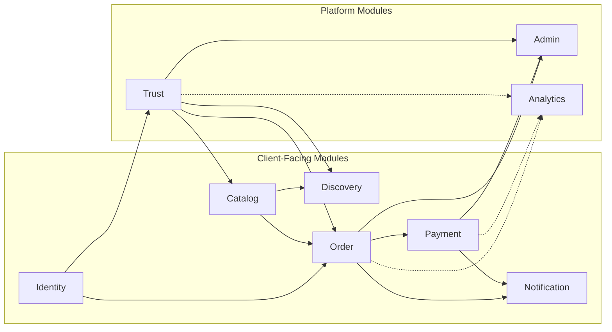

# Service Catalog

> Canonical registry of Marketplate domain modules/services — ownership, boundaries, and API surfaces.

**Status:** Active  
**Version:** 1.0  
**Last updated:** 2026-07-03  
**Owner:** Engineering Architecture

---

## Purpose

This catalog defines every **domain module** in Marketplate's architecture: what it owns, who maintains it, what it depends on, and what API surface it exposes to each application surface.

Modules launch inside a [modular monolith](architecture-overview.md#strategic-approach-modular-monolith-first) with boundaries that support future extraction. Service names here are **logical** — they map to code modules and OpenAPI tag groups, not necessarily separate deployments at launch.

For system-level context, see [Architecture Overview](architecture-overview.md). For async integration between services, see [Integration Patterns](integration-patterns.md).

---

## Architecture

### Catalog overview

### Ownership model

| Module | Owning team *(at launch)* | On-call tier |
|--------|---------------------------|--------------|
| Identity | Platform Engineering | P1 |
| Trust | Platform Engineering + Trust & Safety *(product)* | P1 |
| Catalog | Marketplace Engineering | P2 |
| Order | Marketplace Engineering | P1 |
| Payment | Platform Engineering | P1 |
| Discovery | Marketplace Engineering | P2 |
| Notification | Platform Engineering | P2 |
| Admin | Platform Engineering | P2 |
| Analytics | Data *(future)* | P3 |

---

## Dependencies

### Shared infrastructure (all modules)

| Dependency | Usage |
|------------|-------|
| PostgreSQL | Primary persistence per module schema |
| Redis | Cache, locks, idempotency (module-specific key prefixes) |
| Object storage | Binary assets (Catalog photos, Trust documents) |
| Event bus | Cross-module async events |
| Observability stack | Logs, metrics, traces |

### External integrations by module

| Module | External |
|--------|----------|
| Identity | `TODO(decision):` Auth provider |
| Trust | `TODO(decision):` Identity verification vendor; [Verification Assist](../ai/verification-assist.md) |
| Payment | Stripe, Stripe Connect |
| Notification | Email provider |
| Discovery | [Discovery Ranking](../ai/discovery-ranking.md) *(signals)* |

---

## Services

### Identity

**Responsibility:** User accounts, authentication, sessions, roles, and permission checks across all surfaces.

| Attribute | Detail |
|-----------|--------|
| **Owns** | Users, customer profiles, creator account linkage, sessions, role assignments |
| **Does not own** | Verification status (Trust), creator business profile (Catalog/Trust) |
| **Upstream** | All surfaces, all modules (auth middleware) |
| **Downstream** | Trust (user → creator profile), Order (customer identity), Notification (contact prefs) |

**API surface summary:**

| Surface | Key endpoints | Auth |
|---------|---------------|------|
| Shared | `POST /auth/login`, `POST /auth/signup`, `POST /auth/logout`, `POST /auth/password-reset` | Public / session |
| Customer | `GET /account/settings`, `PATCH /account/settings` | Customer |
| Creator | `GET /dashboard/settings/account`, role switch | Creator |
| Admin | `GET /admin/users/:id` | Admin |

**Events emitted:** `user.created`, `user.role_changed`, `session.revoked`

→ Detail: [Identity Service](services/identity-service.md) · [Authentication API](api/authentication.md)

---

### Trust

**Responsibility:** Creator verification (identity, kitchen, compliance), trust state, moderation, reviews integrity, and immutable audit of trust actions.

| Attribute | Detail |
|-----------|--------|
| **Owns** | Verification workflows, compliance documents metadata, kitchen records, review moderation state, trust audit log |
| **Does not own** | Public review display logic (Catalog), payment disputes (Payment/Admin) |
| **Upstream** | Creator onboarding, Admin verification queue, Catalog (listing gates), Order (checkout gates), Discovery (ranking inputs) |
| **Downstream** | Catalog (publish gate), Order (checkout gate), Discovery (index eligibility), Notification (verification status), [Verification Assist](../ai/verification-assist.md) |

**API surface summary:**

| Surface | Key endpoints | Auth |
|---------|---------------|------|
| Creator | `GET /creator/verify/status`, `POST /creator/verify/identity`, `POST /creator/verify/kitchen`, `GET /dashboard/compliance`, `POST /dashboard/compliance/documents` | Creator |
| Customer | `GET /creators/:slug/trust` *(public trust summary)* | Public |
| Admin | `GET /admin/verification`, `POST /admin/verification/:id/approve`, `POST /admin/verification/:id/reject`, `GET /admin/moderation`, `POST /admin/moderation/:id/action` | Admin |

**Events emitted:** `trust.identity.submitted`, `trust.identity.approved`, `trust.kitchen.verified`, `trust.compliance.expired`, `trust.creator.suspended`, `review.flagged`

**Invariant:** Unverified creators cannot reach `verified_to_sell` state — enforced at Trust and consulted by Catalog/Order.

→ Detail: [Trust Service](services/trust-service.md) · [Trust Verification Flow](../pages/flows/trust-verification-flow.md)

---

### Catalog

**Responsibility:** Creator storefronts, menu items, pricing, allergens, availability windows, and capacity enforcement.

| Attribute | Detail |
|-----------|--------|
| **Owns** | Storefront config, menu items, variants, photos, availability schedules, capacity counters |
| **Does not own** | Order state (Order), verification (Trust), search index (Discovery — denormalized copy) |
| **Upstream** | Creator dashboard, Customer storefront pages |
| **Downstream** | Discovery (index feed), Order (line items, capacity reservation), Trust (SKU → kitchen linkage) |

**API surface summary:**

| Surface | Key endpoints | Auth |
|---------|---------------|------|
| Customer | `GET /creators/:slug`, `GET /creators/:slug/items/:itemId` | Public |
| Creator | `GET /dashboard/catalog`, `POST /dashboard/catalog/items`, `PATCH /dashboard/catalog/items/:id`, `GET /dashboard/availability`, `PATCH /dashboard/availability`, `PATCH /dashboard/storefront` | Creator |
| Admin | `GET /admin/creators/:id/listings`, `POST /admin/creators/:id/listings/:itemId/suspend` | Admin |

**Events emitted:** `catalog.item.published`, `catalog.item.updated`, `catalog.capacity.changed`, `catalog.storefront.updated`

→ Detail: [Catalog Service](services/catalog-service.md) · [Menu Item Detail](../pages/customer/menu-item-detail.md)

---

### Order

**Responsibility:** Shopping cart, checkout orchestration, order lifecycle, fulfillment state machine, and capacity reservation.

| Attribute | Detail |
|-----------|--------|
| **Owns** | Carts, orders, order line items, fulfillment state, cancellation/refund requests *(initiation)* |
| **Does not own** | Payment capture (Payment), trust verification (Trust), notifications (Notification — triggered by events) |
| **Upstream** | Customer checkout, Creator order dashboard |
| **Downstream** | Payment (charge/refund), Notification (status updates), Trust (review eligibility), Discovery (availability) |

**API surface summary:**

| Surface | Key endpoints | Auth |
|---------|---------------|------|
| Customer | `GET /cart`, `POST /cart/items`, `POST /checkout`, `GET /orders`, `GET /orders/:id`, `POST /orders/:id/cancel` | Customer / session |
| Creator | `GET /dashboard/orders`, `GET /dashboard/orders/:id`, `PATCH /dashboard/orders/:id/status` | Creator |
| Admin | `GET /admin/creators/:id/orders`, `POST /admin/disputes/:id/actions` *(orchestrated with Admin)* | Admin |

**Order states:** `draft` → `pending_payment` → `confirmed` → `in_production` → `ready` → `in_fulfillment` → `completed` | `cancelled` | `refunded`

Per [Marketplace Mechanics — Order lifecycle](../product/marketplace-mechanics.md#order-lifecycle).

**Events emitted:** `order.created`, `order.payment_authorized`, `order.confirmed`, `order.status_changed`, `order.completed`, `order.cancelled`

→ Detail: [Order Service](services/order-service.md) · [Customer Purchase Flow](../pages/flows/customer-purchase-flow.md)

---

### Payment

**Responsibility:** Customer payment authorization and capture, platform fee calculation, Stripe Connect onboarding, creator payouts, and refund execution.

| Attribute | Detail |
|-----------|--------|
| **Owns** | Payment intents, charges, refunds, Connect accounts, payout records, fee ledger |
| **Does not own** | Order business logic (Order), dispute mediation (Admin) |
| **Upstream** | Order (checkout), Creator payouts dashboard, Admin dispute resolution |
| **Downstream** | Notification (receipts, payout notices), Analytics *(future)* |

**API surface summary:**

| Surface | Key endpoints | Auth |
|---------|---------------|------|
| Customer | `POST /checkout/payment-intent`, `POST /checkout/confirm` | Customer |
| Creator | `GET /dashboard/payouts`, `POST /dashboard/payouts/connect/onboard`, `GET /dashboard/payouts/history` | Creator |
| Admin | `POST /admin/disputes/:id/refund`, `GET /admin/creators/:id/payments` | Admin |
| Webhooks | `POST /webhooks/stripe` | Stripe signature |

**Events emitted:** `payment.authorized`, `payment.captured`, `payment.refunded`, `payout.completed`, `payout.failed`

Platform fee per `TODO(decision):` commission structure — [Product Overview](../product/overview.md#open-decisions).

→ Detail: [Payment Service](services/payment-service.md)

---

### Discovery

**Responsibility:** Search, browse, collections, location-aware filtering, and trust-weighted ranking of creators and items.

| Attribute | Detail |
|-----------|--------|
| **Owns** | Search index (denormalized), ranking signals, collection definitions, query parsing |
| **Does not own** | Source catalog data (Catalog), verification source of truth (Trust) |
| **Upstream** | Customer home, search, browse pages |
| **Downstream** | Analytics *(future)* — click and conversion events |

**API surface summary:**

| Surface | Key endpoints | Auth |
|---------|---------------|------|
| Customer | `GET /search`, `GET /browse`, `GET /browse/:collectionSlug`, `GET /` *(home feed)* | Public |

**Ranking inputs:** verification status, compliance freshness, review score, relevance, proximity, availability — per [Marketplace Mechanics — Ranking principles](../product/marketplace-mechanics.md#ranking-principles). [Discovery Ranking](../ai/discovery-ranking.md) provides ML signals; rules remain auditable.

**Events consumed:** `catalog.*`, `trust.*`, `order.completed` (for quality signals)

**Events emitted:** `discovery.search.executed` *(analytics)*

→ Detail: [Discovery Service](services/discovery-service.md)

---

### Notification

**Responsibility:** Transactional and operational messages — email at launch; push and SMS in future phases.

| Attribute | Detail |
|-----------|--------|
| **Owns** | Notification templates, delivery queue, delivery status, user channel preferences |
| **Does not own** | Business state (source modules emit events) |
| **Upstream** | All modules via events |
| **Downstream** | Email provider |

**API surface summary:**

| Surface | Key endpoints | Auth |
|---------|---------------|------|
| Customer | `PATCH /account/settings/notifications` | Customer |
| Creator | `PATCH /dashboard/settings/notifications` | Creator |
| Internal | `POST /internal/notifications/send` *(service-to-service)* | Service auth |

**Events consumed:** `order.*`, `trust.*`, `payment.payout.*`

**Delivery types at launch:** order confirmation, order status updates, verification status, payout notices, password reset *(via Identity)*

→ Detail: [Notification Service](services/notification-service.md)

---

### Analytics *(future)*

**Responsibility:** Event collection, creator business metrics, platform dashboards, and export pipelines.

| Attribute | Detail |
|-----------|--------|
| **Owns** | Event store, aggregated metrics, dashboard queries |
| **Does not own** | Source business data (reads from events and read replicas) |
| **Upstream** | All modules (event emission), Creator analytics page, Admin dashboard |
| **Downstream** | [`analytics/`](../analytics/) dashboards *(Phase 5)* |

**API surface summary *(planned)*:**

| Surface | Key endpoints | Auth |
|---------|---------------|------|
| Creator | `GET /dashboard/analytics/overview`, `GET /dashboard/analytics/orders` | Creator |
| Admin | `GET /admin/analytics/marketplace-health` | Admin |
| Internal | Event ingestion via bus | Service auth |

**Status:** Module stub at launch — critical funnel events logged to observability stack; full Analytics module Phase 5.

Page taxonomy: [Information Architecture — Analytics](../pages/information-architecture.md#analytics--page-taxonomy).

---

### Admin

**Responsibility:** Operator workflows, platform configuration, dispute case management, and cross-module orchestration for trust enforcement.

| Attribute | Detail |
|-----------|--------|
| **Owns** | Admin-specific views, dispute cases, platform settings, enforcement action orchestration |
| **Does not own** | Domain state in Trust/Order/Payment — delegates via those modules |
| **Upstream** | Admin console pages |
| **Downstream** | Trust, Order, Payment, Catalog (enforcement actions) |

**API surface summary:**

| Surface | Key endpoints | Auth |
|---------|---------------|------|
| Admin | `GET /admin`, `GET /admin/verification`, `GET /admin/moderation`, `GET /admin/disputes/:id`, `GET /admin/creators/:id`, `PATCH /admin/settings`, enforcement actions on nested resources | Admin |

**Events emitted:** `admin.enforcement.action`, `admin.dispute.resolved`, `admin.settings.changed`

All admin mutations write to Trust audit log.

→ Detail: [Admin API](api/admin-api.md) · [Admin Dashboard](../pages/admin/admin-dashboard.md)

---

## Data Flow

Cross-module data ownership:

| Entity | Owner | Read replicas |
|--------|-------|---------------|
| User | Identity | — |
| Creator profile | Identity + Trust | Discovery |
| Verification record | Trust | Catalog, Order (gate check) |
| Menu item | Catalog | Discovery (index) |
| Order | Order | Admin, Analytics *(future)* |
| Payment / Payout | Payment | Admin, Creator dashboard |
| Review | Trust | Catalog, Discovery |

Entity relationships: [Data Model Overview](data/data-model-overview.md) *(Phase 3 — in progress)*.

---

## Failure Modes

| Module | Failure | Blast radius | Degradation |
|--------|---------|--------------|-------------|
| Identity | Auth down | All authenticated flows | Existing sessions may work until expiry; no new logins |
| Trust | Gate API down | Checkout blocked | Fail closed — no unverified orders |
| Catalog | Read down | Storefronts 503 | CDN cache for public pages (short TTL) |
| Order | Write down | No checkout | Read order history if DB available |
| Payment | Down | No payments | Clear user messaging; no orphaned charges (idempotency) |
| Discovery | Down | Search/browse degraded | Home may show cached collections |
| Notification | Down | No emails | Orders still complete; queue drains on recovery |
| Admin | Down | Internal ops blocked | Customer/creator flows unaffected |

---

## Monitoring

Per-module SLIs:

| Module | SLI | Target |
|--------|-----|--------|
| Identity | Auth success rate | 99.9% |
| Trust | Gate check latency p99 | < 100ms |
| Catalog | Storefront read latency p99 | < 200ms |
| Order | Checkout success rate | 99.5% |
| Payment | Payment success rate | 99.5% |
| Discovery | Search latency p99 | < 300ms |
| Notification | Delivery success rate | 99% (24h) |

Dashboards linked from [Infrastructure Overview](infrastructure-overview.md#observability-stack).

---

## Logging

Each module logs with `service` field matching catalog names. Cross-module requests share `trace_id`.

High-cardinality fields avoided in logs; use IDs referencing PostgreSQL records.

Trust and Payment modules additionally emit audit events — not interchangeable with application logs.

---

## Security

| Module | Security notes |
|--------|----------------|
| Identity | Credential handling delegated to auth provider; bcrypt/argon2 if self-hosted passwords |
| Trust | Document access via signed URLs; PII minimized in API responses |
| Catalog | Creator can only mutate own catalog; public read scoped to published + verified |
| Order | Customer sees own orders; creator sees own orders |
| Payment | PCI scope minimized; Stripe handles card data |
| Discovery | No PII in search index |
| Admin | All endpoints require admin role + audit |

Permission matrix: [Information Architecture — Authentication & Access Matrix](../pages/information-architecture.md#authentication--access-matrix).

---

## Testing

| Module | Critical test scenarios |
|--------|------------------------|
| Trust | Gate blocks unverified; audit on every state change |
| Order | State machine transitions; capacity not oversold |
| Payment | Idempotent charge; Connect payout calculation |
| Catalog | Allergen fields required; publish blocked without kitchen link |
| Discovery | Unverified excluded from results |

Contract tests between Order ↔ Payment and Catalog ↔ Trust required before release.

---

## Scaling Strategy

| Module | First scaling lever |
|--------|---------------------|
| Discovery | Search index extraction; read replicas |
| Notification | Horizontal worker pool |
| Order | Partition by creator_id for hot creators *(future)* |
| Catalog | CDN + object storage for media |
| Payment | Stripe handles payment scale; optimize webhook workers |
| Trust | Async document processing; AI assist queued |

Extraction order when leaving monolith: Notification → Discovery → Payment → Trust.

---

## Disaster Recovery

Module data lives in PostgreSQL with schema-per-module convention. Recovery is platform-wide — see [Infrastructure Overview](infrastructure-overview.md#disaster-recovery).

Payment state reconciled against Stripe after any restore.

---

## Future Improvements

| Module | Enhancement |
|--------|-------------|
| Identity | Social login, passkeys |
| Trust | Automated re-verification triggers |
| Catalog | Bulk import, menu versioning |
| Order | Catering quote workflow |
| Payment | Instant payouts option |
| Discovery | Personalization service extraction |
| Notification | Push notifications, in-app inbox |
| Analytics | Full module implementation (Phase 5) |
| Admin | Automated enforcement playbooks |

---

## Related Documents

- [Architecture Overview](architecture-overview.md)
- [Integration Patterns](integration-patterns.md)
- [Data Flow](data-flow.md)
- [API Overview](api/api-overview.md)
- [Product Overview](../product/overview.md)
- [Marketplace Mechanics](../product/marketplace-mechanics.md)
- [Information Architecture](../pages/information-architecture.md)
- [AI Platform](../ai/)
