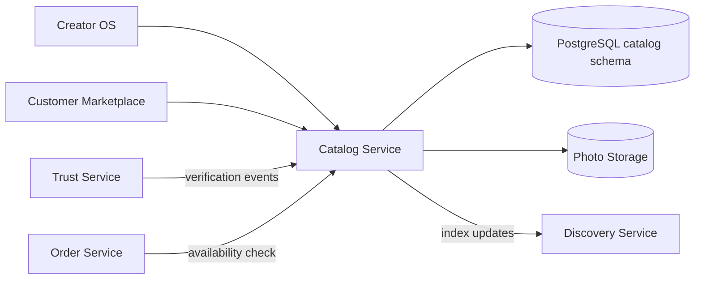

# Catalog Service

> Menu items, storefronts, availability, and listing eligibility — see [Founding Constitution](../../company/constitution.md)

**Status:** Active  
**Version:** 1.0  
**Last updated:** 2026-07-03  
**Owner:** Engineering

---

## Purpose

Manages creator catalog (menu items, sections, photos), storefront presentation settings, and availability schedules. Enforces listing eligibility based on verification and compliance status — [Verified to sell](../../product/marketplace-mechanics.md#marketplace-model-overview) and [Kitchen verification — Product linkage](../../product/marketplace-mechanics.md#kitchen-verification).

Every SKU must link to a verified production location. Capacity enforced at checkout via availability data consumed by Order Service.

---

## Architecture



### Internal components

| Component | Responsibility |
|-----------|----------------|
| **Catalog Manager** | Menu items, sections, CRUD |
| **Storefront Manager** | Profile, slug, photos, policies |
| **Availability Engine** | Schedules, capacity, exceptions, open-now |
| **Compliance Gate** | Pre-publish validation against jurisdiction rules |
| **Public Read API** | Customer-facing storefront and menu endpoints |
| **Inventory Tracker** | Sold-out state, batch limits |

---

## Dependencies

| Dependency | Purpose |
|------------|---------|
| PostgreSQL | Menu items, sections, availability, storefront settings |
| S3 | Item and storefront photos |
| Trust Service | Verification status, compliance rules, category restrictions |
| Discovery Service | Search index updates on publish/unpublish |
| Order Service | Capacity reservation at checkout |

---

## Services

Owns `catalog` schema. Public endpoints served at `/api/v1/creators/:slug/*` and creator OS at `/api/v1/creator/catalog/*`, `/api/v1/creator/storefront/*`, `/api/v1/creator/availability/*`.

---

## Data Flow

### Item publish

1. Creator saves item in Menu Item Editor
2. `POST /api/v1/creator/catalog/items/validate` checks kitchen link, allergens, jurisdiction
3. On publish: verify creator `accepting_orders` and kitchen verified
4. Emit `catalog.item.published` → Discovery indexes item
5. Item appears on public storefront menu

### Availability → checkout

1. Order Service queries `GET /api/v1/checkout/fulfillment-options` internally
2. Availability Engine computes open windows respecting capacity, lead time, exceptions
3. At order placement: atomic capacity decrement for selected window
4. On failure: return `checkout.capacity_exceeded`

Capacity enforcement: [Fulfillment invariants](../../product/marketplace-mechanics.md#fulfillment-invariants).

---

## Key Endpoints

### Creator OS

| Endpoint | Description |
|----------|-------------|
| `/api/v1/creator/catalog` | Sections + items |
| `/api/v1/creator/catalog/items/*` | Item CRUD, photos, validate |
| `/api/v1/creator/catalog/sections/order` | Section reorder |
| `/api/v1/creator/catalog/compliance-summary` | Items needing attention |
| `/api/v1/creator/storefront/*` | Storefront settings |
| `/api/v1/creator/availability/*` | Schedule, rules, exceptions |
| `/api/v1/creator/kitchens` | Verified production locations |

### Customer (public)

| Endpoint | Description |
|----------|-------------|
| `/api/v1/creators/:slug` | Storefront profile |
| `/api/v1/creators/:slug/menu` | Menu sections and items |
| `/api/v1/creators/:slug/items/:itemSlug` | Item detail |
| `/api/v1/creators/:slug/reviews` | Public reviews (delegated to Trust read model) |
| `/api/v1/storefronts/:slug` | Render payload |

Page specs: [Catalog](../../pages/creator/catalog.md), [Creator Storefront](../../pages/customer/creator-storefront.md), [Availability](../../pages/creator/availability.md).

---

## Events

### Emitted

| Event | Consumers | Payload |
|-------|-----------|---------|
| `catalog.item.published` | Discovery | `item_id`, `creator_id`, `menu_data` |
| `catalog.item.unpublished` | Discovery | `item_id`, `creator_id` |
| `catalog.item.sold_out` | Discovery (availability signal) | `item_id` |
| `storefront.updated` | Discovery | `creator_id`, `slug` |
| `availability.updated` | Order (cache invalidation) | `creator_id` |
| `capacity.reserved` | Internal | `window_id`, `order_id`, `quantity` |
| `capacity.released` | Internal | `window_id`, `order_id` (on cancel) |

### Consumed

| Event | Action |
|-------|--------|
| `verification.approved` | Enable listing publish for affected layers |
| `compliance.expired` | Suspend listings; set `compliance_status = blocked` |
| `creator.suspended` | Unpublish all items; set `accepting_orders = false` |
| `creator.reinstated` | Restore eligible items to published |
| `order.cancelled` | Release capacity reservation |

---

## Failure Modes

| Failure | Impact | Mitigation |
|---------|--------|------------|
| Photo upload failure | Item save incomplete | Presigned URL retry; draft saved without photo |
| Compliance rule load failure | Cannot validate publish | Fail closed — block publish; serve cached rules |
| Capacity race at checkout | Potential oversell | DB row lock on capacity counter; transaction isolation |
| Stale availability cache | Wrong windows shown | Short TTL (60s); invalidate on `availability.updated` |
| Discovery index lag | New items not searchable | Accept eventual consistency; storefront direct URL works |
| Slug collision | Storefront URL conflict | Unique constraint; suggest alternatives |

---

## Monitoring

| Metric | Alert |
|--------|-------|
| Availability API p95 latency | > 200ms |
| Capacity reservation conflicts | > 10/min (possible bug) |
| Items blocked by compliance | Track trend |
| Photo upload error rate | > 5% |
| Publish validation failures | Track by reason code |

---

## Logging

```
service=catalog action=item.published creator_id= item_id= kitchen_id= compliance_status=eligible
```

Availability changes logged at INFO. Capacity operations at DEBUG in production.

---

## Security

| Control | Implementation |
|---------|----------------|
| Creator scoping | All mutations filtered by `creator_id` from auth |
| Public read | No PII beyond storefront display fields |
| Unverified creators | Draft items only; public menu returns 404 or empty |
| Photo validation | MIME type and size checks; virus scan async |
| Slug policy | Reserved slug blocklist; profanity filter |

---

## Testing

| Layer | Coverage |
|-------|----------|
| Unit | Availability window computation, lead time, capacity math |
| Unit | Compliance validation rules per jurisdiction |
| Integration | Publish → discovery index → public menu |
| Integration | Checkout capacity reservation under concurrent load |
| E2E | Creator publishes item → customer sees on storefront |

---

## Scaling Strategy

- Public menu endpoints: CDN cache with cache-key on `creator_id + updated_at`
- Availability reads: Redis cache per creator (60s TTL)
- Photo serving: CDN origin from S3
- Write path: single-primary PostgreSQL; shard by `creator_id` if needed at scale

---

## Disaster Recovery

| Target | RPO | RTO |
|--------|-----|-----|
| Catalog data | 1 hour | 4 hours |
| Photos (S3) | 0 (versioned) | 1 hour |

---

## Future Improvements

- Item-level availability overrides (independent of store schedule)
- Batch production limits per SKU
- Multi-location inventory for food trucks
- Photography quality scoring for discovery eligibility
- Nutritional information fields

---

## Related Documents

- [Creator API](../api/creator-api.md)
- [Customer API — Storefront](../api/customer-api.md#storefront--menu)
- [Core Entities — MenuItem](../data/core-entities.md#menuitem)
- [Discovery Service](discovery-service.md)
- [Marketplace Mechanics — Fulfillment](../../product/marketplace-mechanics.md#fulfillment-models)
