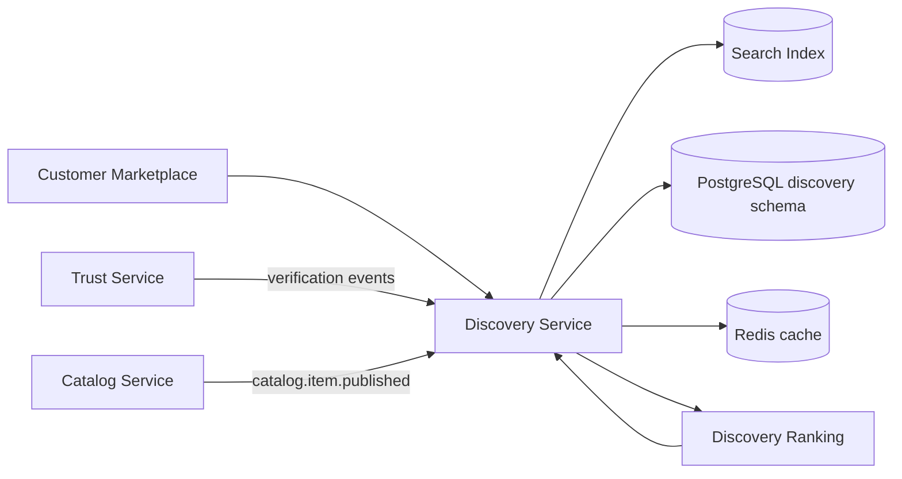

# Discovery Service

> Search, browse, featured collections, and trust-weighted ranking — see [Founding Constitution](../../company/constitution.md)

**Status:** Active  
**Version:** 1.0  
**Last updated:** 2026-07-03  
**Owner:** Engineering

---

## Purpose

Powers customer discovery surfaces: home featured modules, search, browse collections, typeahead, and location-aware creator listings. Consumes catalog and trust signals to return **verified-only, trust-weighted** results per [Discovery Ranking](../../ai/discovery-ranking.md) and [Ranking principles](../../product/marketplace-mechanics.md#ranking-principles).

Discovery optimizes for fit and confidence — not engagement bait. Unverified creators are excluded from paid discovery surfaces.

---

## Architecture

### Internal components

| Component | Responsibility |
|-----------|----------------|
| **Search API** | Query parsing, filters, pagination |
| **Index Manager** | Creator/item index sync from catalog events |
| **Collection Manager** | Editorial and algorithmic browse collections |
| **Ranking Engine** | Trust gates + weighted scoring — [Discovery Ranking](../../ai/discovery-ranking.md) |
| **Geo Module** | Proximity, service area, nearby creators |
| **Featured Module** | Home hero and curated rows with trust thresholds |
| **Suggest API** | Typeahead with verified creator bias |

---

## Dependencies

| Dependency | Purpose |
|------------|---------|
| PostgreSQL | Collections metadata, featured config, ranking weight snapshots |
| Search index (OpenSearch/Elasticsearch) | Full-text and facet search |
| Redis | Hot query cache, featured module cache |
| Trust Service | Verification status, compliance freshness |
| Catalog Service | Menu items, storefronts, availability signals |
| AI Platform | Ranking weight profiles; optional semantic query expansion (v2) |

---

## Services

Owns `discovery` schema and search index pipelines. Public endpoints at `/api/v1/discovery/*`, `/api/v1/search/*`, `/api/v1/browse/*`.

---

## Data Flow

### Index update

1. Catalog emits `catalog.item.published` or `catalog.storefront.updated`
2. Index Manager fetches creator + item payload from Catalog
3. Trust Service provides verification snapshot — unverified excluded from index
4. Document upserted to search index with trust fields denormalized

### Search request

1. `GET /api/v1/search?q=...` with filters
2. Hard trust gates: verified identity + kitchen + active compliance
3. Ranking Engine scores candidates using configurable weights from Platform Settings
4. Paginated response with explain metadata (internal) for ops audit

### Featured home

1. `GET /api/v1/discovery/featured` with optional geo
2. Featured Module applies minimum trust score and fulfillment availability
3. Cache 5–15 minutes per geo bucket; invalidate on trust status change events

---

## Key Endpoints

| Endpoint | Description |
|----------|-------------|
| `GET /api/v1/discovery/featured` | Home featured creators |
| `GET /api/v1/discovery/collections` | Home collection cards |
| `GET /api/v1/discovery/nearby` | Geo-proximate creators |
| `GET /api/v1/search` | Primary search with facets |
| `GET /api/v1/search/suggest` | Typeahead suggestions |
| `GET /api/v1/browse/collections` | Browse index |
| `GET /api/v1/browse/collections/:slug/creators` | Collection creator list |

Full request/response shapes: [Customer API](../api/customer-api.md#discovery--search).

---

## Events

### Consumed

| Event | Action |
|-------|--------|
| `catalog.item.published` | Index item |
| `catalog.item.unpublished` | Remove from index |
| `trust.verification.approved` | Re-index creator; enable discovery |
| `trust.verification.revoked` | Remove from index |
| `trust.compliance.expired` | Demote or exclude |

### Emitted

| Event | Purpose |
|-------|---------|
| `discovery.index.updated` | Analytics, cache invalidation |
| `discovery.ranking.weights.changed` | Audit when ops updates weights |

---

## Failure Modes

| Failure | Mitigation |
|---------|------------|
| Search index lag | Serve stale index with `index_stale` header; alert if lag > 5 min |
| Index unavailable | Fallback to PostgreSQL limited search (degraded mode) |
| Ranking config invalid | Revert to last known good weight snapshot |
| Geo lookup failure | Omit proximity boost; continue with trust + relevance |
| Cache stampede | Request coalescing on featured endpoints |

---

## Monitoring

| Metric | Alert threshold |
|--------|-----------------|
| Search p95 latency | > 500ms |
| Index sync lag | > 5 minutes |
| Zero-result rate spike | +20% vs 7-day baseline |
| Trust gate violation count | > 0 (critical) |
| Featured cache hit rate | < 80% |

Dashboards: discovery funnel, search quality, index health.

---

## Logging

Structured fields: `query`, `filters`, `result_count`, `ranking_version`, `creator_ids` (hashed in prod logs), `latency_ms`, `cache_hit`.

Query text retained 30 days for search quality analysis — PII scrubbed.

---

## Security

- Public read endpoints — rate limited by IP and session
- No PII in search index documents beyond public storefront fields
- Admin ranking weight changes require `admin:discovery:write` scope
- Explainability data for ranking restricted to admin API

---

## Testing

- Unit: ranking function with fixture trust profiles
- Integration: index sync on catalog events
- Contract: search response matches page spec shapes
- Load: search p95 under target at 2× expected QPS

Golden queries regression suite for ranking changes — coordinated with [Discovery Ranking eval](../../ai/discovery-ranking.md#evaluation).

---

## Scaling Strategy

- Horizontal search index replicas
- Read replicas for collection metadata
- Redis cluster for featured/suggest cache
- Async index workers decoupled from write path

Sharding by geography at scale — `TODO(decision):` founding market region drives initial single-region index.

---

## Disaster Recovery

- Search index rebuild from PostgreSQL + Catalog export — RTO 4h
- Ranking weight snapshots versioned in DB — RPO 0 for config
- Featured config backed up with daily snapshots

---

## Future Improvements

- Semantic search via embedding index (v2)
- Personalization modules with explicit opt-in
- A/B testing framework for ranking weights with trust guardrails

---

## Related Documents

- [Discovery Ranking (AI)](../../ai/discovery-ranking.md)
- [Customer API — Discovery](../api/customer-api.md#discovery--search)
- [Catalog Service](catalog-service.md)
- [Trust Service](trust-service.md)
- [Service Catalog](../service-catalog.md)
- [Home](../../pages/customer/home.md) · [Search](../../pages/customer/search.md) · [Browse](../../pages/customer/browse.md)
- [Platform Settings](../../pages/admin/platform-settings.md)
