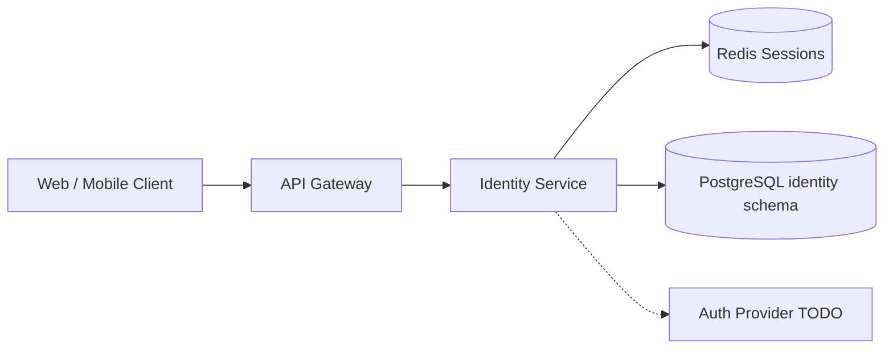

# Identity Service

> Authentication, users, roles, and session management — see [Founding Constitution](../../company/constitution.md)

**Status:** Active  
**Version:** 1.0  
**Last updated:** 2026-07-03  
**Owner:** Engineering

---

## Purpose

Manages user identity, authentication, authorization, and role assignments across Customer Marketplace, Creator OS, and Admin surfaces. Enforces the access matrix defined in [Information Architecture](../../pages/information-architecture.md#authentication--access-matrix).

Single `User` record supports multiple roles (customer + creator owner + admin). See [Authentication](../api/authentication.md) and [Core Entities — User](../data/core-entities.md#user).

`TODO(decision):` Auth provider selection (Auth0, Clerk, native) affects implementation.

---

## Architecture



### Internal components

| Component | Responsibility |
|-----------|----------------|
| **Auth Handler** | Login, signup, logout, password reset |
| **Session Manager** | Cookie and JWT lifecycle in Redis |
| **RBAC Engine** | Scope evaluation per request |
| **Profile Manager** | CustomerProfile CRUD, addresses, preferences |
| **Staff Membership** | Creator staff role assignments |
| **Account Lifecycle** | Deletion requests, anonymization jobs |

---

## Dependencies

| Dependency | Purpose |
|------------|---------|
| PostgreSQL | Users, profiles, roles, addresses |
| Redis | Session store, rate limit counters |
| Notification Service | Email verification, password reset emails |
| Auth provider | `TODO(decision):` Optional external IdP |
| Geocoding service | Address autocomplete (delegated) |

---

## Services

This service owns the `identity` schema. Downstream services receive authenticated user context via gateway JWT claims or internal service tokens — never query user passwords.

---

## Data Flow

### Login flow

1. Client `POST /api/v1/auth/login` with credentials
2. Identity validates password (or delegates to auth provider)
3. Load user, roles, creator context
4. Create session in Redis / issue JWT pair
5. Emit `user.logged_in` audit event
6. Return user payload + redirect URL

### Guest cart merge

On login/signup, Identity notifies Order Service to merge `session_id` cart into `customer_profile_id` cart — [Cart spec](../../pages/customer/cart.md).

---

## Key Endpoints

| Endpoint | Method | Description |
|----------|--------|-------------|
| `/api/v1/auth/signup` | POST | Customer or creator registration |
| `/api/v1/auth/login` | POST | Authenticate |
| `/api/v1/auth/logout` | POST | Invalidate session |
| `/api/v1/auth/session` | GET | Validate and return current user |
| `/api/v1/auth/verify-email` | POST | Confirm email |
| `/api/v1/auth/resend-verification` | POST | Resend confirmation |
| `/api/v1/auth/password-reset/*` | POST/GET | Password reset flow |
| `/api/v1/customers/me` | GET/PATCH | Customer profile |
| `/api/v1/customers/me/addresses/*` | CRUD | Saved addresses |
| `/api/v1/customers/me/preferences/*` | PATCH | Dietary and notification prefs |
| `/api/v1/customers/me/delete` | POST | Deletion request |

Full catalog: [Customer API](../api/customer-api.md), [Authentication](../api/authentication.md).

---

## Events

### Emitted

| Event | Consumers | Payload |
|-------|-----------|---------|
| `user.created` | Notification, Audit | `user_id`, `account_type` |
| `user.logged_in` | Audit | `user_id`, `ip_hash` |
| `user.login_failed` | Audit, alerting | `email_hash`, `ip_hash` |
| `user.email_verified` | Order Service (checkout gate) | `user_id` |
| `user.password_reset` | Audit | `user_id` |
| `user.deletion_requested` | All services (PII scrub schedule) | `user_id` |
| `customer.profile_updated` | Discovery (preference sync) | `user_id`, `preferences` |

### Consumed

| Event | Action |
|-------|--------|
| `creator.account.created` | Link creator owner role to user |
| `admin.user.suspended` | Set `account_status = suspended` |

---

## Failure Modes

| Failure | Impact | Mitigation |
|---------|--------|------------|
| Redis unavailable | No new sessions; existing JWT still valid until expiry | Redis HA cluster; fallback to stateless JWT-only mode (degraded) |
| Auth provider outage | Login/signup blocked for provider-linked accounts | Circuit breaker; native auth fallback if configured |
| Password hash mismatch spike | Possible credential stuffing | Rate limits; CAPTCHA trigger; alert on anomaly |
| Cart merge conflict | Duplicate cart lines | Order Service conflict resolution; user prompted in UI |
| Email delivery failure | Verification blocked | Retry queue via Notification Service; admin alert |

---

## Monitoring

| Metric | Alert threshold |
|--------|-----------------|
| Login success rate | < 95% over 5 min (exclude bad passwords) |
| Login latency p95 | > 500ms |
| Session store memory | > 80% capacity |
| Failed login rate per IP | > 50 / 15 min |
| Signup completion rate | Drop > 20% day-over-day |

Dashboards: auth funnel, session count, role distribution.

---

## Logging

Structured JSON logs with fields:

```
service=identity action=login user_id= uuid request_id= ip_hash= result=success|failure
```

- **INFO:** Successful auth, profile updates
- **WARN:** Failed login, rate limit hits
- **ERROR:** Database errors, auth provider failures
- **Never log:** Passwords, tokens, full email in production (use hashes)

Retention: 90 days operational; security events forwarded to SIEM.

---

## Security

| Control | Implementation |
|---------|----------------|
| Password policy | Min 8 chars; breach list check (HaveIBeenPwned API) |
| Session security | HttpOnly, Secure, SameSite=Lax cookies |
| JWT signing | RS256 with key rotation |
| Rate limiting | Per [API Overview](../api/api-overview.md) |
| Admin MFA | `TODO(decision):` Required for admin v1? |
| PII encryption | At rest via database encryption; addresses encrypted column optional |
| Audit | All auth events → [AuditLog](../data/core-entities.md#auditlog) |

RBAC matrix: [Authentication — RBAC](../api/authentication.md#rbac-permission-matrix).

---

## Testing

| Layer | Coverage |
|-------|----------|
| Unit | Password validation, scope evaluation, token parsing |
| Integration | Login flow, session expiry, cart merge trigger |
| E2E | Signup → verify email → login → access checkout |
| Security | Brute force rate limits, session fixation, CSRF |

---

## Scaling Strategy

- Stateless API workers behind load balancer
- Redis Cluster for session horizontal scale
- Read replicas for profile GET endpoints
- Cache user+roles in request context (short TTL) to reduce DB hits

---

## Disaster Recovery

| Target | RPO | RTO |
|--------|-----|-----|
| User data | 1 hour | 4 hours |
| Session data | Acceptable loss (re-login) | 1 hour |

Daily encrypted backups of `identity` schema. Session Redis persistence optional (AOF).

---

## Future Improvements

- Social login (Google, Apple)
- Passkeys / WebAuthn
- Admin MFA enforcement
- Device management and session revocation UI
- OAuth2 provider for third-party integrations

---

## Related Documents

- [Authentication](../api/authentication.md)
- [Customer API](../api/customer-api.md)
- [Core Entities — User](../data/core-entities.md#user)
- [Login page spec](../../pages/auth/login.md)
- [Account Settings page spec](../../pages/customer/account-settings.md)
