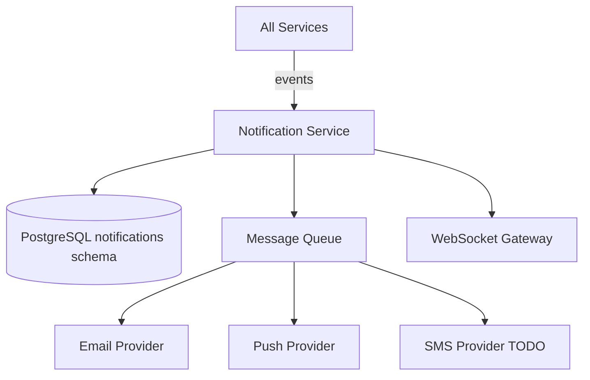

# Notification Service

> Email, push, SMS, and in-app messaging delivery — see [Founding Constitution](../../company/constitution.md)

**Status:** Active  
**Version:** 1.0  
**Last updated:** 2026-07-03  
**Owner:** Engineering

---

## Purpose

Delivers transactional and operational notifications across all Marketplate surfaces: order updates, verification decisions, moderation actions, abandoned checkout recovery, and creator-customer messaging. Respects user notification preferences from [CustomerProfile](../data/core-entities.md#customerprofile).

Creator-customer messaging threads are stored and served here; immutable after send per [Messages spec](../../pages/creator/messages.md).

---

## Architecture



### Internal components

| Component | Responsibility |
|-----------|----------------|
| **Template Engine** | Render notifications from templates + variables |
| **Preference Filter** | Apply user channel/category toggles |
| **Delivery Queue** | Async retry with exponential backoff |
| **Message Store** | Creator-customer thread persistence |
| **Realtime Pusher** | WebSocket message delivery |
| **Support Ticket Handler** | Help page support requests |

---

## Dependencies

| Dependency | Purpose |
|------------|---------|
| PostgreSQL | Messages, threads, delivery logs, support tickets |
| Message queue | Async delivery (SQS, Redis, or Kafka) |
| Email provider | SendGrid, SES, or Postmark |
| Push provider | FCM/APNs for mobile |
| WebSocket gateway | Realtime message and order notifications |
| Identity Service | User contact info, preferences |

---

## Services

Owns notification/message storage. Does not own order or verification business logic — reacts to events.

---

## Data Flow

### Order status notification

1. Order Service emits `order.status_changed`
2. Notification loads template `order.status_update`
3. Check customer preferences: push + email enabled for `order_updates`
4. Render with order context
5. Queue delivery jobs
6. Log delivery status; retry on failure (3 attempts)

### Creator message

1. Creator `POST /api/v1/creator/messages/threads/:id`
2. Store immutable message record
3. Push to customer via WebSocket (if connected)
4. Send push notification + email per customer preferences
5. Update thread preview and unread counts

### Abandoned checkout recovery

1. Order Service emits `checkout.abandoned` after 1h idle
2. Notification sends recovery email with checkout resume link (72h validity)
3. Track open/click for analytics

---

## Key Endpoints

### Creator messaging

| Endpoint | Description |
|----------|-------------|
| `/api/v1/creator/messages/threads` | Thread list |
| `/api/v1/creator/messages/threads/:id` | GET messages / POST send |
| `/api/v1/creator/messages/threads/:id/read` | Mark read |
| `/api/v1/creator/messages/unread-count` | Badge count |
| `/api/v1/creator/messages/quick-replies` | Templates |
| WebSocket `creator.{id}.messages` | Realtime inbound |

### Customer (future dedicated endpoints)

Customer messaging may be accessed via order detail context. v1: creator-initiated and order-linked threads.

### Support

| Endpoint | Description |
|----------|-------------|
| `/api/v1/support/tickets` | POST support request |

Page specs: [Messages](../../pages/creator/messages.md), [Help](../../pages/customer/help.md).

---

## Events

### Emitted

| Event | Consumers | Payload |
|-------|-----------|---------|
| `notification.delivered` | Analytics | `notification_id`, `channel`, `template` |
| `notification.failed` | Alerting | `notification_id`, `error` |
| `message.sent` | Order Service (optional link) | `thread_id`, `sender_id` |
| `support.ticket.created` | Admin (future ticketing) | `ticket_id`, `category` |

### Consumed

| Event | Notification action |
|-------|---------------------|
| `order.created` | Customer confirmation + creator new order alert |
| `order.status_changed` | Customer status update |
| `order.completed` | Review prompt |
| `verification.approved` | Creator approval notice |
| `verification.rejected` | Creator rejection with rationale |
| `verification.needs_information` | Creator action required |
| `compliance.expired` | Creator renewal reminder |
| `moderation.decided` | Affected party notification |
| `dispute.resolved` | Both parties outcome notice |
| `checkout.abandoned` | Recovery email (72h) |
| `payout.completed` | Creator payout notice |
| `user.email_verification` | Verification email (from Identity) |
| `user.password_reset` | Reset link email |

---

## Failure Modes

| Failure | Impact | Mitigation |
|---------|--------|------------|
| Email provider outage | Delayed notifications | Queue with retry; failover provider |
| Push token invalid | Push skipped | Mark token stale; continue email |
| Template render error | Notification dropped | Dead letter queue; alert |
| WebSocket disconnect | Message delayed | Client polls; push/email still sent |
| Preference load failure | Default to transactional ON | Fail open for critical (order confirm); fail closed for marketing |
| Message store write failure | Message lost | Return 500 to client; do not ack send |

---

## Monitoring

| Metric | Alert |
|--------|-------|
| Email delivery rate | < 98% |
| Push delivery rate | < 95% |
| Queue depth | > 10,000 |
| Delivery latency p95 | > 5 min |
| Bounce rate | > 5% |
| Unread message count sync errors | Any |

---

## Logging

```
service=notification action=delivered template=order.status_update channel=email recipient_hash= notification_id=
```

Message body not logged in production. Delivery attempts tracked in `notification_delivery_logs` table.

---

## Security

| Control | Implementation |
|---------|----------------|
| PII in transit | TLS for all provider APIs |
| Message immutability | No edit/delete API in v1 |
| Thread access | Creator scoped to own threads; customer to own orders |
| Support tickets | Rate limit; spam detection |
| Unsubscribe | Transactional emails include preferences link; marketing opt-out honored |
| Content filtering | Basic profanity/spam filter on messages (future ML) |

---

## Testing

| Layer | Coverage |
|-------|----------|
| Unit | Template rendering, preference filtering |
| Integration | Event → notification queued → mock provider |
| Integration | Message send → thread update → unread count |
| E2E | Order placed → confirmation email received (test inbox) |

---

## Scaling Strategy

- Delivery workers scale horizontally from queue depth
- Template compilation cached
- Thread list: indexed by `creator_id, updated_at DESC`
- Message pagination: cursor on `created_at`
- WebSocket: separate gateway service, Redis pubsub backplane

---

## Disaster Recovery

| Target | RPO | RTO |
|--------|-----|-----|
| Message history | 1 hour | 4 hours |
| Queued deliveries | Acceptable loss with retry from source events | 2 hours |

Critical transactional notifications can be replayed from domain events.

---

## Future Improvements

- Customer-facing messaging UI endpoints
- SMS for order-ready notifications
- In-app notification center
- Admin support ticket queue integration
- Read receipts
- Scheduled messages (availability change broadcasts)
- Localized templates per `TODO(decision):` launch locale

---

## Related Documents

- [Creator API — Messages](../api/creator-api.md#messages)
- [Customer API — Help](../api/customer-api.md#help--support)
- [Order Service](order-service.md)
- [Identity Service](identity-service.md)
- [Marketplace Mechanics — Status communication](../../product/marketplace-mechanics.md#fulfillment-invariants)
