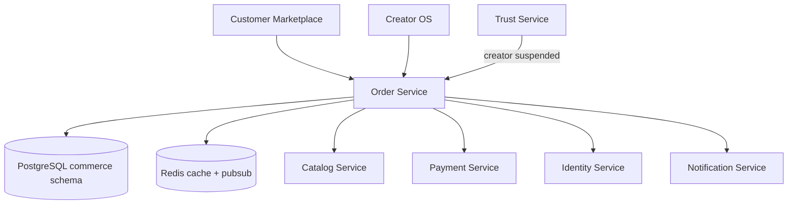

# Order Service

> Cart, checkout, order lifecycle, and fulfillment state — see [Founding Constitution](../../company/constitution.md)

**Status:** Active  
**Version:** 1.0  
**Last updated:** 2026-07-03  
**Owner:** Engineering

---

## Purpose

Manages the commerce transaction path: cart, checkout session, order creation, lifecycle state machine, and real-time status updates. Enforces [Order lifecycle](../../product/marketplace-mechanics.md#order-lifecycle), [single-creator cart](../../product/marketplace-mechanics.md#transactions), capacity at checkout, and allergen/policy acknowledgments.

Creator OS order queue and customer order tracking share the same order entity with asymmetric actions per surface — [Order Fulfillment Flow](../../pages/flows/order-fulfillment-flow.md).

---

## Architecture



### Internal components

| Component | Responsibility |
|-----------|----------------|
| **Cart Manager** | Session and customer carts, line CRUD, merge |
| **Checkout Session** | Multi-step state, 72h draft persistence |
| **Order Factory** | Place order orchestration |
| **Lifecycle Engine** | Validated state transitions |
| **Pricing Engine** | Subtotal, fees, tax estimates |
| **Realtime Hub** | WebSocket/SSE order updates |
| **Creator Queue** | Filtered order lists, next-action computation |

---

## Dependencies

| Dependency | Purpose |
|------------|---------|
| PostgreSQL | Carts, orders, order lines, events |
| Redis | Checkout session cache, realtime pubsub |
| Catalog Service | Availability, capacity, item snapshots |
| Payment Service | Authorization/capture on place order |
| Identity Service | Auth gate, customer profile, addresses |
| Notification Service | Order confirmations, status updates |
| Trust Service | Creator verification gate, allergen audit |

---

## Services

Owns `commerce` schema. Orchestrates cross-service transaction on place order — saga pattern with compensating actions on payment failure.

---

## Data Flow

### Place order (critical path)

1. Customer `POST /api/v1/checkout/orders` with Idempotency-Key
2. Validate cart, creator `accepting_orders`, fulfillment window, acknowledgments
3. Reserve capacity via Catalog Service (atomic)
4. Snapshot menu item data into order lines
5. Call Payment Service for authorization
6. On payment success: create Order, emit `order.created`, convert cart
7. On payment failure: release capacity, return error (no order created)
8. Notify creator via WebSocket + push notification
9. Return `order_id`, `confirmation_url`

Payment capture timing varies by fulfillment model — [Payment model](../../product/marketplace-mechanics.md#payment-model).

### Status transition

1. Creator `PATCH /api/v1/creator/orders/:id/status`
2. Lifecycle Engine validates transition (e.g., `confirmed → in_production`)
3. Append `order_events` row
4. Emit `order.status_changed`
5. Push to customer WebSocket; send notification

---

## Key Endpoints

### Customer

| Endpoint | Description |
|----------|-------------|
| `/api/v1/cart/*` | Cart CRUD, validate, reorder |
| `/api/v1/checkout/session` | Checkout state GET/PATCH |
| `/api/v1/checkout/fulfillment-options` | Available windows |
| `/api/v1/checkout/validate-delivery` | Zone validation |
| `/api/v1/checkout/orders` | Place order |
| `/api/v1/customers/me/orders/*` | Order history, detail, cancel, review |
| WebSocket `customer.{user_id}.orders.{order_id}` | Status updates |

### Creator

| Endpoint | Description |
|----------|-------------|
| `/api/v1/creator/orders` | Paginated queue |
| `/api/v1/creator/orders/next-action` | Primary action bar |
| `/api/v1/creator/orders/:id` | Order detail |
| `/api/v1/creator/orders/:id/status` | Lifecycle transition |
| `/api/v1/creator/orders/:id/cancel` | Creator cancel |
| `/api/v1/creator/dashboard/summary` | Aggregates (partial) |
| WebSocket `creator.{id}.orders` | Realtime queue |

Page specs: [Cart](../../pages/customer/cart.md), [Checkout](../../pages/customer/checkout.md), [Orders](../../pages/creator/orders.md).

---

## Events

### Emitted

| Event | Consumers | Payload |
|-------|-----------|---------|
| `cart.merged` | Analytics | `customer_id`, `lines_merged` |
| `cart.validated` | Analytics | `cart_id`, `validation_result` |
| `order.created` | Payment, Notification, Catalog (capacity confirm), Analytics | `order_id`, `creator_id`, `customer_id`, `total_cents` |
| `order.status_changed` | Notification, Analytics, Trust (metrics) | `order_id`, `from`, `to`, `actor` |
| `order.completed` | Trust (review eligibility), Payment (capture trigger), Analytics | `order_id` |
| `order.cancelled` | Payment (refund), Catalog (capacity release), Notification | `order_id`, `cancelled_by`, `reason` |
| `checkout.abandoned` | Analytics, Notification (recovery email) | `session_id`, `last_step` |

### Consumed

| Event | Action |
|-------|--------|
| `creator.suspended` | Block new orders; banner on active checkout |
| `payment.authorized` | Confirm order payment status |
| `payment.failed` | Abort order creation (in saga) |
| `payment.captured` | Update order payment state |
| `payment.refund_completed` | Set order status refunded |

---

## Failure Modes

| Failure | Impact | Mitigation |
|---------|--------|------------|
| Capacity race | Oversell | Pessimistic lock on capacity; checkout validation + submit re-check |
| Payment timeout | Order stuck in pending | Saga timeout → release capacity; idempotent retry safe |
| Idempotency key replay | Duplicate order prevented | Return original response |
| Idempotency key mismatch | 409 error | Client must use new key for changed request |
| WebSocket disconnect | Stale UI | Client polling fallback every 30s on order detail |
| Cart merge conflict | User chooses cart | Return both carts in 409 response |
| Creator closed mid-checkout | Block place order | Re-validate creator status at submit |

---

## Monitoring

| Metric | Alert |
|--------|-------|
| Checkout → order conversion | Drop > 15% hour-over-hour |
| Place order latency p95 | > 3s |
| Payment failure rate at checkout | > 10% |
| Capacity reservation failures | > 5% of attempts |
| Order status transition errors | > 1% |
| Time confirmed → in_production | SLA per creator segment |

---

## Logging

```
service=order action=order.created order_id= creator_id= customer_id= total_cents= idempotency_key=
```

Allergen acknowledgments logged in order record (not log stream PII). Order events append-only.

---

## Security

| Control | Implementation |
|---------|----------------|
| Auth gate | Checkout requires authenticated customer |
| Ownership | Customer orders scoped to `customer_profile_id` |
| Creator scoping | Creator orders scoped to `creator_id` |
| Idempotency | Required on place order |
| Allergen audit | `allergen_ack_at`, `allergy_restatement` stored immutably on order |
| Staff permissions | Cancel/refund owner-only |
| Unverified creator | Block at payment layer |

---

## Testing

| Layer | Coverage |
|-------|----------|
| Unit | Lifecycle transition matrix, pricing calculation |
| Unit | Cart single-creator enforcement |
| Integration | Place order saga (success + payment failure rollback) |
| Integration | Concurrent capacity reservation |
| Load | Checkout peak simulation |
| E2E | Cart → checkout → order → creator queue → customer tracking |

---

## Scaling Strategy

- Cart: Redis for active carts with PostgreSQL persistence
- Order queue: indexed queries; cursor pagination
- Realtime: Redis pubsub → WebSocket gateway horizontal scale
- Read replicas for order history
- Partition orders by `created_at` month at high volume

---

## Disaster Recovery

| Target | RPO | RTO |
|--------|-----|-----|
| Orders | 0 (sync replication for writes) | 2 hours |
| Carts | 1 hour (acceptable loss) | 2 hours |

Active orders during outage: queue notifications for replay on recovery.

---

## Future Improvements

- Multi-creator cart with grouped checkout
- Recurring orders (meal prep subscriptions)
- Batch production view API
- Delivery partner tracking integration
- Corporate/expense receipt field

---

## Related Documents

- [Customer API](../api/customer-api.md)
- [Creator API — Orders](../api/creator-api.md#orders)
- [Payment Service](payment-service.md)
- [Catalog Service](catalog-service.md)
- [Core Entities — Order](../data/core-entities.md#order)
- [Marketplace Mechanics — Order lifecycle](../../product/marketplace-mechanics.md#order-lifecycle)
