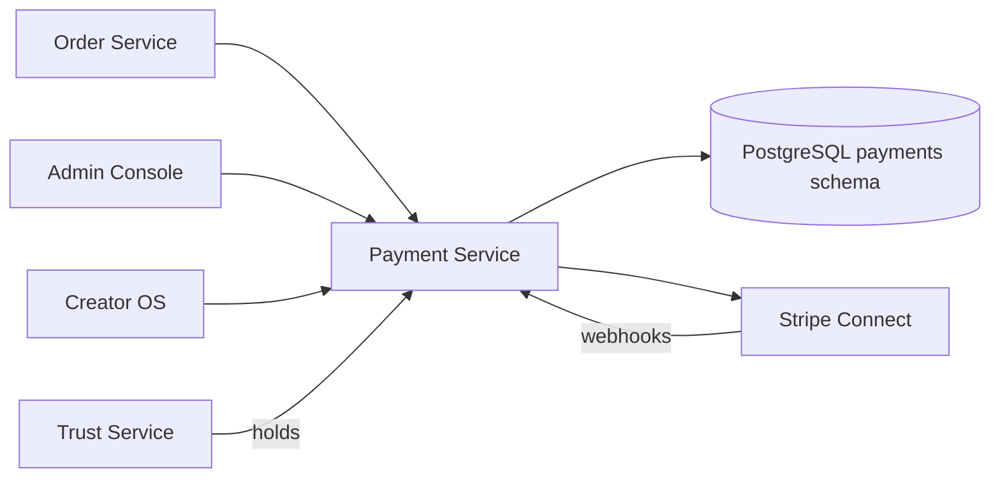

# Payment Service

> Payments, payouts, refunds, and Stripe Connect integration — see [Founding Constitution](../../company/constitution.md)

**Status:** Active  
**Version:** 1.0  
**Last updated:** 2026-07-03  
**Owner:** Engineering

---

## Purpose

Handles payment authorization, capture, refunds, creator payouts, and Connect account onboarding. Implements [Payment model](../../product/marketplace-mechanics.md#payment-model): creator as merchant of record, Marketplate as marketplace facilitator.

`TODO(decision):` Stripe Connect model — Standard vs Express accounts, commission structure, payout schedule.

`TODO(decision):` Payment capture timing per fulfillment model (immediate vs deposit + balance).

---

## Architecture



### Internal components

| Component | Responsibility |
|-----------|----------------|
| **Payment Processor** | PaymentIntent create, authorize, capture |
| **Connect Manager** | Account onboarding, dashboard links |
| **Payout Engine** | Period aggregation, transfer scheduling |
| **Refund Manager** | Full/partial refunds with idempotency |
| **Hold Manager** | Compliance and dispute payout holds |
| **Webhook Handler** | Stripe event processing |
| **Ledger** | Financial record keeping |

---

## Dependencies

| Dependency | Purpose |
|------------|---------|
| PostgreSQL | Payments, payouts, refunds, ledger |
| Stripe Connect | Payment processing, payouts, account onboarding |
| Order Service | Order context for payments |
| Trust Service | Dispute resolution triggers, compliance holds |
| Notification Service | Payout notifications, payment failure alerts |

---

## Services

Owns `payments` schema. Never stores raw card numbers — Stripe Elements tokenization only.

---

## Data Flow

### Checkout payment

1. Order Service calls Payment with order total, creator Connect account ID
2. Payment creates PaymentIntent with `application_fee_amount` (platform fee)
3. Customer confirms via Stripe Elements on client
4. Stripe webhook `payment_intent.succeeded` → status `authorized` or `captured`
5. Emit `payment.authorized` or `payment.captured` → Order Service updates order

### Dispute refund

1. Admin resolves dispute with `partial_refund` outcome
2. `POST /api/v1/admin/payments/refund` with Idempotency-Key = dispute ID
3. Payment creates Stripe refund against original charge
4. Update `Payment.refunded_cents`, create `Refund` record
5. Emit `payment.refund_completed` → Order, Trust, Payout adjustment

### Payout cycle

1. Scheduled job aggregates captured payments minus refunds for period
2. Apply platform fee per `TODO(decision):` commission structure
3. Check holds (compliance, disputes) → skip or reduce payout
4. Create Stripe transfer to creator Connect account
5. Emit `payout.completed` → Notification

---

## Key Endpoints

### Customer (via checkout)

| Endpoint | Description |
|----------|-------------|
| `/api/v1/customers/me/payment-methods` | GET saved cards |
| Payment handled via Stripe Elements | Client-side tokenization |

### Creator

| Endpoint | Description |
|----------|-------------|
| `/api/v1/creator/payouts/summary` | Balance, holds, next payout |
| `/api/v1/creator/payouts/period` | Current period breakdown |
| `/api/v1/creator/payouts/history` | Transfer history |
| `/api/v1/creator/payouts/history/:id` | Line items |
| `/api/v1/creator/payouts/account-link` | Stripe dashboard URL |
| `/api/v1/creator/payouts/account/onboard` | Start Connect onboarding |
| `/api/v1/creator/payouts/export` | CSV export |

### Admin

| Endpoint | Description |
|----------|-------------|
| `/api/v1/admin/payments/refund` | Execute refund (idempotent) |

### Internal webhooks

| Endpoint | Description |
|----------|-------------|
| `/internal/webhooks/stripe` | Stripe event receiver |

Page spec: [Payouts](../../pages/creator/payouts.md).

---

## Events

### Emitted

| Event | Consumers | Payload |
|-------|-----------|---------|
| `payment.authorized` | Order Service | `payment_id`, `order_id`, `amount_cents` |
| `payment.captured` | Order Service, Payout Engine | `payment_id`, `order_id` |
| `payment.failed` | Order Service (saga rollback) | `order_id`, `failure_code` |
| `payment.refund_completed` | Order, Trust, Payout | `payment_id`, `refund_cents`, `dispute_id` |
| `payout.scheduled` | Notification | `payout_id`, `creator_id`, `net_cents` |
| `payout.completed` | Notification, Analytics | `payout_id`, `creator_id` |
| `payout.held` | Notification | `payout_id`, `hold_reason` |
| `connect.onboarding_completed` | Creator cache | `creator_id`, `account_id` |

### Consumed

| Event | Action |
|-------|--------|
| `order.created` | Initiate payment flow (if not already in checkout saga) |
| `order.completed` | Trigger capture if authorize-then-capture model |
| `order.cancelled` | Refund if captured; void if authorized only |
| `dispute.resolved` | Execute refund per outcome |
| `compliance.expired` | Place payout hold |
| `creator.suspended` | Freeze payouts |

---

## Failure Modes

| Failure | Impact | Mitigation |
|---------|--------|------------|
| Stripe API timeout | Payment stuck pending | Idempotent retry; webhook reconciliation |
| Webhook delivery failure | Status desync | Stripe retry + manual reconciliation job |
| Partial refund failure | Dispute unresolved | Retry with idempotency; alert admin |
| Connect onboarding incomplete | Creator cannot receive payouts | Dashboard action item; block not orders |
| Double capture | Overcharge | Idempotency on capture; audit alert |
| Currency mismatch | Transaction rejected | Validate at order creation |
| Hold release race | Payout includes disputed funds | Transaction-level hold check before transfer |

---

## Monitoring

| Metric | Alert |
|--------|-------|
| Payment success rate | < 95% |
| Webhook processing lag | > 5 min |
| Refund failure rate | Any failure → investigate |
| Payout failure rate | > 0 |
| Connect account errors | Track by error code |
| Platform fee calculation drift | Reconciliation job mismatch |

Daily reconciliation: Stripe balance vs internal ledger.

---

## Logging

```
service=payment action=payment.captured payment_id= order_id= amount_cents= stripe_pi=pi_xxx
```

Never log card numbers, CVV, or full Stripe client secrets. Webhook payloads logged at DEBUG with PII redaction.

---

## Security

| Control | Implementation |
|---------|----------------|
| PCI scope | SAQ-A — Stripe Elements; no card data touches Marketplate servers |
| Webhook verification | Stripe signature validation |
| Idempotency | Required on refund and onboarding |
| Connect account isolation | Each creator has separate Connect account |
| Admin refunds | Scope check + audit rationale |
| Secrets | Stripe keys in vault; rotated quarterly |

Financial records immutable — no DELETE on payments/refunds tables.

---

## Testing

| Layer | Coverage |
|-------|----------|
| Unit | Fee calculation, hold logic, ledger entries |
| Integration | Stripe test mode PaymentIntent flow |
| Integration | Webhook processing (mock Stripe events) |
| Integration | Refund idempotency |
| Reconciliation | Daily ledger vs Stripe test dashboard |

Use Stripe test cards for decline scenarios in E2E.

---

## Scaling Strategy

- Webhook handler: horizontal workers with queue (SQS/Kafka)
- Payout job: batch processing off-peak
- Payment methods: Stripe Customer objects linked to `customer_profile_id`
- Read-heavy payout history: pagination + read replica

---

## Disaster Recovery

| Target | RPO | RTO |
|--------|-----|-----|
| Payment records | 0 | 2 hours |
| Stripe reconciliation | Replay from Stripe API | 4 hours |

Stripe remains source of truth for payment state — reconciliation job rebuilds local state if needed.

---

## Future Improvements

- Apple Pay / Google Pay
- Deposit + balance payment for catering
- Tip handling (creator-configurable)
- Multi-currency support
- Automated chargeback handling workflow
- Tax reporting (1099-K) automation

---

## Related Documents

- [Order Service](order-service.md)
- [Trust Service](trust-service.md)
- [Creator API — Payouts](../api/creator-api.md#payouts)
- [Admin API — Payments](../api/admin-api.md#payments-admin)
- [Core Entities — Payment](../data/core-entities.md#payment)
- [Marketplace Mechanics — Payment model](../../product/marketplace-mechanics.md#payment-model)
