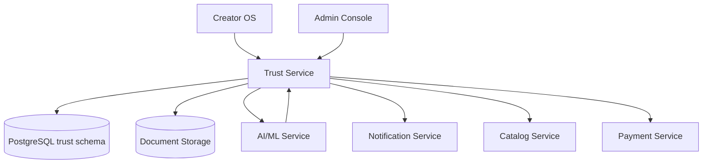

# Trust Service

> Verification, compliance, moderation, reviews, and disputes — see [Founding Constitution](../../company/constitution.md)

**Status:** Active  
**Version:** 1.0  
**Last updated:** 2026-07-03  
**Owner:** Engineering

---

## Purpose

Implements Marketplate's trust thesis: identity, kitchen, and compliance verification; review integrity; moderation; dispute resolution; and immutable audit trails. Governs [Trust Model](../../product/marketplace-mechanics.md#trust-model) and [Trust enforcement ladder](../../product/marketplace-mechanics.md#trust-enforcement-ladder).

**Invariant:** AI recommends; humans approve verification. No auto-approval — [Human approval on high stakes](../../product/marketplace-mechanics.md#marketplace-model-overview).

`TODO(decision):` Geographic compliance rules determine jurisdiction template library.

---

## Architecture



### Internal components

| Component | Responsibility |
|-----------|----------------|
| **Verification Manager** | Identity, kitchen, compliance submissions and status |
| **Review Queue** | Admin verification queue with SLA tracking |
| **Compliance Engine** | Jurisdiction rules, category restrictions, expiry |
| **Moderation Engine** | Content review, enforcement actions |
| **Dispute Manager** | Case lifecycle, resolution, refund triggers |
| **Review Manager** | Verified-purchase reviews, creator responses |
| **Audit Writer** | Append-only audit log emission |
| **Platform Settings** | Configurable thresholds with audit history |

---

## Dependencies

| Dependency | Purpose |
|------------|---------|
| PostgreSQL | Verification, reviews, disputes, audit |
| S3 | Verification document storage (presigned uploads) |
| AI/ML Service | Document extraction, mismatch flags (internal) |
| Notification Service | Creator status updates, moderation notices |
| Catalog Service | Listing eligibility on verification change |
| Payment Service | Payout holds, dispute refunds |
| Identity Service | User/creator context |

---

## Services

Owns `trust` schema. Publishes events that update `Creator.verification_status` and `Creator.accepting_orders` cache.

---

## Data Flow

### Verification approval

1. Creator submits via `/creators/me/verification/*/submit`
2. Trust creates `VerificationRecord` with status `in_review`
3. ML service processes documents → `ai_flags_json`
4. Item appears in admin queue
5. Operator approves with checklist → status `approved`
6. Trust updates creator verification timestamps
7. Emits `verification.approved` → Catalog enables listings; Payment releases holds
8. AuditLog entry with before/after state

### Compliance expiry

1. Scheduled job checks document expiration dates
2. Grace period from platform settings
3. Post-grace: emit `compliance.expired` → Catalog suspends listings
4. Notify creator via Notification Service

---

## Key Endpoints

### Creator-facing

| Endpoint | Description |
|----------|-------------|
| `/api/v1/creator/verification/status` | Three-layer summary |
| `/api/v1/creators/me/verification/identity/*` | Identity submission |
| `/api/v1/creators/me/verification/kitchen/*` | Kitchen submission |
| `/api/v1/creators/me/compliance/*` | Compliance documents |
| `/api/v1/creator/compliance/*` | Ongoing compliance management |
| `/api/v1/creator/reviews/*` | Review management |
| `/api/v1/creator/reviews/:id/flag` | Flag review for moderation |

### Admin-facing

| Endpoint | Description |
|----------|-------------|
| `/api/v1/admin/verification/queue` | Verification queue |
| `/api/v1/admin/verification/items/:id/*` | Approve/reject/request-info |
| `/api/v1/admin/moderation/*` | Moderation queue |
| `/api/v1/admin/disputes/*` | Dispute resolution |
| `/api/v1/admin/creators/:id/*` | Creator admin actions |
| `/api/v1/admin/settings/*` | Platform settings |

Full catalogs: [Creator API](../api/creator-api.md), [Admin API](../api/admin-api.md).

Page specs: [Verification Queue](../../pages/admin/verification-queue.md), [Compliance](../../pages/creator/compliance.md).

---

## Events

### Emitted

| Event | Consumers | Payload |
|-------|-----------|---------|
| `verification.submitted` | Admin queue, Notification | `record_id`, `type`, `creator_id` |
| `verification.approved` | Catalog, Creator cache, Notification | `record_id`, `type`, `creator_id` |
| `verification.rejected` | Notification | `record_id`, `rationale` |
| `verification.needs_information` | Notification | `record_id`, `message` |
| `compliance.expired` | Catalog, Payment (hold) | `creator_id`, `document_type` |
| `creator.suspended` | Order, Catalog, Payment | `creator_id`, `rationale` |
| `creator.reinstated` | Catalog, Payment | `creator_id` |
| `review.created` | Discovery (rating update), Notification | `review_id`, `creator_id`, `rating` |
| `review.flagged` | Admin moderation queue | `review_id`, `reason` |
| `moderation.decided` | Notification, Catalog | `entity_type`, `action` |
| `dispute.opened` | Admin queue, Notification | `dispute_id`, `order_id` |
| `dispute.resolved` | Payment (refund), Notification | `dispute_id`, `outcome`, `amount` |
| `audit.action` | AuditLog (internal) | Full audit payload |

### Consumed

| Event | Action |
|-------|--------|
| `order.completed` | Enable review eligibility window |
| `payment.refund_completed` | Update dispute status |
| `catalog.item.flagged` | Create moderation queue item |

---

## Failure Modes

| Failure | Impact | Mitigation |
|---------|--------|------------|
| Document upload failure | Creator cannot submit | Presigned URL retry; client retry with exponential backoff |
| ML service timeout | Verification proceeds without AI flags | Queue item with `ai_flags_pending`; operator manual review |
| Concurrent review conflict | Two operators on same item | Optimistic lock on `locked_by`; return 409 |
| Approve without checklist | Policy violation | Server-side validation; reject with `verification.checklist_incomplete` |
| Dispute refund failure | Case resolved but payment pending | Retry with idempotency; manual admin escalation alert |
| Audit write failure | **Critical** — block mutating action | Transaction rollback; alert P1 |

---

## Monitoring

| Metric | Alert |
|--------|-------|
| Verification queue age (median) | > SLA threshold from platform settings |
| Verification approval rate | Anomaly detection (possible rubber-stamping) |
| Compliance expirations pending | > 100 unprocessed |
| Dispute SLA breaches | Any urgent dispute past due |
| Moderation queue backlog | > 50 items |
| Audit write failures | Any occurrence → P1 |

---

## Logging

```
service=trust action=verification.approved actor_id= entity_id= record_id= ai_flags_dismissed=2
```

Document access (preview, download) logged for compliance. PII in logs restricted to internal audit systems.

---

## Security

| Control | Implementation |
|---------|----------------|
| Document access | Signed URLs with 15-min expiry; access logged |
| Admin separation of duties | Operators cannot review own test accounts |
| Rationale required | Reject, suspend, moderation actions |
| AI flags immutable | Dismissal requires operator note in audit |
| Immutable audit | [AuditLog](../data/core-entities.md#auditlog) — insert only |
| Encryption | Documents encrypted at rest (SSE-S3 or KMS) |

Hardcoded invariants enforced at API layer:
- `verification.human_approval_required: true`
- `reviews.pay_to_remove: false`

---

## Testing

| Layer | Coverage |
|-------|----------|
| Unit | Status transitions, checklist validation, jurisdiction rules |
| Integration | Submit → queue → approve → creator status update |
| Integration | Dispute resolve → refund idempotency |
| E2E | Creator onboarding verification flow |
| QA sampling | Approved items reviewed for false positives |

---

## Scaling Strategy

- Verification queue: indexed by `(status, sla_due_at)`
- Document processing: async ML pipeline via message queue
- Read-heavy review lists: cache creator rating aggregates
- Admin dashboard aggregates: materialized views refreshed every 5 min

---

## Disaster Recovery

| Target | RPO | RTO |
|--------|-----|-----|
| Verification records | 1 hour | 4 hours |
| Documents (S3) | 0 (versioned) | 1 hour |
| Audit logs | 0 | 4 hours |

Audit logs replicated to separate storage account with WORM policy.

---

## Future Improvements

- Third-party identity verification integration (Jumio, Persona)
- Side-by-side document comparison UI support
- Queue assignment and workload balancing
- Bulk compliance expiration review
- Automated jurisdiction rule updates from legal ops

---

## Related Documents

- [Admin API](../api/admin-api.md)
- [Creator API — Compliance](../api/creator-api.md#compliance--verification)
- [Core Entities — VerificationRecord](../data/core-entities.md#verificationrecord)
- [Marketplace Mechanics — Trust Model](../../product/marketplace-mechanics.md#trust-model)
- [Trust Verification Flow](../../pages/flows/trust-verification-flow.md)
