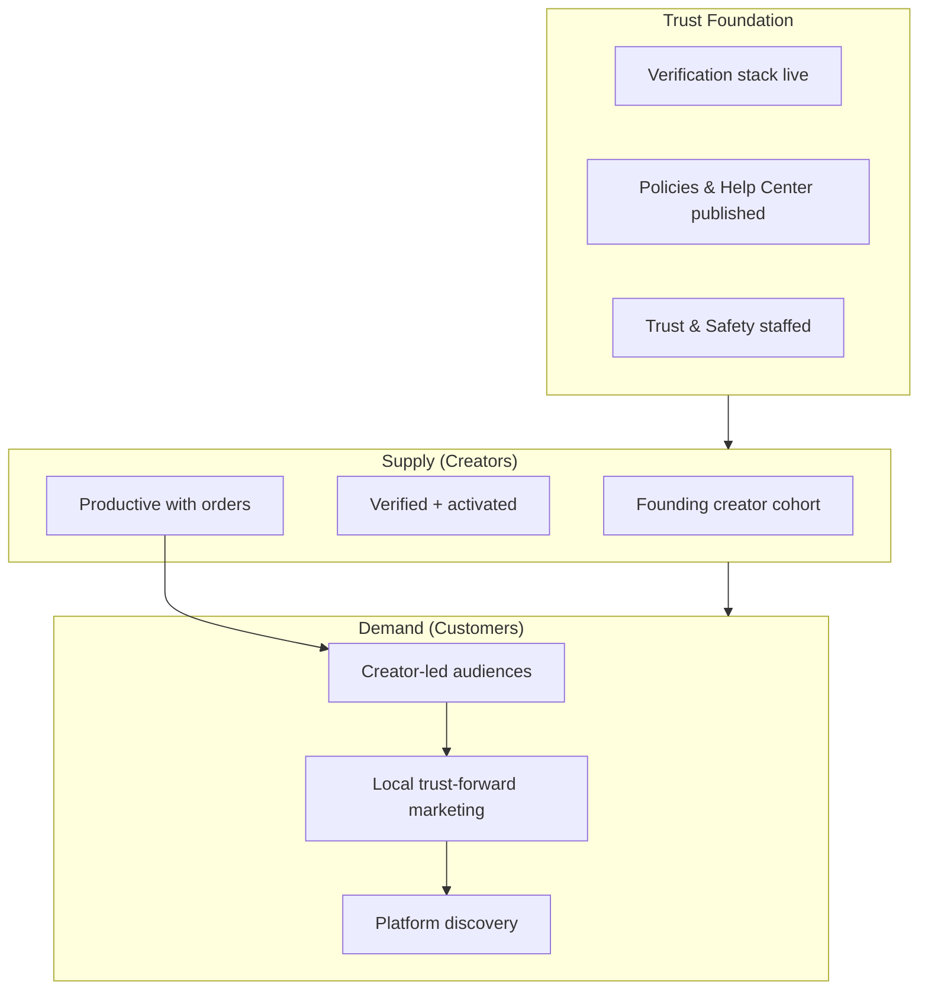

# Go-to-Market Strategy

> Launch market strategy, supply vs. demand sequencing, and trust-first GTM for Phase 1 marketplace launch.

**Status:** Active  
**Version:** 1.0  
**Last updated:** 2026-07-03  
**Owner:** Growth · Product · Founders

---

## Purpose

This document defines **how Marketplate enters its founding market** and achieves marketplace liquidity. It is the strategic layer above channel tactics ([Acquisition Channels](acquisition-channels.md)), brand execution ([Brand Marketing](brand-marketing.md)), and launch checklists ([Launch Plan](launch-plan.md)).

GTM at Marketplate is not a traditional blitz-scale customer acquisition play. We are building a **two-sided trusted marketplace** where supply quality gates demand marketing. The goal of Phase 1 is to validate real transactions — see [Company Phases — Phase 1](../roadmap/company-phases.md#phase-1--marketplace-launch).

---

## Strategic Frame

### Category we are entering

Marketplate creates **verified creator infrastructure for independent food entrepreneurs** — not food delivery. Every GTM conversation must reframe away from delivery-app comparisons.

→ Positioning: [Positioning Statement](../brand/positioning.md#positioning-statement)  
→ Competitive frame: [Positioning — Competitive Frame](../brand/positioning.md#competitive-frame)

### Phase 1 GTM goal

| Goal | Definition | Success signal |
|------|------------|----------------|
| **Validate real transactions** | Verified creators completing orders with repeat customers | Verified GMV growth with trust guardrails intact |
| **Prove trust model** | Customers buy because of verification, not discounts | High checkout completion; low trust-related support volume |
| **Establish creator OS adoption** | Creators run operations on-platform, not just list | Retention, catalog depth, share-link usage |
| **Build local liquidity** | Sufficient supply and demand density in launch geography | Browse → order conversion; median time to first order |

**Ship criteria (from company phases):** Verified GMV, creator retention, trust incident rate near zero, help deflection working.

→ Metrics: [Success Metrics Overview](../product/success-metrics-overview.md)

### What Phase 1 GTM is not

| Anti-goal | Why |
|-----------|-----|
| National launch day with empty cities | Liquidity requires geographic density |
| Discount-led customer blitz | Attracts price shoppers, not trust-seeking buyers |
| Unverified supply to inflate catalog | Violates platform invariants — see [Executive Summary](../docs/internal/executive-summary.md#solution) |
| Restaurant aggregator positioning | Wrong category, wrong unit economics |
| Growth tactics that erode trust | Fake urgency, hidden fees, verification theater |

---

## Trust-First GTM Thesis

Trust is not a marketing tagline — it is the **sequencing constraint** for every GTM decision.

### Trust-first rules

| Rule | GTM implication |
|------|-----------------|
| Unverified creators cannot accept paid orders | No "list now, verify later" campaigns |
| Customers see trust-relevant information before payment | Marketing claims must match checkout experience |
| Creators are merchant of record | Platform marketing celebrates creator brands, not anonymous listings |
| AI recommends; humans approve | No AI-generated trust claims in ads without human review |
| When trust and growth conflict, choose trust | Documented in [Founding Constitution](../company/constitution.md) |

→ Trust product model: [Marketplace Mechanics — Trust Model](../product/marketplace-mechanics.md#trust-model)  
→ Brand expression: [Brand Strategy — Trust-Forward Positioning](../brand/brand-strategy.md#trust-forward-positioning)

---

## Supply vs. Demand Sequencing

Marketplace GTM fails when demand arrives before supply. Marketplate sequences **verified supply first**, then **creator-led demand**, then **platform demand generation**.

### Sequencing model

| Phase | Primary motion | Secondary motion | Gate to next phase |
|-------|----------------|------------------|-------------------|
| **0 — Pre-launch** | Founding creator recruitment; verification pipeline | Waitlist for customers (no broad ads) | Trust stack operational; jurisdiction configured |
| **1 — Supply build** | Verify and activate founding creator cohort | Creator share-link enablement | Minimum verified supply threshold met |
| **2 — Soft launch** | Creator-led customer acquisition (share links, social) | Targeted local awareness; no mass paid | First orders completing; completion rate ≥ target |
| **3 — Public launch** | Platform discovery marketing; PR; collections | Paid channels with CAC guardrails | Liquidity metrics stable 4+ weeks |

### Why supply first

| Reason | Detail |
|--------|--------|
| **Empty discovery kills conversion** | Customer who browses and finds 3 listings in one category churns permanently |
| **Verification takes time** | Identity + kitchen + compliance is days to weeks — pipeline must start early |
| **Creator quality sets brand** | First 50 creators define market perception |
| **Creator audiences are warm demand** | Creators bring existing customers — lowest CAC, highest trust |
| **Trust incidents are irreversible at launch** | One bad early experience becomes the market story |

→ Supply activation: [Customer Lifecycle — Creator](../docs/customer-success/customer-lifecycle.md#creator-lifecycle)  
→ Liquidity mechanics: [Marketplace Mechanics — Liquidity](../product/marketplace-mechanics.md#liquidity)

### Demand sequencing detail

| Demand source | When to activate | Trust alignment |
|---------------|------------------|-----------------|
| **Creator share links** | Soft launch (Phase 2) | Highest — customer knows creator; verification visible on storefront |
| **Creator social posts** | Soft launch | Creator brand forward; platform recedes |
| **Email to creator waitlists** | Soft launch | Only after creator has live catalog |
| **Local SEO / content** | Soft launch → public | "Verified local food" positioning — not discount keywords |
| **Marketplate Collections** | Public launch | Editorial curation with trust gates — see [Company Phases — Collections](../roadmap/company-phases.md#marketplate-collections) |
| **Paid social / search** | Public launch | CAC-capped; trust-forward creative only |
| **PR / press** | Public launch | Supply stories ready; verification proof points |

**Never:** Run broad "order food near you" paid campaigns before minimum supply density exists.

---

## Launch Market Selection

`TODO(decision):` **Geographic launch market** — first city/region for Phase 1 launch.

Until resolved, all GTM documents use **"[Launch Market]"** as a placeholder. Every checklist, supply target, and campaign plan must be revisited once the founding market is decided via ADR in [`decisions/`](../decisions/).

### Selection criteria (recommended framework)

| Criterion | Weight | Rationale |
|-----------|--------|-----------|
| **Regulatory clarity** | High | Cottage food laws, licensing paths, category restrictions — Legal assessment required |
| **Creator supply density** | High | Existing independent food businesses, commercial kitchens, culinary schools |
| **Trust-seeking customer base** | High | Health-conscious households, local food culture, farmers market participation |
| **Competitive whitespace** | Medium | Delivery apps weak on cottage/home-based creators |
| **Operational feasibility** | High | Trust ops staffing, verification SLAs, support coverage |
| **Founder/market knowledge** | Medium | Credibility with creator community; local partnerships |
| **Media ecosystem** | Low–Medium | Local food press, community organizations |

### Recommended market boundary

Define launch geography at **MSA or defined metro cluster** — not state-wide on day one. Density beats breadth.

→ Expansion playbook (subsequent markets): [Launching a New Market](../docs/playbooks/launching-new-market.md)

### Launch market placeholders

| Parameter | Placeholder until ADR | Owner |
|-----------|----------------------|-------|
| Launch market name | `[Launch Market]` | Founders |
| Minimum verified supply at soft launch | 25 creators across 3+ categories | Growth + CS |
| Minimum verified supply at public launch | 50 creators across 5+ categories | Growth + CS |
| Target customer radius | TBD — discovery geo-index | Product + Engineering |
| Local partnership targets | TBD — commercial kitchens, cottage food associations | Growth |

---

## Founding Creator Strategy

The founding creator cohort defines market quality. Recruitment is **selective, not open floodgates**.

### Ideal founding creator profile

| Attribute | Target |
|-----------|--------|
| **Verification readiness** | Willing and able to complete identity + kitchen + compliance |
| **Existing audience** | Even small — brings warm demand at soft launch |
| **Operational maturity** | Can fulfill orders reliably; not learning food safety on-platform |
| **Brand quality** | Photography, story, menu presentation align with premium positioning |
| **Persona diversity** | Mix across [Personas](../product/personas.md) — not all bakers or all meal prep |
| **Geographic spread** | Coverage across launch market zones for discovery |

### Founding creator tiers

| Tier | Count (indicative) | Role |
|------|-------------------|------|
| **Signature creators** | 5–10 | Co-marketing, launch stories, Collections features |
| **Core cohort** | 15–25 | Soft launch supply density |
| **Expansion cohort** | 25+ | Public launch catalog breadth |

### Founding creator value exchange

| We offer | They offer |
|----------|------------|
| Early access + dedicated onboarding | Complete verification promptly |
| Launch co-marketing (with approval) | High-quality storefront and catalog |
| Feedback channel to product | Reliable fulfillment during launch window |
| Founding creator recognition (non-pay-to-win) | Bring existing customers via share links |

**Guardrail:** Founding benefits must not include ranking boosts that bypass trust gates — see [Discovery Ranking](../ai/discovery-ranking.md).

→ Onboarding: [Creator Onboarding](../docs/onboarding/) · [Launching a Creator](../docs/playbooks/launching-a-creator.md)

---

## Customer GTM Strategy

### Primary persona

[End Customer (Trust-Seeking Buyer)](../product/personas.md#end-customer-trust-seeking-buyer) — optimizes for confidence, not cheapest delivery.

### Messaging hierarchy

Use [Positioning — Messaging Hierarchy](../brand/positioning.md#messaging-hierarchy):

1. **Trust** — Verified creators, transparent operations
2. **Creator** — Real people, real kitchens, real craft
3. **Quality** — Premium experience, not discount marketplace
4. **Simplicity** — Calm checkout, clear tracking
5. **Community** — Local relationships, repeat customers

### Customer acquisition philosophy

| Approach | Rationale |
|----------|-----------|
| **Creator-led first** | Customers trust the creator; platform provides verification layer |
| **Education over promotion** | Explain verification value; reduce anonymous-seller anxiety |
| **Repeat over reach** | First-order experience drives retention — CS owns post-purchase |
| **Local over national** | Geo-targeted until liquidity proven |

→ Buyer lifecycle: [Customer Lifecycle — Buyer](../docs/customer-success/customer-lifecycle.md#buyer-lifecycle)  
→ Channels: [Acquisition Channels](acquisition-channels.md)

---

## Liquidity Model

Marketplace liquidity = verified supply density × active demand × conversion quality.

### Phase 1 liquidity targets (internal)

Targets apply to `[Launch Market]` — adjust after geographic ADR.

| Metric | Soft launch gate | Public launch gate | Steady state (Month 6+) |
|--------|------------------|--------------------|-----------------------|
| Verified creators with live listings | ≥25 | ≥50 | ↑ month-over-month |
| Categories represented | ≥3 | ≥5 | Broaden with demand |
| Median browse → storefront view | — | Baseline established | ↑ |
| Registered → first order rate (30-day) | Track | ≥15% (calibrate) | ↑ |
| Repeat purchase rate (30-day) | Track | ≥25% (calibrate) | ↑ |
| Order completion rate | ≥95% | ≥98% | ≥98% |
| Creator-attributed first orders | ≥50% of first orders | ≥40% | Monitor organic mix |

**Liquidity crisis signals:** Browse with <10 relevant results; median time-to-first-order >21 days for activated creators; completion rate <95%.

→ CS monitoring: [Success Metrics — Trust Guardrails](../docs/customer-success/success-metrics.md#trust-guardrails-cs-accountability)

---

## GTM × Value Proposition Alignment

Map GTM messaging to [Value Propositions](../product/value-props.md) by audience and stage:

| Stage | Creator — lead with | Customer — lead with |
|-------|---------------------|----------------------|
| Awareness | Trust — verification credibility | Trust — verified creators only |
| Consideration | Software — OS replaces patchwork | Software — calm, premium experience |
| Conversion | Economics — transparent fees *(when decided)* | Community — connection to local makers |
| Retention | Community — reviews compound | Trust — confidence to reorder |

---

## Competitive GTM Response

| Competitor motion | Our response |
|-------------------|--------------|
| Delivery app discount blitz in market | Do not match on price; reframe to trust and creator relationship |
| Generic marketplace "anyone can sell" | Emphasize verification gates as feature, not friction |
| Social-only selling (Instagram) | Position integrated commerce + verification + operations |
| "Free to list" race to bottom | Lead with value (OS + trust), not zero fees |

→ Competitive detail: [Value Propositions — Competitive Differentiation](../product/value-props.md#competitive-differentiation-product-lens) · [Research](../research/) *(Phase 5)*

---

## GTM Governance

| Decision | Approver | Documentation |
|----------|----------|---------------|
| Launch market selection | Founders | ADR in `decisions/` |
| Public launch go/no-go | Founders + Growth + CS + Trust | Launch review meeting |
| Trust-claim marketing copy | Marketing + Trust review | Pre-publish checklist |
| Paid channel spend > threshold | Growth lead + Finance | Weekly channel review |
| Founding creator acceptance | Growth + CS + Trust | Cohort roster |
| Discount or promotion | Growth + Product + Trust | Must pass dark-pattern review |

**Crisis rule:** If trust incident rate spikes during GTM push, pause demand campaigns and diagnose — do not increase spend.

---

## Phase 1 Timeline (Indicative)

Aligned with [Company Phases — Phase 1](../roadmap/company-phases.md#phase-1--marketplace-launch) (Months 0–18). Exact dates depend on build readiness and launch market ADR.

| Window | GTM focus |
|--------|-----------|
| **Months −6 to −3** | Pre-launch: founding creator recruitment, waitlist, brand assets, jurisdiction config |
| **Months −3 to 0** | Supply build: verify founding cohort, activate storefronts, internal dogfood |
| **Month 0** | Soft launch: creator-led demand, limited geography, monitor completion rate |
| **Months 1–3** | Public launch: PR, collections, measured paid, liquidity optimization |
| **Months 3–12** | Density: expand supply, persona-specific acquisition, retention focus |
| **Months 12–18** | Phase 1 validation: retention, Verified GMV, trust metrics → Phase 2 readiness |

→ Detailed checklists: [Launch Plan](launch-plan.md)  
→ Build dependencies: [Build Readiness](../roadmap/build-readiness.md)

---

## Related Documents

- [Growth README](README.md)
- [Acquisition Channels](acquisition-channels.md)
- [Brand Marketing](brand-marketing.md)
- [Launch Plan](launch-plan.md)
- [Company Phases — Phase 1](../roadmap/company-phases.md#phase-1--marketplace-launch)
- [Executive Summary](../docs/internal/executive-summary.md)
- [Value Propositions](../product/value-props.md)
- [Positioning](../brand/positioning.md)
- [Brand Strategy](../brand/brand-strategy.md)
- [Customer Success](../docs/customer-success/)
- [Launching a New Market](../docs/playbooks/launching-new-market.md)
- [Success Metrics Overview](../product/success-metrics-overview.md)
