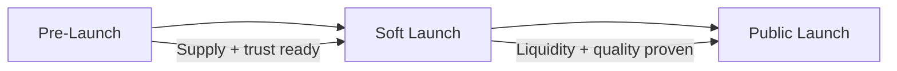
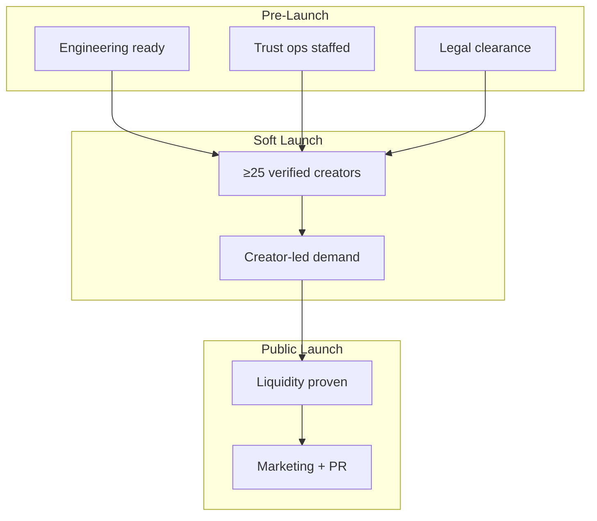

# Launch Plan

> Pre-launch, soft launch, and public launch checklists aligned with Company Phase 1 — Marketplace (Launch).

**Status:** Active  
**Version:** 1.0  
**Last updated:** 2026-07-03  
**Owner:** Growth · Product · Cross-functional launch team

---

## Purpose

This document is the **operational launch playbook** for Phase 1 marketplace go-live. It translates [Go-to-Market Strategy](go-to-market-strategy.md) into sequenced checklists with go/no-go gates, cross-functional owners, and metric thresholds.

Launch is not a single date — it is three phases: **pre-launch** (supply and infrastructure), **soft launch** (creator-led demand in controlled geography), and **public launch** (platform marketing and PR). Each phase has explicit exit criteria before the next begins.

**Launch geography:** `TODO(decision):` Geographic launch market — all checklists use `[Launch Market]` until ADR resolved. See [Go-to-Market Strategy — Launch Market Selection](go-to-market-strategy.md#launch-market-selection).

---

## Launch Overview

| Phase | Duration (indicative) | Primary goal | Demand marketing |
|-------|----------------------|--------------|------------------|
| **Pre-launch** | 8–12 weeks | Verified supply pipeline; platform ready | Waitlist only — no broad ads |
| **Soft launch** | 4–8 weeks | First real orders; creator-led demand | Creator share links + targeted local |
| **Public launch** | Ongoing from go-live | Marketplace liquidity; brand awareness | Full channel mix with CAC guardrails |

→ Company context: [Company Phases — Phase 1](../roadmap/company-phases.md#phase-1--marketplace-launch)  
→ Build dependencies: [Build Readiness](../roadmap/build-readiness.md)

---

## Launch Team

| Role | Team | Phase 1 responsibility |
|------|------|------------------------|
| **Launch Lead** | Growth / Product | End-to-end orchestration, go/no-go decisions |
| **Engineering Lead** | Engineering | Platform stability, feature flags, monitoring |
| **Trust & Safety Lead** | Trust | Verification SLAs, incident response, claim review |
| **Creator Success Lead** | CS | Supply activation, founding cohort support |
| **Customer Experience Lead** | CS | Buyer education, post-order satisfaction |
| **Marketing Lead** | Marketing | Campaigns, content, PR, brand assets |
| **Support Lead** | Support | Staffing, macros, Help Center readiness |
| **Legal Counsel** | Legal | Jurisdiction, terms, campaign claims |
| **Finance** | Finance | Payment/payout config, budget approval |
| **Founder / Executive Sponsor** | Leadership | Final go/no-go, launch market ADR |

→ Subsequent market expansion: [Launching a New Market](../docs/playbooks/launching-new-market.md)

---

## Pre-Launch Checklist

**Goal:** Platform operational in `[Launch Market]` with founding creator pipeline verified and activated. No broad customer marketing.

### Product & engineering

| # | Item | Owner | Status |
|---|------|-------|--------|
| P1 | Core order loop tested end-to-end (browse → checkout → fulfillment → payout) | Engineering | ☐ |
| P2 | Verification flow operational (identity + kitchen + compliance) | Engineering + Trust | ☐ |
| P3 | Trust gates block unverified paid checkout | Engineering + Trust | ☐ |
| P4 | Creator storefront + share links live (`creator.marketplate.app`) | Engineering | ☐ |
| P5 | Discovery geo-index configured for `[Launch Market]` | Engineering | ☐ |
| P6 | Jurisdiction compliance template configured for launch market | Trust + Engineering | ☐ |
| P7 | Stripe Connect payouts configured for region | Finance + Engineering | ☐ |
| P8 | Admin dashboard + support dashboard operational | Engineering | ☐ |
| P9 | AI systems in human-gated mode (no auto-approve verification) | AI Platform | ☐ |
| P10 | Monitoring and alerting for order, payment, trust paths | Engineering | ☐ |
| P11 | Feature flags for soft launch geography | Engineering | ☐ |
| P12 | Load testing on critical paths completed | Engineering | ☐ |

→ Specs: [Pages](../pages/) · [Architecture](../engineering/architecture-overview.md)

### Trust & safety

| # | Item | Owner | Status |
|---|------|-------|--------|
| T1 | Verification review queue staffed with SLA targets | Trust | ☐ |
| T2 | Moderation queue staffed | Trust | ☐ |
| T3 | Dispute resolution process documented and staffed | Trust + Support | ☐ |
| T4 | Food safety incident playbook ready | Trust + Ops | ☐ |
| T5 | Refund processing SOP tested | Ops + Support | ☐ |
| T6 | Trust & Safety onboarding complete for operators | Trust | ☐ |
| T7 | All marketing trust claims reviewed and approved | Trust + Marketing | ☐ |

→ SOPs: [Marketplace Launch Ops SOP](../operations/marketplace-launch-ops-sop.md) · [operations/](../operations/) · [Trust Verification Flow](../pages/flows/trust-verification-flow.md)

### Supply (creators)

| # | Item | Owner | Status |
|---|------|-------|--------|
| S1 | Founding creator cohort identified (target: 25–50) | Growth + CS | ☐ |
| S2 | Founding creator agreements / consent for co-marketing | Growth + Legal | ☐ |
| S3 | ≥15 creators verified before soft launch gate | CS + Trust | ☐ |
| S4 | Persona diversity across cohort (≥3 persona types) | Growth | ☐ |
| S5 | Creator onboarding materials distributed | CS | ☐ |
| S6 | Creator marketing asset kit available in dashboard | Marketing + Product | ☐ |
| S7 | Commercial kitchen or association partnership signed (≥1) | Growth | ☐ |
| S8 | Creator Success touchpoint calendar active | CS | ☐ |

→ Onboarding: [docs/onboarding/](../docs/onboarding/) · [Launching a Creator](../docs/playbooks/launching-a-creator.md)

### Operations & support

| # | Item | Owner | Status |
|---|------|-------|--------|
| O1 | Help Center published (minimum 22 articles) | Support + Product | ☐ |
| O2 | Launch market-specific Help articles (cottage food, verification) | Support + Legal | ☐ |
| O3 | Support playbook and macro library ready | Support | ☐ |
| O4 | Support staffing plan for launch window | Support | ☐ |
| O5 | Escalation paths tested (Trust, CS, Engineering) | Support | ☐ |
| O6 | CS lifecycle email sequences configured | CS | ☐ |

→ Help Center: [docs/help-center/](../docs/help-center/) · [Support Playbook](../support/support-playbook.md)

### Marketing & brand (pre-launch scope)

| # | Item | Owner | Status |
|---|------|-------|--------|
| M1 | Brand assets finalized (logo, colors, templates) | Brand + Design | ☐ |
| M2 | Launch market landing page / waitlist live | Marketing + Product | ☐ |
| M3 | Creator-facing content published (verification guides) | Marketing | ☐ |
| M4 | Founding creator recruitment campaign executed | Growth | ☐ |
| M5 | Customer waitlist collecting (no broad paid ads) | Marketing | ☐ |
| M6 | Social profiles created and brand-compliant | Marketing | ☐ |
| M7 | PR briefing materials prepared (embargoed) | Marketing | ☐ |
| M8 | Dark pattern pre-publish checklist adopted | Marketing | ☐ |

→ Brand: [brand/](../brand/) · Guardrails: [Brand Marketing — Guardrails](brand-marketing.md#marketing-guardrails)

### Legal & finance

| # | Item | Owner | Status |
|---|------|-------|--------|
| L1 | Terms of service and privacy policy published | Legal | ☐ |
| L2 | Launch market regulatory assessment complete | Legal | ☐ |
| L3 | Creator merchant agreement finalized | Legal | ☐ |
| L4 | Launch budget approved | Finance + Founders | ☐ |
| L5 | `TODO(decision):` Fee/commission structure decided or launch blocked for creator economics messaging | Finance + Founders | ☐ |

### Pre-launch go/no-go gate

**Required to proceed to soft launch:**

| Criterion | Threshold |
|-----------|-----------|
| End-to-end order loop | Passing in staging and production |
| Verified creators ready | ≥15 with ≥10 live listings |
| Trust ops staffed | Verification SLA achievable at projected volume |
| Help Center | Published and accurate for launch market |
| Support | Staffed for launch window |
| No P0 open bugs | On order, payment, or verification paths |
| Executive sponsor approval | Documented |

**Decision:** ☐ Go ☐ No-go ☐ Go with conditions — Date: ___________

---

## Soft Launch Checklist

**Goal:** Real orders flowing through creator-led demand. Validate fulfillment quality before broad marketing.

**Geography:** `[Launch Market]` — feature-flagged; no out-of-market paid acquisition.

### Activation

| # | Item | Owner | Status |
|---|------|-------|--------|
| A1 | Verified creator count ≥25 with live listings | CS | ☐ |
| A2 | Categories represented ≥3 | CS + Product | ☐ |
| A3 | All founding creators have shared storefront link at least once | CS | ☐ |
| A4 | Creator share links and QR codes tested | Engineering + CS | ☐ |
| A5 | First Collection drafted (not yet public) | Marketing + Product | ☐ |
| A6 | Buyer waitlist notified of soft availability (creator-driven framing) | Marketing | ☐ |
| A7 | CS creator touchpoints active (day 7, day 14 activation) | CS | ☐ |

### Demand (creator-led only)

| # | Item | Owner | Status |
|---|------|-------|--------|
| D1 | No broad paid customer campaigns active | Growth | ☐ |
| D2 | Creator social promotion coordinated (launch week) | Marketing + CS | ☐ |
| D3 | Creator marketing asset kit distributed | Marketing | ☐ |
| D4 | Attribution tracking verified (share link → order) | Engineering + Analytics | ☐ |
| D5 | Local SEO pages indexed for `[Launch Market]` | Marketing | ☐ |

→ Channels: [Acquisition Channels — Soft launch mix](acquisition-channels.md#channel-mix-by-launch-phase)

### Monitoring (daily during soft launch)

| Metric | Target | Action if missed |
|--------|--------|------------------|
| Order completion rate | ≥95% | Pause demand; creator coaching |
| Trust incident rate | Near zero | Pause demand; Trust investigation |
| Median time to first order (activated creators) | ≤21 days | CS outreach; share-link coaching |
| CSAT (post-order) | ≥4.0 | Support audit; creator coaching |
| Verification queue backlog | Within SLA | Trust staffing adjustment |
| Platform error rate | Within SLO | Engineering triage |

→ Metrics: [Success Metrics](../docs/customer-success/success-metrics.md) · [Trust Guardrails](../docs/customer-success/success-metrics.md#trust-guardrails-cs-accountability)

### Soft launch duration

Minimum **4 weeks** of stable operations before public launch gate — unless executive override with documented risk acceptance.

### Soft launch go/no-go gate (public launch)

**Required to proceed to public launch:**

| Criterion | Threshold |
|-----------|-----------|
| Verified creators with listings | ≥50 |
| Categories represented | ≥5 |
| Completed orders | ≥100 (calibrate for market size) |
| Order completion rate | ≥98% for 2 consecutive weeks |
| Trust incident rate | Near zero; no unresolved P0 incidents |
| CSAT average | ≥4.2 |
| Creator-attributed first orders | ≥40% of total first orders |
| Repeat purchase rate (30-day) | Baseline established; ≥20% (calibrate) |
| Support ticket volume | Manageable within staffing plan |
| Public launch campaigns | Approved; trust claims reviewed |
| Executive sponsor approval | Documented |

**Decision:** ☐ Go ☐ No-go ☐ Go with conditions — Date: ___________

---

## Public Launch Checklist

**Goal:** Marketplace liquidity with full channel mix. Brand presence in `[Launch Market]`.

### Marketing activation

| # | Item | Owner | Status |
|---|------|-------|--------|
| PL1 | Press release distributed (local + target trade) | Marketing | ☐ |
| PL2 | First Marketplate Collection published | Marketing + Product | ☐ |
| PL3 | Creator spotlight campaign live | Marketing | ☐ |
| PL4 | Buyer newsletter launched | Marketing | ☐ |
| PL5 | Paid channels activated per CAC guardrails | Growth | ☐ |
| PL6 | PR interviews scheduled (founder + creators) | Marketing | ☐ |
| PL7 | Social launch content calendar executing | Marketing | ☐ |
| PL8 | Community event or partnership activation (≥1) | Growth | ☐ |

→ Campaigns: [Brand Marketing](brand-marketing.md) · [Collections](brand-marketing.md#marketplate-collections)

### Product surfaces

| # | Item | Owner | Status |
|---|------|-------|--------|
| PS1 | Browse and search returning robust results for `[Launch Market]` | Product + Engineering | ☐ |
| PS2 | Collections visible on browse / home | Product | ☐ |
| PS3 | Verification badges visible on all discovery surfaces | Product | ☐ |
| PS4 | Customer registration and checkout flow optimized | Product | ☐ |
| PS5 | Review prompts active post-order | Product | ☐ |
| PS6 | Favorites and follow chefs enabled | Product | ☐ |

→ Phase 1 scope: [Company Phases — Phase 1 Buyer](../roadmap/company-phases.md#buyer)

### Operations scale

| # | Item | Owner | Status |
|---|------|-------|--------|
| OP1 | Support staffing scaled for projected ticket volume | Support | ☐ |
| OP2 | Trust ops scaled for verification volume | Trust | ☐ |
| OP3 | CS at-risk monitoring active (day-14 creator outreach) | CS | ☐ |
| OP4 | Weekly launch review meeting scheduled | Launch Lead | ☐ |
| OP5 | Incident comms template ready | Marketing + Trust | ☐ |

### Public launch week runbook

| Day | Activity | Owner |
|-----|----------|-------|
| **−7** | Final go/no-go review; all gates confirmed | Launch Lead |
| **−3** | Embargoed press previews; creator final prep | Marketing + CS |
| **−1** | Engineering freeze on critical paths; monitoring heightened | Engineering |
| **0** | Press release; Collection live; social activation; paid campaigns start | Marketing + Growth |
| **0–3** | Hourly monitoring: orders, errors, trust incidents, support queue | Engineering + Trust + Support |
| **+1** | Day-1 retrospective: metrics, incidents, creator feedback | Launch team |
| **+7** | Week-1 review: liquidity, CAC, completion rate, CSAT | Launch Lead |
| **+30** | Month-1 review: Phase 1 progress vs. targets | Leadership |

---

## Phase 1 Success Criteria

Aligned with [Company Phases — Phase 1 ship criteria](../roadmap/company-phases.md#phase-1--marketplace-launch):

| Criterion | Definition | Target (Month 6–12) |
|-----------|------------|---------------------|
| **Verified GMV** | Completed orders from verified creators | ↑ month-over-month |
| **Creator retention** | Monthly active creators returning | ≥70% (calibrate) |
| **Trust incident rate** | Confirmed incidents per 1,000 orders | Near zero |
| **Help deflection** | Self-serve resolution rate | ≥60% |
| **Repeat customer rate** | 30-day repeat purchase | ≥25% (calibrate) |
| **Order completion rate** | Completed / confirmed | ≥98% |

**Phase 1 validation** (Months 12–18): Sustained metrics above → readiness for [Phase 2 — Native Mobile](../roadmap/company-phases.md#phase-2--native-mobile).

→ North star: [Success Metrics Overview](../product/success-metrics-overview.md)

---

## Launch Risk Register

| Risk | Likelihood | Impact | Mitigation |
|------|------------|--------|------------|
| Insufficient verified supply at soft launch | Medium | High | Extend pre-launch; do not proceed to demand marketing |
| Trust incident during launch window | Low | Critical | Pause campaigns; Trust response; incident comms |
| Verification backlog delays creator activation | Medium | High | Trust staffing surge; clear SLA communication |
| Low creator share-link adoption | Medium | Medium | CS coaching; marketing asset kit; founding creator incentives |
| Empty discovery (low catalog density) | Medium | High | Delay public launch; recruit supply |
| Platform instability under load | Low | High | Load testing; gradual rollout; feature flags |
| Regulatory challenge in launch market | Low | Critical | Legal pre-clearance; jurisdiction config |
| Competitor discount blitz | Medium | Medium | Do not match on price; trust reframe |
| Fee/pricing undecided blocks creator messaging | Medium | Medium | Resolve ADR before public launch |

---

## Communication Plan

### Internal

| Audience | Channel | Cadence during launch |
|----------|---------|----------------------|
| Launch team | Slack / standup | Daily (soft launch week); weekly (after) |
| Full company | Email / all-hands | Pre-launch, soft launch, public launch milestones |
| Board / advisors | Email summary | Public launch + Month 1 |

### External

| Audience | Message | Channel |
|----------|---------|---------|
| Creators (founding cohort) | Launch timeline, expectations, support contacts | Email + creator community |
| Creators (pipeline) | Verification status, launch date | Email |
| Customer waitlist | Soft launch availability (creator-driven) | Email |
| Press | Launch story (embargo → release) | PR |
| Public | Verified local food in `[Launch Market]` | PR, social, paid |

**Crisis comms:** Trust incident → pause marketing → Trust lead + Founder statement → creator/buyer notification per [Trust & Safety Escalation](../docs/playbooks/trust-safety-escalation.md).

---

## Post-Launch Operating Rhythm

| Cadence | Meeting | Participants | Focus |
|---------|---------|--------------|-------|
| Daily (Week 1) | Launch standup | Launch team | Orders, incidents, blockers |
| Weekly | Growth + CS review | Growth, CS, Product, Trust | Activation, retention, liquidity |
| Weekly | Channel review | Growth, Finance | CAC, spend, channel quality |
| Monthly | Executive launch review | Leadership | Verified GMV, Phase 1 progress |
| Quarterly | Persona + market review | Cross-functional | Persona metrics, launch market health |

→ CS cadence: [Success Metrics — Reporting](../docs/customer-success/success-metrics.md#reporting-cadence)

---

## Cross-Functional Dependency Map

---

## Open Decisions

| Decision | Launch impact |
|----------|---------------|
| `TODO(decision):` Geographic launch market | All geography-specific checklist items |
| `TODO(decision):` Commission / fee structure | Creator economics messaging; public launch gate L5 |
| `TODO(decision):` Soft launch exact date | Dependent on build readiness + supply |
| `TODO(decision):` Public launch exact date | Dependent on soft launch metrics |

Track in [`decisions/`](../decisions/).

---

## Related Documents

- [Growth README](README.md)
- [Go-to-Market Strategy](go-to-market-strategy.md)
- [Acquisition Channels](acquisition-channels.md)
- [Brand Marketing](brand-marketing.md)
- [Company Phases — Phase 1](../roadmap/company-phases.md#phase-1--marketplace-launch)
- [Build Readiness](../roadmap/build-readiness.md)
- [Launching a New Market](../docs/playbooks/launching-new-market.md)
- [Customer Lifecycle](../docs/customer-success/customer-lifecycle.md)
- [Success Metrics](../docs/customer-success/success-metrics.md)
- [Executive Summary](../docs/internal/executive-summary.md)
- [Phased Rollout — Phase 5](../roadmap/phased-rollout.md#phase-5--launch)
