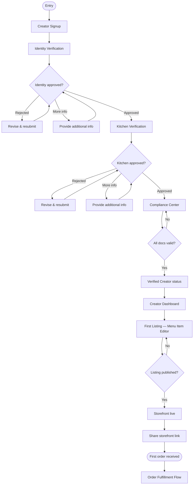

# Creator Onboarding Flow

> End-to-end journey from signup through first order — the primary supply-side activation funnel.

**Status:** Active  
**Version:** 1.0  
**Last updated:** 2026-07-03  
**Owner:** UX & Information Architecture

---

## Purpose

This document maps how independent food creators **join Marketplate, earn verified status, publish their first listing, and receive their first order**. Onboarding is a trust gate — not a signup form. Unverified creators cannot accept paid orders.

**Primary persona:** [Independent Chef](../../product/personas.md#independent-chef)  
**Secondary personas:** [Cottage Food Operator](../../product/personas.md#cottage-food-operator), [Baker](../../product/personas.md#baker), [Commercial Kitchen Operator](../../product/personas.md#commercial-kitchen-operator)

Governing rules: [Marketplace Mechanics — Trust Model](../../product/marketplace-mechanics.md#trust-model) · [Verified to sell](../../product/marketplace-mechanics.md#marketplace-model-overview)

---

## Flow Summary

```
Signup → Identity verification → Kitchen verification → Compliance → First listing → First order
```

| Phase | Gate | Blocker if incomplete |
|-------|------|----------------------|
| Signup | Account created | Cannot begin verification |
| Identity | Human-approved identity | Cannot submit kitchen docs |
| Kitchen | Human-approved kitchen | Cannot publish paid listings |
| Compliance | Jurisdiction docs valid | Listings suspended |
| First listing | Published catalog item | No discovery presence |
| First order | Operational readiness | Activation incomplete |

---

## Flow Diagram



Internal review path: [Trust Verification Flow](trust-verification-flow.md)

---

## Phase 1 — Creator Signup

**Page:** [Creator Signup](../information-architecture.md) (`/creator/signup`)

### Entry points

| Source | Context |
|--------|---------|
| Marketing landing | "Start your verified storefront" CTA |
| Existing customer account | "Become a creator" in account menu |
| Referral from commercial kitchen partner | Pre-linked kitchen ID (future) |

### User provides

- Email and password (or SSO)
- Legal name and business name (if applicable)
- Business type: sole proprietor, LLC, partnership
- Storefront slug (validated for uniqueness)
- Jurisdiction (state/locality — drives compliance rules)
- Creator category: chef, baker, meal prep, food truck, cottage food, caterer, pop-up, other

### System actions

- Create creator profile linked to auth account
- Initialize compliance checklist for jurisdiction
- Set verification status: `identity_not_started`
- Redirect → Identity Verification

### UX requirements

- Progress indicator shows step 1 of 5
- Plain-language explanation of verification requirement — no surprise gates later
- Slug preview of public URL: `marketplate.com/creators/your-slug`

→ Page spec: `pages/auth/creator-signup`  
→ Existing customer: [Navigation Model — Role Switching](../navigation-model.md#role-switching-creator-who-is-also-customer)

---

## Phase 2 — Identity Verification

**Page:** [Identity Verification](../information-architecture.md) (`/creator/verify/identity`)

### Purpose

Confirm creator is a real, accountable operator. Customers see "Verified Creator" only after approval.

### Required submissions

| Document / data | Entity type |
|-----------------|-------------|
| Government-issued photo ID | All |
| Selfie / liveness check | All |
| Business registration | LLC, partnership |
| EIN / tax identity | All (where applicable) |
| Phone verification | All |

### User experience

1. Guided upload with document type examples
2. Real-time quality checks (blur, glare) before submit
3. Review estimated timeline: "Our team will review within 2 business days."
4. Submit → status `identity_in_review`

### Status states

| Status | Creator sees | Can proceed to kitchen? |
|--------|--------------|------------------------|
| `not_started` | Upload prompts | No |
| `in_review` | Waiting message + submitted date | No |
| `action_required` | Specific deficiency list | Yes — revise |
| `approved` | Success confirmation | Yes |
| `rejected` | Reason + appeal path | Revise only |

### AI assist

Document extraction and mismatch flagging — **human approves** final status per [AI Philosophy](../../company/constitution.md#ai-philosophy).

→ Page spec: `pages/auth/identity-verification`  
→ Internal review: [Trust Verification Flow](trust-verification-flow.md)

---

## Phase 3 — Kitchen Verification

**Page:** [Kitchen Verification](../information-architecture.md) (`/creator/verify/kitchen`)

### Purpose

Confirm where food is produced. Every SKU must link to a verified production location.

### Kitchen type selection

| Type | Typical persona | Additional requirements |
|------|-----------------|----------------------|
| Home / cottage kitchen | Cottage Food Operator | Cottage food registration |
| Commercial shared kitchen | Independent Chef, Meal Prep | Facility linkage or invite code |
| Dedicated commercial facility | Meal Prep, Baker | Inspection records |
| Commissary (food truck) | Food Truck Operator | Commissary agreement + unit ID |
| Multi-tenant bay | Commercial Kitchen tenant | Kitchen admin verification link |

### Required submissions

- Production address (validated)
- Facility photos (prep area, storage, handwashing)
- Inspection records where available
- Facility registration / license
- For mobile: unit photos, commissary linkage

### Multi-tenant path

Commercial kitchens verified once at facility level. Tenants link to pre-verified kitchen — reduced per-tenant friction. See [Commercial Kitchen Operator](../../product/personas.md#commercial-kitchen-operator).

### Status states

Same pattern as identity: `not_started` → `in_review` → `approved` / `action_required` / `rejected`

### Navigation

- Locked until identity `approved`
- Progress indicator step 3 of 5
- Back to identity (read-only) for reference

→ Page spec: `pages/auth/kitchen-verification`

---

## Phase 4 — Compliance Center

**Pages:** [Compliance Center (onboarding)](../information-architecture.md) (`/creator/compliance`) · post-verification: `/dashboard/compliance`

### Purpose

Jurisdiction-specific licenses, permits, and food safety documents. Platform enforces category restrictions (e.g., cottage food prohibited items).

### Checklist structure

```
Identity          ✓ Complete (from Phase 2)
Kitchen           ✓ Complete (from Phase 3)
Food handler cert [ Upload ]
Business license  [ Upload ]
Cottage food reg  [ Upload — if applicable ]
Liability insurance [ Upload — if required ]
Allergen training [ Upload — optional ]
```

### System behaviors

| Behavior | Detail |
|----------|--------|
| Expiration tracking | Proactive reminders at 30/14/7 days |
| Grace period | Defined in policy — expired doc suspends listings after grace |
| Category enforcement | Blocked SKUs for cottage food where prohibited |
| Sales cap tracking | Cottage food jurisdictions with caps — warn at 80%, block at 100% |

### Completion gate

All required documents for jurisdiction uploaded and approved → **Verified Creator** status granted.

### Creator notification

"You are verified. Publish your first listing to go live." → Dashboard with first-listing prompt.

→ Page spec: `pages/auth/compliance-center` (onboarding) · `pages/creator/compliance` (ongoing)

---

## Phase 5 — Creator Dashboard (Activation Hub)

**Page:** [Dashboard](../information-architecture.md) (`/dashboard`)

### First-login experience (verified, no listings)

| Zone | Content |
|------|---------|
| Welcome banner | "You're verified. Let's publish your first item." |
| Activation checklist | Profile photo · First listing · Availability · Share link |
| Verification pill | Green — "Verified Creator" |
| Empty orders | "No orders yet. Share your storefront link to get started." |

### Activation checklist items

1. **Complete storefront profile** → Storefront Settings
2. **Add first menu item** → Menu Item Editor
3. **Set availability** → Availability
4. **Share storefront** → Copy link + share sheet

Checklist persists until all items complete; then collapses to standard dashboard.

→ Page spec: `pages/creator/dashboard`

---

## Phase 6 — First Listing

**Pages:** [Catalog](../information-architecture.md) (`/dashboard/catalog`) · [Menu Item Editor](../information-architecture.md) (`/dashboard/catalog/items/:itemId/edit`)

### Purpose

Publish the first discoverable, purchasable item. Listing cannot go live without verified kitchen linkage.

### Required fields (minimum viable listing)

| Field | Trust rationale |
|-------|-----------------|
| Name and description | Discovery and clarity |
| Price | Commerce transparency |
| Photography | Quality and authenticity |
| Ingredients | Customer trust |
| Allergens | Safety — mandatory |
| Production location | Verified kitchen linkage |
| Fulfillment method | Pickup/delivery/event |
| Lead time / availability | Capacity integrity |

### Publish flow

1. Create item in Catalog → opens Menu Item Editor
2. Complete required fields — inline validation
3. Preview customer view
4. **Publish** (primary CTA)
5. Confirmation → item live on storefront

### Draft mode

Creators can save drafts before verification complete. Publish button disabled until verified — with explanation tooltip.

### Post-publish

- Storefront URL active in discovery (subject to minimum profile completeness)
- Dashboard checklist marks "First listing" complete
- Prompt to set availability if not configured

→ Page specs: `pages/creator/catalog`, `pages/creator/menu-item-editor`  
→ Public surface: [Creator Storefront](../information-architecture.md) (`/creators/:slug`)

---

## Phase 7 — Availability & Storefront Settings

**Pages:** [Availability](../information-architecture.md) (`/dashboard/availability`) · [Storefront Settings](../information-architecture.md) (`/dashboard/storefront`)

### Availability

Configure before first order strongly recommended:

- Operating hours and blackout dates
- Pickup windows or delivery zones
- Capacity limits per window/day
- Lead times for custom items

System blocks checkout for customers if no valid fulfillment window exists.

### Storefront settings

- Profile photo and cover image
- Creator story
- Public slug (change triggers redirect policy)
- Fulfillment summary for customers

→ Page specs: `pages/creator/availability`, `pages/creator/storefront-settings`

---

## Phase 8 — Share & First Order

### Share storefront

| Channel | Action |
|---------|--------|
| Copy link | `marketplate.com/creators/:slug` |
| Share sheet | Native OS share on mobile |
| QR code | Generated in dashboard (future) |

### First order arrival

1. Push notification + dashboard badge on Orders
2. Creator lands on [Order Detail](../information-architecture.md) (`/dashboard/orders/:orderId`)
3. Guided first-order tooltip: Confirm → Produce → Ready → Complete
4. Activation checklist marks complete after first order fulfilled

→ Fulfillment: [Order Fulfillment Flow](order-fulfillment-flow.md)  
→ Customer mirror: [Customer Purchase Flow](customer-purchase-flow.md)

---

## Onboarding States Summary

| State | Customer-visible | Can publish | Can accept orders |
|-------|------------------|-------------|-------------------|
| Signed up | No | Draft only | No |
| Identity in review | No | Draft only | No |
| Kitchen in review | No | Draft only | No |
| Compliance pending | No | Draft only | No |
| Verified, no listings | Storefront empty/minimal | Yes | Yes (nothing to buy) |
| Verified, published | Full storefront | Yes | Yes |
| Suspended | Storefront hidden | No | No |

---

## Persona-Specific Variations

| Persona | Onboarding difference |
|---------|------------------------|
| Cottage Food Operator | Enhanced compliance checklist; category restrictions enforced in editor |
| Food Truck Operator | Commissary linkage + unit ID; availability emphasizes location schedule |
| Commercial Kitchen tenant | Kitchen verification via facility link — skip redundant facility upload |
| Baker | Lead time configuration prompted during first listing |
| Meal Prep Business | Batch capacity setup prompted post-first-listing |
| Caterer | v1 uses standard listing; catering inquiry flow future phase |

---

## Navigation & Progress

- **Minimal Auth Shell** during Phases 1–4 — see [Navigation Model](../navigation-model.md)
- **Step indicator** in header: Account → Identity → Kitchen → Compliance → First listing
- **Verification pill** appears in Creator Shell from first dashboard visit
- Incomplete onboarding redirects operational pages to earliest incomplete step

---

## Notifications

| Event | Channel | Copy tone |
|-------|---------|-----------|
| Submission received | Email | Precise timeline |
| Action required | Email + in-app | Specific deficiency |
| Approved | Email + in-app | Warm confirmation + next step |
| Rejected | Email + in-app | Clear reason + appeal |
| First order | Push + email | Action-oriented |

→ [Voice and Tone — Customer Support](../../brand/voice-and-tone.md#customer-support)

---

## Metrics

| Metric | Definition |
|--------|------------|
| Signup → identity submit | Time and completion rate |
| Identity approval rate | Approved / submitted |
| Time to verified | Signup → verified status |
| Verified → first listing | Days to publish |
| First listing → first order | Activation velocity |
| Verification abandonment | Drop-off by step |

→ [Creator Metrics](../../product/success-metrics-overview.md#creator-metrics) · [Trust Metrics](../../product/success-metrics-overview.md#trust-metrics)

---

## Page & Spec Index

| Phase | Path | Spec folder |
|-------|------|-------------|
| Creator Signup | `/creator/signup` | `auth/creator-signup` |
| Identity Verification | `/creator/verify/identity` | `auth/identity-verification` |
| Kitchen Verification | `/creator/verify/kitchen` | `auth/kitchen-verification` |
| Compliance Center | `/creator/compliance` | `auth/compliance-center` |
| Dashboard | `/dashboard` | `creator/dashboard` |
| Catalog | `/dashboard/catalog` | `creator/catalog` |
| Menu Item Editor | `/dashboard/catalog/items/:itemId/edit` | `creator/menu-item-editor` |
| Availability | `/dashboard/availability` | `creator/availability` |
| Storefront Settings | `/dashboard/storefront` | `creator/storefront-settings` |
| Compliance (ongoing) | `/dashboard/compliance` | `creator/compliance` |
| Orders | `/dashboard/orders` | `creator/orders` |
| Order Detail | `/dashboard/orders/:orderId` | `creator/order-detail` |

---

## Related Documents

- [Information Architecture](../information-architecture.md)
- [Navigation Model](../navigation-model.md)
- [Trust Verification Flow](trust-verification-flow.md)
- [Order Fulfillment Flow](order-fulfillment-flow.md)
- [Customer Purchase Flow](customer-purchase-flow.md)
- [Product Overview](../../product/overview.md)
- [Personas](../../product/personas.md)
- [Marketplace Mechanics](../../product/marketplace-mechanics.md)
- [Founding Constitution](../../company/constitution.md)
- [Design System Principles](../../design-system/principles.md)
- [Voice and Tone](../../brand/voice-and-tone.md)
- [Pages README](../README.md)
