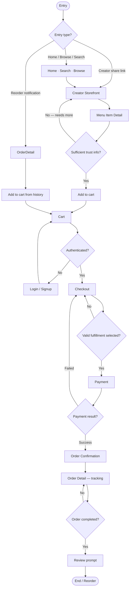

# Customer Purchase Flow

> End-to-end journey from discovery through review — the primary demand-side funnel on Marketplate.

**Status:** Active  
**Version:** 1.0  
**Last updated:** 2026-07-03  
**Owner:** UX & Information Architecture

---

## Purpose

This document maps the **complete customer purchase journey** across pages, decision points, trust surfaces, and system states. It connects discovery (pillar: Discovery) with transparent commerce (pillar: Commerce) and post-purchase accountability (pillar: Trust + Operations).

Page-level layouts belong in individual page specs under `pages/customer/`. Transaction rules: [Marketplace Mechanics — Transactions](../../product/marketplace-mechanics.md#transactions).

**Primary persona:** [End Customer (Trust-Seeking Buyer)](../../product/personas.md#end-customer-trust-seeking-buyer)

---

## Flow Summary

```
Discovery → Evaluate → Add to cart → Checkout → Confirmation → Track → Review
```

| Phase | Goal | Success signal |
|-------|------|----------------|
| Discovery | Find verified creators matching needs | Storefront visit |
| Evaluation | Trust the creator and item | Item added to cart |
| Checkout | Complete purchase with full transparency | Payment authorized |
| Post-purchase | Receive order with clear status | Order completed |
| Retention | Build repeat relationship | Review submitted or reorder |

---

## Flow Diagram



---

## Phase 1 — Discovery

**Pages:** [Home](../information-architecture.md) (`/`) · [Search](../information-architecture.md) (`/search`) · [Browse](../information-architecture.md) (`/browse`)

### Entry points

| Source | Landing | Nav context |
|--------|---------|-------------|
| Direct / SEO | Home | Customer shell, bottom nav |
| Search engine (creator) | Creator Storefront | Skip discovery |
| Referral / share link | Creator Storefront or Item Detail | Deep link |
| Return visit | Home or Order History | Personalized modules |

### User actions

1. Browse curated collections or enter search query
2. Apply filters: dietary, allergen exclusion, fulfillment type, distance
3. Scan result cards for trust signals (verification badge, rating, fulfillment type)
4. Tap creator card → Creator Storefront

### Trust surfaces (non-negotiable)

- Verification badge on every creator card — unverified creators do not appear in results per [Ranking principles](../../product/marketplace-mechanics.md#ranking-principles)
- Rating summary and review count
- Fulfillment type icon (pickup, delivery, catering, event)
- Real photography — no stock imagery

### Exit criteria

User selects a creator worth evaluating further → **Creator Storefront**

### Analytics events

`discovery_view`, `search_submit`, `filter_apply`, `creator_card_click`

---

## Phase 2 — Creator Storefront

**Page:** [Creator Storefront](../information-architecture.md) (`/creators/:slug`)

### Purpose

Primary conversion surface — customer answers: *Who made this? Can I trust them? What can I order?*

### Layout zones

| Zone | Content |
|------|---------|
| Hero | Creator photo, name, verification badges, rating |
| Story | Creator narrative, production location summary |
| Catalog | Menu items grouped by category |
| Reviews | Aggregate + recent reviews |
| Policies | Cancellation, lead times, fulfillment summary |

### User actions

1. Read creator story and verification details
2. Browse catalog; filter by dietary tags
3. Tap menu item → Menu Item Detail
4. Optionally switch tabs: Menu · About · Reviews

### Trust surfaces

- Identity verification badge with tooltip detail
- Kitchen / production location transparency
- Compliance indicators (cottage food, commercial kitchen, etc.)
- Verified purchase reviews only

### Navigation

- Back → discovery source (search results or browse) with state preserved
- Cart FAB visible when items added

→ Page spec: `pages/customer/creator-storefront`

---

## Phase 3 — Menu Item Detail

**Page:** [Menu Item Detail](../information-architecture.md) (`/creators/:slug/items/:itemId`)

### Purpose

Informed purchase decision before cart — allergens, ingredients, fulfillment, and lead time visible **before** add-to-cart.

### User actions

1. Review photos, description, price
2. Read ingredients and allergen list (expanded by default — not collapsed)
3. Select variants (size, add-ons, dietary modifications)
4. Choose quantity respecting capacity limits
5. Tap **Add to order** (primary CTA)

### Trust surfaces

- Full allergen disclosure with checkout acknowledgment flag for flagged allergens
- Production location linked to verified kitchen
- Lead time and availability window
- Sold-out state when capacity exhausted — no silent backorder

### System rules

- Cannot add to cart if creator is not accepting orders (unverified, suspended, or closed)
- Capacity enforced at add-to-cart where possible; final enforcement at checkout
- Custom items (cakes, catering) may route to inquiry flow — future phase; v1 uses standard add-to-cart with lead time

### Navigation

- Back → Creator Storefront (scroll restored)
- Breadcrumb: Home / Creator name / Item name

→ Page spec: `pages/customer/menu-item-detail`  
→ Design: [Trust in Design — Allergen info](../../design-system/principles.md#trust-in-design)

---

## Phase 4 — Cart

**Page:** [Cart](../information-architecture.md) (`/cart`)

### Purpose

Review items, adjust quantities, validate fulfillment compatibility before checkout.

### User actions

1. Review line items with creator grouping (single-creator cart in v1)
2. Adjust quantity or remove items
3. See subtotal, estimated fees, and fulfillment summary
4. Tap **Continue to checkout** (primary CTA)

### Business rules

| Rule | Detail |
|------|--------|
| Single creator per cart | v1 — multi-creator cart deferred |
| Session persistence | Cart survives login; merges on auth |
| Expired availability | Items flagged if pickup window passed; must update |
| Minimum order | Creator-configured minimums enforced |

### Empty state

"Your cart is empty." → **Browse creators** (primary) → `/browse`

### Navigation

- Item tap → Menu Item Detail
- Creator name tap → Creator Storefront
- Checkout CTA → auth gate if needed

→ Page spec: `pages/customer/cart`

---

## Phase 5 — Checkout

**Page:** [Checkout](../information-architecture.md) (`/checkout`)

### Purpose

Complete purchase with **full transparency** before payment — no surprise fees, policies acknowledged, fulfillment confirmed.

### Steps (horizontal step indicator)

```
1. Fulfillment → 2. Details → 3. Payment → 4. Review
```

#### Step 1 — Fulfillment

- Select fulfillment method (pickup window, delivery address, event date)
- System validates against creator availability and capacity
- Pickup/delivery instructions preview

#### Step 2 — Details

- Contact information (pre-filled from account)
- Order notes, allergy restatement
- Gift/message options if creator supports

#### Step 3 — Payment

- Payment method entry (card, saved methods)
- Billing address if required
- Authorization — not capture until order confirmed per fulfillment model

#### Step 4 — Review

- Full itemized summary: items, fees, tax estimate, total
- Creator policies with required acknowledgment checkboxes
- Allergen acknowledgment for flagged items
- **Place order** (primary CTA — sole filled button on screen)

### Trust surfaces

- Complete price breakdown before Place order
- Cancellation and refund policy linked and summarized inline
- Creator verification status repeated in order summary
- Allergen acknowledgment checkbox — cannot proceed without explicit confirm

### Error handling

| Error | UX |
|-------|-----|
| Payment declined | Inline message; remain on payment step |
| Capacity exceeded | Return to fulfillment step with explanation |
| Creator closed | Block checkout; offer remove items or notify when open |
| Session expired | Preserve cart; re-auth |

### Navigation

- Bottom nav **hidden** during checkout
- Back between steps preserves entered data
- Back from step 1 → Cart

→ Page spec: `pages/customer/checkout`  
→ Mechanics: [Cancellations and refunds](../../product/marketplace-mechanics.md#cancellations-and-refunds)

---

## Phase 6 — Order Confirmation

**Page:** [Order Confirmation](../information-architecture.md) (`/orders/:orderId/confirmation`)

### Purpose

Immediate reassurance — order is real, timing is clear, next steps are obvious.

### Content

| Element | Detail |
|---------|--------|
| Confirmation headline | "Your order is confirmed." |
| Order number | Prominent, copyable |
| Pickup/delivery details | Specific time window and location |
| Creator contact | Link to message creator |
| Order summary | Items and total charged |
| What's next | Expected status timeline |

### Primary CTA

**View order** → Order Detail

### Secondary actions

- Add to calendar (pickup window)
- Continue shopping → Home

### Navigation

- No back to checkout — history replace prevents duplicate submission
- Confirmation URL bookmarkable for reference

→ Page spec: `pages/customer/order-confirmation`

---

## Phase 7 — Order Tracking

**Page:** [Order Detail](../information-architecture.md) (`/orders/:orderId`)

### Purpose

Reduce uncertainty post-purchase — customer always knows order status.

### Status timeline (customer-visible states)

| Status | Customer sees | Notification |
|--------|---------------|--------------|
| Confirmed | Order accepted; ETA shown | Email + push |
| In production | Being prepared | Optional push |
| Ready | Ready for pickup / out for delivery | Push + SMS optional |
| In fulfillment | Handoff in progress | Tracking if delivery |
| Completed | Order fulfilled | Review prompt |
| Cancelled / Refunded | Reason + refund status | Email |

### User actions

1. Monitor status timeline
2. Message creator (link to thread)
3. Get directions (pickup)
4. Request help → Help center with order context
5. Cancel (within policy window if allowed)

### Mirror to creator

Each status transition is driven by creator actions in [Order Fulfillment Flow](order-fulfillment-flow.md). Customer timeline updates in near-real-time.

→ Page spec: `pages/customer/order-detail`

---

## Phase 8 — Order History

**Page:** [Order History](../information-architecture.md) (`/orders`)

### Purpose

Repeat purchase hub — access past orders, reorder, and track active orders.

### Content

- Active orders pinned at top
- Historical orders grouped by date
- Creator name, items summary, status, total

### User actions

1. Tap order → Order Detail
2. Reorder → pre-populates cart (subject to availability)
3. Leave review (completed orders within review window)

→ Page spec: `pages/customer/order-history`

---

## Phase 9 — Review

**Trigger:** Order status → Completed; prompt on Order Detail and notification

### Rules (from trust model)

- Verified purchase only
- Post-completion window (configurable — default 14 days)
- Star rating + text + optional photo
- Moderation for policy violations

### User actions

1. Rate overall experience
2. Rate specific dimensions (food quality, accuracy, communication) — optional
3. Submit review
4. View confirmation — review appears on creator storefront after moderation queue

→ Creator-side: [Reviews](../information-architecture.md) (`/dashboard/reviews`)  
→ Mechanics: [Reviews & community](../../product/marketplace-mechanics.md#reviews--community)

---

## Authentication Gates

| Step | Auth required? | Behavior |
|------|----------------|----------|
| Discovery | No | Full access |
| Storefront / Item | No | Full access |
| Add to cart | No | Session cart |
| Checkout | Yes | Redirect to login with return URL `/checkout` |
| Order confirmation+ | Yes | Must own order |

Login and signup preserve cart and checkout progress. See [Navigation Model — Auth](../navigation-model.md#auth--onboarding-navigation).

---

## Fulfillment Model Variations

The flow above applies to all models with step-level differences:

| Model | Checkout difference | Tracking difference |
|-------|--------------------|--------------------|
| Scheduled pickup | Window selector required | Ready → pickup instructions |
| Same-day / food truck | Real-time inventory | Location map when open |
| Creator delivery | Address + zone validation | In fulfillment with ETA |
| Catering / event | Deposit + date (future) | Event countdown |
| Pop-up / ticketed | Event date + capacity | Event location details |

→ Full model comparison: [Fulfillment Models](../../product/marketplace-mechanics.md#fulfillment-models)

---

## Drop-Off Recovery

| Drop-off point | Recovery mechanism |
|----------------|-------------------|
| Abandoned cart | Email reminder at 24h (opt-in) |
| Checkout abandonment | Save fulfillment selections 72h |
| Post-confirm | Calendar add reduces no-show |
| Completed without review | Single reminder at day 7; no nagging |

Copy follows calm tone — no artificial urgency per [Voice and Tone](../../brand/voice-and-tone.md).

---

## Metrics

| Metric | Definition |
|--------|------------|
| Storefront conversion | Item views → add to cart |
| Cart conversion | Cart → checkout start |
| Checkout conversion | Checkout start → order placed |
| Time-to-trust | First visit → first completed order |
| Repeat purchase rate | Second order within 60 days |

→ [Customer Metrics](../../product/success-metrics-overview.md#customer-metrics)

---

## Page & Spec Index

| Step | Path | Spec folder |
|------|------|-------------|
| Home | `/` | `customer/home` |
| Search | `/search` | `customer/search` |
| Browse | `/browse` | `customer/browse` |
| Creator Storefront | `/creators/:slug` | `customer/creator-storefront` |
| Menu Item Detail | `/creators/:slug/items/:itemId` | `customer/menu-item-detail` |
| Cart | `/cart` | `customer/cart` |
| Checkout | `/checkout` | `customer/checkout` |
| Order Confirmation | `/orders/:orderId/confirmation` | `customer/order-confirmation` |
| Order Detail | `/orders/:orderId` | `customer/order-detail` |
| Order History | `/orders` | `customer/order-history` |
| Account Settings | `/account/settings` | `customer/account-settings` |
| Help | `/help` | `customer/help` |
| Login / Signup | `/login`, `/signup` | `auth/login`, `auth/signup` |

---

## Related Documents

- [Information Architecture](../information-architecture.md)
- [Navigation Model](../navigation-model.md)
- [Order Fulfillment Flow](order-fulfillment-flow.md)
- [Product Overview](../../product/overview.md)
- [Personas](../../product/personas.md)
- [Marketplace Mechanics](../../product/marketplace-mechanics.md)
- [Design System Principles](../../design-system/principles.md)
- [Voice and Tone](../../brand/voice-and-tone.md)
- [Pages README](../README.md)
