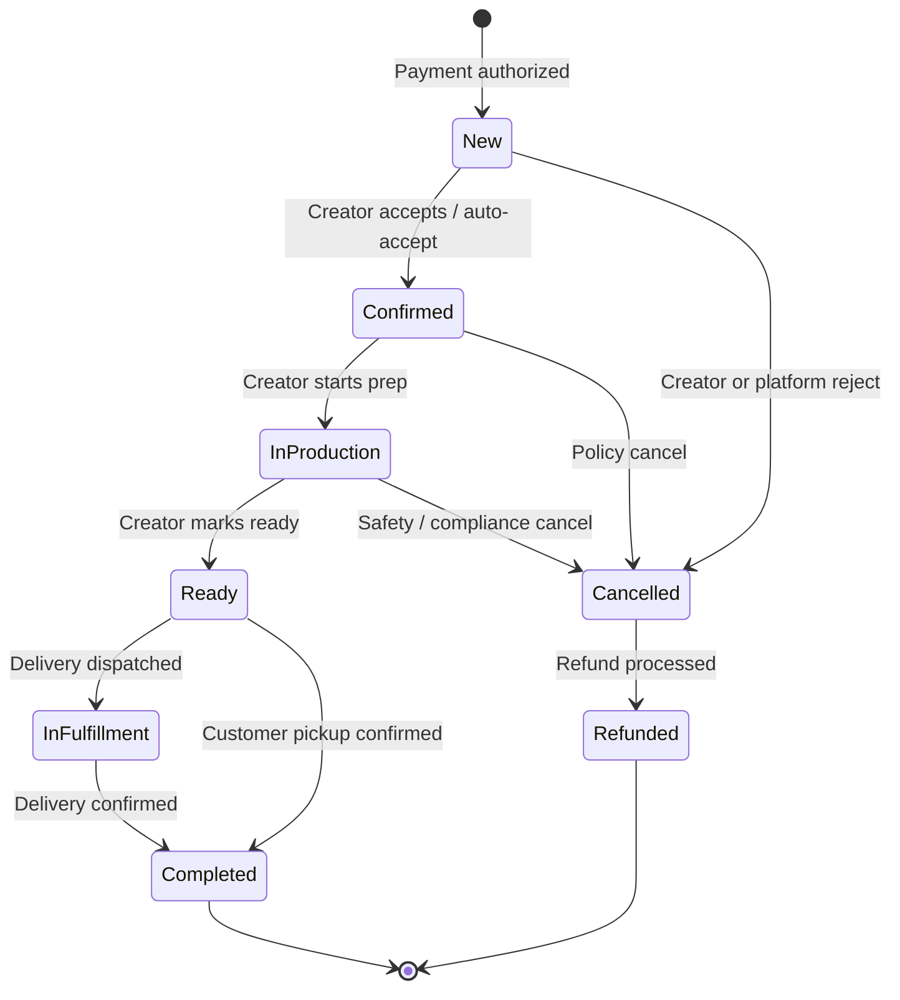
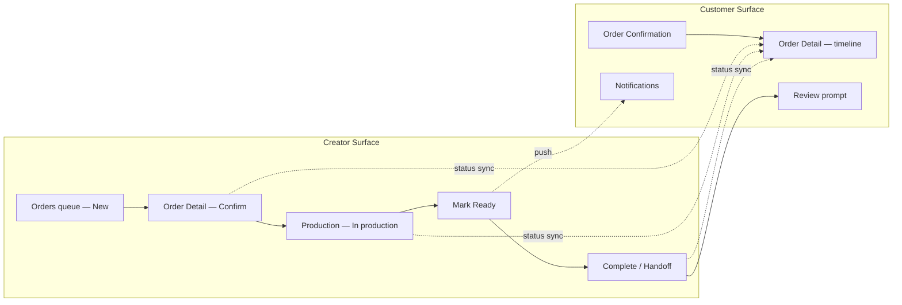

# Order Fulfillment Flow

> Creator production queue and customer order tracking — mirrored states from confirmation through completion.

**Status:** Active  
**Version:** 1.0  
**Last updated:** 2026-07-03  
**Owner:** UX & Information Architecture

---

## Purpose

This document defines the **order lifecycle** as experienced by creators (production queue) and customers (tracking), with explicit state transitions, actions, notifications, and edge cases.

Order states derive from [Marketplace Mechanics — Order lifecycle](../product/marketplace-mechanics.md#order-lifecycle). This flow is the operational bridge between Commerce and Operations pillars.

**Primary personas:** [Independent Chef](../product/personas.md#independent-chef) (creator) · [End Customer (Trust-Seeking Buyer)](../product/personas.md#end-customer-trust-seeking-buyer) (customer)  
**Secondary personas:** [Meal Prep Business](../product/personas.md#meal-prep-business), [Food Truck Operator](../product/personas.md#food-truck-operator), [Baker](../product/personas.md#baker)

---

## Lifecycle Overview

```
New → Confirmed → In production → Ready → [In fulfillment] → Completed
                                                      ↘ Cancelled / Refunded
```

| State | Owner | Customer visibility |
|-------|-------|---------------------|
| **New** | System / Creator | "Order placed" (pending confirmation) |
| **Confirmed** | Creator | Confirmation with ETA |
| **In production** | Creator | "Being prepared" |
| **Ready** | Creator | "Ready for pickup" / delivery dispatch |
| **In fulfillment** | Creator / delivery | Handoff in progress |
| **Completed** | Creator / system | Fulfilled; review prompt |
| **Cancelled / Refunded** | Creator / platform | Cancellation reason + refund status |

**Note:** `In fulfillment` is optional — skipped for customer pickup when handoff occurs at "Ready."

---

## State Machine



---

## Flow Diagram — Dual Perspective



---

## State 1 — New

**Trigger:** Customer completes checkout; payment authorized.

### Creator experience

**Page:** [Orders](../information-architecture.md) (`/dashboard/orders`) — New tab

| Element | Detail |
|---------|--------|
| Queue position | Sorted by pickup window / urgency |
| Badge | Nav badge count on Orders |
| Card info | Customer name, items, pickup window, total |
| Primary action | Open order detail |

**Page:** [Order Detail](../information-architecture.md) (`/dashboard/orders/:orderId`)

| Element | Detail |
|---------|--------|
| Order summary | Full item list with allergens flagged |
| Customer notes | Allergy and special instructions prominent |
| Fulfillment details | Pickup window, delivery address |
| Primary CTA | **Confirm order** |
| Secondary | Message customer · Decline (with reason) |

### Auto-accept mode

Creators may enable auto-accept in settings. New orders skip manual confirm → transition directly to **Confirmed**.

### Customer experience

**Pages:** [Order Confirmation](../information-architecture.md) · [Order Detail](../information-architecture.md)

- Status: "Order placed — awaiting confirmation"
- If auto-accept enabled: immediately "Confirmed"

### Notifications

| Recipient | Channel | Message |
|-----------|---------|---------|
| Creator | Push + email | "New order #1042 — pickup Saturday 11 AM" |
| Customer | Email | "Order placed. [Creator] will confirm shortly." |

### SLA

Creators should confirm within configurable window (default 2 hours). Unconfirmed orders escalate: reminder → auto-cancel with full refund (policy-defined).

---

## State 2 — Confirmed

**Trigger:** Creator taps Confirm (or auto-accept).

### Creator experience

- Order moves to **Active** tab
- Production queue shows confirmed orders sorted by fulfillment deadline
- Primary CTA becomes **Start preparation**

### Customer experience

- Timeline advances to "Confirmed"
- ETA displayed based on pickup window or delivery estimate
- Option to message creator

### Notifications

| Recipient | Channel |
|-----------|---------|
| Customer | Push + email: "Your order is confirmed. Pickup Saturday 11:00–11:30 AM." |

---

## State 3 — In Production

**Trigger:** Creator taps **Start preparation** (or automatic on confirm — creator preference).

### Creator experience

**Page:** Order Detail

| Element | Detail |
|---------|--------|
| Production checklist | Optional per-item checkoffs |
| Allergy flags | Persistent banner |
| Timer | Time until pickup window |
| Primary CTA | **Mark ready** |
| Secondary | Message customer · Report issue |

**Batch view (Meal Prep):** Orders grouped by production batch in Orders list — filter by pickup date.

### Customer experience

- Timeline: "In production"
- No action required — passive tracking
- Optional: estimated ready time if creator provides update

### Delay handling

If creator anticipates delay:

1. Tap **Update customer** → message with revised time
2. Chronic delays affect creator reliability metrics
3. Material delay without update → customer can contact support via Help

→ [Voice and Tone — Precise timing](../brand/voice-and-tone.md#3-precise)

---

## State 4 — Ready

**Trigger:** Creator taps **Mark ready**.

### Creator experience

| Fulfillment type | Ready state UX |
|------------------|----------------|
| Pickup | Display pickup instructions, order code, handoff notes |
| Delivery | **Dispatch delivery** CTA → transitions to In fulfillment |
| Food truck | Location pin + "Ready for pickup" with order code |
| Catering | Setup confirmation checklist |

**Primary CTA (pickup):** **Complete pickup** — after customer handoff  
**Primary CTA (delivery):** **Dispatch** → In fulfillment

### Customer experience

- Push notification: "Your order is ready."
- Pickup: address, instructions, order code
- Delivery: "Out for delivery" when dispatched
- Map link for food truck / pop-up locations

### No-show handling

Creator policy applies. System records no-show after window expiry. Creator may mark **Completed** with no-show flag or **Cancelled** per policy.

---

## State 5 — In Fulfillment (Optional)

**Trigger:** Delivery dispatched; or creator marks handoff to delivery partner.

### Creator experience

- Tracking status if delivery partner integrated (future)
- Manual: **Confirm delivered** CTA

### Customer experience

- Timeline: "On the way"
- ETA if available
- Delivery instructions

### Skipped when

Customer pickup — transition **Ready → Completed** directly at handoff.

---

## State 6 — Completed

**Trigger:** Creator confirms handoff (pickup, delivery, or event service complete).

### Creator experience

- Order moves to **Completed** tab
- Analytics updated (completion rate, on-time rate)
- Prompt to thank customer via message (optional)

### Customer experience

- Timeline: "Completed"
- **Leave a review** CTA (primary on Order Detail)
- Reorder option

### Review prompt

- In-app on Order Detail
- Email at completion + reminder at day 7 (single)
- Verified purchase only — see [Reviews & community](../product/marketplace-mechanics.md#reviews--community)

### Creator review visibility

Reviews appear on [Reviews](../information-architecture.md) (`/dashboard/reviews`) and public storefront after moderation (if flagged).

---

## State 7 — Cancelled / Refunded

**Trigger:** Creator, customer (within policy), or platform initiates cancellation.

### Cancellation actors

| Actor | Typical scenario | Refund |
|-------|------------------|--------|
| Creator | Cannot fulfill | Full refund; impacts reliability |
| Customer | Within cancel window | Per creator/platform policy |
| Platform | Safety / compliance | Full refund; creator investigation |

### Creator experience

- Order moves to Cancelled tab with reason
- Reliability metric impact shown if creator-initiated
- Dispute link if customer contests

### Customer experience

- Timeline: "Cancelled" with reason
- Refund status and timeline
- Help link for disputes

### Dispute path

Unresolved refund disputes escalate to [Dispute Detail](../information-architecture.md) (`/admin/disputes/:disputeId`) — see admin flow.

→ [Cancellations and refunds](../product/marketplace-mechanics.md#cancellations-and-refunds)

---

## Creator Orders Queue — IA

**Page:** [Orders](../information-architecture.md) (`/dashboard/orders`)

### Tab structure

| Tab | States included | Sort default |
|-----|-----------------|--------------|
| **New** | New (unconfirmed) | Urgency (pickup window) |
| **Active** | Confirmed, In production, Ready, In fulfillment | Fulfillment deadline |
| **Completed** | Completed | Most recent first |
| **Cancelled** | Cancelled, Refunded | Most recent first |

### Filters

- Date range
- Fulfillment type (pickup, delivery, catering)
- Search by order # or customer name

### Batch operations (Meal Prep — future)

Select multiple orders → mark production stage in bulk.

→ Page spec: `pages/creator/orders`

---

## Customer Order Tracking — IA

**Page:** [Order Detail](../information-architecture.md) (`/orders/:orderId`)

### Timeline component

Vertical timeline with completed steps checked, current step highlighted, future steps muted.

```
✓ Order placed        — Jul 3, 10:15 AM
✓ Confirmed           — Jul 3, 10:22 AM
● In production       — Current
○ Ready for pickup
○ Completed
```

### Actions by state

| State | Customer actions |
|-------|------------------|
| New / Confirmed | Cancel (if within policy), Message creator |
| In production | Message creator |
| Ready | Get directions, Show order code, Message creator |
| In fulfillment | Track (if available) |
| Completed | Review, Reorder, Get receipt |
| Cancelled | View refund, Contact support |

→ Page spec: `pages/customer/order-detail`

---

## Messaging Integration

**Page:** [Messages](../information-architecture.md) (`/dashboard/messages`) (creator) · Order Detail message thread (customer)

- Every order has an associated message thread
- Pre-filled context: order #, items, fulfillment window
- Creator notified of unread messages via nav badge
- Messages are part of dispute evidence — audit logged

→ Page spec: `pages/creator/messages`

---

## Fulfillment Model Variations

| Model | Key state differences |
|-------|----------------------|
| Scheduled pickup | Ready → customer arrives → Completed |
| Same-day / food truck | Ready includes live location; shorter windows |
| Creator delivery | Ready → In fulfillment → Completed |
| Catering / event | Confirmed weeks ahead; production starts near event date |
| Pop-up / ticketed | Ready = check-in at event; capacity enforced at checkout |

→ [Fulfillment Models](../product/marketplace-mechanics.md#fulfillment-models)

---

## Edge Cases

| Scenario | Handling |
|----------|----------|
| Partial availability after order | Creator messages customer; adjust or cancel with refund |
| Customer modifies order post-confirm | Not supported v1 — cancel and reorder within policy |
| Creator oversubscribed | Platform defect — should not occur; capacity enforced at checkout |
| Allergen dispute | Platform mediation; creator suspension if confirmed mislabeling |
| Payment capture timing | Per fulfillment model — immediate or on confirm |
| Multi-item with different lead times | Single order; longest lead time governs fulfillment window |

---

## Notifications Matrix

| Transition | Creator | Customer |
|------------|---------|----------|
| New order | Push, email | Email (placed) |
| Confirmed | — | Push, email |
| In production | — | Optional push |
| Ready | — | Push, SMS optional |
| In fulfillment | — | Push |
| Completed | Email (summary) | Push, email + review prompt |
| Cancelled | Email | Push, email |
| Refund processed | — | Email |

All notifications use precise timing and order numbers — [Voice and Tone](../brand/voice-and-tone.md).

---

## Metrics

| Metric | Owner | Definition |
|--------|-------|------------|
| Confirmation time | Creator | New → Confirmed duration |
| Production time | Creator | Confirmed → Ready duration |
| On-time ready rate | Creator | Ready before window end |
| Completion rate | Creator | Completed / Confirmed |
| Cancellation rate | Both | Cancelled / Total orders |
| Customer support contact rate | Platform | Support tickets per order |

→ [Creator Metrics](../product/success-metrics-overview.md#creator-metrics) · [Customer Metrics](../product/success-metrics-overview.md#customer-metrics)

---

## Page & Spec Index

| Role | Path | Spec folder |
|------|------|-------------|
| Creator — Orders queue | `/dashboard/orders` | `creator/orders` |
| Creator — Order detail | `/dashboard/orders/:orderId` | `creator/order-detail` |
| Creator — Messages | `/dashboard/messages` | `creator/messages` |
| Customer — Confirmation | `/orders/:orderId/confirmation` | `customer/order-confirmation` |
| Customer — Order detail | `/orders/:orderId` | `customer/order-detail` |
| Customer — Order history | `/orders` | `customer/order-history` |
| Admin — Dispute | `/admin/disputes/:disputeId` | `admin/dispute-detail` |

---

## Related Documents

- [Information Architecture](../information-architecture.md)
- [Navigation Model](../navigation-model.md)
- [Customer Purchase Flow](customer-purchase-flow.md)
- [Creator Onboarding Flow](creator-onboarding-flow.md)
- [Trust Verification Flow](trust-verification-flow.md)
- [Product Overview](../product/overview.md)
- [Personas](../product/personas.md)
- [Marketplace Mechanics](../product/marketplace-mechanics.md)
- [Design System Principles](../design-system/principles.md)
- [Voice and Tone](../brand/voice-and-tone.md)
- [Pages README](../README.md)
