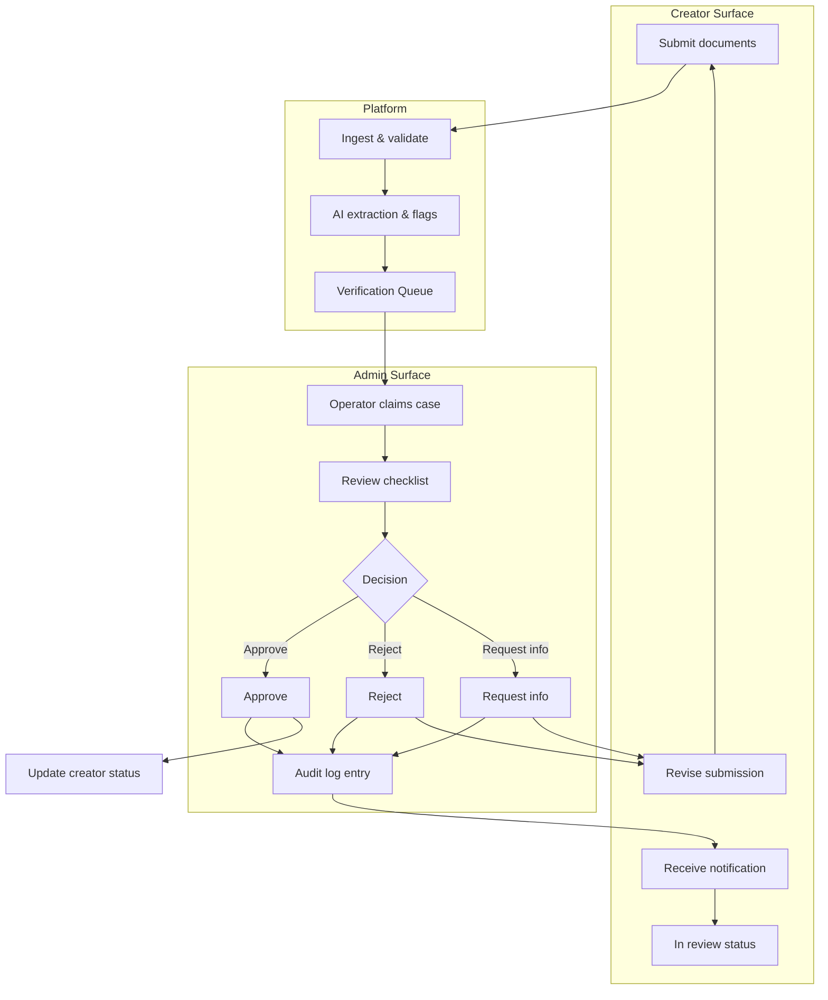
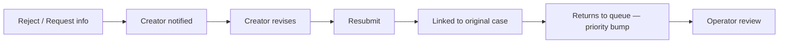

# Trust Verification Flow

> Internal operations workflow for creator verification — submission through human approval and creator notification.

**Status:** Active  
**Version:** 1.0  
**Last updated:** 2026-07-03  
**Owner:** UX & Information Architecture

---

## Purpose

This document maps the **internal Trust & Safety workflow** for reviewing creator identity, kitchen, and compliance submissions. It covers operator actions, AI assist boundaries, creator-facing status updates, and audit requirements.

**Primary persona:** [Platform Operations (Internal)](../product/personas.md#platform-operations-internal)  
**Affected persona:** All creator types — especially [Cottage Food Operator](../product/personas.md#cottage-food-operator) and [Commercial Kitchen Operator](../product/personas.md#commercial-kitchen-operator)

Governing principles: [Trust Philosophy](../company/constitution.md#trust-philosophy) · [AI Philosophy](../company/constitution.md#ai-philosophy) — **AI recommends. Humans approve.**

Creator-facing onboarding context: [Creator Onboarding Flow](creator-onboarding-flow.md)

---

## Verification Types

| Type | Queue | Creator page | Approval unlocks |
|------|-------|--------------|------------------|
| **Identity** | Verification Queue | `/creator/verify/identity` | Kitchen submission |
| **Kitchen** | Verification Queue | `/creator/verify/kitchen` | Compliance + paid listings |
| **Compliance** | Verification Queue | `/creator/compliance`, `/dashboard/compliance` | Category eligibility; ongoing ops |
| **Listing moderation** | Moderation Queue | — | Public catalog visibility |
| **Review moderation** | Moderation Queue | — | Public review visibility |

This document focuses on **identity, kitchen, and compliance verification**. Listing and review moderation share queue UX patterns but distinct checklists.

---

## Flow Summary

```
Submission → Queue → Review → Approve / Reject / Request info → Creator notification → Status update
```

---

## Flow Diagram



---

## Phase 1 — Creator Submission

**Pages:** Identity · Kitchen · Compliance (see [Creator Onboarding Flow](creator-onboarding-flow.md))

### Submission validation (automated)

Before entering queue:

| Check | Failure behavior |
|-------|------------------|
| File format and size | Inline reject — creator fixes before submit |
| Required fields complete | Block submit |
| Document readability (AI) | Warn creator; allow submit with flag |
| Duplicate submission | Merge with existing case |

### On successful submit

1. Creator status → `in_review`
2. Case created in Verification Queue with unique case ID
3. Timestamp and document hash stored (audit)
4. Confirmation shown: "Submitted. Review within 2 business days."
5. AI pipeline runs asynchronously

---

## Phase 2 — AI Pre-Processing

AI assists — does not decide. Per [AI Philosophy](../company/constitution.md#ai-philosophy):

| AI output | Operator use |
|-----------|--------------|
| Extracted fields (name, address, dates) | Pre-filled review form |
| Document type classification | Routes to correct checklist |
| Mismatch flags (name ≠ ID, expired doc) | Highlighted for operator attention |
| Fraud signals (manipulated image) | Priority escalation |
| Confidence score | Low confidence → senior review required |

**Fallback:** AI unavailable → case enters queue without pre-fill; operator reviews manually.

All AI outputs logged with model version and confidence. Operator can override any AI suggestion.

→ AI docs: [`ai/`](../ai/) *(Phase 3)*

---

## Phase 3 — Verification Queue

**Page:** [Verification Queue](../information-architecture.md) (`/admin/verification`)

### Queue IA

```
┌─────────────────┬──────────────────────────────────────────────┐
│ Queue list      │ Case detail                                   │
│ ─────────────── │ ───────────────────────────────────────────── │
│ Filters:        │ Creator info · Submission type · AI flags     │
│ · Identity      │ Document viewer (side-by-side)                │
│ · Kitchen       │ Checklist                                     │
│ · Compliance    │ AI extracted fields                           │
│ · Priority      │ Internal notes                                │
│ · SLA breach    │ [Approve] [Reject] [Request info]             │
│                 │ Audit trail                                   │
└─────────────────┴──────────────────────────────────────────────┘
```

### Queue columns

| Column | Detail |
|--------|--------|
| Case ID | Unique identifier |
| Creator | Name + slug link to Creator Admin Detail |
| Type | Identity / Kitchen / Compliance |
| Submitted | Timestamp |
| SLA | Time remaining / breached indicator |
| AI flags | Count of flagged issues |
| Assignee | Operator or Unassigned |
| Priority | Standard / Elevated / Fraud suspect |

### Sort default

1. SLA breach (oldest first)
2. Priority elevated
3. FIFO within tier

### Filters

- Verification type
- Jurisdiction
- Assignee (mine / unassigned / all)
- AI flag presence
- Creator category (cottage food, food truck, etc.)

→ Page spec: `pages/admin/verification-queue`

---

## Phase 4 — Case Review

**Page:** Verification Queue detail pane · [Creator Admin Detail](../information-architecture.md) (`/admin/creators/:creatorId`) for full history

### Operator checklist — Identity

| Item | Verify |
|------|--------|
| ☐ | Government ID is valid, unexpired, and legible |
| ☐ | Name matches account and business registration |
| ☐ | Selfie/liveness passes |
| ☐ | Business entity type matches documents |
| ☐ | Tax identity consistent |
| ☐ | No fraud signals from AI or prior cases |
| ☐ | Sanctions / PEP screening clear (if applicable) |

### Operator checklist — Kitchen

| Item | Verify |
|------|--------|
| ☐ | Address matches claimed production location |
| ☐ | Facility type appropriate for creator category |
| ☐ | Photos show food-safe environment |
| ☐ | Inspection / registration docs valid for jurisdiction |
| ☐ | Multi-tenant linkage correct (if applicable) |
| ☐ | Mobile unit commissary linkage verified (if food truck) |
| ☐ | No prior kitchen suspensions on address |

### Operator checklist — Compliance

| Item | Verify |
|------|--------|
| ☐ | Food handler certificate valid and unexpired |
| ☐ | Business license matches jurisdiction |
| ☐ | Cottage food registration valid (if applicable) |
| ☐ | Insurance meets platform minimum (if required) |
| ☐ | Category restrictions understood and enforceable |
| ☐ | Expiration dates captured for renewal tracking |

### Document viewer

- Side-by-side: uploaded document + AI extracted fields
- Zoom, rotate, download (operator only)
- Previous submissions visible for resubmissions
- Comparison mode for resubmit vs. prior

### Internal notes

- Free-text notes visible to all operators
- Not visible to creator
- Attached to audit trail

→ Page spec: `pages/admin/creator-admin-detail`

---

## Phase 5 — Decision

Three outcomes — every decision requires rationale text (min 20 characters) except bulk approve with standard checklist completion.

### Approve

**Operator action:** Tap **Approve** → confirm → rationale (optional for clean approve)

**System actions:**

1. Update creator verification status for type
2. If all types approved → grant **Verified Creator** status
3. Audit log: operator ID, timestamp, rationale, checklist state
4. Notify creator (see Phase 6)
5. Remove from active queue; archive case

**Creator impact:**

- Status pill updates in Creator OS header
- Next onboarding step unlocks (if sequential)
- Email: "Your [identity/kitchen/compliance] verification is approved."

### Reject

**Operator action:** Tap **Reject** → select reason code → required rationale → confirm

**Reason codes:**

| Code | Use when |
|------|----------|
| `document_invalid` | Unreadable, expired, wrong document type |
| `information_mismatch` | Name, address, or entity mismatch |
| `facility_inadequate` | Kitchen does not meet standards |
| `jurisdiction_ineligible` | Cannot operate in selected jurisdiction |
| `fraud_suspected` | Suspected fraudulent submission |
| `policy_violation` | Other platform policy violation |

**System actions:**

1. Status → `rejected`
2. Audit log with reason code
3. Notify creator with reason and appeal path
4. Creator may revise and resubmit (unless fraud — account hold)

**Creator impact:**

- Status pill: error state with "Action required"
- Compliance page shows rejection detail
- Resubmit flow opens prior submission for correction

### Request info

**Operator action:** Tap **Request info** → specify required items → required message → confirm

**Use when:**

- Document partially acceptable but incomplete
- Clarification needed (e.g., additional angle of kitchen photo)
- Expiring document acceptable short-term but renewal needed

**System actions:**

1. Status → `action_required`
2. Audit log with requested items list
3. Notify creator with specific checklist of needed items
4. Case remains in queue — pauses SLA clock until resubmit

**Creator impact:**

- Status pill: warning — "Action required"
- Compliance/verification page shows exact items needed
- Creator uploads → case returns to queue as resubmission

---

## Phase 6 — Creator Notification

| Decision | Email | In-app | Status pill |
|----------|-------|--------|-------------|
| Approve | ✓ | ✓ | Success |
| Reject | ✓ | ✓ | Error |
| Request info | ✓ | ✓ | Warning |
| SLA delay (no decision) | ✓ (proactive) | — | Warning |

### Copy requirements

- Specific — not "your verification was updated"
- Actionable — exact next step for reject/request info
- Timeline — when to expect re-review after resubmit
- Appeal path for reject — link to Help with case ID

→ [Voice and Tone — Customer Support](../brand/voice-and-tone.md#customer-support)

### Creator-facing status sync

Verification status pill in Creator OS header reads from same status source — no delay between decision and UI.

→ [Navigation Model — Trust-Critical Navigation](../navigation-model.md#trust-critical-navigation)

---

## Resubmission Flow



- Resubmissions link to original case ID — full history preserved
- Resubmissions receive priority bump (after SLA breaches)
- Operator sees diff: what changed since last submission
- Max resubmission attempts before manual outreach — `TODO(decision):` threshold

---

## Moderation Queue (Parallel Flow)

**Page:** [Moderation Queue](../information-architecture.md) (`/admin/moderation`)

Shares queue UX with Verification Queue but distinct checklists:

| Content type | Trigger | Decisions |
|--------------|---------|-----------|
| Menu item | New publish; edit to flagged fields | Approve listing / Reject / Request edit |
| Review | Customer submission; fraud flag | Publish / Remove / Escalate |
| Storefront content | Photo or story flag | Approve / Request change / Suspend |
| Message | Automated toxicity flag | Dismiss / Warn / Suspend |

→ Page spec: `pages/admin/moderation-queue`

---

## Dispute Escalation (Related)

Verification-adjacent disputes (e.g., allergen mislabeling confirmed post-order) may originate in order context but link to creator verification history.

**Page:** [Dispute Detail](../information-architecture.md) (`/admin/disputes/:disputeId`)

- Linked from Creator Admin Detail
- Verification history visible in case sidebar
- Enforcement ladder may trigger re-verification or suspension

→ [Trust enforcement ladder](../product/marketplace-mechanics.md#trust-enforcement-ladder)  
→ Page spec: `pages/admin/dispute-detail`

---

## SLA & Escalation

| Verification type | Target SLA | Escalation |
|-------------------|------------|------------|
| Identity | 2 business days | Supervisor at 3 days |
| Kitchen | 3 business days | Supervisor at 4 days |
| Compliance | 2 business days | Supervisor at 3 days |
| Resubmission | 1 business day | Same as type |
| Fraud flag | 4 hours | Trust lead immediate |

SLA breach triggers:

1. Queue visual indicator (red)
2. Automated supervisor notification
3. Proactive creator email if no decision imminent

Full SOPs: [`operations/`](../operations/) *(Phase 4)*

---

## Audit Requirements

Every action logged immutably:

| Field | Detail |
|-------|--------|
| `case_id` | Verification case identifier |
| `creator_id` | Subject creator |
| `operator_id` | Acting operator |
| `action` | `approve` · `reject` · `request_info` · `claim` · `reassign` · `note` |
| `timestamp` | UTC ISO 8601 |
| `rationale` | Operator-provided text |
| `reason_code` | For rejections |
| `checklist_state` | Snapshot of checklist at decision |
| `ai_flags_reviewed` | Which AI flags acknowledged |
| `document_hashes` | Submitted document integrity |

Audit trail visible on:

- Verification case detail
- Creator Admin Detail → Verification tab
- Compliance exports for legal review

---

## Creator Admin Detail — Verification Tab

**Page:** [Creator Admin Detail](../information-architecture.md) (`/admin/creators/:creatorId`)

Consolidated view for operators:

| Section | Content |
|---------|---------|
| Status summary | Identity · Kitchen · Compliance — each with current state |
| Case history | All submissions chronologically |
| Documents | All uploaded artifacts |
| AI flags | Historical flag log |
| Enforcement | Warnings, suspensions, restrictions |
| Internal notes | Cross-team notes |
| Quick actions | Force re-verify · Suspend · Message creator |

→ Page spec: `pages/admin/creator-admin-detail`

---

## Platform Settings (Verification Config)

**Page:** [Platform Settings](../information-architecture.md) (`/admin/settings`)

Admin-configurable verification parameters:

- SLA thresholds by type
- Jurisdiction template library
- Required documents per jurisdiction
- Auto-approve rules (if any — default none for v1)
- AI confidence thresholds for flagging
- Reason codes and messaging templates

→ Page spec: `pages/admin/platform-settings`

---

## Metrics

| Metric | Target direction |
|--------|------------------|
| Verification turnaround time | ↓ within SLA |
| First-pass approval rate | ↑ (better creator guidance) |
| Resubmission rate | ↓ (clearer requirements) |
| False approve rate | ↓ (audit sampling) |
| False reject rate | ↓ (appeals tracking) |
| Queue depth | Stable under SLA |
| Operator cases per hour | Baseline for staffing |

→ [Trust Metrics](../product/success-metrics-overview.md#trust-metrics) · [Platform Health Metrics](../product/success-metrics-overview.md#platform-health-metrics)

---

## Security & Access

| Rule | Detail |
|------|--------|
| Admin-only | Verification queue not accessible to creators or customers |
| PII handling | Document viewer watermarked with operator ID |
| Least privilege | Junior operators cannot approve fraud-flagged cases |
| Session timeout | Shorter timeout on admin surface |
| Export controls | Bulk document export requires elevated permission |

---

## Page & Spec Index

| Role | Path | Spec folder |
|------|------|-------------|
| Admin — Dashboard | `/admin` | `admin/admin-dashboard` |
| Admin — Verification Queue | `/admin/verification` | `admin/verification-queue` |
| Admin — Moderation Queue | `/admin/moderation` | `admin/moderation-queue` |
| Admin — Creator Detail | `/admin/creators/:creatorId` | `admin/creator-admin-detail` |
| Admin — Dispute Detail | `/admin/disputes/:disputeId` | `admin/dispute-detail` |
| Admin — Platform Settings | `/admin/settings` | `admin/platform-settings` |
| Creator — Identity | `/creator/verify/identity` | `auth/identity-verification` |
| Creator — Kitchen | `/creator/verify/kitchen` | `auth/kitchen-verification` |
| Creator — Compliance | `/creator/compliance`, `/dashboard/compliance` | `auth/compliance-center`, `creator/compliance` |

---

## Related Documents

- [Information Architecture](../information-architecture.md)
- [Navigation Model](../navigation-model.md)
- [Creator Onboarding Flow](creator-onboarding-flow.md)
- [Order Fulfillment Flow](order-fulfillment-flow.md)
- [Product Overview](../product/overview.md)
- [Personas](../product/personas.md)
- [Marketplace Mechanics](../product/marketplace-mechanics.md)
- [Founding Constitution](../company/constitution.md)
- [Design System Principles](../design-system/principles.md)
- [Voice and Tone](../brand/voice-and-tone.md)
- [Pages README](../README.md)
