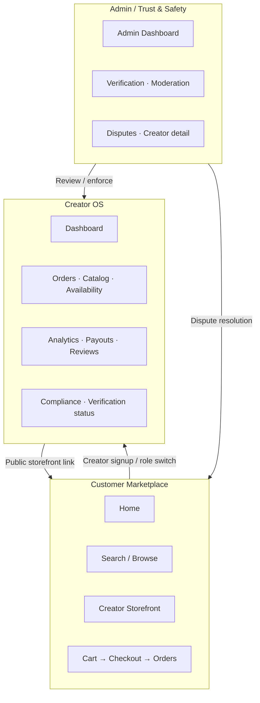

# Information Architecture

> Canonical site map, page inventory, URL conventions, and content hierarchy for Marketplate Phase 2.

**Status:** Active  
**Version:** 1.0  
**Last updated:** 2026-07-03  
**Owner:** UX & Information Architecture

---

## Purpose

This document defines **what exists on Marketplate**, **who it serves**, and **how pages relate to one another**. It is the authoritative reference for navigation design, page specifications, engineering routing, and analytics taxonomy.

Every page spec in [`pages/`](.) must trace back to an entry in the page inventory below. Governing product context lives in [Product Overview](../product/overview.md) and [Marketplace Mechanics](../product/marketplace-mechanics.md).

---

## Three Primary Surfaces

Marketplate is one product with three distinct application contexts. Each context has its own navigation shell, permission model, and primary job-to-be-done.

| Surface | Audience | Primary job | Entry URL |
|---------|----------|-------------|-----------|
| **Customer Marketplace** | End customers (buyers) | Discover verified creators and complete purchases with confidence | `/` |
| **Creator OS** | Verified and onboarding creators | Run catalog, orders, fulfillment, compliance, and business analytics | `/dashboard` |
| **Admin / Trust & Safety** | Platform operators | Maintain verification integrity, resolve disputes, and monitor marketplace health | `/admin` |



**Surface isolation rules:**

- Customer Marketplace is **public-first** — discovery and storefronts are reachable without authentication; checkout and order history require a customer account.
- Creator OS is **authenticated-only** — unauthenticated users redirect to login with return path preserved.
- Admin is **internal-only** — separate permission tier; never exposed in customer or creator navigation.

→ Navigation patterns: [Navigation Model](navigation-model.md)  
→ Role switching: [Navigation Model — Role Switching](navigation-model.md#role-switching-creator-who-is-also-customer)

---

## Content Hierarchy

### Level 0 — Platform

Marketplate brand, trust thesis, and cross-surface utilities (auth, help, legal).

### Level 1 — Surface root

One root per primary surface: Marketplace home (`/`), Creator dashboard (`/dashboard`), Admin console (`/admin`).

### Level 2 — Domain sections

Logical groupings within a surface:

| Surface | Sections |
|---------|----------|
| Customer | Discovery · Creator profiles · Commerce · Account |
| Creator | Overview · Orders · Catalog · Business · Trust & compliance · Settings |
| Admin | Overview · Verification · Moderation · Disputes · Platform config |

### Level 3 — Entity pages

Pages scoped to a specific entity: order, menu item, creator profile, dispute case.

### Level 4 — Modal / drawer overlays (non-routable)

Some interactions (quick cart preview, allergen detail, filter panels) use overlays without dedicated routes. Overlays inherit the parent page's analytics context and back behavior.

---

## URL Structure Conventions

### General rules

| Rule | Convention | Example |
|------|------------|---------|
| **Lowercase, hyphenated slugs** | kebab-case for multi-word paths | `/password-reset` |
| **Plural resource collections** | Plural noun for lists | `/orders`, `/dashboard/orders` |
| **Singular entity by ID** | `:id` or `:slug` param | `/orders/:orderId` |
| **Nested ownership** | Parent before child | `/creators/:slug/items/:itemId` |
| **No trailing slashes** | Canonical URL without `/` suffix | `/cart` not `/cart/` |
| **Query params for filters** | State that doesn't define a page | `/search?q=vegan&fulfillment=pickup` |
| **Hash fragments** | In-page anchors only — not primary navigation | `/creators/:slug#reviews` |

### Path prefixes by surface

| Prefix | Surface | Notes |
|--------|---------|-------|
| `/` | Customer Marketplace | Default public experience |
| `/creators/:slug` | Customer Marketplace | Creator-owned storefront namespace |
| `/orders/:orderId` | Customer Marketplace | Post-purchase order management |
| `/account/*` | Customer Marketplace | Authenticated customer settings |
| `/login`, `/signup`, `/password-reset` | Auth (shared) | Surface-agnostic authentication |
| `/creator/*` | Auth / onboarding | Creator-specific signup and verification |
| `/dashboard/*` | Creator OS | All creator operational pages |
| `/admin/*` | Admin | Internal operations |

### Canonical slug rules (creator storefronts)

- Creator storefront slug is **creator-chosen** at signup, validated for uniqueness and platform policy.
- Slug changes require re-verification of public links; old slug redirects for 90 days minimum.
- Reserved slugs (`admin`, `dashboard`, `login`, `help`, etc.) are blocked at registration.

### SEO and sharing

- Creator storefronts and menu item detail pages are **indexable** where creator opt-in and verification status allow.
- Checkout, cart, dashboard, and admin routes carry `noindex`.
- Open Graph metadata derives from creator photography and item descriptions — see individual page specs.

---

## Site Map

### Customer Marketplace

```
/
├── /search
├── /browse
│   └── /browse/:collectionSlug
├── /creators/:slug                    (creator storefront)
│   └── /creators/:slug/items/:itemId  (menu item detail)
├── /cart
├── /checkout
├── /orders
│   ├── /orders/:orderId
│   └── /orders/:orderId/confirmation
├── /account/settings
└── /help
```

### Auth & Creator Onboarding

```
/login
/signup
/password-reset
/creator/signup
/creator/verify/identity
/creator/verify/kitchen
/creator/compliance
```

### Creator OS

```
/dashboard
├── /dashboard/orders
│   └── /dashboard/orders/:orderId
├── /dashboard/catalog
│   └── /dashboard/catalog/items/:itemId/edit
├── /dashboard/availability
├── /dashboard/analytics
├── /dashboard/messages
├── /dashboard/compliance
├── /dashboard/payouts
├── /dashboard/storefront
└── /dashboard/reviews
```

### Admin / Trust & Safety

```
/admin
├── /admin/verification
├── /admin/moderation
├── /admin/disputes/:disputeId
├── /admin/creators/:creatorId
└── /admin/settings
```

---

## Page Inventory

Complete inventory of Phase 2 pages. Each row maps to a page specification document (authored by Page Specification agents) or a flow document where the page is part of a multi-step journey.

**Pillar key:** Trust · Discovery · Commerce · Operations  
**User type key:** Customer · Creator · Admin · Shared (auth/onboarding)

| Path | Page name | User type | Primary persona | Primary pillar | Page spec folder |
|------|-----------|-----------|-----------------|----------------|------------------|
| `/` | Home | Customer | [End Customer (Trust-Seeking Buyer)](../product/personas.md#end-customer-trust-seeking-buyer) | Discovery | `customer/home` |
| `/search` | Search | Customer | End Customer | Discovery | `customer/search` |
| `/browse` | Browse | Customer | End Customer | Discovery | `customer/browse` |
| `/creators/:slug` | Creator Storefront | Customer | End Customer | Trust + Discovery | `customer/creator-storefront` |
| `/creators/:slug/items/:itemId` | Menu Item Detail | Customer | End Customer | Trust + Commerce | `customer/menu-item-detail` |
| `/cart` | Cart | Customer | End Customer | Commerce | `customer/cart` |
| `/checkout` | Checkout | Customer | End Customer | Commerce + Trust | `customer/checkout` |
| `/orders/:orderId/confirmation` | Order Confirmation | Customer | End Customer | Commerce | `customer/order-confirmation` |
| `/orders/:orderId` | Order Detail | Customer | End Customer | Operations + Trust | `customer/order-detail` |
| `/orders` | Order History | Customer | End Customer | Operations | `customer/order-history` |
| `/account/settings` | Account Settings | Customer | End Customer | Operations | `customer/account-settings` |
| `/help` | Help | Customer | End Customer | Trust | `customer/help` |
| `/login` | Login | Shared | End Customer / Independent Chef | Operations | `auth/login` |
| `/signup` | Signup | Shared | End Customer | Operations | `auth/signup` |
| `/password-reset` | Password Reset | Shared | End Customer / Independent Chef | Operations | `auth/password-reset` |
| `/creator/signup` | Creator Signup | Creator | [Independent Chef](../product/personas.md#independent-chef) | Trust + Operations | `auth/creator-signup` |
| `/creator/verify/identity` | Identity Verification | Creator | Independent Chef / [Cottage Food Operator](../product/personas.md#cottage-food-operator) | Trust | `auth/identity-verification` |
| `/creator/verify/kitchen` | Kitchen Verification | Creator | Independent Chef / [Commercial Kitchen Operator](../product/personas.md#commercial-kitchen-operator) | Trust | `auth/kitchen-verification` |
| `/creator/compliance` | Compliance Center (onboarding) | Creator | Cottage Food Operator | Trust | `auth/compliance-center` |
| `/dashboard` | Dashboard | Creator | Independent Chef | Operations | `creator/dashboard` |
| `/dashboard/orders` | Orders | Creator | Independent Chef / [Meal Prep Business](../product/personas.md#meal-prep-business) | Operations | `creator/orders` |
| `/dashboard/orders/:orderId` | Order Detail | Creator | Independent Chef | Operations + Commerce | `creator/order-detail` |
| `/dashboard/catalog` | Catalog | Creator | [Baker](../product/personas.md#baker) | Commerce + Operations | `creator/catalog` |
| `/dashboard/catalog/items/:itemId/edit` | Menu Item Editor | Creator | Baker / Meal Prep Business | Commerce + Trust | `creator/menu-item-editor` |
| `/dashboard/availability` | Availability | Creator | [Food Truck Operator](../product/personas.md#food-truck-operator) / Baker | Operations | `creator/availability` |
| `/dashboard/analytics` | Analytics | Creator | Meal Prep Business | Operations | `creator/analytics` |
| `/dashboard/messages` | Messages | Creator | Independent Chef | Operations | `creator/messages` |
| `/dashboard/compliance` | Compliance | Creator | Cottage Food Operator | Trust | `creator/compliance` |
| `/dashboard/payouts` | Payouts | Creator | Independent Chef | Commerce + Operations | `creator/payouts` |
| `/dashboard/storefront` | Storefront Settings | Creator | Independent Chef | Discovery + Trust | `creator/storefront-settings` |
| `/dashboard/reviews` | Reviews | Creator | Baker | Trust | `creator/reviews` |
| `/admin` | Admin Dashboard | Admin | [Platform Operations (Internal)](../product/personas.md#platform-operations-internal) | Trust + Operations | `admin/admin-dashboard` |
| `/admin/verification` | Verification Queue | Admin | Platform Operations | Trust | `admin/verification-queue` |
| `/admin/moderation` | Moderation Queue | Admin | Platform Operations | Trust | `admin/moderation-queue` |
| `/admin/disputes/:disputeId` | Dispute Detail | Admin | Platform Operations | Trust + Commerce | `admin/dispute-detail` |
| `/admin/creators/:creatorId` | Creator Admin Detail | Admin | Platform Operations | Trust + Operations | `admin/creator-admin-detail` |
| `/admin/settings` | Platform Settings | Admin | Platform Operations | Operations | `admin/platform-settings` |

### Inventory notes

- **Compliance Center** appears twice by design: `/creator/compliance` is the onboarding gate; `/dashboard/compliance` is the ongoing management surface for verified creators. They share components but differ in navigation context and completion requirements.
- **Order Detail** exists on both customer and creator surfaces with mirrored state but asymmetric actions — see [Order Fulfillment Flow](flows/order-fulfillment-flow.md).
- **Browse collections** (`/browse/:collectionSlug`) are editorial/algorithmic sub-pages of Browse; they inherit Browse's page spec with collection-specific content blocks.
- Admin pages are not linked from public navigation. Access is direct URL + permission check only.

---

## Cross-Surface Page Relationships

| Customer page | Related creator page | Related admin page | Shared entity |
|---------------|---------------------|-------------------|---------------|
| Creator Storefront | Storefront Settings | Creator Admin Detail | Creator profile |
| Menu Item Detail | Menu Item Editor | Creator Admin Detail (listings tab) | Catalog item |
| Order Detail | Order Detail (dashboard) | Dispute Detail | Order |
| Order History | Orders (list) | Creator Admin Detail (orders tab) | Order collection |
| Checkout | — | — | Cart → Order |
| Help | Messages (creator support threads) | — | Support ticket (future) |

---

## Pillar Coverage by Surface

Quick reference for prioritization — which surface owns which pillar's primary UX.

| Pillar | Customer Marketplace | Creator OS | Admin |
|--------|:--------------------:|:----------:|:-----:|
| **Trust** | Storefront badges, item allergens, checkout disclosures | Compliance, verification status, review management | Verification queue, moderation, disputes |
| **Discovery** | Home, search, browse, storefront | Storefront settings, photography, availability signals | Featured collections config (platform settings) |
| **Commerce** | Cart, checkout, order confirmation | Catalog, pricing, payouts | Dispute resolution, refund overrides |
| **Operations** | Order tracking, account settings | Orders, availability, messages, analytics | Admin dashboard, creator admin detail |

The reinforcing loop defined in [Product Overview — Pillar Interdependencies](../product/overview.md#pillar-interdependencies) maps directly to cross-surface links above.

---

## Authentication & Access Matrix

| Page group | Anonymous | Customer auth | Creator auth | Admin auth |
|------------|:---------:|:-------------:|:------------:|:----------:|
| Discovery (home, search, browse, storefront, item detail) | ✓ | ✓ | ✓ | ✓ |
| Cart | ✓ (session) | ✓ | ✓ | — |
| Checkout, orders, account | — | ✓ | ✓ | — |
| Auth pages | ✓ | ✓ | ✓ | — |
| Creator onboarding | — | — | ✓ (partial) | — |
| Creator dashboard | — | — | ✓ | — |
| Admin console | — | — | — | ✓ |

**Invariant:** Unverified creators can access Creator OS in **draft/onboarding mode** but cannot accept paid orders — per [Marketplace Mechanics — Verified to sell](../product/marketplace-mechanics.md#marketplace-model-overview).

---

## User Flows

Multi-page journeys documented separately with step-by-step IA, state transitions, and entry/exit points:

| Flow | Document | Surfaces touched |
|------|----------|------------------|
| Customer purchase | [Customer Purchase Flow](flows/customer-purchase-flow.md) | Customer Marketplace |
| Creator onboarding | [Creator Onboarding Flow](flows/creator-onboarding-flow.md) | Auth → Creator OS |
| Order fulfillment | [Order Fulfillment Flow](flows/order-fulfillment-flow.md) | Creator OS ↔ Customer Marketplace |
| Trust verification (internal) | [Trust Verification Flow](flows/trust-verification-flow.md) | Admin ↔ Creator OS |

---

## Analytics & Page Taxonomy

Every page in the inventory must emit a `page_view` event with:

| Property | Source |
|----------|--------|
| `surface` | `customer` · `creator` · `admin` |
| `page_key` | Inventory page name in snake_case (e.g., `menu_item_detail`) |
| `path` | Canonical path pattern |
| `pillar` | Primary pillar from inventory table |
| `persona` | Primary persona slug |

Funnel events attach to flow documents above. Full taxonomy: [`analytics/`](../analytics/) *(Phase 5)*.

---

## Phase 2 Dependencies

| Downstream | Uses this document for |
|------------|------------------------|
| Page Specification agents | Route, persona, pillar per page spec |
| Engineering | Router definitions, permission middleware |
| Navigation implementation | Shell selection, nav item inventory |
| QA | Coverage checklist against inventory |
| Analytics | Event naming and funnel boundaries |

---

## Open Decisions

| Decision | IA impact |
|----------|-----------|
| `TODO(decision):` Geographic launch market | Help content, compliance copy, and location-aware browse defaults |
| `TODO(decision):` Pricing model | Whether analytics or advanced fulfillment pages are gated by tier |
| `TODO(decision):` Primary launch locale(s) | URL locale prefix strategy (`/en-us/...`) — not assumed in v1 paths above |

Record resolved decisions as ADRs in [`decisions/`](../decisions/).

---

## Related Documents

- [Founding Constitution](../company/constitution.md)
- [Product Overview](../product/overview.md)
- [Personas](../product/personas.md)
- [Marketplace Mechanics](../product/marketplace-mechanics.md)
- [Design System Principles](../design-system/principles.md)
- [Voice and Tone](../brand/voice-and-tone.md)
- [Navigation Model](navigation-model.md)
- [Customer Purchase Flow](flows/customer-purchase-flow.md)
- [Creator Onboarding Flow](flows/creator-onboarding-flow.md)
- [Order Fulfillment Flow](flows/order-fulfillment-flow.md)
- [Trust Verification Flow](flows/trust-verification-flow.md)
- [Page Doc Template](../templates/page-doc-template.md)
- [Pages README](README.md)
