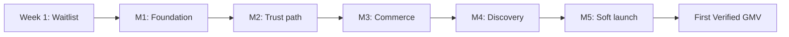

# V1 Build Plan — Waitlist to First Revenue

> Execution plan for Marketplate Phase 1: landing + waitlist first, then the full verified marketplace through first **Verified GMV**.

**Status:** Active  
**Version:** 1.0  
**Last updated:** 2026-07-04  
**Owner:** Founders · Product · Engineering

**Reference pattern:** Dizee landing + waitlist (`dizee-landing`, `backend-dizee`) — Vite on Vercel, small API, Postgres waitlist table.

---

## Two repositories (keep this split)

| Repo | Role |
|------|------|
| **`marketplate-docs`** (this repo) | Specs, SOPs, ADRs, page specs — source of truth |
| **`marketplate`** (new, separate) | All code: landing → API → full marketplace |

Link them: git submodule `docs/` → `marketplate-docs`, or a README pointer. Code changes that affect behavior should trace back to a doc or ADR.

### Recommended app repo layout

Grows over time — not everything on day 1.

```
marketplate/
├── apps/
│   ├── landing/          # Week 1 — Vite + React (Dizee pattern)
│   └── web/              # Week 3+ — Next.js (customer + creator + admin)
├── services/
│   └── api/              # Week 1 minimal; grows into modular monolith
├── packages/
│   ├── db/               # Migrations, shared types
│   └── ui/                 # Design tokens + components from marketplate-docs
├── docker-compose.yml    # Postgres, Redis, Mailpit
└── docs/                 # Submodule → marketplate-docs
```

Maps to [Implementation Kickoff — modular monolith](../engineering/implementation-kickoff.md).

---

## Strategic sequence



**Making money** = **Verified GMV**: a verified creator completes a real paid order, platform takes commission, creator receives payout.

**Supply before demand:** Founding chefs from the waitlist are usually the bottleneck — not checkout code. Start creator outreach in parallel from Week 2.

---

## Week 1 — Landing + waitlist only

Mirror Dizee: **Vite landing on Vercel** + **small API** + **Postgres waitlist table**. No marketplace, Stripe, or verification yet.

### Dizee pattern to copy

| Dizee | Marketplate equivalent |
|-------|------------------------|
| `dizee-landing` → `POST /api/v1/waitlist/submit` | `marketplate/apps/landing` → same endpoint shape |
| `vercel.json` rewrites `/api/*` → backend | Same — landing and API can be separate hosts |
| Honeypot + rate limits + duplicate email handling | Required before any public URL |
| Optional role step after email | **Creator vs Customer** + optional city/zip (launch market signal) |
| Confirmation email | Resend/SendGrid — “You’re on the Marketplate waitlist” |

### Day-by-day (Week 1)

| Day | Deliverable |
|-----|-------------|
| **Mon** | Create `marketplate` repo. Scaffold `apps/landing` (Vite, React Router). Hero + one-liner from [Positioning](../brand/positioning.md). Trust-first copy — not aggregator positioning. |
| **Tue** | Scaffold `services/api` (Express/Fastify + TypeScript). Docker Compose Postgres. `waitlist_signups` table + migration. |
| **Wed** | `POST /api/v1/waitlist/submit` — email validation, honeypot, IP + email rate limits. Idempotent duplicate emails. |
| **Thu** | Wire landing form: email → role (Creator / Customer) → optional city/zip. Style using [design-system foundations](../design-system/foundations/color.md). |
| **Fri** | Confirmation email + internal admin notify (Slack or email). Minimal `/privacy` + `/terms` pages (counsel review before paid ads). |
| **Sat** | Deploy: Vercel (landing) + Railway/Render/Fly (API). Custom domain. Analytics: `waitlist_signup` event ([Event Taxonomy](../analytics/event-taxonomy.md)). |
| **Sun** | **ADR workshop** (~90 min): launch city ([ADR-001](../decisions/adr-001-geographic-launch-market.md)), app name ([ADR-009](../decisions/adr-009-consumer-app-naming.md)). Share waitlist with first 10–20 founding chefs. |

### Week 1 exit criteria

- [ ] Live URL; email capture works; duplicates handled gracefully
- [ ] Rate limiting + honeypot active
- [ ] Confirmation email sends
- [ ] Signups exportable (admin query or simple protected `/admin`)
- [ ] Analytics: signups segmented by role (creator vs customer)

### Week 1 API sketch

```http
POST /api/v1/waitlist/submit
Content-Type: application/json

{
  "email": "chef@example.com",
  "role": "creator",           // creator | customer
  "city": "Austin",            // optional — launch market signal
  "source": "landing_page_hero",
  "website": "",               // honeypot — must be empty
  "formStartedAt": 1710000000000
}
```

Response: `200` with `{ duplicate: true }` for existing emails; `429` with rate-limit message when abused.

---

## Milestone 0 — Pre-launch wedge (Weeks 1–2)

| Build | Docs |
|-------|------|
| Landing + waitlist | [Go-to-Market Strategy](../growth/go-to-market-strategy.md) |
| Creator/customer signup segmentation | [Personas](../product/personas.md) |
| Basic legal pages (counsel before paid ads) | [Legal index](../legal/README.md) |

---

## Milestone 1 — Foundation (Weeks 2–4)

**Goal:** Runnable product repo, not just landing.

| # | Build | Doc reference |
|---|--------|---------------|
| 1 | Monorepo + CI + Docker (Postgres, Redis, Mailpit) | [Implementation Kickoff — Phase A](../engineering/implementation-kickoff.md) |
| 2 | Core schema: `users`, `creators`, `audit_log` | [Core Entities](../engineering/data/core-entities.md) |
| 3 | Auth (Clerk or stub) + role model | [ADR-004](../decisions/adr-004-auth-provider.md), [Authentication API](../engineering/api/authentication.md) |
| 4 | Design system in code: Button, Input, Badge, tokens | [Design system](../design-system/) |
| 5 | Merge landing into monorepo or keep separate with shared API | This plan |
| 6 | Health checks, logging, staging env | [Infrastructure Overview](../engineering/infrastructure-overview.md) |

**Exit:** `docker compose up` → API healthy; creator can create account (not yet verified).

---

## Milestone 2 — Trust path (Weeks 5–8)

**Cannot make money without this.**

| # | Build | Doc reference |
|---|--------|---------------|
| 7 | Creator signup + onboarding shell | [Creator Signup](../pages/auth/creator-signup.md), [Onboarding Flow](../pages/flows/creator-onboarding-flow.md) |
| 8 | Identity / kitchen / compliance uploads + object storage | [Trust Service](../engineering/services/trust-service.md) |
| 9 | Admin verification queue | [Verification Queue](../pages/admin/verification-queue.md), [Verification Review SOP](../operations/verification-review-sop.md) |
| 10 | Verification Assist (async flags; **human approve only**) | [Verification Assist](../ai/verification-assist.md) |
| 11 | **Verified-to-sell gate** — block paid listings/checkout if not verified | [Marketplace Mechanics](../product/marketplace-mechanics.md) |
| 12 | Immutable audit log on every trust action | [Trust & Safety Standards](../docs/standards/trust-and-safety-standards.md) |

**Exit:** Founding creator verified in admin; unverified creator cannot sell.

**Ops (parallel):** Train on [Verification Review SOP](../operations/verification-review-sop.md); recruit 5–15 founding creators from waitlist.

---

## Milestone 3 — Commerce loop (Weeks 9–12)

**First dollar lives here.**

| # | Build | Doc reference |
|---|--------|---------------|
| 13 | Creator storefront + menu items | [Creator Storefront](../pages/customer/creator-storefront.md) |
| 14 | Menu editor + photos + allergens | [Catalog Service](../engineering/services/catalog-service.md) |
| 15 | Cart + checkout + Stripe (test → live) | [Checkout](../pages/customer/checkout.md), [ADR-006](../decisions/adr-006-stripe-connect-model.md) |
| 16 | Stripe Connect Express creator onboarding | [Payment Service](../engineering/services/payment-service.md) |
| 17 | Order lifecycle (new → confirmed → ready → complete) | [Order Fulfillment Flow](../pages/flows/order-fulfillment-flow.md) |
| 18 | Creator order queue + email notifications | [Order Service](../engineering/services/order-service.md) |
| 19 | Platform commission (10% assumption) | [ADR-003](../decisions/adr-003-commission-structure.md) |
| 20 | Weekly payouts + holds | [Payout Processing SOP](../operations/payout-processing-sop.md) |
| 21 | Refund path (admin-first) | [Refund Processing SOP](../operations/refund-processing-sop.md) |

**Exit:** Test card purchase → creator fulfills → payout row exists. Minimum “making money” bar.

**Legal gate before live Stripe:** Counsel signs off [Terms](../legal/terms-of-service.md), [Creator Agreement](../legal/creator-agreement.md), [Refund Policy](../legal/refund-and-cancellation-policy.md).

---

## Milestone 4 — Discovery + polish (Weeks 13–16)

| # | Build | Doc reference |
|---|--------|---------------|
| 22 | Home + browse + search (verified-only, geo-filtered) | [Discovery Service](../engineering/services/discovery-service.md) |
| 23 | Reviews (verified purchase only) | [Marketplace Mechanics — Reviews](../product/marketplace-mechanics.md) |
| 24 | Customer account + order history | [Order History](../pages/customer/order-history.md) |
| 25 | Help center surface (from docs) | [Help Center](../docs/help-center/) |
| 26 | Analytics → Verified GMV dashboard | [Event Taxonomy](../analytics/event-taxonomy.md), [Metrics Definitions](../analytics/metrics-definitions.md) |
| 27 | Admin: disputes, moderation queue (basic) | [Admin pages](../pages/admin/) |
| 28 | Trust Score v1 (internal ranking; badges public) | [ADR-007](../decisions/adr-007-trust-score-weights-visibility.md) |
| 29 | Marketplate Collections v1 (staff picks, manual) | [Company Phases — Collections](../roadmap/company-phases.md#marketplate-collections) |

**Exit:** A non-founder stranger can discover a creator, buy, and review.

---

## Milestone 5 — Soft launch (Weeks 17–20)

| # | Build / ops | Doc reference |
|---|-------------|---------------|
| 30 | Accept ADRs 001, 003, 004, 006 minimum | [Decision Index](../decisions/README.md) |
| 31 | Verification queue staffed to SLA | [Marketplace Launch Ops SOP](../operations/marketplace-launch-ops-sop.md) |
| 32 | Support inbox + macros | [Support Playbook](../support/support-playbook.md) |
| 33 | 10–20 verified creators with live menus | [Launch Plan — Supply](../growth/launch-plan.md) |
| 34 | Creator share links drive orders (no broad paid ads) | [Acquisition Channels](../growth/acquisition-channels.md) |
| 35 | Chargeback + fraud runbooks live | [Chargeback SOP](../operations/chargeback-response-sop.md), [Fraud Investigation SOP](../operations/fraud-investigation-sop.md) |
| 36 | Feature flag: launch city only | [ADR-001](../decisions/adr-001-geographic-launch-market.md) |

**Exit:** Verified GMV in launch city; repeat customers; trust incidents near zero.

---

## Phase 1 master checklist

Use as the “done = can charge money” list.

### Customer-facing

- [ ] Landing / waitlist (Week 1)
- [ ] Home, browse, search (geo + verified only)
- [ ] Creator storefront + menu item detail
- [ ] Cart + checkout (policy acknowledgment at payment)
- [ ] Order confirmation + order detail + history
- [ ] Reviews post-completion
- [ ] Help center
- [ ] Auth (signup/login, password reset)

### Creator-facing

- [ ] Signup + onboarding
- [ ] Identity / kitchen / compliance verification
- [ ] Dashboard + catalog / menu editor
- [ ] Availability / pickup windows
- [ ] Order queue + fulfillment
- [ ] Stripe Connect onboarding + payouts view
- [ ] Storefront settings + share link (`name.marketplate.app` or path-based v1)

### Admin / ops

- [ ] Verification queue
- [ ] Creator admin detail
- [ ] Moderation queue (basic)
- [ ] Dispute detail (basic)
- [ ] Platform settings (fees, launch region)
- [ ] Waitlist export / creator pipeline view

### Platform / infrastructure

- [ ] Identity + RBAC + admin MFA
- [ ] Trust service + audit log
- [ ] Catalog, order, payment, notification, discovery modules
- [ ] Object storage (compliance docs + menu photos)
- [ ] Email notifications (order placed, ready, etc.)
- [ ] Stripe webhooks (payment, Connect, disputes)
- [ ] Analytics (Verified GMV, trust guardrails)
- [ ] Staging + prod + CI/CD

### AI (human-gated only)

- [ ] Verification Assist
- [ ] Moderation Assist on listing publish
- [ ] Support Assist (optional for soft launch)

### Legal / business (launch blockers)

- [ ] Counsel-approved Terms, Privacy, Creator Agreement, Refund Policy
- [ ] ADR-001 launch city locked
- [ ] ADR-003 commission + ADR-006 Stripe locked
- [ ] Food commerce compliance template for launch jurisdiction
- [ ] Creator insurance / cottage food requirements documented

### Explicitly out of V1 (Phase 2+)

- Native iOS/Android apps
- Platform delivery network / drivers
- Recipe royalties marketplace
- Subscriptions
- Instant payout
- Full BI warehouse
- Community / chef social features

---

## How to proceed in the app repo

1. **Create `marketplate` on GitHub** — private repo; add `marketplate-docs` as submodule at `docs/`.
2. **Week 1:** Copy structure from `dizee-landing` + minimal waitlist API (not full `backend-dizee` — take waitlist route, rate limit, honeypot, email only).
3. **Week 2:** Expand API into monorepo skeleton; migrate waitlist into `packages/db`.
4. **Week 3+:** Start `apps/web` (Next.js — customer/creator/admin route groups) per [37 page specs](../pages/information-architecture.md).
5. **Build vertical slices**, not horizontal layers:

| Slice | Scope |
|-------|--------|
| 1 | Waitlist |
| 2 | Creator signup → admin verify |
| 3 | One creator, one item, one checkout |
| 4 | Discovery + reviews |
| 5 | Soft launch |

6. **Every sprint:** Pick page spec → implement API → wire UI → emit analytics events → update doc if spec was wrong.

### Stack (from architecture docs)

| Layer | Choice |
|-------|--------|
| API | TypeScript modular monolith |
| Database | PostgreSQL (schema per module) |
| Cache | Redis |
| Payments | Stripe Connect Express ([ADR-006](../decisions/adr-006-stripe-connect-model.md)) |
| Auth | Clerk adapter ([ADR-004](../decisions/adr-004-auth-provider.md)) |
| Frontend | React / Next.js + design system from docs |
| Email | Resend or SendGrid |
| Analytics | PostHog + warehouse ([ADR-008](../decisions/adr-008-analytics-bi-stack.md)) |

---

## Decisions — when you need them

Week 1 does not block on full ADR acceptance except copy/branding choices.

| When | Decision | ADR |
|------|----------|-----|
| **Week 1** | Launch city (rough — for waitlist city field) | [ADR-001](../decisions/adr-001-geographic-launch-market.md) |
| **Before Stripe test mode** | Commission + Connect model | [ADR-003](../decisions/adr-003-commission-structure.md), [ADR-006](../decisions/adr-006-stripe-connect-model.md) |
| **Before live payments** | Launch city final + counsel-approved legal | ADR-001, [`legal/`](../legal/README.md) |
| **Before scaling waitlist ads** | App name + brand assets | [ADR-009](../decisions/adr-009-consumer-app-naming.md), [`assets/`](../assets/README.md) |
| **Before soft launch** | Auth, Trust Score, support staffing | [ADR-004](../decisions/adr-004-auth-provider.md), [ADR-007](../decisions/adr-007-trust-score-weights-visibility.md) |

Engineering may use **interim assumptions** in each ADR until status is **Accepted** — do not ship production Stripe, auth, or legal text on assumptions alone.

---

## Realistic timeline (1–2 engineers)

| Milestone | Indicative time |
|-----------|-----------------|
| Waitlist live | **Week 1** |
| First verified creator | Weeks 6–8 |
| First Stripe **test** transaction | Weeks 10–12 |
| First **real** dollar (live Stripe + counsel) | Weeks 14–18 |
| Soft launch (repeat orders, 10+ creators) | Weeks 18–22 |

Faster with more engineers; slower if legal or supply recruitment slips.

---

## Recommended actions

### Today

1. Create the **`marketplate`** GitHub repo (private).
2. Add **`marketplate-docs`** as a git submodule at `docs/`.
3. Scaffold **`apps/landing`** from Dizee pattern — swap brand, copy, roles (Creator / Customer).
4. Stand up minimal **waitlist API** + Postgres — do not import all of `backend-dizee`.

### This week

5. Ship landing + waitlist to production URL.
6. Schedule **Sunday ADR workshop** (launch city + app name).
7. Begin outreach to **10–20 founding chefs** from personal network (parallel to code).
8. Book **legal counsel** intro for framework review (4–6 week lead time typical).

### Week 2

9. Merge landing into monorepo skeleton; shared `packages/db`.
10. Export waitlist by role weekly — prioritize **creator** signups for founding cohort.
11. Accept **ADR-001** (launch city) so compliance and GTM placeholders resolve.

### Before first test checkout

12. Accept **ADR-003** and **ADR-006**.
13. Implement verified-to-sell gate (Milestone 2 complete).

### Before first real dollar

14. Counsel-approved legal docs published.
15. Stripe **live** mode + Connect Express for founding creators.
16. Verification queue staffed; [Verification Review SOP](../operations/verification-review-sop.md) trained.

### Architecture choice (pick one for Week 1)

| Option | Pros | Cons |
|--------|------|------|
| **A — Vite landing + separate Express API** (Dizee clone) | Fastest; matches existing pattern | Two deploys |
| **B — Next.js app (landing + `/api/waitlist`)** | One repo path to full product | Slightly more setup than Vite clone |

**Recommendation:** Option A for Week 1 if speed is priority; migrate into Next.js `apps/web` at Milestone 1.

---

## Success metrics

| Phase | North star | Guardrails |
|-------|------------|------------|
| Waitlist | Creator signups/week; creator:customer ratio | Spam rate; duplicate rate |
| Soft launch | **Verified GMV** | Trust incident rate; dispute rate; verification SLA |
| Post-launch | Repeat customer rate; active verified creators with orders | Refund rate; chargeback rate |

→ [Success Metrics Overview](../product/success-metrics-overview.md)

---

## Related documents

- [Implementation Kickoff](../engineering/implementation-kickoff.md)
- [Build Readiness](../roadmap/build-readiness.md)
- [Launch Plan](../growth/launch-plan.md)
- [Company Phases — Phase 1](../roadmap/company-phases.md)
- [Phased Documentation Rollout](../roadmap/phased-rollout.md)
- [Decision Index](../decisions/README.md)
- [Diagrams](../diagrams/README.md)
