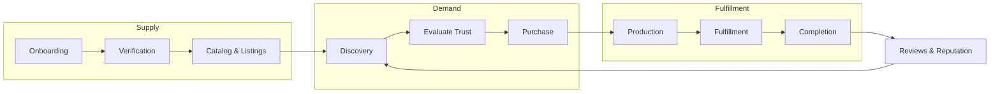

# Marketplace Mechanics

> Strategic model for trust, discovery, transactions, and fulfillment on Marketplate — not page specifications.

**Status:** Active  
**Version:** 1.0  
**Last updated:** 2026-07-03  
**Owner:** Product

---

## Purpose

This document defines **how the marketplace works** at the systems level: the rules, flows, and invariants that engineering, operations, legal, and trust & safety must implement consistently.

Page-level layouts and component specs belong in [`pages/`](../pages/). Trust operations SOPs belong in [`operations/`](../operations/). Legal requirements belong in [`legal/`](../legal/).

Governing thesis: **Trust is our product. Software enables trust.** — [Founding Constitution](../company/constitution.md#trust-philosophy)

For product scope and pillars, see [Product Overview](overview.md). For audience-specific outcomes, see [Value Propositions](value-props.md).

---

## Marketplace Model Overview

Marketplate operates a **verified supply marketplace** with an integrated **creator operating system**. The following invariants apply platform-wide:

| Invariant | Rule |
|-----------|------|
| **Verified to sell** | Unverified creators cannot accept paid orders |
| **Transparent to buy** | Customers see trust-relevant information before payment |
| **Creator-owned relationship** | Platform facilitates; creator is the merchant of record |
| **Audit everything** | Trust, payment, and moderation actions leave immutable audit trails |
| **Human approval on high stakes** | AI recommends; humans approve verification, suspensions, and policy exceptions |



---

## Trust Model

Trust is not a badge collection exercise. It is a **coherent system** where each layer reinforces the others. Removing one layer weakens the entire model.

### Trust layers

| Layer | Purpose | Customer-visible outcome |
|-------|---------|------------------------|
| **Identity verification** | Confirm creator is a real person or legal entity authorized to operate | "Verified Creator" with identity assurance |
| **Kitchen verification** | Confirm food is produced in an approved environment | Production location transparency |
| **Compliance verification** | Confirm licenses, permits, and food safety requirements for jurisdiction | Compliance status and category eligibility |
| **Listing transparency** | Disclose ingredients, allergens, fulfillment, and policies | Informed purchase decision |
| **Reviews & community** | Post-transaction accountability and social proof | Authentic reputation signals |
| **Platform integrity** | Moderation, dispute resolution, enforcement | Bad actors removed; disputes handled |

### Identity verification

**Goal:** Customers know they are buying from a real, accountable operator — not an anonymous account.

| Element | Strategic requirement |
|---------|----------------------|
| **Who verifies** | Individual sole proprietors, LLCs, and partnerships — entity type captured |
| **Minimum signals** | Government ID, business registration where applicable, tax identity, contact verification |
| **Ongoing checks** | Re-verification on material identity change; fraud signal triggers |
| **Failure mode** | Cannot publish paid listings; draft mode only |
| **AI role** | Document extraction and mismatch flagging; **human approves** final status |

Identity verification establishes **accountability**. It does not alone prove food safety — kitchen and compliance layers required.

### Kitchen verification

**Goal:** Customers understand **where food is produced** and that the environment meets platform standards.

| Element | Strategic requirement |
|---------|----------------------|
| **Kitchen types** | Home (cottage), commercial shared kitchen, dedicated facility, commissary, mobile unit commissary linkage |
| **Verification artifacts** | Address confirmation, inspection records where available, facility registration, photos |
| **Multi-tenant kitchens** | Commercial kitchen verified once; tenants linked to permitted bays/schedules |
| **Mobile operators** | Food trucks link to commissary + unit identification |
| **Product linkage** | Every SKU associated with a verified production location |
| **Failure mode** | Listings blocked or suspended until kitchen verified |

Kitchen verification is **not** a health inspection substitute. Marketplate verifies documentation and consistency; government authorities retain regulatory authority. Legal framing: [`legal/`](../legal/).

### Compliance verification

**Goal:** Creators operate within jurisdiction rules; customers see only eligible products.

| Element | Strategic requirement |
|---------|----------------------|
| **Jurisdiction awareness** | Rules vary by state/locality — especially cottage food categories and sales caps |
| **Document types** | Food handler certificates, business licenses, cottage food registrations, liability insurance where required |
| **Category restrictions** | Platform enforces prohibited items per jurisdiction (e.g., certain refrigerated items under cottage food) |
| **Renewal** | Expiration tracking with proactive reminders; grace periods defined in policy |
| **Failure mode** | Expired compliance → listing suspension, not silent continuation |

`TODO(decision):` Geographic launch market determines initial jurisdiction rule set and compliance template library.

### Transparency

**Goal:** Customers see what they need to trust **before** payment — not buried in post-purchase email.

| Disclosure area | Required visibility |
|-----------------|---------------------|
| **Creator identity** | Name, verification status, story |
| **Production location** | Appropriate level — full address may appear post-purchase or at pickup per policy |
| **Ingredients & allergens** | Mandatory fields; checkout acknowledgment for flagged allergens |
| **Fulfillment method** | Pickup location/window, delivery zone, catering date, pop-up event details |
| **Pricing** | Item price, fees, tax estimate, total |
| **Policies** | Cancellation, refund, lead time, deposit terms |

Transparency standards apply uniformly — trust cannot be optional on discount items or promoted listings.

### Reviews & community

**Goal:** Authentic reputation that rewards quality and protects customers.

| Rule | Rationale |
|------|-----------|
| **Verified purchase only** | Prevents review bombing and fake social proof |
| **Post-completion window** | Reviews prompt after order fulfilled/completed |
| **Moderation** | Fraud, harassment, and policy violations removed; appeals path exists |
| **Creator response** | Creators may respond publicly; professional dispute encouraged |
| **No pay-to-remove** | Reviews are not suppressed for payment — ever |
| **Aggregate display** | Rating distribution visible; recent reviews weighted in display logic |

Review integrity is a **trust metric** — see [Trust Metrics](success-metrics-overview.md#trust-metrics).

### Trust enforcement ladder

Progressive enforcement protects marketplace integrity:

```
Education → Warning → Listing restriction → Order suspension → Account suspension → Permanent removal
```

| Trigger examples | Typical response |
|------------------|------------------|
| Incomplete verification | Cannot go live |
| Expired compliance doc | Auto-suspend listings after grace |
| Allergen mislabeling confirmed | Immediate suspension pending investigation |
| Pattern of unresolved disputes | Account review |
| Fraudulent identity | Permanent removal |

Detailed SOPs: [`operations/`](../operations/) (Phase 4).

---

## Discovery

Discovery connects customers with verified creators. It optimizes for **fit and confidence**, not engagement maximization.

### Discovery surfaces

| Surface | Function |
|---------|----------|
| **Search** | Keyword, cuisine, dietary, fulfillment type, location |
| **Browse / collections** | Curated and algorithmic groupings — editorial + personalized |
| **Creator profile** | Primary conversion surface — story, catalog, reviews, verification |
| **Location-aware** | Near me, pickup today, open now (food truck), upcoming pop-ups |
| **Repeat purchase** | Order history, favorites, notifications from followed creators |

### Ranking principles

Ranking algorithms must be documented and auditable. Strategic priorities in order:

1. **Verification and compliance status** — unverified never ranked alongside verified
2. **Relevance** — match query, dietary filters, fulfillment availability
3. **Quality signals** — review score, completion rate, dispute rate (inversely)
4. **Proximity / availability** — location and time suitability
5. **Personalization** — order history and preferences, opt-in where required

**Prohibited ranking factors:** Payment for obscured promotion that hides verification status; boosting creators with expired compliance.

### Merchandising rules

| Rule | Detail |
|------|--------|
| **Trust signals on every card** | Verification badge, rating summary, fulfillment type |
| **Accurate availability** | Sold-out and closed states reflected in real time |
| **Photography standards** | Guidelines enforced — quality affects discovery eligibility over time |
| **Collections integrity** | Featured creators must meet minimum trust thresholds |

Discovery metrics: [Customer Metrics](success-metrics-overview.md#customer-metrics).

---

## Transactions

Transactions define how money and orders move through the platform.

### Order lifecycle

Standard lifecycle applies to all fulfillment models with model-specific states:

```
Draft cart → Checkout → Payment authorized → Order confirmed → In production → Ready → In fulfillment → Completed
                                                                                      ↘ Cancelled / Refunded
```

| State | Creator action | Customer visibility |
|-------|----------------|---------------------|
| **Confirmed** | Accept or auto-accept per settings | Confirmation with ETA |
| **In production** | Production queue active | Status update |
| **Ready** | Mark ready for pickup/dispatch | Notification with instructions |
| **In fulfillment** | Handoff to delivery or service | Tracking where applicable |
| **Completed** | Confirm handoff | Review prompt |
| **Cancelled / Refunded** | Per policy | Refund status |

### Payment model

| Element | Strategic requirement |
|---------|----------------------|
| **Merchant of record** | Creator is seller; Marketplate is marketplace facilitator |
| **Payment capture** | Timing aligned to fulfillment model (immediate vs. deposit + balance) |
| **Platform fee** | Deducted per `TODO(decision):` commission structure |
| **Payout schedule** | Defined, predictable, visible in creator dashboard |
| **Refunds** | Policy-driven; platform-mediated disputes when creator and customer disagree |

Payment implementation details: [`engineering/`](../engineering/) (Phase 3).

### Cancellations and refunds

| Scenario | Default principle |
|----------|-------------------|
| **Creator-initiated cancel** | Full refund; impacts creator reliability metrics |
| **Customer cancel within policy window** | Per creator/platform policy |
| **Custom order / catering deposit** | Deposit forfeiture rules disclosed pre-payment |
| **Platform force-cancel** | Safety or compliance issue; full refund; creator investigation |

Policies must be **displayed pre-checkout** and versioned in [`legal/`](../legal/).

### Disputes

| Stage | Owner |
|-------|-------|
| **Creator ↔ Customer direct** | Encouraged first via messaging |
| **Platform mediation** | Trust & Safety when unresolved |
| **Resolution outcomes** | Refund, partial refund, credit, no action — logged |
| **SLA** | Defined in operations docs |

---

## Fulfillment Models

Marketplate supports multiple fulfillment models because independent food creators operate differently. Each model shares the order lifecycle but differs in configuration and customer UX.

### Model comparison

| Model | Typical personas | Key mechanics |
|-------|------------------|---------------|
| **Pickup — scheduled window** | Baker, meal prep, chef | Customer selects pickup slot; creator prepares to window |
| **Pickup — same day / ASAP** | Food truck, pop-up | Limited inventory; real-time sell-out |
| **Delivery — creator managed** | Chef, caterer | Creator or staff delivers within defined zone |
| **Delivery — partner/coordinated** | Meal prep, scale operators | Handoff to delivery partner; tracking integration future phase |
| **Catering / event** | Caterer, pop-up | Quote → deposit → event date → final payment |
| **Pop-up / ticketed event** | Pop-up kitchen | Capacity-capped; location and time primary |
| **Shipping — non-perishable** | Baker (cookies, dry goods) | Only where legally permitted; packaging standards apply |

Perishable nationwide shipping is **not** a default v1 model — complexity and trust risk are high.

### Fulfillment configuration (creator-side)

Creators configure:

- **Service area** — radius, zones, or fixed pickup locations
- **Schedule** — operating hours, blackout dates, lead times
- **Capacity** — max orders per window/day; batch limits
- **Handoff instructions** — pickup codes, truck location, catering setup notes

System enforces capacity **at checkout** — overselling is a platform defect.

### Fulfillment invariants

| Invariant | Rule |
|-----------|------|
| **No checkout without viable fulfillment** | Customer must select valid window/method |
| **Lead time enforcement** | Custom and batch items respect minimum lead times |
| **Sell-out integrity** | Zero inventory → unavailable, not backordered silently |
| **Status communication** | Material delays require creator update; chronic lateness affects metrics |

---

## Two-Sided Dynamics

### Supply-side (creators)

| Phase | Marketplace behavior |
|-------|---------------------|
| **Acquisition** | Apply → verify → first listing → first order |
| **Activation** | Complete profile, photos, compliance, first 5 orders |
| **Retention** | OS value increases with order history and customer base |
| **Quality** | Metrics and reviews drive discovery ranking |

Creator funnel metrics: [Creator Metrics](success-metrics-overview.md#creator-metrics).

### Demand-side (customers)

| Phase | Marketplace behavior |
|-------|---------------------|
| **Acquisition** | Discovery via search, referral, creator share link |
| **First order** | Trust surfaces dominate conversion |
| **Repeat** | Favorites, notifications, creator loyalty |
| **Advocacy** | Reviews and word-of-mouth |

Repeat purchase is the primary demand-side health signal.

### Liquidity

Marketplace liquidity requires sufficient verified supply and active demand in a geography.

| Health signal | Interpretation |
|---------------|----------------|
| Search with zero results | Supply gap or discovery failure |
| High creator views, low conversion | Trust or pricing friction |
| High cart abandonment at fulfillment | Scheduling/capacity UX issue |
| Concentration in few creators | Early market or ranking issue |

`TODO(decision):` Geographic launch market defines initial liquidity strategy and supply acquisition focus.

---

## Anti-Patterns (Explicitly Rejected)

| Anti-pattern | Why rejected |
|--------------|--------------|
| Open marketplace without verification | Destroys trust thesis |
| Pay to hide negative reviews | Violates transparency |
| Promoted listings without verification badge | Misleads customers |
| Bidding wars / auction for ranking | Race to bottom, wrong incentives |
| Platform as anonymous middleman | Hides creator identity |
| Overselling capacity | Creates food waste and broken trust |

---

## Dependencies & Downstream Docs

This document drives implementation across domains:

| Domain | Derived artifacts |
|--------|-------------------|
| **Pages** | Checkout, creator profile, verification flows, order tracking |
| **Engineering** | Order service, verification service, search index, payment integration |
| **Operations** | Verification SOPs, dispute SOPs, moderation playbooks |
| **Legal** | Terms, seller agreement, refund policy, cottage food disclosures |
| **AI** | Document verification assist, moderation classifiers, fraud detection |
| **Analytics** | Event taxonomy for funnel and trust metrics |

---

## Open Decisions

| Decision | Impact on mechanics |
|----------|---------------------|
| `TODO(decision):` Geographic launch market | Jurisdiction rules, kitchen verification partners, discovery defaults |
| `TODO(decision):` Commission structure | Fee line items at checkout, payout calculation |
| `TODO(decision):` Pricing model | Creator tier capabilities (e.g., advanced fulfillment, team seats) |

---

## Related Documents

- [Product Overview](overview.md)
- [Personas](personas.md)
- [Value Propositions](value-props.md)
- [Success Metrics Overview](success-metrics-overview.md)
- [Founding Constitution](../company/constitution.md)
- [Company Philosophy](../company/company-philosophy.md)
- [Operations](../operations/) *(Phase 4)*
- [Legal](../legal/) *(Phase 5)*
- [Engineering](../engineering/) *(Phase 3)*
- [Analytics](../analytics/) *(Phase 5)*
- [Trust & Safety SOPs](../operations/) *(Phase 4)*
