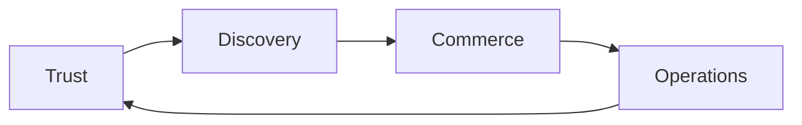

# Product Overview

> What Marketplate is, what it is not, and the product pillars that govern every feature decision.

**Status:** Active  
**Version:** 1.0  
**Last updated:** 2026-07-03  
**Owner:** Product

---

## Purpose

This document defines Marketplate's product identity at the strategic level. It is the canonical reference for what we build, what we explicitly do not build, and how the four core product pillars interlock. Every feature spec, page document, and engineering design must trace back here.

For governing principles and quality standards, see the [Founding Constitution](../company/constitution.md). For mission and long-term ambition, see [Mission](../company/mission.md) and [Vision](../company/vision.md).

For the **15-phase company roadmap** (marketplace → mobile → delivery → Chef OS → AI → enterprise), see [Company Phases](../roadmap/company-phases.md).

---

## Company vs product

| Concept | Meaning |
|---------|---------|
| **The company** | Operating system + trusted commerce platform for independent food businesses |
| **Phase 1 product** | Verified marketplace — browse, buy, sell, trust, payouts |
| **Long term** | Chef OS, delivery network, AI assistant, financial products, APIs, kitchen network, enterprise |

Every feature must answer: *Does this make independent creators more trusted and more capable of running their business?* The marketplace alone is insufficient; the platform is the moat.

---

## What Marketplate Is

Marketplate is the **trusted marketplace and operating system for independent food creators**.

We serve independent chefs, meal prep businesses, bakers, caterers, food truck operators, cottage food operators, pop-up kitchens, commercial kitchen operators, and other local food entrepreneurs who sell directly to customers — not restaurants operating as dine-in or delivery-first brands.

Marketplate combines two layers into one product:

| Layer | Role |
|-------|------|
| **Marketplace** | Where verified creators are discovered, evaluated, and purchased from by trust-seeking customers |
| **Operating system** | The software creators use to run their business — catalog, orders, fulfillment, customer communication, compliance, and analytics |

**Trust is our product. Software enables trust.** Customers should feel they are buying from verified creators, not anonymous sellers. Every system reinforces this thesis — see [Marketplace Mechanics](marketplace-mechanics.md) and the trust philosophy in the [Founding Constitution](../company/constitution.md#trust-philosophy).

Our mission is to empower independent food entrepreneurs with world-class software. Marketplate exists so creators can build **durable, trusted businesses** — not merely list items for sale.

---

## What Marketplate Is Not

Marketplate is deliberately **not** the following. These boundaries protect product focus and prevent category confusion with investors, creators, and customers.

| We are not | Why |
|------------|-----|
| **Uber Eats, DoorDash, or a restaurant delivery aggregator** | We do not onboard restaurants as the primary supply side, optimize for 30-minute delivery from anonymous kitchens, or compete on delivery speed alone |
| **A generic e-commerce platform (Shopify for food)** | We are food-native: compliance, kitchen verification, perishability, fulfillment models, and food safety are first-class — not bolted on |
| **A social network or content platform** | Discovery serves commerce and trust, not engagement for its own sake |
| **A ghost kitchen or commissary operator** | We verify and enable existing production environments; we do not own kitchens by default |
| **A payment processor or POS replacement** | Payments and point-of-sale integrations are infrastructure within our OS, not the product identity |
| **A wholesale or B2B food distribution network** | Our primary motion is creator-to-consumer; B2B may emerge later but is not the core product |
| **A ratings-and-reviews site without operational depth** | Reviews are one trust signal within a verified operating system, not the entire product |

When evaluating features, ask: *Does this make independent food creators more trusted and more capable of running their business?* If the answer is no, it likely does not belong in v1.

---

## Product Positioning Summary

```
┌─────────────────────────────────────────────────────────────────┐
│                        MARKETPLATE                              │
│         Trusted Marketplace + Creator Operating System          │
├──────────────────────┬──────────────────────────────────────────┤
│   FOR CREATORS       │   FOR CUSTOMERS                          │
│   Run & grow a       │   Discover & buy from verified local     │
│   trusted food       │   food creators with confidence          │
│   business           │                                          │
├──────────────────────┴──────────────────────────────────────────┤
│   TRUST LAYER: Identity · Kitchen · Transparency · Community    │
└─────────────────────────────────────────────────────────────────┘
```

Brand positioning and voice live in [`brand/`](../brand/). This document covers product scope only.

---

## Core Product Pillars

Every Marketplate capability maps to one or more pillars. Features that do not strengthen at least one pillar require explicit justification.

### 1. Trust

Trust is the foundation. Without it, discovery and commerce collapse.

**Scope includes:**
- Creator identity verification
- Kitchen and production environment verification
- Food safety and compliance visibility
- Transparent product, ingredient, allergen, and fulfillment information
- Reviews, ratings, and community accountability
- Dispute resolution and platform integrity

**Product principle:** Never sacrifice trust for growth. A creator who fails verification does not appear as "verified." A review system that can be gamed is worse than no reviews.

→ Strategic detail: [Marketplace Mechanics — Trust Model](marketplace-mechanics.md#trust-model)  
→ Operations: [`operations/`](../operations/) (Trust & Safety SOPs, Phase 4)

### 2. Discovery

Discovery connects trust-seeking customers with verified creators worth buying from.

**Scope includes:**
- Search, browse, and curated collections
- Creator profiles and story-driven merchandising
- Location-aware availability (pickup zones, delivery radius, pop-up schedules)
- Dietary, allergen, and fulfillment filters
- Social proof surfaced at decision points (verification badges, review summaries, repeat purchase signals)

**Product principle:** Discovery optimizes for **fit and confidence**, not infinite scroll. A customer should quickly answer: *Who made this? Where was it made? Can I trust it? How do I get it?*

**Explicitly out of scope for discovery:** Algorithmic engagement loops, paid placement that obscures verification status, or ranking that deprioritizes trust signals.

→ Personas: [End Customer (Trust-Seeking Buyer)](personas.md#end-customer-trust-seeking-buyer)  
→ Metrics: [Success Metrics — Customer & Discovery](success-metrics-overview.md#customer-metrics)

### 3. Commerce

Commerce is how value exchanges hands — reliably, transparently, and with minimal friction for both sides.

**Scope includes:**
- Product catalog and variant management (size, add-ons, dietary options)
- Cart, checkout, and payment processing
- Order lifecycle (placed → confirmed → in production → ready → fulfilled → completed)
- Pricing, promotions, and creator-controlled economics
- Refunds, cancellations, and adjustment policies
- Tax and receipt handling (jurisdiction-dependent)

**Product principle:** Creators own their customer relationship. Marketplate facilitates the transaction and enforces platform standards; it does not interpose opaquely between creator and buyer.

→ Economics and pricing decisions: [Value Propositions](value-props.md#marketplate-business-value)  
→ Transaction flow: [Marketplace Mechanics — Transactions](marketplace-mechanics.md#transactions)

### 4. Operations

Operations is the creator operating system — the daily software that makes running a food business feasible without enterprise tooling.

**Scope includes:**
- Order management dashboard and production queue
- Inventory and capacity management (including sell-out and lead times)
- Fulfillment coordination (pickup windows, delivery handoff, catering timelines)
- Customer messaging and order updates
- Compliance document storage and renewal reminders
- Business analytics and payout visibility
- Team and permission management for multi-person operations

**Product principle:** Reduce uncertainty for creators and customers on every interaction. If a workflow creates confusion, it is a product defect — not a training problem.

→ Internal ops persona: [Platform Operations (Internal)](personas.md#platform-operations-internal)  
→ Metrics: [Creator Metrics](success-metrics-overview.md#creator-metrics)

---

## Pillar Interdependencies

The pillars are not silos. They form a reinforcing loop:



| Interaction | Example |
|-------------|---------|
| Trust → Discovery | Verified kitchen badge appears in search results and creator cards |
| Discovery → Commerce | Customer arrives at creator profile with context already established |
| Commerce → Operations | Order creates production queue item with fulfillment instructions |
| Operations → Trust | Completed orders feed review prompts; compliance renewals block stale listings |

Breaking any link weakens the whole product. A beautiful checkout without kitchen verification erodes trust. A verified creator without operational tooling cannot scale.

---

## Primary User Types

Marketplate serves two external user types and one internal type. Detailed personas live in [Personas](personas.md).

| User type | One-line definition |
|-----------|---------------------|
| **Creator** | Independent food entrepreneur selling through Marketplate |
| **Customer** | Buyer seeking verified, local food from a real person or small business |
| **Platform operator** | Internal team member maintaining trust, compliance, and marketplace health |

Creator sub-types (chef, baker, meal prep, food truck, etc.) share the creator OS but differ in fulfillment patterns, compliance requirements, and discovery behavior — see persona-specific sections in [Personas](personas.md).

---

## Product Scope Boundaries

### In scope (v1 strategic intent)

- Verified creator onboarding and ongoing compliance
- Creator storefront, catalog, and order management
- Customer discovery, purchase, and order tracking
- Pickup, delivery coordination, and scheduled fulfillment models
- Reviews and trust signals integrated into discovery and checkout
- Creator payouts and platform fee collection
- Basic admin and trust & safety tooling

### Out of scope (v1 — may revisit)

- Dine-in reservations or table service
- Restaurant POS as primary wedge
- National overnight shipping of perishable goods as default model
- Creator-to-creator wholesale marketplace
- White-label marketplace licensing for third parties
- Cryptocurrency or alternative payment rails as primary checkout

Geographic launch scope is a business decision — see open decisions below.

---

## Success Definition

Marketplate succeeds when:

1. **Creators** run repeatable businesses on the platform with high retention and growing GMV per creator
2. **Customers** return because they trust what they buy and who they buy from
3. **Trust metrics** improve or hold steady as the marketplace scales
4. **Platform health** remains strong — low dispute rates, high verification completion, sustainable unit economics

→ Full metric definitions: [Success Metrics Overview](success-metrics-overview.md)

---

## Open Decisions

The following require explicit founder or executive input before implementation. All use the `TODO(decision):` prefix per [constitution standards](../company/constitution.md#quality-bar).

| Decision | Impact |
|----------|--------|
| `TODO(decision):` Pricing model — subscription vs. transaction-only vs. hybrid for creators | Affects onboarding, value prop, and creator OS feature gating |
| `TODO(decision):` Commission structure — take rate, payment processing pass-through, and promotional fee holidays | Affects unit economics, creator economics, and checkout implementation |
| `TODO(decision):` Geographic launch market — first city/region and expansion sequence | Affects compliance templates, kitchen verification partners, and GTM |

Record resolved decisions as ADRs in [`decisions/`](../decisions/).

---

## Related Documents

- [Founding Constitution](../company/constitution.md)
- [Mission](../company/mission.md)
- [Vision](../company/vision.md)
- [Values](../company/values.md)
- [Company Philosophy](../company/company-philosophy.md)
- [Personas](personas.md)
- [Value Propositions](value-props.md)
- [Marketplace Mechanics](marketplace-mechanics.md)
- [Success Metrics Overview](success-metrics-overview.md)
- [Phased Rollout](../roadmap/phased-rollout.md)
- [Brand Strategy](../brand/brand-strategy.md) *(Phase 1)*
