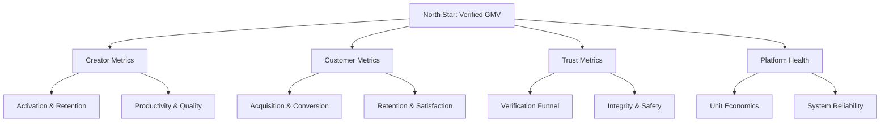

# Success Metrics Overview

> North star and domain metrics with definitions — the measurement layer for product, trust, and marketplace health.

**Status:** Active  
**Version:** 1.0  
**Last updated:** 2026-07-03  
**Owner:** Product · Analytics

---

## Purpose

This document defines **what success looks like in numbers** for Marketplate. Every feature spec must identify which metrics it moves. Dashboard implementation lives in [`analytics/`](../analytics/).

Metrics align with product pillars — see [Product Overview](overview.md) — and the trust thesis in the [Founding Constitution](../company/constitution.md).

For strategic context on why these metrics matter, see [Value Propositions](value-props.md) and [Marketplace Mechanics](marketplace-mechanics.md).

---

## Measurement Principles

| Principle | Application |
|-----------|-------------|
| **Trust metrics are first-class** | Not a subset of growth — reported alongside GMV |
| **Quality over vanity** | Prefer repeat rate over raw signups |
| **Segment by persona** | Creator sub-types behave differently — see [Personas](personas.md) |
| **Cohort-based** | Weekly/monthly cohorts for retention and activation |
| **Auditable definitions** | One canonical definition per metric; no dashboard drift |
| **Leading + lagging** | Balance predictive signals with outcome confirmation |

Event taxonomy and instrumentation specs: [`analytics/`](../analytics/) (Phase 5).

---

## North Star Metric

### Gross Merchandise Value from Verified Creators (Verified GMV)

**Definition:** Total value of orders completed on Marketplate where the selling creator held **active verified status** (identity + kitchen + compliance) at time of order placement.

**Formula:**

```
Verified GMV = Σ (order_subtotal + applicable_fees − platform_cancellations) 
               for all orders with status = completed 
               AND creator.verification_status = verified_at_order_time
```

**Why this north star:**

| Criterion | Fit |
|-----------|-----|
| **Captures marketplace scale** | Revenue proxy for platform and creators |
| **Embeds trust** | Unverified supply excluded by definition |
| **Aligns incentives** | Growth requires verification completion, not gray-market listings |
| **Actionable** | Movable by supply activation, demand conversion, retention, and AOV |

**Supporting north star inputs (reported weekly):**

| Input metric | Relationship |
|--------------|--------------|
| Active verified creators with ≥1 order | Supply health |
| Repeat customer rate (30-day) | Demand quality |
| Order completion rate | Operational reliability |
| Trust incident rate | Integrity guardrail |

If Verified GMV grows while trust metrics degrade, **treat as a crisis** — not success.

---

## Metric Hierarchy



---

## Creator Metrics

Creators are the supply engine. Metrics track acquisition, activation, productivity, retention, and quality.

### Acquisition & onboarding

| Metric | Definition | Target direction |
|--------|------------|------------------|
| **Creator applications started** | Count of unique users beginning onboarding | ↑ (top of funnel) |
| **Creator applications submitted** | Applications with all required fields submitted for review | ↑ |
| **Verification completion rate** | `verified_creators / submitted_applications` within 30 days | ↑ |
| **Time to verified** | Median hours from application submit → full verification | ↓ |
| **Verification drop-off by step** | % abandoning at identity, kitchen, compliance, catalog | ↓ per step |

### Activation

| Metric | Definition | Target direction |
|--------|------------|------------------|
| **First listing published rate** | `creators_with_≥1_live_listing / verified_creators` within 14 days | ↑ |
| **First order received rate** | `creators_with_≥1_order / verified_creators` within 30 days | ↑ |
| **Time to first order** | Median days from verification → first completed order | ↓ |
| **Profile completeness score** | Weighted score: photo, story, catalog depth, fulfillment config | ↑ |

**Activation benchmark (internal):** A verified creator without a live listing at day 14 is **at-risk** — trigger creator success outreach.

### Productivity

| Metric | Definition | Target direction |
|--------|------------|------------------|
| **GMV per active creator** | Verified GMV / creators with ≥1 order in period | ↑ |
| **Orders per active creator** | Completed orders / active creators | ↑ |
| **Average order value (AOV)** | Verified GMV / completed order count | Monitor by persona |
| **Catalog breadth** | Median active SKUs per active creator | Monitor |
| **Capacity utilization** | `orders_placed / capacity_available` where capacity tracked | Optimize — not max blindly |

### Retention

| Metric | Definition | Target direction |
|--------|------------|------------------|
| **Creator retention (monthly)** | % of creators with order in month M who also have order in M+1 | ↑ |
| **Creator churn** | Complement of retention; creators with zero orders after prior active month | ↓ |
| **Creator reactivation rate** | Previously churned creators returning to ≥1 order | ↑ |
| **Weekly active creators (WAC)** | Creators with ≥1 login or order action in 7 days | ↑ |

### Quality (creator-side)

| Metric | Definition | Target direction |
|--------|------------|------------------|
| **Order completion rate** | `completed_orders / confirmed_orders` | ↑ (platform target: ≥98%) |
| **On-time ready rate** | Orders marked ready by promised time / orders with time promise | ↑ |
| **Creator-initiated cancellation rate** | Creator cancellations / confirmed orders | ↓ |
| **Creator average review score** | Mean review rating across completed orders | ↑ |
| **Dispute rate (creator-attributed)** | Disputes lost or mediated against creator / completed orders | ↓ |

Segment all creator metrics by [persona](personas.md) after sufficient volume.

---

## Customer Metrics

Customers represent demand quality — repeat trust-seeking buyers, not one-time discount hunters.

### Acquisition

| Metric | Definition | Target direction |
|--------|------------|------------------|
| **New customer registrations** | Unique customer accounts created | ↑ |
| **Organic vs. paid acquisition mix** | % customers from creator referral, search, direct vs. paid | ↑ organic share over time |
| **Creator-attributed acquisition** | Customers whose first touch was a creator share link/profile | ↑ |

### Discovery & conversion

| Metric | Definition | Target direction |
|--------|------------|------------------|
| **Search success rate** | Searches yielding ≥1 click / total searches | ↑ |
| **Zero-result search rate** | Searches with no results / total searches | ↓ |
| **Profile view → cart rate** | Sessions adding to cart / creator profile views | ↑ |
| **Cart → checkout rate** | Checkouts started / carts created | ↑ |
| **Checkout → order rate** | Orders placed / checkouts started | ↑ |
| **Fulfillment step abandonment** | Drop-off at scheduling/pickup selection | ↓ |

### Retention & engagement

| Metric | Definition | Target direction |
|--------|------------|------------------|
| **Repeat purchase rate (30-day)** | Customers with ≥2 orders within 30 days of first order / first-time customers | ↑ |
| **Repeat purchase rate (90-day)** | Same at 90-day window | ↑ |
| **Purchase frequency** | Orders per active customer per month | ↑ |
| **Cross-creator purchase rate** | Customers buying from ≥2 creators in period | Monitor |
| **Customer retention (monthly)** | % of customers ordering in M who order in M+1 | ↑ |

### Satisfaction

| Metric | Definition | Target direction |
|--------|------------|------------------|
| **Customer satisfaction (CSAT)** | Post-order survey: "How satisfied were you?" (1–5) | ↑ |
| **Net Promoter Score (NPS)** | Standard NPS survey cadence | ↑ |
| **Support contact rate** | Support tickets / completed orders | ↓ |
| **Refund request rate** | Customer-initiated refund requests / completed orders | ↓ |

---

## Trust Metrics

Trust metrics are **non-negotiable guardrails**. They appear on executive dashboards equal to GMV.

### Verification integrity

| Metric | Definition | Target direction |
|--------|------------|------------------|
| **Verified creator ratio** | Active creators with full verification / all creators attempting to sell | ↑ |
| **Compliance doc currency rate** | Creators with all docs valid / verified creators | ↑ (target: ~100%) |
| **Verification SLA adherence** | Applications reviewed within SLA / total applications | ↑ |
| **Verification appeal overturn rate** | Appeals granted / total appeals | Monitor — high rate signals process issue |

### Review integrity

| Metric | Definition | Target direction |
|--------|------------|------------------|
| **Review submission rate** | Reviews submitted / review prompts sent | ↑ |
| **Verified-purchase review ratio** | Reviews linked to completed orders / total reviews | ~100% |
| **Review fraud detection rate** | Reviews flagged or removed for policy violation / total reviews | ↓ |
| **Average review score (platform)** | Mean rating across marketplace | Monitor — sudden shifts signal issues |

### Safety & incidents

| Metric | Definition | Target direction |
|--------|------------|------------------|
| **Trust incident rate** | Confirmed incidents (allergen mislabel, unlicensed operation, food safety complaint) / 1,000 orders | ↓ |
| **Time to trust incident resolution** | Median hours from report → resolution | ↓ |
| **Account suspension rate** | Creators suspended / active verified creators | Monitor |
| **Dispute rate** | Disputes opened / completed orders | ↓ |
| **Dispute resolution SLA** | Disputes resolved within SLA / total disputes | ↑ |

### Transparency compliance

| Metric | Definition | Target direction |
|--------|------------|------------------|
| **Listing completeness rate** | Listings meeting ingredient/allergen/fulfillment standards / live listings | ↑ |
| **Pre-checkout policy acknowledgment rate** | Orders with required policy ack / orders requiring ack | ~100% |

---

## Platform Health Metrics

Platform health covers economics, reliability, and operational efficiency.

### Marketplace liquidity

| Metric | Definition | Target direction |
|--------|------------|------------------|
| **Supply-demand ratio** | Active verified creators / active customers in geography | Balanced — define band per market maturity |
| **Browse-to-order rate (market level)** | Marketplace orders / unique browse sessions | ↑ |
| **Geographic coverage** | % of target launch area with verified creator within X miles | ↑ |

`TODO(decision):` Geographic launch market defines initial liquidity targets.

### Unit economics

| Metric | Definition | Target direction |
|--------|------------|------------------|
| **Take rate** | Platform revenue / Verified GMV | Set per `TODO(decision):` commission structure |
| **Contribution margin per order** | `(platform_revenue − variable_costs) / order` | ↑ |
| **Creator acquisition cost (CAC)** | Sales/marketing spend / new verified creators | ↓ |
| **Customer acquisition cost (CAC)** | Spend / new first-time ordering customers | ↓ |
| **Creator LTV** | Projected lifetime platform revenue from creator | ↑ |
| **Customer LTV** | Projected lifetime platform revenue from customer | ↑ |
| **LTV:CAC ratio** | LTV / CAC by segment | ↑ (target: >3:1 at maturity) |

### Payments & payouts

| Metric | Definition | Target direction |
|--------|------------|------------------|
| **Payment success rate** | Successful payment captures / payment attempts | ↑ (target: ≥99%) |
| **Payout success rate** | Successful creator payouts / payout attempts | ↑ |
| **Payout latency** | Median time from order completion → creator funds available | ↓ |
| **Refund processing time** | Median time from refund initiated → customer credited | ↓ |

### Reliability

| Metric | Definition | Target direction |
|--------|------------|------------------|
| **Platform uptime** | API and checkout availability | ↑ (target: 99.9%+) |
| **Checkout error rate** | Failed checkouts / checkout attempts | ↓ |
| **Order notification delivery rate** | Successful status notifications / notifications sent | ↑ |
| **Search latency p95** | 95th percentile search response time | ↓ |

### Internal operations efficiency

| Metric | Definition | Target direction |
|--------|------------|------------------|
| **Verification queue depth** | Pending applications awaiting review | ↓ |
| **Moderation queue depth** | Pending review/dispute items | ↓ |
| **AI assist acceptance rate** | AI recommendations accepted by human ops / AI recommendations | Monitor |
| **Cost per verification** | Total verification ops cost / verifications completed | ↓ over time |

→ Ops SLAs: [`operations/`](../operations/) (Phase 4)

---

## Reporting Cadence

| Audience | Cadence | Core metrics |
|----------|---------|--------------|
| **Executive** | Weekly | Verified GMV, trust incident rate, creator retention, repeat customer rate |
| **Product** | Weekly | Funnel metrics, feature adoption, cohort retention |
| **Trust & Safety** | Daily | Queue depth, incidents, dispute SLA |
| **Creator Success** | Weekly | Activation, at-risk creators, verification drop-off |
| **Engineering** | Real-time + weekly | Uptime, error rates, latency |

---

## Metric Review Rituals

| Ritual | Purpose |
|--------|---------|
| **Weekly business review** | North star + inputs; anomaly investigation |
| **Monthly trust review** | Trust metrics cannot degrade quarter-over-quarter without explicit acceptance |
| **Quarterly persona segmentation** | Re-cut metrics by creator persona and geography |
| **Incident post-mortem** | Every trust incident updates metrics definitions or thresholds if needed |

---

## Anti-Metrics (Do Not Optimize)

| Anti-metric | Why harmful |
|-------------|-------------|
| **Total unverified signups** | Incentivizes low-quality supply |
| **Raw page views without conversion context** | Vanity |
| **Review volume without integrity** | Invites fraud |
| **GMV including unverified creators** | Contradicts trust thesis |
| **Short-term take rate maximization** | Drives creator churn |

---

## Open Decisions

| Decision | Metric impact |
|----------|---------------|
| `TODO(decision):` Geographic launch market | Liquidity targets, segmentation baselines |
| `TODO(decision):` Commission structure | Take rate, contribution margin definitions |
| `TODO(decision):` Pricing model | Creator LTV model, subscription vs. transaction revenue split |

---

## Related Documents

- [Product Overview](overview.md)
- [Personas](personas.md)
- [Value Propositions](value-props.md)
- [Marketplace Mechanics](marketplace-mechanics.md)
- [Founding Constitution](../company/constitution.md)
- [Analytics](../analytics/) *(Phase 5)*
- [Operations](../operations/) *(Phase 4)*
- [Phased Rollout](../roadmap/phased-rollout.md)
- [Feature Doc Template](../templates/feature-doc-template.md) — Analytics section
