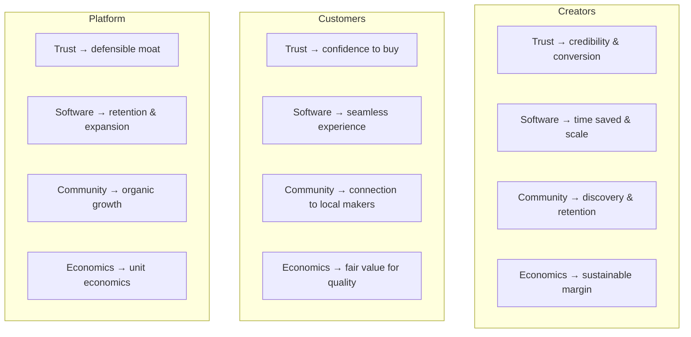

# Value Propositions

> Why creators, customers, and Marketplate choose this platform — organized by trust, software, community, and economics.

**Status:** Active  
**Version:** 1.0  
**Last updated:** 2026-07-03  
**Owner:** Product

---

## Purpose

Value propositions translate product pillars into audience-specific outcomes. This document drives positioning, onboarding copy, sales conversations, and feature prioritization.

Brand expression of these props lives in [`brand/`](../brand/). Company mission and vision provide north-star context in [Mission](../company/mission.md) and [Vision](../company/vision.md). This document covers **product-level value only**.

For persona context, see [Personas](personas.md). For how value is delivered mechanically, see [Marketplace Mechanics](marketplace-mechanics.md).

---

## Value Proposition Framework

Marketplate delivers value across four dimensions. Every dimension must be credible — overpromising on any one erodes the whole.

| Dimension | One-line promise |
|-----------|------------------|
| **Trust** | Verified creators, transparent food, accountable marketplace |
| **Software** | World-class operating system purpose-built for independent food businesses |
| **Community** | Local food ecosystem where reputation compounds |
| **Economics** | Fair, transparent economics that align platform success with creator success |

---

## Creator Value Propositions

**Headline:** *Run a trusted food business with software worthy of your craft.*

Independent food creators today stitch together Instagram, spreadsheets, payment apps, and hope. Marketplate replaces the patchwork with a verified presence and an integrated operating system.

### Trust

| Value | What creators get | Why it matters |
|-------|-------------------|----------------|
| **Verified identity** | Marketplate confirms you are a real operator — customers see it | Stops answering "Are you legit?" in every DM |
| **Kitchen verification** | Production environment validated and displayed appropriately | Converts skepticism into confidence at checkout |
| **Compliance guidance** | Jurisdiction-aware checklists and document management | Reduces fear of accidental violation (especially cottage food) |
| **Transparent listing standards** | Clear rules on ingredients, allergens, labeling | Protects your brand and customer safety |

**Proof points (product):** Verification badges, compliance center, audit-ready document storage — see [Trust Model](marketplace-mechanics.md#trust-model).

### Software

| Value | What creators get | Why it matters |
|-------|-------------------|----------------|
| **Unified business OS** | Catalog, orders, fulfillment, messaging, analytics in one place | Eliminates tool sprawl and order errors |
| **Production-aware order management** | Queue, capacity, lead times, batch views | Matches how food is actually made |
| **Fulfillment flexibility** | Pickup windows, delivery zones, catering timelines, pop-up events | One platform for every creator model |
| **Customer relationship ownership** | Direct communication; Marketplate doesn't hide the creator | Builds repeat business and brand equity |
| **AI-assisted operations** | Smart suggestions on inventory, timing, responses — human approved | Saves hours without losing control |

**Proof points (product):** Creator dashboard, order lifecycle, fulfillment configuration — see [Operations pillar](overview.md#4-operations).

### Community

| Value | What creators get | Why it matters |
|-------|-------------------|----------------|
| **Discovery alongside peers** | Curated marketplace of verified creators, not a race to the bottom | Customers arrive intent to buy local, not cheapest delivery |
| **Reviews that reward quality** | Integrity-protected review system tied to completed orders | Reputation compounds over time |
| **Shared standards** | Bad actors removed; category trust protected | One bad unlicensed seller hurts everyone — we prevent that |
| **Local ecosystem visibility** | Optional kitchen partnerships, events, collections | Cross-discovery without losing brand identity |

**Proof points (product):** Verified-only marketplace, review authenticity rules — see [Reviews & Community](marketplace-mechanics.md#reviews--community).

### Economics

| Value | What creators get | Why it matters |
|-------|-------------------|----------------|
| **Transparent fees** | Clear fee structure before first sale | No surprise statements |
| **Creator-controlled pricing** | You set prices, bundles, deposits, promotions | You own margin strategy |
| **Fast, reliable payouts** | Predictable settlement with visibility | Cash flow is survival for small food businesses |
| **Value-aligned platform** | Fees fund trust infrastructure, not ads against you | Platform wins when creators win |

**Open decision:** Fee model and take rate require executive decision — see [Economics — Open Decisions](#open-decisions).

### Creator value by persona

| Persona | Strongest value dimensions |
|---------|---------------------------|
| Independent Chef | Trust, Software |
| Meal Prep Business | Software, Economics |
| Baker | Trust, Software |
| Caterer | Software, Commerce flow |
| Food Truck | Software (location/availability), Discovery |
| Cottage Food | Trust (compliance), Economics (low overhead entry) |
| Pop-Up Kitchen | Discovery (events), Commerce (pre-pay) |
| Commercial Kitchen | Trust (facility verification), Software (multi-tenant) |

→ Full persona detail: [Personas](personas.md)

---

## Customer Value Propositions

**Headline:** *Buy from verified local food creators — know who made it, where, and that you can trust it.*

Customers are not optimizing for the cheapest delivery in 30 minutes. They are optimizing for **confidence** in food quality, safety, and provenance.

### Trust

| Value | What customers get | Why it matters |
|-------|-------------------|----------------|
| **Verified creators only** | Marketplace access requires verification — not open listing | Eliminates anonymous seller risk |
| **Kitchen transparency** | Appropriate visibility into where food is produced | Answers "where was this made?" before purchase |
| **Ingredient & allergen clarity** | Standardized, prominent disclosure | Critical for safety and dietary needs |
| **Accountable reviews** | Reviews from verified purchases; moderation against fraud | Social proof you can believe |

**Proof points (product):** Verification badges on profiles and search, pre-checkout transparency module — see [Trust Model](marketplace-mechanics.md#trust-model).

### Software

| Value | What customers get | Why it matters |
|-------|-------------------|----------------|
| **Calm, premium shopping experience** | Photography-forward discovery; one clear action per step | Feels trustworthy, not chaotic |
| **Reliable order tracking** | Status from placed to fulfilled with proactive updates | Food is perishable — timing anxiety is real |
| **Flexible fulfillment choice** | Pickup, delivery, scheduled windows — creator-dependent | Fits real life, not one delivery model |
| **Support when things go wrong** | Documented policies and platform-mediated dispute path | Recourse exists; creators held accountable |

**Proof points (product):** Order lifecycle, customer notifications — see [Transactions](marketplace-mechanics.md#transactions).

### Community

| Value | What customers get | Why it matters |
|-------|-------------------|----------------|
| **Connection to real people** | Chef stories, creator profiles, local identity | Food purchase supports a person, not a logo |
| **Local food ecosystem** | Discover creators by neighborhood, cuisine, dietary need | Replaces fragmented Instagram hunting |
| **Repeat relationships** | Favorites, order history, creator following | Trust deepens over time |

### Economics

| Value | What customers get | Why it matters |
|-------|-------------------|----------------|
| **Fair value exchange** | Price reflects quality and craft — platform doesn't force race-to-bottom discounts | Aligns with trust-seeking buyer mindset |
| **Transparent checkout** | Full cost visible before payment including fees and fulfillment | No surprise charges |
| **Direct support of local economy** | Money flows to creators with disclosed platform fee | Ethical purchasing motivation |

---

## Marketplate Business Value

**Headline:** *A defensible trusted marketplace with software-driven retention and aligned unit economics.*

Marketplate's business model depends on creators running durable businesses on the platform — not on extracting maximum short-term take from high-churn supply.

### Strategic moats

| Moat | Mechanism |
|------|-----------|
| **Trust infrastructure** | Verification, compliance, moderation — expensive to replicate well |
| **Creator OS lock-in (healthy)** | Operational data, customer relationships, catalog history increase switching cost |
| **Reputation graph** | Reviews and verification tied to creator identity compound over time |
| **Local network density** | Marketplace liquidity in a geography creates discovery advantage |

### Revenue drivers

| Driver | Description | Dependency |
|--------|-------------|------------|
| **Transaction fees** | Percentage or fixed fee on GMV | `TODO(decision):` Commission structure |
| **Creator subscriptions** | Optional tier for advanced OS features | `TODO(decision):` Pricing model |
| **Value-added services** | Future: insurance partnerships, equipment financing, premium placement *without obscuring trust* | Phase 5+ evaluation |
| **Payment float** | Minimal strategic intent; not a primary revenue pillar | — |

### Unit economics levers

| Lever | Product implication |
|-------|---------------------|
| **Creator retention** | OS depth reduces churn; measure [Creator LTV](success-metrics-overview.md#creator-metrics) |
| **GMV per creator** | Discovery and trust tools increase conversion and repeat rate |
| **Cost of trust** | Verification and moderation must scale with AI assist + human approval |
| **CAC payback** | Community and organic discovery reduce paid dependency over time |

### What we will not optimize for

- Maximizing restaurant count for delivery density
- Engagement metrics that sacrifice trust (fake urgency, unverified promoted listings)
- Take rates that drive creators off-platform while GMV looks healthy short-term

→ Governance: [Trust Philosophy](../company/constitution.md#trust-philosophy)

---

## Competitive Differentiation (Product Lens)

Detailed competitive analysis belongs in [`research/`](../research/). Product-level differentiation summary:

| Alternative | Creator pain | Marketplate answer |
|-------------|--------------|-------------------|
| **Delivery apps** | High fees, anonymous brand, menu-only identity | Verified creator brand, direct relationship, food-native OS |
| **Social + Venmo** | No trust layer, order chaos | Verification + integrated commerce + operations |
| **Generic e-commerce** | No food compliance, no kitchen verification | Food-native trust and fulfillment models |
| **Farmers market only** | Limited reach, weather-dependent | Digital discovery with same local trust thesis |

---

## Value Prop × Pillar Alignment

| Dimension | Primary pillar(s) |
|-----------|-------------------|
| Trust | Trust |
| Software | Operations |
| Community | Discovery + Trust |
| Economics | Commerce |

Features should strengthen at least one dimension for at least one audience. Use this table in prioritization reviews.

---

## Messaging Guardrails

When writing customer- or creator-facing copy:

1. **Lead with trust** — verification is a feature, not fine print
2. **Name the creator** — "Buy from [Creator]" not "Order food"
3. **Never imply restaurant delivery app** — we are not "Uber Eats for..."
4. **Be specific on software value** — "production queue" not "powerful tools"
5. **Economics transparency** — if fees aren't decided, don't invent numbers

Voice and tone rules: [Brand Voice](../brand/voice-and-tone.md).

---

## Open Decisions

| Decision | Blocks |
|----------|--------|
| `TODO(decision):` Pricing model — subscription vs. transaction-only vs. hybrid for creators | Creator tier messaging, feature gating, revenue forecasting |
| `TODO(decision):` Commission structure — take rate, processing pass-through, promotional holidays | Checkout fee display, creator payout UX, unit economics model |
| `TODO(decision):` Geographic launch market — first city/region | Local community value prop specificity, compliance templates |

Resolve via ADR in [`decisions/`](../decisions/).

---

## Related Documents

- [Product Overview](overview.md)
- [Personas](personas.md)
- [Marketplace Mechanics](marketplace-mechanics.md)
- [Success Metrics Overview](success-metrics-overview.md)
- [Founding Constitution](../company/constitution.md)
- [Mission](../company/mission.md)
- [Vision](../company/vision.md)
- [Company Philosophy](../company/company-philosophy.md)
- [Brand Strategy](../brand/brand-strategy.md)
- [Brand Positioning](../brand/positioning.md)
- [Competitive Landscape](../research/competitive-landscape.md) *(Phase 5)*
- [Market Analysis](../research/market-analysis.md) *(Phase 5)*
