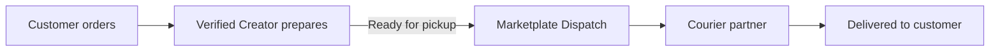
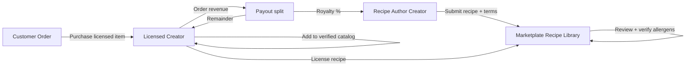

# Product Roadmap

> Supplementary detail for select future capabilities. **Canonical company roadmap:** [Company Phases](company-phases.md) (15 phases — marketplace is Phase 1 only).

For documentation rollout status, see [Phased Documentation Rollout](phased-rollout.md).

**Status:** Active  
**Version:** 1.2  
**Last updated:** 2026-07-03  
**Owner:** Product

---

## Canonical roadmap

The authoritative long-term plan lives in **[Company Phases](company-phases.md)**:

| Phase | Name |
|-------|------|
| 1 | Marketplace (Launch) — **now** |
| 2 | Native Mobile |
| 3 | Delivery Network |
| 4 | Chef OS |
| 5 | AI Kitchen Assistant |
| 6 | Discovery Platform |
| 7 | Community |
| 8 | Subscriptions |
| 9 | Catering |
| 10 | Financial Products |
| 11 | Marketplace APIs |
| 12 | Kitchen Network |
| 13 | Supply Marketplace |
| 14 | Franchise / Multi-location |
| 15 | Enterprise |

Signature features (Trust Score, Chef Levels, Collections, storefronts, etc.) are defined there.

The sections below retain **expanded detail** on mobile apps, platform delivery, and recipe royalties.

---

## Now — v1 Launch Scope

Ship the minimum trusted marketplace loop. Explicitly in scope:

| Capability | Notes |
|------------|-------|
| Creator onboarding + verification | Identity, kitchen, compliance — human-approved |
| Creator OS | Dashboard, catalog, orders, availability, compliance, payouts, storefront settings, reviews |
| Customer marketplace | Discovery, search, browse, storefront, cart, checkout, order tracking |
| Trust layer | Verification badges, transparent listings, verified-purchase reviews |
| Admin / Trust & Safety | Verification queue, moderation, disputes, creator admin |
| Payments | Stripe Connect creator payouts |
| Fulfillment | Pickup-first; delivery where creator-managed |
| **Web (responsive)** | Customer marketplace + Creator OS — mobile, tablet, desktop breakpoints per page specs |
| Help center | Content from `docs/help-center/` |
| AI assist (human-gated) | Verification Assist, Moderation Assist, Support Assist, Discovery Ranking |

Explicitly **out of scope for v1:**

- Dine-in reservations, restaurant POS wedge
- National perishable shipping as default motion
- B2B wholesale marketplace
- White-label licensing
- Recipe marketplace / royalty program (see Expansion)
- **Native mobile apps** (iOS/Android) — v1 ships responsive web; see [Mobile Apps](#mobile-apps-ios--android)
- **Platform-coordinated delivery** (Uber-style logistics) — see [Platform Delivery](#platform-coordinated-delivery)
- Paid placement that obscures verification status

Near-term build sequence: [Build Readiness](build-readiness.md#recommended-build-sequence)

---

## Foundation (Years 0–2)

**Goal:** Become the most trusted platform for independent food creators in founding market(s).

| Theme | Initiatives |
|-------|-------------|
| **Trust moat** | Faster verification turnaround; Trust Score v1; compliance renewal automation |
| **Mobile apps** | Native iOS + Android for customers and creators — see dedicated section |
| **Creator OS depth** | Messaging, analytics v2, batch/menu scheduling, catering quotes |
| **Commerce reliability** | Order SLA tooling, dispute resolution maturity, payout transparency |
| **Discovery quality** | Trust-weighted ranking tuning; collections; "order again" loops |
| **Operations scale** | SOP automation, support deflection, health scoring (see `docs/customer-success/`) |
| **Geography** | Second market launch using [Launching a New Market](../docs/playbooks/launching-new-market.md) playbook |

**Success signals:** Verified GMV growth, creator retention, verification mark recognition, support volume per order declining.

Metrics: [Success Metrics Overview](../product/success-metrics-overview.md)

---

## Expansion (Years 2–5)

**Goal:** Creators run their entire business on Marketplate; platform recognized beyond founding markets.

| Theme | Initiatives |
|-------|-------------|
| **Creator diversity** | Deep workflows for caterers, meal prep subscriptions, food trucks, pop-ups |
| **Fulfillment** | Platform-coordinated delivery (Uber-style) for verified creators; integrated delivery partners |
| **Geography** | Multi-jurisdiction compliance library; localized onboarding |
| **Creator growth tools** | Promotions, loyalty, gift cards, team seats |
| **Platform extensibility** | Vetted integrations (accounting, label printing, inventory) |
| **Community** | Creator forums, local chapters, education programs |

---

## Infrastructure (Years 5–10)

**Goal:** Default infrastructure layer for independent food commerce in served markets.

| Theme | Initiatives |
|-------|-------------|
| **Ecosystem** | Commercial kitchen OS; regulator/insurer data sharing (with consent) |
| **International** | Multi-currency, multi-locale, creator-led market requests |
| **Platform API** | Public APIs for partners; webhook ecosystem |
| **AI maturity** | Proactive compliance alerts; menu optimization suggestions (creator-approved) |
| **Marketplace network effects** | Cross-creator discovery, regional food economies |

---

## Future Product Ideas

Exploration backlog — **not committed, not scheduled**. Each idea requires a feature doc and ADR before build. Ordered roughly by strategic fit.

| Idea | Horizon | Fit with trust thesis | Status |
|------|---------|----------------------|--------|
| **Native mobile apps (iOS + Android)** | Foundation (0–2) | High — see below | **Proposed** |
| **Platform-coordinated delivery** | Expansion (2–5) | Medium–High — see below | **Proposed** |
| **Recipe Marketplace & Royalty Program** | Expansion (2–5) | High — see below | **Proposed** |
| Creator subscription tiers (advanced OS) | Foundation | High | Open — pricing model TBD |
| Meal prep subscription billing | Expansion | High | Exploration |
| Catering quote + deposit flows | Foundation | High | Partially in page specs |
| Commercial kitchen multi-tenant dashboard | Infrastructure | Medium | Exploration |
| Insurance verification integration | Expansion | High | Exploration |
| Creator education / certification program | Expansion | High | Partially in `docs/training/` |
| Regional fulfillment partner network | Expansion | Medium | Superseded by Platform Delivery section |
| B2B wholesale (creators → restaurants) | Infrastructure | Low for core thesis | Deferred |

---

## Mobile Apps (iOS + Android)

> **Status:** Proposed · **Horizon:** Foundation (Years 0–2) · **Not required for v1 web launch**

### Concept

Ship **native Marketplate apps** for iOS and Android — separate customer and creator experiences (or unified app with role switching, per `TODO(decision):`).

v1 launches on **responsive web** (all 37 page specs already define mobile/tablet/desktop behavior). Native apps follow once the core loop is proven — prioritizing push notifications, camera uploads for verification, and creator order management on the go (food trucks, pop-ups, kitchen floor).

### Why it fits Marketplate

| Alignment | Detail |
|-----------|--------|
| **Creator mobility** | Food trucks, pop-ups, and market sellers need order alerts and status updates in the field |
| **Customer habit** | Repeat buyers benefit from home-screen presence, push for "ready for pickup," order tracking |
| **Trust** | Verification document capture (ID, kitchen photos) is smoother via native camera flows |
| **Retention** | Push re-engagement for order-again and review prompts — without dark patterns |

### Scope (strategic)

| App | Primary jobs |
|-----|--------------|
| **Customer app** | Discovery, reorder, order tracking, notifications, help |
| **Creator app** | Order queue, status updates, messages, availability toggles, verification uploads |

Shared: auth, deep links, offline-tolerant order detail viewing.

### v1 vs native

| Surface | v1 Launch | Native apps |
|---------|-----------|-------------|
| Customer marketplace | Responsive web (PWA-capable) | Foundation phase |
| Creator OS | Responsive web | Foundation phase — high priority for creators |
| Admin / Trust & Safety | Web only (internal) | Web only long-term |

### Open questions (`TODO(decision):`)

| Question | Notes |
|----------|-------|
| **One app vs two** | Single Marketplate app with role switch vs separate consumer/creator apps |
| **Build vs cross-platform** | React Native / Flutter vs native Swift/Kotlin |
| **Minimum OS versions** | iOS/Android support matrix |
| **App Store branding** | "Marketplate" vs sub-brand for consumer app |

### Dependencies before build

- v1 web marketplace loop stable
- Push notification infrastructure ([Notification Service](../engineering/services/notification-service.md))
- Feature docs + page spec updates for native-specific UX (safe areas, biometrics, etc.)
- App Store / Play Store legal and privacy disclosures in `legal/`

---

## Platform-Coordinated Delivery

> **Status:** Proposed · **Horizon:** Expansion (Years 2–5) · **Not v1**

### Concept

Offer **on-demand delivery logistics** — Uber-style courier pickup from a verified creator's kitchen and delivery to the customer — as an **optional fulfillment mode** creators can enable.

This is **not** Marketplate becoming Uber Eats. Delivery aggregators optimize anonymous restaurant supply and 30-minute speed. Marketplate delivery optimizes **verified creator handoff**: the customer still buys from a named chef with kitchen verification visible; the platform (or integrated partners) coordinates the last mile.

### How this differs from Uber Eats / DoorDash

| Dimension | Delivery aggregators | Marketplate platform delivery |
|-----------|---------------------|------------------------------|
| **Supply** | Restaurants as interchangeable listings | Verified independent creators only |
| **Brand** | Aggregator brand forward | Creator brand forward; Marketplate is infrastructure |
| **Trust** | Opaque kitchen sourcing | Verified kitchen → courier handoff with audit trail |
| **Speed priority** | Sub-30-minute default | Creator-set prep windows + realistic delivery ETA |
| **Economics** | Extractive commission | Creator-owned margin; transparent delivery fee line item |

We remain **not a restaurant delivery aggregator**. Platform delivery is **infrastructure for creators** who want delivery without running their own drivers.

### How it could work

1. Creator enables **platform delivery** on eligible menu items with zone + fee settings.
2. Customer selects delivery at checkout — fee shown transparently (creator margin + delivery fee + platform fee).
3. Creator marks order **ready for handoff**; dispatch assigns courier (in-house fleet or third-party API — e.g. DoorDash Drive, Uber Direct, local partners).
4. Customer tracks courier; creator and customer see handoff timestamp in audit log.
5. Disputes route through existing [dispute playbook](../docs/playbooks/food-safety-incident.md) with delivery-specific SLA.

### Trust & safety requirements

- Courier handoff only from **verified kitchen address** on file
- **Temperature and packaging standards** per [Chef Quality Standards](../docs/standards/chef-quality-standards.md)
- Delivery incidents (spills, delays, wrong address) tied to Trust Score — not just courier rating
- Creators can **opt out** of platform delivery and use creator-managed delivery only
- No ranking boost for creators who only offer delivery — trust signals unchanged

### Open questions (`TODO(decision):`)

| Question | Notes |
|----------|-------|
| **Fleet model** | Pure third-party API vs hybrid vs owned fleet in dense markets |
| **Fee structure** | Who sets delivery fee — creator, platform, dynamic surge? |
| **Insurance** | Courier liability, food in transit coverage |
| **Geographic rollout** | Delivery only in markets with partner coverage |
| **Perishability** | Item-level eligibility (some dishes not delivery-safe) |

### Dependencies before build

- v1 pickup commerce mature; creator-managed delivery proven
- Legal delivery terms in `legal/`
- Dispatch integration in Order Service + engineering docs
- Feature doc + page specs (customer tracking, creator handoff UI)
- ADR: platform delivery vs partnership-only model

### Related documents

- [Product Overview](../product/overview.md) — what we are not (aggregator)
- [Marketplace Mechanics — Fulfillment](../product/marketplace-mechanics.md) — creator-managed vs partner/coordinated today
- [Help — Delivery](../docs/help-center/delivery.md)
- [Payment Service](../engineering/services/payment-service.md) — fee line items

---

## Recipe Marketplace & Royalty Program

> **Status:** Proposed · **Horizon:** Expansion (Years 2–5) · **Not v1**

### Concept

Experienced creators **license recipes to Marketplate** (or directly to other creators through the platform). When another chef adds that recipe to their verified catalog — with proper attribution — the **original creator earns a royalty** on each order fulfilled using that recipe.

This turns Marketplate into not just commerce infrastructure, but **culinary IP infrastructure** for the independent food economy — similar to how Etsy patterns or stock media marketplaces work, but food-native with trust, allergen, and compliance requirements built in.

### Why it fits Marketplate

| Alignment | Detail |
|-----------|--------|
| **Creator economics** | New revenue stream for expert chefs beyond their own storefront |
| **Quality propagation** | Proven recipes raise baseline quality across the marketplace |
| **Trust** | Licensed recipes carry verified ingredient lists, allergen data, and prep standards |
| **OS depth** | Extends catalog/menu system creators already use daily |
| **Moat** | Recipe IP + verification + transaction data is hard to replicate on generic platforms |

### How it could work (strategic — not page specs yet)

1. **Author submits recipe** — ingredients, weights, prep steps, photos, allergen declarations, suggested pricing band, royalty rate (within platform bounds).
2. **Marketplate review** — Trust & Safety verifies allergen accuracy, naming, no policy violations; optional culinary QA for "Marketplate Certified Recipe" badge.
3. **Listing in Recipe Library** — Discoverable by other verified creators in their jurisdiction (some recipes may be geo-restricted due to ingredients or licensing).
4. **License & import** — Licensee adds recipe to catalog; system links to authoritative ingredient/allergen source; modifications require re-verification or fork with attribution.
5. **Order & royalty** — On each qualifying order, platform splits payout: licensee keeps margin, author receives royalty %, Marketplate takes platform fee on total transaction.

### Trust & safety requirements

- Licensed recipes must **not override** kitchen verification — licensee still produces in their verified kitchen
- Allergen and ingredient data **inherits from licensed source**; changes trigger re-review
- Clear **customer-facing attribution** ("Recipe by [Author Name]")
- **Provenance audit trail** for food safety incidents — trace which recipe version was used
- Human review on recipe submission (AI assist only — same as verification queue)

### Open questions (`TODO(decision):`)

| Question | Notes |
|----------|-------|
| **IP model** | Exclusive vs non-exclusive license; can author still sell same dish on own storefront? |
| **Royalty rate bounds** | Platform-set min/max %; who sets default? |
| **Modification rules** | When does a derivative recipe stop paying royalties to original author? |
| **Jurisdiction** | Cottage food vs commercial kitchen eligibility per recipe type |
| **Tax reporting** | Royalty income 1099 implications for authors |
| **Marketplate ownership** | Does Marketplate ever buy recipes outright vs pure marketplace? |

### Dependencies before build

- v1 catalog, menu item editor, and payout splitting mature
- Legal framework for IP licensing in `legal/`
- Trust & Safety SOP for recipe review in `operations/`
- Feature doc using `templates/feature-doc-template.md`
- ADR in `decisions/`

### Related documents

- [Product Overview](../product/overview.md) — explicitly out of scope for v1 today; update when promoted
- [Marketplace Mechanics](../product/marketplace-mechanics.md) — transaction and payout model
- [Chef Quality Standards](../docs/standards/chef-quality-standards.md) — recipe accuracy standards
- [Payment Service](../engineering/services/payment-service.md) — split payouts
- [Personas — Independent Chef](../product/personas.md#independent-chef)

---

## Roadmap governance

| Action | Process |
|--------|---------|
| Add new idea | Append to Future Product Ideas; link from this doc |
| Promote idea to committed | Feature doc + ADR + update horizon table |
| Ship feature | Page specs + engineering docs + update Build Readiness |
| Defer / kill | ADR with reasoning; remove from active horizon |

Decisions: [`decisions/`](../decisions/) · Templates: [`templates/`](../templates/)

---

## Related Documents

- [Build Readiness](build-readiness.md)
- [Phased Documentation Rollout](phased-rollout.md)
- [Vision](../company/vision.md)
- [Product Overview](../product/overview.md)
- [Executive Summary](../docs/internal/executive-summary.md)
- [Partner Handbook — Product Roadmap Horizons](../docs/internal/partner-handbook.md#product-roadmap-horizons)
